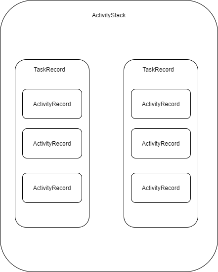

## 1 AMS 家族

在 Android 系统启动、应用程序进程启动过程以及四大组件工作过程都设计到一个非常重要的概念 AMS。AMS是Android中最核心的服务之一，AMS 并不是单打独斗，而是以家族形式，相互配合完成工作。


在 Activity 的启动过程中会调用 Instrumentation 的 execStartActivity 方法。

```java
public Activity execStartActivity(...){
    try {
        ...
        //调用 ActivityManager#getService() 
        int result = ActivityManager.getService().startActivity(...)    
    }
}
```

接下来看看 ActivityManager#getService()。

```java
public static IActivityManager getService() {
    return IActivityManagerSingleton.get()    
}

 private static final Singleton<IActivityManager> IActivityManagerSingleton =
            new Singleton<IActivityManager>() {
                @Override
                protected IActivityManager create() {
                    //得到名为 activity 的 service 引用 -> IBinder 类型的 AMS 引用。
                    final IBinder b = ServiceManager.getService(Context.ACTIVITY_SERVICE);
                    //转换为 IActivityManager   这几段代码其实就是典型的 AIDL 应用
                    final IActivityManager am = IActivityManager.Stub.asInterface(b);
                    return am;
                }
            };

```

## 2 AMS 启动

### 2.1 SystemServer#main ()

AMS 启动在 SystemServer 的 main 方法中。

```java
public static void main(String[] args) {
     //调用 run 方法
     new SystemServer().run();
}

private void run() {
     try {
         //创建消息 Looper
        Looper.prepareMainLooper();

        //加载 libandroid.so
        System.loadLibrary("android_servers");
        ...
        //创建 SystemServiceManager 对系统服务进行管理   
        mSystemServiceManager = new SystemServiceManager(mSystemContext);
        mSystemServiceManager.setRuntimeRestarted(mRuntimeRestart);
        LocalServices.addService(SystemServiceManager.class, mSystemServiceManager);
            
        SystemServerInitThreadPool.get();
        } finally {
           ...
        }
        try {
          //启动引导服务  AMS、PMS等
          startBootstrapServices();
          //启动核心服务  
          startCoreServices();
          //启动其他服务  
          startOtherServices();
          SystemServerInitThreadPool.shutdown();
        }
     }
}
```

### 2.2 SystemServer#startBootstrapServices()

接下来我们看看 startBootstrapServices()

```java
private void startBootstrapServices() {
    ...
    //调用 SystemServiceManager#startService() 参数是 ActivityManagerService.Lifecycle.class   
    mActivityManagerService = mSystemServiceManager.startService(
                ActivityManagerService.Lifecycle.class).getService();
    ....
    
}
```

### 2.3 SystemServiceManager#startService()

```java
public void startService(@NonNull final SystemService service) {
       //添加到 ArrayList 中
       mServices.add(service);
       //启动
       long time = System.currentTimeMillis();
       try {
            service.onStart();
        } catch (RuntimeException ex) {
           ...
       }
       ...
}
```

 ActivityManagerService.Lifecycle 是 ActivityManagerService 内部类，代码如下：

```java
public static final class Lifecycle extends SystemService {
        private final ActivityManagerService mService;
        public Lifecycle(Context context) {
            super(context);
            //创建 AMS
            mService = new ActivityManagerService(context);
        }

        @Override
        public void onStart() {
            mService.start();
        }

        public ActivityManagerService getService() {
            return mService;
        }
}
```

## 3 Activity 栈

* ActivityRecord：即 Activity 在 Activity 栈中的存储形式，包含了一个 **Activity 所有的信息**，存放于 TaskRecord 中的 ArrayList
* TaskRecord：任务栈、Task栈，存放于 ActivityStack 中的 ArrayList，内部存储任务栈的所有信息，例如 任务ID、所在的 ActivityStack 等。
* ActivityStack：管理类，用来管理**系统中的所有 Activity**，内部维护 Activity 所有状态、特殊状态的 Activity 以及和 Activity 相关的列表等数据，由 ActivityStackSupervisor 管理的。

总结：

* AMS 初始化时创建一个 ActivityStackSupervisor 对象（ 创建和管理 Android 系统中所有应用的 ActivityStack）
* 一个 ActivityStack 对应和包含一个应用所启动的所有 Activity。
* 一个 ActivityStack 包含一或多个TaskRecord；
* 一个TaskRecord 包含一到多个 ActivityRecord（包含Activity所有信息）。



## 4 Launch Mode

* standard：标准模式（默认模式），每启动 Activity 都会创建一个新的 Activity 实例，加入到栈中。
* singleTop：如果在任务的栈顶正好存在该Activity的实例，就重用该实例，会调用 onNewIntent() ，否则就会创建新的实例并放入栈顶。适合接收通知启动的内容显示页面。
* singleTask：如果在栈中已经有该 Activity 的实例，就重用该实例，调用 onNewIntent() 。并且上面的实例将会被移出栈。如果栈中不存在该实例，将会创建新的实例放入栈中。适合作为程序入口点，例如浏览器的主界面
* singleInstance：和 singleTask 类型，但是启动时会创建一个新栈，新栈中只有当前的 Activity。适合需要与程序分离开的页面。例如闹铃提醒，将闹铃提醒与闹铃设置分离。

## 5 Intent 的 Flag

FLAG_ACTIVITY_NEW_TASK :对应singleTask启动模式，其效果和在XML中指定该启动模式相同；

FLAG_ACTIVITY_SINGLE_TOP :对应singleTop启动模式，其效果和在XML中指定该启动模式相同；

FLAG_ACTIVITY_CLEAR_TOP :启动时，在同一个任务栈中所有位于它上面的 Activity 都要出栈。一般会和 singleTask模式一起出现。

FLAG_ACTIVITY_EXCLUDE_FROM_RECENTS : Activity 不会出现在历史 Activity 列表中；

## 6 taskAffinity

在 配置文件中设置 android:taskAffinity ,指定 Activity 的栈，默认情况下，同一个应用 Activity 有相同的 taskAffinity，要使 taskAffinity 产生效果，需要如下情况：

* 与 FLAG_ACTIVITY_NEW_TASK 或 singleTask 配合使用
* 与 allowTaskReparenting 配合，android:allowTaskReparenting="true"，说明 Activity 有转移能力。