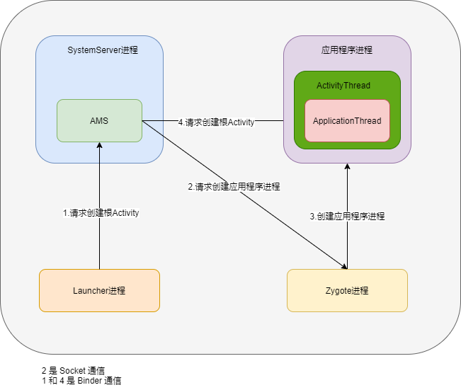

## 1 简介

Activity 的启动过程分为两种：

* 根 Activity 的启动过程（应用程序的启动过程）
* 普通 Activity 的启动过程   

根 Activity 的启动过程和普通 Activity 的启动过程有些部分是相通的，只要分析根 Activity，也就了解整个启动过程。Activity 启动过程分为三部分：

* Launcher 请求 AMS 过程
* AMS 到 ApplicationThread 的调用过程
* ActivityThread 启动 Activity

 ## 2 Launcher 请求 AMS 过程

点击桌面图标，调用 Launcher 的 startActivitySafely 方法。

### 2.1  Launcher#startActivitySafely()

```java
public boolean startActivitySafely(View v, Intent intent, ItemInfo item) {
     ...
     //1.启动一个新栈
     intent.addFlags(Intent.FLAG_ACTIVITY_NEW_TASK);
     if (v != null) {
         intent.setSourceBounds(getViewBounds(v));
     }
     try {
         if (Utilities.ATLEAST_MARSHMALLOW
                 && (item instanceof ShortcutInfo)
                 && (item.itemType == Favorites.ITEM_TYPE_SHORTCUT
                  || item.itemType == Favorites.ITEM_TYPE_DEEP_SHORTCUT)
                 && !((ShortcutInfo) item).isPromise()) {
             startShortcutIntentSafely(intent, optsBundle, item);
         } else if (user == null || user.equals(Process.myUserHandle())) {
             //2.启动 Activity << 代码1
             startActivity(intent, optsBundle);
         } else {
             ...
         }
         return true;
     } catch (ActivityNotFoundException|SecurityException e) {
       ...
     }
     return false;
 }
```

### 2.2  Activity#startActivityForResult()

上面代码 1，最终调用到 Activity#startActivityForResult()。

```java
public void startActivityForResult(@RequiresPermission Intent intent, int requestCode,
           @Nullable Bundle options) {
       if (mParent == null) {
           options = transferSpringboardActivityOptions(options);
           //调用 execStartActivity
           //Instrumentation:负责调用 Activity 和 Application 生命周期
           Instrumentation.ActivityResult ar =
               mInstrumentation.execStartActivity(
                   this, mMainThread.getApplicationThread(), mToken, this,
                   intent, requestCode, options);
          ...
       } else {
         ...
       }
   }
```

### 2.3 Instrumentation#execStartActivity()

```java
public ActivityResult execStartActivity(...) {
      ...
      try {
          intent.migrateExtraStreamToClipData();
          intent.prepareToLeaveProcess(who);
          //获取 AMS 的代理对象,然后调用 startActivity 方法 -> 重点：调用 AMS#startActivity()
          int result = ActivityManager.getService()
              .startActivity(whoThread, who.getBasePackageName(), intent,
                      intent.resolveTypeIfNeeded(who.getContentResolver()),
                      token, target != null ? target.mEmbeddedID : null,
                      requestCode, 0, null, options);
          checkStartActivityResult(result, intent);
      } catch (RemoteException e) {
          throw new RuntimeException("Failure from system", e);
      }
      return null;
  }
```

### 2.4 IActivityManager 

```java
//IActivityManager 由 AIDL 工具在编译时自动生成的
public static IActivityManager getService() {
       return IActivityManagerSingleton.get();
   }

   private static final Singleton<IActivityManager> IActivityManagerSingleton =
           new Singleton<IActivityManager>() {
               @Override
               protected IActivityManager create() {
                   //1.得到名为”activity”的Service引用
                   final IBinder b = ServiceManager.getService(Context.ACTIVITY_SERVICE);
                   //2.
                   final IActivityManager am = IActivityManager.Stub.asInterface(b);//2
                   return am;
               }
           };
```

## 3 AMS 到 ApplicationThread 的调用过程

由上面的代码可以知道 startActivity 最终调用到 AMS#startActivityAsUser。

### 3.1 ActivityManagerService#startActivityAsUser()

```java
@Override
public final int startActivityAsUser(IApplicationThread caller, String callingPackage,
        Intent intent, String resolvedType, IBinder resultTo, String resultWho, int requestCode,
        int startFlags, ProfilerInfo profilerInfo, Bundle bOptions, int userId) {
    //判断调用者进程是否被隔离    
    enforceNotIsolatedCaller("startActivity");
    //检查调用者权限
    userId = mUserController.handleIncomingUser(Binder.getCallingPid(), Binder.getCallingUid(),
            userId, false, ALLOW_FULL_ONLY, "startActivity", null);
    //调用 ActivityStarter#startActivityMayWait
    return mActivityStarter.startActivityMayWait(caller, -1, callingPackage, intent,
            resolvedType, null, null, resultTo, resultWho, requestCode, startFlags,
            profilerInfo, null, null, bOptions, false, userId, null, null,
            "startActivityAsUser");
}
```

### 3.2 ActivityStarter#startActivityLocked()

ActivityStarter#startActivityMayWait() 调用到 ActivityStarter#startActivity()

```java
private int startActivity(...) {
      int err = ActivityManager.START_SUCCESS;
      final Bundle verificationBundle
              = options != null ? options.popAppVerificationBundle() : null;
      ProcessRecord callerApp = null;
      if (caller != null) {
          //获取Launcher进程
          callerApp = mService.getRecordForAppLocked(caller);
          if (callerApp != null) {
            //获取Launcher进程的pid和uid并赋值
              callingPid = callerApp.pid;
              callingUid = callerApp.info.uid;
          } else {
              ...
          }
      }
      ...
      //创建描述类 ActivityRecord(记录 Activity 的所有信息) 
      ActivityRecord r = new ActivityRecord(mService, callerApp, callingPid, callingUid,
              callingPackage, intent, resolvedType, aInfo, mService.getGlobalConfiguration(),
              resultRecord, resultWho, requestCode, componentSpecified, voiceSession != null,
              mSupervisor, container, options, sourceRecord);   
      if (outActivity != null) {
          outActivity[0] = r;
      }
      ...
          doPendingActivityLaunchesLocked(false);
          //ActivityStarter#startActivity()
          return startActivity(r, sourceRecord, voiceSession, voiceInteractor, startFlags, true,
              options, inTask, outActivity);
  }
```

### 2.3 ActivityStarter#startActivityUnchecked()

上面的代码 ActivityStarter#startActivity() 最终调用到 startActivityUnchecked()

```java
 private int startActivityUnchecked(...) {
...
 if (mStartActivity.resultTo == null && mInTask == null && !mAddingToTask
                && (mLaunchFlags & FLAG_ACTIVITY_NEW_TASK) != 0) {
            newTask = true;
            //创建新的TaskRecord
            result = setTaskFromReuseOrCreateNewTask(
                    taskToAffiliate, preferredLaunchStackId, topStack);
        } else if (mSourceRecord != null) {
            result = setTaskFromSourceRecord();
        } else if (mInTask != null) {
            result = setTaskFromInTask();
        } else {
            setTaskToCurrentTopOrCreateNewTask();
        }
       ...
 if (mDoResume) {
            final ActivityRecord topTaskActivity =
                    mStartActivity.getTask().topRunningActivityLocked();
            if (!mTargetStack.isFocusable()
                    || (topTaskActivity != null && topTaskActivity.mTaskOverlay
                    && mStartActivity != topTaskActivity)) {
               ...
            } else {
                if (mTargetStack.isFocusable() && !mSupervisor.isFocusedStack(mTargetStack)) {
                    mTargetStack.moveToFront("startActivityUnchecked");
                }
                //ActivityRecord 不为null，或者要启动的Activity的状态不是RESUMED状态
                //调用 ActivityStackSupervisor#resumeFocusedStackTopActivityLocked
                mSupervisor.resumeFocusedStackTopActivityLocked(mTargetStack, mStartActivity,
                        mOptions);
            }
        } else {
            mTargetStack.addRecentActivityLocked(mStartActivity);
        }
        ...

}
```

### 2.4 ActivityStackSupervisor#resumeFocusedStackTopActivityLocked()

```java
boolean resumeFocusedStackTopActivityLocked(...) {
    if (targetStack != null && isFocusedStack(targetStack)) {
        return targetStack.resumeTopActivityUncheckedLocked(target, targetOptions);
    }
    //获取要启动的 Activity 所在栈的栈顶的不是处于停止状态的 ActivityRecord
    final ActivityRecord r = mFocusedStack.topRunningActivityLocked();
    if (r == null || r.state != RESUMED) {
        //调用 ActivityStack 的 resumeTopActivityInnerLocked 方法
        //最后调用 ActivityStackSupervisor#startSpecificActivityLocked
        mFocusedStack.resumeTopActivityUncheckedLocked(null, null);
    } else if (r.state == RESUMED) {
        mFocusedStack.executeAppTransition(targetOptions);
    }
    return false;
}
```

### 2.5 ActivityStackSupervisor#startSpecificActivityLocked()

```java
void startSpecificActivityLocked(ActivityRecord r,
           boolean andResume, boolean checkConfig) {
       //获取要启动的 Activity 的所在的应用程序进程
       ProcessRecord app = mService.getProcessRecordLocked(r.processName,
               r.info.applicationInfo.uid, true);
       r.getStack().setLaunchTime(r);
       //如果要启动的 Activity 的所在应用程序进程已经运行的话，调用 realStartActivityLocked
       if (app != null && app.thread != null) {
           try {
               ...
               //调用 realStartActivityLocked    
               realStartActivityLocked(r, app, andResume, checkConfig);//3
               return;
           } catch (RemoteException e) {
               ...
           }
       }
      ...
   }
```

### 2.6 2.5 ActivityStackSupervisor#realStartActivityLocked()

```java
final boolean realStartActivityLocked(...) throws RemoteException {
   ...
          //app.thread 就是 IApplicationThread
          //其中 ApplicationThread 继承了IApplicationThread.Stub
          //ApplicationThread 是 AMS 所在的 SyetemServer进程和应用程序进程的通信桥梁 通过 Binder
          app.thread.scheduleLaunchActivity(new Intent(r.intent), r.appToken,
                  System.identityHashCode(r), r.info, new Configuration(mService.mConfiguration),
                  new Configuration(task.mOverrideConfig), r.compat, r.launchedFromPackage,
                  task.voiceInteractor, app.repProcState, r.icicle, r.persistentState, results,
                  newIntents, !andResume, mService.isNextTransitionForward(), profilerInfo);
  ...      
      return true;
  }
```

## 4 ActivityThread 启动 Activity

### 4.1 ActivityThread#scheduleLaunchActivity()

```java
@Override
public final void scheduleLaunchActivity(...) {
    updateProcessState(procState, false);
    //将启动 Activity 的参数封装成 ActivityClientRecord
    ActivityClientRecord r = new ActivityClientRecord();
    ...
    //sendMessage方法向 H 类发送类型为 LAUNCH_ACTIVITY的消息，并将 ActivityClientRecord 传递过去
    //H ActivityThread 的内部类并继承 Handler，是应用程序进程中主线程的消息管理类
    sendMessage(H.LAUNCH_ACTIVITY, r);
}
```

### 4.2 H 类

```java
private class H extends Handler {
      public static final int LAUNCH_ACTIVITY         = 100;
      public static final int PAUSE_ACTIVITY          = 101;
...
public void handleMessage(Message msg) {
          if (DEBUG_MESSAGES) Slog.v(TAG, ">>> handling: " + codeToString(msg.what));
          switch (msg.what) {
              case LAUNCH_ACTIVITY: {
                  Trace.traceBegin(Trace.TRACE_TAG_ACTIVITY_MANAGER, "activityStart");
                  final ActivityClientRecord r = (ActivityClientRecord) msg.obj;
                  //获得 LoadedApk 类型的对象并赋值给 ActivityClientRecord 的成员变量packageInfo 
                  r.packageInfo = getPackageInfoNoCheck(
                          r.activityInfo.applicationInfo, r.compatInfo);
                  //调用 handleLaunchActivity()
                  handleLaunchActivity(r, null, "LAUNCH_ACTIVITY");
                  Trace.traceEnd(Trace.TRACE_TAG_ACTIVITY_MANAGER);
              } break;
              case RELAUNCH_ACTIVITY: {
                  Trace.traceBegin(Trace.TRACE_TAG_ACTIVITY_MANAGER, "activityRestart");
                  ActivityClientRecord r = (ActivityClientRecord)msg.obj;
                  handleRelaunchActivity(r);
                  Trace.traceEnd(Trace.TRACE_TAG_ACTIVITY_MANAGER);
              } break;
            ...
}
```

### 4.3 ActivityThread#handleLaunchActivity()

```java
private void handleLaunchActivity(ActivityClientRecord r, Intent customIntent, String reason) {
    ...
    WindowManagerGlobal.initialize();
    //启动 Activity
    Activity a = performLaunchActivity(r, customIntent);
    if (a != null) {
        r.createdConfig = new Configuration(mConfiguration);
        reportSizeConfigurations(r);
        Bundle oldState = r.state;
        //将 Activity 的状态置为 Resume
        handleResumeActivity(r.token, false, r.isForward,
                !r.activity.mFinished && !r.startsNotResumed, r.lastProcessedSeq, reason);
        ...
    } else {
        try {
            //停止Activity启动
            ActivityManager.getService()
                .finishActivity(r.token, Activity.RESULT_CANCELED, null,
                        Activity.DONT_FINISH_TASK_WITH_ACTIVITY);
        } catch (RemoteException ex) {
            throw ex.rethrowFromSystemServer();
        }
    }
}
```

### 4.4 ActivityThread#performLaunchActivity

```java
private Activity performLaunchActivity(ActivityClientRecord r, Intent customIntent) {
       //获取ActivityInfo类
       ActivityInfo aInfo = r.activityInfo;
       if (r.packageInfo == null) {
       //获取APK文件的描述类LoadedApk
           r.packageInfo = getPackageInfo(aInfo.applicationInfo, r.compatInfo,
                   Context.CONTEXT_INCLUDE_CODE);
       }
       //获取组件
       ComponentName component = r.intent.getComponent();
       ...
       //创建要启动Activity的上下文环境
       ContextImpl appContext = createBaseContextForActivity(r);
       Activity activity = null;
       try {
           java.lang.ClassLoader cl = appContext.getClassLoader();
           //用类加载器来创建 Activity
           activity = mInstrumentation.newActivity(
                   cl, component.getClassName(), r.intent);
         ...
       } catch (Exception e) {
         ...
       }

       try {
           //创建 Application
           Application app = r.packageInfo.makeApplication(false, mInstrumentation);//6
           ...
           if (activity != null) {
              ...
               //初始化 Activity
               activity.attach(appContext, this, getInstrumentation(), r.token,
                       r.ident, app, r.intent, r.activityInfo, title, r.parent,
                       r.embeddedID, r.lastNonConfigurationInstances, config,
                       r.referrer, r.voiceInteractor, window, r.configCallback);

              ...
               if (r.isPersistable()) {
                   //调用Instrumentation#callActivityOnCreate()
                   mInstrumentation.callActivityOnCreate(activity, r.state, r.persistentState);
               } else {
                   mInstrumentation.callActivityOnCreate(activity, r.state);
               }
              ...
           }
           r.paused = true;
           mActivities.put(r.token, r);
       } catch (SuperNotCalledException e) {
           throw e;
       } catch (Exception e) {
         ...
       }

       return activity;
   }
```


## 5 总结



1. 点击桌面应用图标，Launcher 进程将启动 Activity（MainActivity）的请求以 Binder 的方式发送给了AMS

2. AMS 接收到启动请求后，交付 ActivityStarter 处理 Intent和 Flag 等信息，然后再交给ActivityStackSupervisior/ActivityStack 处理 Activity 进栈相关流程。同时以 Socket 方式请求 Zygote 进程fork新进程。
3. Zygote 接收到新进程创建请求后 fork 出新进程
4. 在新进程里创建 ActivityThread 对象，新创建的进程就是应用的主线程，在主线程里开启 Looper 消息循环，开始处理创建Activity。
5. ActivityThread利用 ClassLoader 去加载 Activity、创建 Activity 实例，并回调 Activity 的 onCreate() 方法，完成 Activity 的启动。