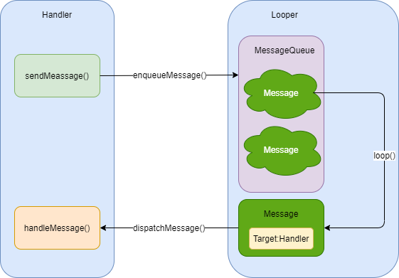
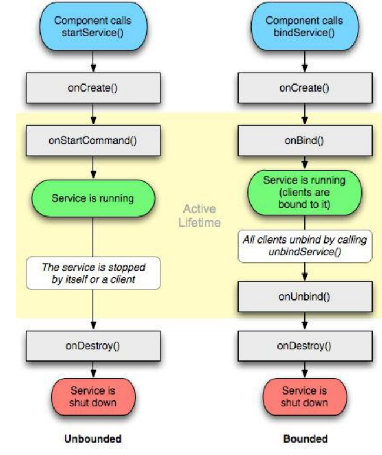
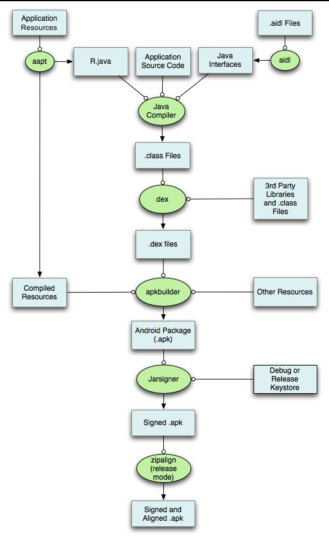

### 1 Activity 生命周期 

* onCreate()：正在被创建，常用来**初始化工作**，比如调用 setContentView 加载界面布局资源，初始化 Activity 所需数据等；

* onRestart()：正在重新启动，一般情况下，当前 Acitivty 从不可见重新变为可见时，OnRestart 就会被调用；

* onStart()：正在被启动，此时 Activity 可见但不在前台，还处于后台，无法与用户交互；

* onResume()：获得焦点，此时 Activity 可见且在前台并开始活动，这是 与onStart 的区别所在；

* onPause()：正在停止，此时可做一些存储数据、停止动画等工作，但不能太耗时，因为这会影响到新 Activity 的显示，onPause 必须先执行完，新 Activity 的 onResume 才会执行；

* onStop()：即将停止，可以做一些稍微重量级的回收工作，比如注销广播接收器、关闭网络连接等，同样不能太耗时；

* onDestroy()：即将被销毁，Activity 生命周期中的最后一个回调，常做回收工作、资源释放；

### 2 横竖屏切换时候 Activity 的生命周期

* 不设置  **android:configChanges** ，切屏会销毁当前 Activity，重新加载各个生命周期，切横屏时会执行一次，切竖屏时会执行两次。

* 设置 android:configChanges="orientation"
  * 在Android5.1 即 API 23级别下，切屏会重新调用各个生命周期，切横、竖屏时只会执行一次。
  * 在Android9 即API 28级别下，切屏不会重新调用各个生命周期，只会执行 onConfigurationChanged 方法
* 设置 android:configChanges="orientation|keyboardHidden|screenSize"：切屏不会重新调用各个生命周期，只会执行onConfigurationChanged方法。


### 3 ActivityA 跳转 ActivityB 然后 B 按 back 返回 A，各自的生命周期顺序，A 与 B 均不透明？如果B是透明主题的又或是个DialogActivity 呢？

```java
A -> B
A:onPause
B:onCreate -> onStart -> onResume
A:onStop
    
B -> A
B:onPause
A:onRestart -> onStart -> onResume
B:onStop -> onDestroy 

//B是透明主题
//A:不会调用 onStop   
```

### 4 Android中进程的优先级？

* 前台进程：与用户正在交互的 Activity 或者 Activity 用到的 Service 等，如果系统内存不足时前台进程是最晚被杀死的。
* 可见进程：处于暂停状态(onPause)的 Activity 或者绑定在其上的 Service，即被用户可见，但由于失了焦点而不能与用户交互。
* 服务进程：其中运行着使用 startService 方法启动的 Service，虽然不被用户可见，但是却是用户关心的，例如用户正在非音乐界面听的音乐或者正在非下载页面下载的文件等；当系统要空间运行，前两者进程才会被终止。
* 后台进程：其中运行着执行 onStop 方法而停止的程序，但是却不是用户当前关心的，例如后台挂着的QQ，这时的进程系统一旦没了有内存就首先被杀死。
* 空进程：不包含任何应用程序的进程，这样的进程系统是一般不会让他存在的。

### 5 Activty 和 Fragmengt 之间怎么通信，Fragmengt 和 Fragmengt怎么通信？

* Handler
* 广播
* 事件总线：EventBus、RxBus、Otto
* 接口回调
* Bundle 和 setArguments(bundle)

### 6 onSaveInstanceState()方法的作用 ? 何时会被调用？

系统**配置发生改变**时导致 Activity 被杀死并重新创建、资源内存不足导致优先级低的 Activity 被杀死。

系统会调用 onSaveInstanceState 来保存当前 Activity 的状态，此方法调用在onStop之前，与onPause 没有既定的时序关系；

当Activity被重建后，系统会调用 **onRestoreInstanceState**，并且把 onSaveInstanceState 方法所保存的 Bundle 对象同时传参给 onRestoreInstanceState 和 onCreate()，因此可以通过这两个方法判断Activity 是否被重建 ，调用在 onStart 之后；

###  7 Activity的四种启动模式、应用场景 ？

**standard标准模式**：每次启动一个 Activity 都会重新创建一个新的实例，不管这个实例是否已经存在，此模式的 Activity 默认会进入启动它的 Activity 所属的任务栈中；

**singleTop栈顶复用模式**：如果新 Activity 已经位于任务栈的栈顶，那么此 Activity 不会被重新创建，同时会回调 **onNewIntent** 方法，如果新 Activity 实例已经存在但不在栈顶，那么 Activity 依然会被重新创建；

**singleTask栈内复用模式**：只要 Activity 在一个任务栈中存在，那么多次启动此 Activity 都不会重新创建实例，并回调 **onNewIntent** 方法，此模式启动 Activity，系统首先会寻找是否 Activity 存在想要的任务栈，如果不存在，就会重新创建一个任务栈，然后把创建好 Activity 的实例放到栈中，具有 clearTop 功能；

**singleInstance单实例模式**：这是一种加强的 singleTask 模式，具有此种模式的 Activity 只能单独地位于一个任务栈中，且此任务栈中只有唯一一个实例；

### 8 Activity 常用的标记位 Flags？

**FLAG_ACTIVITY_NEW_TASK :** 对应singleTask启动模式；

**FLAG_ACTIVITY_SINGLE_TOP :** 对应singleTop启动模式；

**FLAG_ACTIVITY_CLEAR_TOP :**当它启动时，在同一个任务栈中所有位于它上面的 Activity 都要出栈。这个标记位一般会和 **singleTask** 模式一起出现，在这种情况下，被启动 Activity 的实例如果已经存在，那么系统就会回调 onNewIntent。如果被启动的 Activity 采用 standard 模式启动，那么它以及连同它之上的 Activity 都要出栈，系统会创建新的 Activity 实例并放入栈中；

**FLAG_ACTIVITY_EXCLUDE_FROM_RECENTS :** 具有这个标记的 Activity 不会出现在历史 Activity 列表中；

### 9 Activity 跟 window，view 之间的关系？

window （实现类是 PhoneWindow ）相当于一个容器，里面盛放着很多 view，这些 view 是以树状结构组织起来的。

一个 Activity 对应一个 Window，Activity 本身是没办法处理显示什么控件（view）的，是通过PhoneWindow 进行显示的。

### 10 如何启动其他应用的 Activity？

在保证有权限访问的情况下，通过隐式 Intent 进行目标 Activity 的 **IntentFilter** 匹配，原则是：

- 一个 intent 只有同时匹配某个 Activity 的 intent-filter 中的 action、category、data 才算完全匹配，才能启动该Activity；
- 一个 Activity 可以有多个 intent-filter，一个 intent 只要成功匹配任意一组 intent-filter，就可以启动该Activity；

### 11 什么是 ANR？ 如何避免？

应用程序有一段时间响应不够灵敏，系统会向用户显示一个对话框，这个对话框称作应用程序无响应（ANR：Application Not Responding）对话框。用户可以选择让程序继续运行，但是，用户在使用应用程序时，并不希望每次都要处理这个对话框。因此，在程序里对响应性能的设计很重要，这样，系统不会显示 ANR 给用户。

不同的组件发生 ANR 的时间不同（均为前台）：

* Activity：5s
* BroadcastReceiver：10s
* Service：20s

开发机器上出现问题，可以通过查看 **/data/anr/traces.txt** 。

出现原因：

* 主线程做了耗时操作（IO操作等）
* 主线程使用 Object.wait()、Thread.sleep() 等错误的操作
* 应用在规定时间内没有处理完相关事件（Activity、BroadcastReceiver 、Service ）

处理：

* 使用 AsyncTask、Thread、HandlerThread 等处理耗时操作
* 使用 Handler 线程之间的通信，而不是使用 Object.wait() 或者 Thread.sleep() 来阻塞主线程
* onCreate 和 onResume 回调中尽量避免耗时的代码

### 12 AsyncTask 的缺陷和问题，说说他的原理？

AsyncTask 是一种**轻量级的异步任务类**，可以在线程池中执行后台任务，然后把执行的进度和最终结果传递给主线程并主线程中更新 UI，通过 AsyncTask 可以更加方便执行后台任务以及在主线程中访问 UI，但是 AsyncTask 并不适合进行特别耗时的后台任务，对于特别耗时的任务来说，建议使用线程池。

AsyncTask 是一个抽象的泛型类，提供了 Params（参数类型）、Progress（后台任务的执行进度和类型） 和 Result（后台任务的返回结果的类型）这三个泛型参数，如果 AsyncTask 不需要传递具体的参数，那么这三个泛型参数可以用 Void 来代替。

#### 线程池

AsyncTask 里面线程池是一个核心线程数为 CPU + 1，最大线程数为 CPU * 2 + 1，工作队列长度为128 的线程池，线程等待队列的最大等待数为 28，但是可以自定义线程池。线程池是由 AsyncTask 来处理的，线程池允许tasks并行运行，需要注意的是并发情况下数据的一致性问题，新数据可能会被老数据覆盖掉。所以希望tasks能够串行运行的话，使用SERIAL_EXECUTOR。

#### 原理（两个线程池 + Handler）

- AsyncTask 中有两个线程池（SerialExecutor 和 THREAD_POOL_EXECUTOR）和一个Handler（InternalHandler），SerialExecutor 用于任务的排队，THREAD_POOL_EXECUTOR 用于真正地执行任务，InternalHandler 用于将执行环境从线程池切换到主线程。
- sHandler 是一个静态的 Handler 对象，为了能够将执行环境切换到主线程，这就要求 sHandler这个对象必须在主线程创建。由于静态成员会在加载类的时候进行初始化，因此就要求AsyncTask 的类必须在主线程中加载，否则同一个进程中的 AsyncTask 都将无法正常工作。

#### 缺陷

* 生命周期：Activity 销毁之前，没有取消 AsyncTask，有可能让应用崩溃(crash)。
* 内存泄漏：如果 AsyncTask 被声明 非静态内部类，会保留一个对 Activity 的引用，AsyncTask 的后台线程还在执行，它将继续在内存里保留这个引用，导致 Activity 无法被回收，引起内存泄漏。
* 结果丢失：屏幕旋转或 Activity 在后台被系统杀掉等情况会导致 Activity 的重新创建，之前运行的 AsyncTask  会持有一个之前 Activity 的引用，这个引用已经无效，这时调用 onPostExecute()再去更新界面将不再生效。
* 并行还是串行
  * Android1.6 之前，串行
  * Android 1.6 之后，采用线程池处理并行任务
  * 从Android 3.0开始，一个线程来串行执行任务。可以使用 executeOnExecutor() 方法来并行地执行任务。

### 13 动画

- View 动画：
  - 作用对象是 View，可用 xml 定义，建议使用 xml 比较易读
  - 四种类型：平移、旋转、缩放、透明度
- 帧动画：
  - 通过 AnimationDrawable 实现，容易 OOM
- 属性动画：
  - 可作用于任何对象，可用 xml 定义，Android 3 引入，建议代码实现比较灵活
  - 包括 ObjectAnimator、ValuetAnimator、AnimatorSet
  - 时间插值器：根据时间流逝的百分比计算当前属性改变的百分比，系统预置匀速、加速、减速等插值器
  - 类型估值器：根据当前属性改变的百分比计算改变后的属性值，系统预置整型、浮点、色值等类型估值器
  - 使用注意事项：避免使用帧动画，容易OOM；界面销毁时停止动画，避免内存泄漏；开启硬件加速，提高动画流畅性
  - 硬件加速原理：将 cpu 一部分工作分担给 gpu ，使用 gpu 完成绘制工作；从工作分摊和绘制机制两个方面优化了绘制速度

#### 属性动画和 View 动画区别：

属性动画真正的实现了 view 的移动，补间动画对 view 的移动只是在不同地方绘制了一个影子，实际对象还是处于原来的地方。 当动画的 repeatCount 设置为无限循环时，如果在 Activity 退出时没有及时将动画停止，属性动画会导致Activity无法释放而导致内存泄漏，而补间动画却没问题。 xml 文件实现的补间动画，复用率极高。在 Activity切换，窗口弹出时等情景中有着很好的效果。 使用帧动画时需要注意，不要使用过多特别大的图，容导致内存不足。

#### 原理：

* 属性动画：其实就是利用**插值器和估值器**，来计算出各个时刻 View 的属性，然后通过改变View的属性来，实现View的动画效果。
* View 动画：只是影像变化，view的实际位置还在原来的地方。
* 帧动画：是在xml中定义好一系列图片之后，使用 AnimationDrawable 来播放的动画。
* 属性动画：
  - 插值器：根据时间的流逝的百分比来计算属性改变的百分比
  - 估值器：根据插值器的结果计算出属性变化了多少数值

### 14 Bundle 传递对象为什么需要序列化？

为 bundle 传递数据时，只支持基本数据类型，所以在传递数据时，要将对象序列化转化成可以存储或者可以传输的本质状态，即**字节流**。序列化后的对象可以在网络，页面之间传递，也可以存储到本地。

### 15 Android 各版本新版本

#### Android5.0

- **MaterialDesign设计风格**
- **支持 64 位ART虚拟机**（5.0推出的ART虚拟机，在5.0之前都是Dalvik。他们的区别是： Dalvik,每次运行,字节码都需要通过即时编译器转换成机器码(JIT)。 ART,第一次安装应用的时候,字节码就会预先编译成机器码(AOT)）
- 通知详情可以用户自己设计

#### Android6.0

- **动态权限管理**
- 支持快速充电的切换
- 支持文件夹拖拽应用
- 相机新增专业模式

#### Android7.0

- **多窗口支持**
- **V2签名**
- 增强的Java8语言模式
- 夜间模式

#### Android8.0（O）

- **优化通知**

  通知渠道 (Notification Channel) 通知标志 休眠 通知超时 通知设置 通知清除

- **画中画模式**：清单中 Activity 设置 android:supportsPictureInPicture

- **后台限制**

#### Android9.0（P）

- **室内WIFI定位**
- **“刘海”屏幕支持**
- 安全增强

#### Android10.0（Q）

- **夜间模式**：包括手机上的所有应用都可以为其设置暗黑模式。
- **桌面模式**：提供类似于PC的体验，但是远远不能代替PC。
- **屏幕录制**：通过长按“电源”菜单中的"屏幕快照"来开启。

#### Android11.0（R）

* 短信更新改进：聊天泡泡
* 隐私和权限：位置、麦克风和摄像头的一次性权限许可
* 内置屏幕录制
* 适配不同设备：折叠手机等
* **网络优化**：5G

### 16 Serialzable 和 Parcelable 的区别？

##### Serializable（Java自带）：

Serializable 是序列化的意思，表示将一个对象转换成存储或可传输的状态。序列化后的对象可以在网络上进传输，也可以存储到本地。

##### Parcelable（android专用）：

除了 Serializable 之外，使用 Parcelable 也可以实现相同的效果，不过不同于将对象进行序列化，Parcelable方式的实现原理是将一个完整的对象进行**分解**，而分解后的每一部分都是Intent所支持的数据类型，这也就实现传递对象的功能了。

作用：

* 永久性保存对象，保存对象的字节序列到本地文件中；

* 通过序列化对象在网络中传递对象；

* 通过序列化在进程间传递对象。

序列化方法的原则

* 在使用内存的时候，Parcelable 比 Serializable 性能高，所以推荐使用 Parcelable。

* Serializable 在序列化的时候会产生大量的临时变量，从而引起频繁的GC。

* Parcelable 不能使用在要将数据存储在磁盘上的情况，因为 Parcelable 不能很好的保证数据的持续性在外界有变化的情况下。尽管 Serializable 效率低点，但此时还是建议使用 Serializable 。

### 17 Json

JSON 的全称是 JavaScript Object Notation，也就是 JavaScript 对象表示法 JSON是存储和交换文本信息的语法，类似XML，但是比XML更小、更快，更易解析 JSON是轻量级的文本数据交换格式，独立于语言，具有可描述性，更易理解，对象可以包含多个名称/值对，比如：

```java
{"name":"test" , "age":25}
```

### 18 Android 为每个应用程序分配的内存大小是多少？

不同手机型号，分配的内存大小不同，可以设置  android:largeheap = "true"。

### 19 Activity 的 startActivity 和 context 的 startActivity区别？

* 从 Activity 中启动新的 Activity 时，可以直接 mContext.startActivity(intent) 

*  Context 中启动 Activity 须给 intent 设置Flag:

```java
intent.setFlags(Intent.FLAG_ACTIVITY_NEW_TASK);
```

### 20 怎么在Service中创建Dialog对话框？

```java
//设置类型
dialog.getWindow().setType(WindowManager.LayoutParams.TYPE_SYSTEM_ALERT)
//权限
<uses-permission android:name="android.permission.SYSTEM_ALERT_WINOW" />
```

### 21 程序A能否接收到程序B的广播？

可以，使用全局的 BroadCastRecevier 能进行跨进程通信，但是注意它只能被动接收广播，此外，LocalBroadCastRecevier 只限于本进程的广播间通信。

### 22 数据加载更多涉及到分页，你是怎么实现的？

一般 20 为一页，滑动到底部，监听滑动事件，加载更多。

### 23 编译期注解跟运行时注解有何不同？

编译期注解：RetentionPolicy.CLASS，作用域 class 字节码上，生命周期只有在编译器间有效，常使用 APT（注解处理器）+ JavaPoet（Java源代码生成框架），EventBus、Dagger 等使用。

运行时注解：RetentionPolicy.RUNTIME，注解不仅被保存到 class 文件中，jvm 加载 class 文件之后，仍然存在；获取注解，需要通过反射来获取运行时注解。

### 24 如何解析 xml？

#### SAX

**SAX(Simple API for XML)**：是一种**基于事件的解析器**，事件驱动的流式解析方式，从文件的开始顺序解析到文档的结束，不可暂停或倒退。 
**优点：**解析速度快，占用内存少。非常适合在 Android 移动设备中使用。 
**缺点：**不会记录标签的关系，而要让你的应用程序自己处理，这样就增加了你程序的负担。 
**工作原理：**对文档进行顺序扫描，当扫描到文档(document)开始与结束、元素(element)开始与结束、文档 (document)结束等地方时通知事件处理函数，由事件处理函数做相应动作，然后继续同样的扫描，直至文档结束。 

#### PULL

**PULL：**运行方式和 SAX 类似，都是**基于事件的模**式。不同的是，在 PULL 解析过程中返回的是**数字**，且我们需要自己获取产生的事件然后做相应的操作，而不像 SAX 那样由处理器触发一种事件的方法，执行我们的代码。 

**优点：** PULL解析器小巧轻便，解析速度快，简单易用，非常适合在Android移动设备中使用，Android系统内部在解析各种 XML 时也是用 PULL 解析器，**Android官方推荐开发者们使用Pull解析技术**。Pull解析技术是第三方开发的开源技术，它同样可以应用于 JavaSE 开发。

#### DOM

DOM：即对象文档模型，它是将整个XML文档载入内存(所以效率较低，不推荐使用)，每一个节点当做一个对象，结合代码分析。DOM实现时首先为XML文档的解析定义一组接口，解析器读入整个文档，然后构造一个驻留内存的树结构，这样代码就可以使用DOM接口来操作整个树结构。 由于DOM在内存中以树形结构存放，因此检索和更新效率会更高。**但是对于特别大的文档，解析和加载整个文档将会很耗资源。 当然，如果XML文件的内容比较小，采用DOM是可行的。** 
**工作原理：**使用DOM对XML文件进行操作时，首先要解析文件，将文件分为独立的元素、属性和注释等，然后以节点树的形式在内存中对XML文件进行表示，就可以通过节点树访问文档的内容，并根据需要修改文档。 

### 25 更新 UI 方式

- Activity.runOnUiThread(Runnable)
- Handler
- View.post(Runnable)，View.postDelay(Runnable, long)（可以理解为在当前操作视图UI线程添加队列）
- AsyncTask
- RxJava
- LiveData

### 26 jar 和 aar 的区别

* jar 包里面只有代码
* aar 里面有代码、资源文件，比如 drawable 文件，xml资源文件，对于一些不常变动的 Android Library，我们可以直接引用 aar，加快编译速度。

### 27 程序自启动？

```java
//AndroidManifest.xml
android:installLocation="internalOnly":表示程序只能被安装在内存中，如果内存为空，则程序将不能成功安装，因为安装在 SD 卡中时会接收不到系统的广播消息(暂时未验证)
    
//添加权限
<uses-permission android:name="android.permission.RECEIVE_BOOT_COMPLETED" />    
//注册广播    
<!--注册接收系统开机广播消息的广播接收者-->
<receiver
    android:name=".broadcastReceiver.MyBroadcastReceiver"
    android:enabled="true"
    android:exported="true">
    <intent-filter>
        <action android:name="android.intent.action.BOOT_COMPLETED" />
        <category android:name="android.intent.category.HOME" />
    </intent-filter>
</receiver>  
//高版本基本没用，每个手机厂商都有一个手机管家，可以在里面设置自启动管理           
```

### 28 BroadcastReceiver，LocalBroadcastReceiver 区别？

|          | BroadcastReceiver                                            | LocalBroadcastReceiver                       |
| -------- | ------------------------------------------------------------ | -------------------------------------------- |
| 应用场景 | 应用之间的传递消息                                           | 应用内部传递消息                             |
| 安全     | 使用 Content API，本质上它是跨应用的，所以在使用它时必须要考虑到不要被别的应用滥用 | 不需要考虑安全问题，因为它只在应用内部有效。 |
| 原理     | Binder                                                       | Handler                                      |

### 29 SharedPrefrences 的 apply 和 commit 有什么区别？

* **commit 返回 boolean**，表示修改是否提交成功，apply 没有返回值
* commit 将数据同步的提交到硬件磁盘，apply 先将修改数据原子提交到内存, 而后异步真正提交到硬件磁盘

### 30 计算一个view的嵌套层级

```java
private int getParents(View view){
    if(view.getParents() == null) 
        return 0;
    } else {
      return (1 + getParents(view.getParents));
   }
}
```

### 31 Asset 目录与 res 目录的区别？

assets：不会在 R 文件中生成相应标记，存放到这里的资源在打包时会打包到程序安装包中。（通过 AssetManager 类访问这些文件）

res：会在 R 文件中生成 id 标记，资源在打包时如果使用到则打包到安装包中，未用到不会打入安装包中。

### 32 Handler



#### 角色

* Handler : 负责发送并处理消息
* Looper：：负责关联线程以及消息的分发，在该线程下从 MessageQueue 获取 Message，分发给 Handler ；
* MessageQueue ：消息队列，负责消息的存储与管理，负责管理由 Handler 发送过来的 Message；
* Message：消息，封装信息；

#### 原理

- Handler 通过 sendMessage() 发送 Message 到消息队列 MessageQueue。
- Looper 通过 loop() 不断提取触发条件的Message，并将 Message 交给对应的 target handler（发送该消息的 Handler ）来处理。
- target handler调用自身的 handleMessage() 方法来处理 Message。

```java
//基本使用
var handler = Handler {}
handler.sendMessage(msg)
handler.post(runnable) 
```

##### Handler 与 Looper 的关联

```kotlin
//Handler 基本使用
class LooperThread : Thread() {
    lateinit var mHandler: Handler
    override fun run() {
        Looper.prepare()//创建 Looper
        mHandler = Handler {
        }
        Looper.loop()//不断尝试从 MessageQueue 中获取 Message , 并分发给对应的 Handler
    }
}

//Handler 构造方法
public Handler(Callback callback, boolean async) {
        ...
        mLooper = Looper.myLooper();
        //检查当前线程的 Looper 是否存在    
        if (mLooper == null) {
            throw new RuntimeException(
                "Can't create handler inside thread " + Thread.currentThread()
                        + " that has not called Looper.prepare()");
        }
        //Looper 持有一个 MessageQueue
        mQueue = mLooper.mQueue;
        ...
 }
```

Handler 跟线程的关联是靠 Looper 来实现的。

##### Message 的存储与管理

Handler post 等方法 最终都会调用 `MessageQueue.enqueueMessage(Message,long)`，所以 Message 由 MessageQueue 存储和管理。

##### Message 的分发与处理

Message  存储和管理之后，就要进行分发与处理，调用 Looper.loop() 。

```java
    public static void loop() {
        ...
        final Looper me = myLooper();
        ...
        for (;;) {//死循环 不断从 MessageQueue 获取消息处理
            Message msg = queue.next(); 
            if (msg == null) {              
                return;
            }
            final Printer logging = me.mLogging;
            if (logging != null) {
                logging.println(">>>>> Dispatching to " + msg.target + " " +
                        msg.callback + ": " + msg.what);
            }
            ...
            try {
                //msg.target 就是发送该消息的 Handler 
                msg.target.dispatchMessage(msg);
                dispatchEnd = needEndTime ? SystemClock.uptimeMillis() : 0;
            } finally {
                if (traceTag != 0) {
                    Trace.traceEnd(traceTag);
                }
            }
            ...
            //回收 message    
            msg.recycleUnchecked();
        }
    }
```

 queue.next()：获取消息

```java
    Message next() {
        ...
        for (;;) {
             //本地方法      
            nativePollOnce(ptr, nextPollTimeoutMillis);
            synchronized (this) {
                // Try to retrieve the next message.  Return if found.
                final long now = SystemClock.uptimeMillis();
                Message prevMsg = null;
                Message msg = mMessages;
                if (msg != null && msg.target == null) {                   
                    do {
                        prevMsg = msg;
                        msg = msg.next;
                    } while (msg != null && !msg.isAsynchronous());
                }
                if (msg != null) {
                    if (now < msg.when) {
                        // Next message is not ready.  Set a timeout to wake up when it is ready.
                        nextPollTimeoutMillis = (int) Math.min(msg.when - now, Integer.MAX_VALUE);
                    } else {
                        // Got a message.
                        mBlocked = false;
                        if (prevMsg != null) {
                            prevMsg.next = msg.next;
                        } else {
                            mMessages = msg.next;
                        }
                        msg.next = null;
                        if (DEBUG) Log.v(TAG, "Returning message: " + msg);
                        msg.markInUse();
                        return msg;
                    }
                } else {
                    // No more messages.
                    nextPollTimeoutMillis = -1;
                }
                if (mQuitting) {
                    dispose();
                    return null;
                }
        }
    }

```

msg.target 是发送该消息的 Handler，回调该 Handler :

```java
  public void dispatchMessage(Message msg) {
        if (msg.callback != null) {//callback 优先级比较高
            handleCallback(msg);
        } else {
            if (mCallback != null) {
                if (mCallback.handleMessage(msg)) {
                    return;
                }
            }
            handleMessage(msg);
        }
    }
```

#### 注意

##### 为什么能在主线程直接使用 Handler，而不需要创建 Looper？

ActivityThread.main() 方法中调用了 Looper.prepareMainLooper() 方法创建了 主线程的 Looper ,并且调用了 loop() 方法，所以我们就可以直接使用 Handler 了。

##### Handler 引起的内存泄露？

Handler 允许我们发送延时消息，如果在延时期间用户关闭了 Activity，那么该 Activity 会泄露。 这个泄露是因为 Message 会持有 Handler，而又因为 Java 的特性，内部类会持有外部类，使得 Activity 会被 Handler 持有，这样最终就导致 Activity 泄露。

解决：将 Handler 定义成静态的内部类，在内部持有 Activity 的弱引用，并在Acitivity的onDestroy()中调用handler.removeCallbacksAndMessages(null) 及时移除所有消息。

##### Handler 里藏着的 Callback 能干什么？

优先处理消息的权利。

##### 创建 Message 实例的最佳方式

- 通过 Message 的静态方法 Message.obtain()
- 通过 Handler 的公有方法 handler.obtainMessage()

##### 主线程的死循环一直运行是不是特别消耗CPU资源呢？

涉及到 Linux pipe/epoll 机制，简单说就是在主线程的 MessageQueue 没有消息时，便阻塞在loop的 queue.next() 中的 nativePollOnce() 方法里，此时主线程会释放 CPU 资源进入休眠状态，直到下个消息到达或者有事务发生，通过往 pipe 管道写端写入数据来唤醒主线程工作。这里采用的 epoll 机制，是一种IO多路复用机制，可以同时监控多个描述符，当某个描述符就绪(读或写就绪)，则立刻通知相应程序进行读或写操作，本质是同步I/O，即读写是阻塞的。所以说，主线程大多数时候都是处于休眠状态，并不会消耗大量CPU资源。

##### handler postDelay这个延迟是怎么实现的？

```java
//加上当前时间
SystemClock.uptimeMillis() + delayMillis
msg.when = when;   
```

handler.postDelay 并不是先等待一定的时间再放入到MessageQueue中，而是直接进入MessageQueue，以 MessageQueue 的时间顺序排列和唤醒的方式结合实现的。

##### 妙用 Looper 机制

- 将 Runnable post 到主线程执行；
- 利用 Looper 判断当前线程是否是主线程。

##### 主线程的 Looper 不允许退出

主线程不允许退出，退出就意味 APP 要挂。

##### 子线程里弹 Toast 

```java
new Thread(new Runnable() {
  @Override
  public void run() {
    Looper.prepare();
    Toast.makeText(HandlerActivity.this, "test", Toast.LENGTH_SHORT).show();
    Looper.loop();
  }
}).start();
```

[Handler 都没搞懂，拿什么去跳槽啊？](https://juejin.im/post/5c74b64a6fb9a049be5e22fc#heading-7)

### 33 硬件加速

使用 GPU 实现图形绘制，通过底层软件代码，将 CPU 不擅长的图形计算转换成 GPU 专用指令，由GPU完成。

- CPU更擅长复杂逻辑控制，而GPU得益于大量ALU和并行结构设计，更擅长数学运算。
- 页面由各种基础元素（DisplayList）构成，渲染时需要进行大量浮点运算。
- 硬件加速条件下，CPU用于控制复杂绘制逻辑、构建或更新DisplayList；GPU用于完成图形计算、渲染DisplayList。
- 硬件加速条件下，刷新界面尤其是播放动画时，CPU只重建或更新必要的DisplayList，进一步提高渲染效率。
- 实现同样效果，应尽量使用更简单的DisplayList，从而达到更好的性能（Shape代替Bitmap等）。

### 34 Android 中 HashMap 的优化

* SpareArray

```java
//避免了对key的自动装箱,两个数组来进行数据存储的，一个存储key，另外一个存储value,查找使用二分查找法
private int[] mKeys;
private Object[] mValues;
```

* ArrayMap：

* <key,value> 映射的数据结构，类似于 SpareArray

如果 key 类型为 int 建议使用 SpareArray，类似 LongSparseMap。

如果 key 类型为其他类型，则使用 ArrayMap。

注意：SparseArray、ArrayMap  在增加、查找、删除都需要使用 二分查找法，数据量大，效率会低。

### 35 Android 适配方案

* 布局适配
  * 布局自适应屏幕尺寸：使用相对布局（RelativeLayout），禁用绝对布局（AbsoluteLayout）
  * 根据屏幕的配置来加载相应的 UI 布局
    * 尺寸限定符
      * 例如有一个平板，可以使用：res/layout-large/main.xml ，只适合Android 3.2版本前
    * 最小宽度限定符：例如 layout-sw600dp 的最小宽度限定符，只适合Android 3.2版本后
    * 布局别名
    * 屏幕方向限定符
  * 使用 sp、dp
  * 屏幕尺寸和屏幕密度之间适配（以某一分辨率为基准，生成所有分辨率对应像素数列表）
* 布局组件适配：使得布局组件自适应屏幕尺寸：wrap_content、match_parent、weight 
* 图片资源适配：图片资源组件自适应屏幕尺寸 ：.9.png 、只切一套图 xhdpi
* 用户界面流程适配：根据屏幕的配置来加载相应的用户界流程
  * 确定当前布局
  * 根据当前布局做出响应
  * 重复使用其他活动中的片段
  * 处理屏幕配置变化

* 推荐：今日头条的适配方案：**动态更改 density**

```java
px:像素   px = dp * (dpi / 160) 
dp:设备独立像素
dpi:像素密度 dpi = 根号(宽^2 + 高^2) / 屏幕尺寸(inch)

//基本公式
px = dp * density;
density = dpi / 160;
px = dp * (dpi / 160);    
```

```java
private static void adaptScreen(final Activity activity,
                                    final int sizeInPx,
                                    final boolean isVerticalSlide) {
        final DisplayMetrics systemDm = Resources.getSystem().getDisplayMetrics();
        final DisplayMetrics appDm = App.getAppContext().getResources().getDisplayMetrics();
        final DisplayMetrics activityDm = activity.getResources().getDisplayMetrics();
        if (isVerticalSlide) {
            activityDm.density = activityDm.widthPixels / (float) sizeInPx;
        } else {
            activityDm.density = activityDm.heightPixels / (float) sizeInPx;
        }
        activityDm.scaledDensity = activityDm.density * (systemDm.scaledDensity / systemDm.density);
        activityDm.densityDpi = (int) (160 * activityDm.density);
        appDm.density = activityDm.density;
        appDm.scaledDensity = activityDm.scaledDensity;
        appDm.densityDpi = activityDm.densityDpi;
    }
//假如要使用第三方的UI界面的时候，重新设置为系统的density即可
public static void cancelAdaptScreen(final Activity activity) {
        final DisplayMetrics systemDm = Resources.getSystem().getDisplayMetrics();
        final DisplayMetrics appDm = App.getAppContext().getResources().getDisplayMetrics();
        final DisplayMetrics activityDm = activity.getResources().getDisplayMetrics();
        activityDm.density = systemDm.density;
        activityDm.scaledDensity = systemDm.scaledDensity;
        activityDm.densityDpi = systemDm.densityDpi;
        appDm.density = systemDm.density;
        appDm.scaledDensity = systemDm.scaledDensity;
        appDm.densityDpi = systemDm.densityDpi;
    }
```

[Android 屏幕适配：最全面的解决方案](https://www.jianshu.com/p/ec5a1a30694b)

[Android屏幕适配全攻略(最权威的官方适配指导)](https://www.jianshu.com/p/f46f2874f52e)

### 36 显式 Intent 和隐式 Intent

显式 Intent，明确指出目标组件的名称

```java
 bt.setOnClickListener(new View.OnClickListener() {
            @Override
            public void onClick(View view) {
                Intent intent = new Intent(MainActivity.this,secondActivity.class);
                startActivity(intent);
            }
        });
```

隐式 Intent，没有明确指出目标组件名称，intent-filter

* 动作(Action)

* 类别(Category ['kætɪg(ə)rɪ] )

* 数据(Data )

```java
<activity android:name=".secondActivity">
            <intent-filter>
                <action android:name="com.example.aries.androidtest.ACTION_START"></action>
                <category android:name="android.intent.category.DEFAULT"></category>
            </intent-filter>
</activity>
```

### 37 广播传输的数据是否有限制，是多少，为什么要限制？

广播传输的数据一般经过 IPC，Intent 在传递数据时是有大小限制的，大约限制在 **1MB** 之内，IPC 需要把数据从内核copy到进程中，每一个进程有一个接收内核数据的缓冲区，默认是1M；如果一次传递的数据超过限制，就会出现异常。

### 38 安卓签名机制？

* 应用程序升级，验证 APP 的**唯一性**，包名和签名都一致才能升级

* 应用程序模块化，可以模块化部署多个应用到一个进程，只要他们的签名都一样

* 代码或者数据共享，同一个签名有相同的权限，可以共享数据和代码

### 39 merge、ViewStub、include 的作用？

merge: 删减多余的层级，优化 UI，多用于替换 FrameLayout 或者当一个布局包含另一个

ViewStub: 按需加载，不会影响 UI 初始化时的性能

include：重用布局文件

### 40 ContentProvider 使用

内容提供器，调用 Context 的 **getContentResolver** 方法。

```java
Uri uri = Uri.parse("content:xxx/xxx");
Cursor cursor = getContentResolver().query(uri,new String[]{"author","price"},
        "name=?",new String[]{"Java"},null);
if(cursor.moveToFirst()){
    do{
        Log.d("MainActivity",cursor.getString(cursor.getColumnIndex("name")));
        Log.d("MainActivity",cursor.getString(cursor.getColumnIndex("price")));
    }while(cursor.moveToNext());
}
cursor.close()
```

### 41 Android 怎么加速启动 Activity？

* 优化布局，不要嵌套太多
* 主线程不要做太多的耗时工作

### 42 Json 解析方式的两种区别？

* JSONArray、JSONObject
* Gson

### 43 Fragment懒加载

* support 版本中利用 setUserVisibleHint 和  onHiddenChanged

```java
public class LazyLoadFragment extends Fragment {
    //判断是否已进行过加载，避免重复加载
    private boolean isLoad=false;
    //判断当前fragment是否可见
    private boolean isVisibleToUser = false;
    //判断当前fragment是否回调了resume
    private boolean isResume = false;
    private boolean isCallUserVisibleHint = false;

    @Override
    public void onResume() {
        super.onResume();
        isResume=true;
        if (!isCallUserVisibleHint) isVisibleToUser=!isHidden();
        lazyLoad();
    }

    @Override
    public void setUserVisibleHint(boolean isVisibleToUser) {
        super.setUserVisibleHint(isVisibleToUser);
        Log.i(TAG, “setUserVisibleHint: “+isVisibleToUser+”  “+FragmentD.this);
        this.isVisibleToUser=isVisibleToUser;
        isCallUserVisibleHint=true;
        lazyLoad();
    }

    @Override
    public void onHiddenChanged(boolean hidden) {
        super.onHiddenChanged(hidden);
        Log.i(TAG, "onHiddenChanged: "+hidden+" "+FragmentD.this);
        isVisibleToUser=!hidden;
        lazyLoad();
    }

    @Override
    public void onDestroyView() {
        super.onDestroyView();
        isLoad=false;
        isCallUserVisibleHint=false;
        isVisibleToUser=false;
        isResume=false;
    }

    private void lazyLoad() {
        if (!isLoad&&isVisibleToUser&&isResume){
            //懒加载。。。
            isLoad=true;
        }
    }
```

* Androidx 版本。

 在 Androidx 在 FragmentTransaction 中增加了 setMaxLifecycle 方法来控制 Fragment 所能调用的最大的生命周期函数，该方法可以设置活跃状态下 Fragment 最大的状态，如果该 Fragment 超过了设置的最大状态，那么会强制将 Fragment 降级到正确的状态。

ViewPager+Fragment: 在 FragmentPagerAdapter 与 FragmentStatePagerAdapter 新增了含有 **behavior** 字段的构造函数。

```java
public class LazyLoadFragment extends Fragment {
    //判断是否已进行过加载，避免重复加载
    private boolean isLoad=false;

    @Override
    public void onResume() {
        super.onResume();
        if (!isLoad&& !isHidden()){
            lazyLoad();
            isLoad=true;
        }
    }

    @Override
    public void onDestroyView() {
        super.onDestroyView();
        isLoad=false;
    }

    private void lazyLoad() {
            //懒加载。。。
    }
}
```

[Android Fragment 懒加载](https://www.cnblogs.com/Robin132929/p/13819386.html)

### 44 Bitmap 使用时候注意什么？

* 要选择合适的图片规格（bitmap类型）：

```
ALPHA_8   每个像素占用1byte内存        
ARGB_4444 每个像素占用2byte内存       
ARGB_8888 每个像素占用4byte内存（默认）      
RGB_565 每个像素占用2byte内存
```

* 降低采样率。**BitmapFactory.Options** 参数 inSampleSize 的使用，先把 options.inJustDecodeBounds 设为 true，只是去读取图片的大小，在拿到图片的大小之后和要显示的大小做比较通过 calculateInSampleSize() 函数计算 inSampleSize 的具体值，得到值之后。options.inJustDecodeBounds 设为 false 读图片资源。

* 复用内存。通过软引用，复用内存块，不需要再重新给这个 bitmap 申请一块新的内存，避免了一次内存的分配和回收，从而改善了运行效率。

* 使用 recycle() 方法及时回收内存。

* 压缩图片

### 45 多进程场景遇见过么？

* 音乐播放器
* 大图查看
* 多模块应用

### 46 Bitmap 的 recycler()

 Android 有自己的垃圾回收机制，如果只使用了少量的图片，回收与否关系不大。可是若有大量的 bitmap 需要垃圾回收，那么垃圾回收的次数过于频繁，会造成系统资源负荷，这时候还是调用 recycler() 比较好。

通过源码可以了解到，加载Bitmap到内存里以后，是包含**两部分内存区域**的。简单的说，一部分是**Java部分**的，一部分是**C部分**的。这个Bitmap对象是由Java部分分配的，不用的时候系统就会自动回收了

但是那个对应的**C可用**的内存区域，虚拟机是不能直接回收的，这个只能调用底层的功能释放。所以需要调用recycle()方法来释放C部分的内存

bitmap.recycle()方法用于回收该Bitmap所占用的内存，接着将bitmap置空，最后使用System.gc()调用一下系统的垃圾回收器进行回收，调用System.gc()并不能保证立即开始进行回收过程，而只是为了加快回收的到来。

### 47 一张Bitmap所占内存以及内存占用的计算

```java
Bitamp 所占内存大小 = 宽度像素 *（inTargetDensity / inDensity）* 高度像素 *（inTargetDensity / inDensity）* 一个像素所占的内存字节大小 
```

注：这里 inDensity 表示目标图片的dpi（放在哪个资源文件夹下），inTargetDensity表示目标屏幕的dpi，所以你可以发现inDensity和inTargetDensity会对Bitmap的宽高进行拉伸，进而改变Bitmap占用内存的大小。

在Bitmap里有两个获取内存占用大小的方法。 

- **getByteCount()**：API12 加入，代表存储 Bitmap 的像素需要的最少内存。
- **getAllocationByteCount()**：API19 加入，代表在内存中为 Bitmap 分配的内存大小，代替了 getByteCount() 方法。
- 在**不复用 Bitmap** 时，getByteCount() 和 getAllocationByteCount 返回的结果是一样的。在通过**复用 Bitmap** 来解码图片时，那么 getByteCount() 表示新解码图片占用内存的大 小，getAllocationByteCount() 表示被复用 Bitmap 真实占用的内存大小

### 48 数据库升级增加表和删除表都不涉及数据迁移，但是修改表涉及到对原有数据进行迁移,如何实现？

* 将现有表命名为临时表 
* 创建新表
* 将临时表的数据导入新表
* 删除临时表

### 49 Canvas.save() 跟 Canvas.restore()的区别

* Canvas.save()：来保存 Canvas 的状态。save 之后，可以调用 Canvas 的平移、放缩、旋转、错切、裁剪等操作。
* Canvas.restore()：用来恢复 Canvas 之前保存的状态。防止 save 后对 Canvas 执行的操作对后续的绘制有影响。

save 和 restore 要配对使用，**restore 次数 <= save 少**

### 50 为什么bindService可以跟Activity生命周期联动？

* bindService 方法执行时，**LoadedApk** 会记录 **ServiceConnection 信息**。

* Activity 执行 finish 方法时，会通过 LoadedApk 检查 Activity 是否存在未注销/解绑的 BroadcastReceiver 和 ServiceConnection，如果有，那么会通知 AMS 注销/解绑对应的 BroadcastReceiver 和 Service，并打印异常信息，告诉用户应该主动执行注销/解绑的操作。

### 51 自定义 view 效率高于xml定义吗？说明理由。

不一定，如果自定义 view 计算复杂，可能效率不一定高，但是一般情况下，自定义 view 效率高于 xml 定义。

* 少了解析 xml
* 自定义 View 减少了 ViewGroup 与 View之间的测量，包括父量子，子量自身，子在父中位置摆放，当子 view变化时,父的某些属性都会跟着变化

### 52 Gradle 配置多渠道打包

我们使用友盟多渠道打包。

```java
android {  
    productFlavors {
        xiaomi {}
        baidu {}
        wandoujia {}
        _360 {}        // 或“"360"{}”，数字需下划线开头或加上双引号
    }
}
```

或者使用 360 加固，配置多渠道打包。

#### 53 Handler、Thread和HandlerThread的差别

* Handler：在 Android 中负责发送和处理消息，线程之间的消息通信。

* Thread：Java进程中执行运算的最小单位，亦即执行处理机调度的基本单位。某一进程中一路单独运行的程序。

* HandlerThread：
  * 继承自 **Thread**。
  * 内部实现了 **Looper** ，便于消息的分发。

### 54 广播的两种注册方式 ？

* **静态注册**（常驻广播）：在 AndroidManifest.xml 配置 <receive>
  * 常驻，不受任何组件的生命周期影响
  * 如果程序被关闭，如果有信息广播来，程序依旧会被系统调用
  * 需要时刻监听广播
* **动态注册**（非常驻广播）：Context.registerReceiver()
  * 非常驻，灵活，跟随组建的生命周期变化
  * 不需要特定时刻监听广播
  * 当用来注册的 Activity 关掉后，广播也就失效了。

### 55 ddms 和 traceView 的区别？

ddms：davik debug monitor service。简单的说 ddms 是一个**程序执行查看器**，在里面可以看见线程和堆栈等信息。

traceView： 程序性能分析器。traceview 是 ddms 中的一部分内容。

traceview 是 Android 平台特有的数据采集和分析工具，它主要用于分析 Android 中应用程序的 hotspot（瓶颈）。Traceview 本身只是一个数据分析工具，而数据的采集则需要使用 Android SDK 中的 Debug 类或者利用DDMS 工具。二者的用法如下：开发者在一些关键代码段开始前调用 Android SDK 中 Debug 类的 startMethodTracing 函数，并在关键代码段结束前调用 stopMethodTracing 函数。这两个函数运行过程中将采集运行时间内该应用所有线程（注意，只能是 Java线程） 的函数执行情况， 并将采集数据保存到/mnt/sdcard/下的一个文件中。 开发者然后需要利用 SDK 中的 Traceview工具来分析这些数据。

### 56 说说ContentProvider、ContentResolver、ContentObserver 之间的关系？

* ContentProvider **内容提供者**：对外提供数据，通过 ContentProvider 把应用中的数据共享给其他应用访问，其他应用可以通过ContentProvider 对你应用中的数据进行添删改查。

* ContentResolver **内容解析者**：按照一定规则访问内容提供者的数据（其实就是调用内容提供者自定义的接口来操作它的数据）。
* ContentObserver **内容监听器**：监听(捕捉)特定Uri引起的数据库的变化，继而做一些相应的处理，它类似于数据库技术中的触发器(Trigger)，当ContentObserver所观察的Uri发生变化时，便会触发它。

### 57  实现竖向的 TextView？TextView 文字描边效果？

* [竖向的 TextView](https://blog.csdn.net/wei1583812/article/details/56678110)
* 使用TextPaint绘制相同文字在TextView的底部，TextPaint的字显示要比原始的字大一些，这样看起来就像是有描边的文字。

### 58 Service 是否在 main thread 中执行, service 里面是否能执行耗时的操作?

默认情况，如果没有显示的指 service 所运行的进程, Service 和 activity 是运行在当前 app 所在进程的 main thread(**UI 主线程**)里面。

service 里面不能执行耗时的操作(网络请求,拷贝数据库,大文件)

### 59 简单说一下 Activity？

四大组件之一，用于与用户交互，一个界面对应一个 Activity。

### 60 如何保存 Activity 的状态或者 Activiy 重启怎么保存数据？

使用 **onSaveInstanceState()**

 ```kotlin
override fun onSaveInstanceState(outState: Bundle) {
     //保存状态
     super.onSaveInstanceState(outState)
}
 ```

### 如何将一个 Activity 设置成窗口的样式

```xml
android:theme="@android:style/Theme.Dialog
```

### 61 Context、 Activity、Application 有什么区别？

* Activity 和 Application 都是Context的子类
* Context：上下文，管理上下文环境中各个参数和变量。
* Activity 维护一个 Acitivity 的生命周期，其对应的 Context 也只能访问该 Activity内的各种资源。
* Application 维护一个 Application 的生命周期。

### 62 Context 是 什 么 ？  一 个 应 用 有 多 少 个 Context？
* 描述的是一个应用程序环境的信息，即上下文。

* 抽象(abstract class)类，Android 提供了该抽象类的具体实现类。

* 通过它我们可以获取应用程序的资源和类，也包括一些应用级别操作，例如：启动一个Activity，发送广播，接受Intent信息
* Context 实例个数 = Service 个数 + Activity 个数 + 1（Application对应的Context实例）

### 63 Activity 怎么和 Service 绑定，怎么在Activity 中启动自己对应的 Service？

bindService(Intent service, ServiceConnection conn, int flags)。

 Activity 中可以通过 **startService** 和 **bindService** 启动 Service。一般情况下如果想获取 Service 的服务对象那么通过 bindService（），比如音乐播放器，第三方支付等。如果仅仅只是为了开启一个后台任务那么可以使用 startService（）方法。

### 64 Service 的生命周期

*  非绑定模式
  * 当第一次调用 startService ：onCreate() -> onStartCommand()
  * 多次调用 startService：onStartCommand()
  * 关闭：onDestory()
* 绑定模式
  * 第一次调用 bindService：onCreate() -> onBind(）
  * 解除绑定： onUnbind() -> onDestory()。



### 65 简单说一下 IntentService

* IntentService 是 Service 的子类，创建独立的 **worker 线程**来处理所有的 Intent 请求；
* 请求处理完成后，IntentService 会自动停止，无需调用 stopSelf() 停止 Service； 

### 66 说说 Activity、Intent、Service 是什么关系？

#### Activity、Intent、Service 是什么关系

Activity 和 Service 都是 Android 四大组件之一。都是 Context 类的子类 **ContextWrapper** 的子类。

* Activity 和 Service 都是 Context 类的子类ContextWrapper 的子类

* Activity 负责用户界面的显示和交互，Service 负责后台任务的处理
* Intent 传递数据，因此可以把 Intent 看作是通信使者

### 67 Service 和 Activity 在同一个线程吗？

对于同一 app 来说默认情况下在同一个线程中，也就是 MainThread （UI 线程）。

### 68  Service 里面可以弹吐司么？

可以，Service  是 Context 的子类。

### 69  加速启动Activity？

* 优化布局文件
* onCreate() 和 onReume() 减少复杂操作，可以利用多线程
* 减少主线程阻塞时间

### 70 说说Android 集合框架？

* SparseArray：key 为 int 类型，value 为 Object。key 的查找使用了二分的查找方式。
* ArrayMap：存放了两个数组。一个存放 hash，另外一个存放的是真正的数值。二分法查找和实时扩容机制，实现了一个有序的HashMap.

### 71 断点续传和下载

* 断点续传和断点下载都是用的 RandomAccessFile, seek() 具有移动指定的文件大小的位置的功能。
* 在 Http 请求中，加入请求头 Range，下载指定区间的文件数。

### 73 Fragment 在 ViewPager 里面的生命周期，滑动 ViewPager 的页面时 Fragment 的生命周期的变化。

### 74 Android中跨进程通讯的几种方式?

* Bundle
* 通过系统文件
* ContentProvider
* Messenger
* AIDL

### 75 将一个Activity设置成窗口的样式？

```xml
android:theme="@android:style/Theme.Dialog"
```

### 76 HandlerThread

* HandlerThread 本质是一个线程类，继承了 Thread；
* HandlerThread 有自己的内部 Looper 对象，可以进行looper循环；
* 通过获取 HandlerThread 的 Looper 对象传递给Handler对象，可以在 handleMessage方法中执行异步任务；
* 创建HandlerThread后必须先调用HandlerThread.start()方法，Thread会先调用run方法，创建Looper对象。

### 77 IntentService

其实就是 Service + HandlerThread。

* IntentService是继承自 Service 并处理异步请求的一个类，在 IntentService 内有一个工作线程来处理耗时操作。
* 当任务执行完后，IntentService 会自动停止，不需要我们去手动结束。
* 如果启动 IntentService 多次，那么每一个耗时操作会以工作队列的方式在 IntentService 的 **onHandleIntent** 回调方法中执行，依次去执行，使用**串行**的方式，执行完自动结束。

### 78 说说 scheme 跳转协议？

Android中的 Scheme 是一种**页面跳转协议**，和网站通过URL的形式访问一样，APP同样可以通过这种方式进行跳转，可以满足以下需求：

- 当应用接收到 Push，点击通知栏消息跳转到特定页面，比如商品详情等。
- 通过服务器下发的跳转路径，客户端可以根据路径跳转相应页面。
- 应用跳转到其他 APP 指定页面。
- H5页面点击锚点，APP端跳转具体页面。

### 79 简单说说 LinearLayout、FrameLayout、RelativeLayout 性能？

* RelativeLayout 会对子View做两次 measure
* 如果 LinearLayout 中有weight属性，则也需要进行两次 measure，但即便如此，应该仍然会比RelativeLayout的情况好一点。
* RelativeLayout 的 子 View 如果高度和RelativeLayout不同，会引发效率问题，当子View很复杂时，这个问题会更加严重。如果可以，尽量使用 padding 代替 margin。

### 80 如何导入外部数据库

* 把原数据库放到 res/raw
* 把数据库复制到 /data/data/com.（package name）/ 目录下

### 81 如何保证Service不被杀死？

- 利用onStartCommand方法中，返回START_STICKY
- 提高优先级：android:priority="1000"
- onDestroy 方法里重启 Service
- 使用 startForeground 将 service 放到前台状态，提升service进程优先级

### 82 说一说支付流程？

[客户端 Android 集成流程](https://opendocs.alipay.com/open/204/105296/)

* 在支付宝开放平台创建应用，添加功能并签约，配置密钥。

* 导入支付宝 SDK

### 83 说说 AndroidManifest.xml？
* 是整个应用的主配置清单文件，用于记录应用的相关配置信息，包括应用的包名、组件、权限等。
* 申明组件（四大组件）

### 84 为什么 bindService 可以跟Activity生命周期联动？

* bindService 方法执行时，LoadedApk 会记录 ServiceConnection 信息。

* Activity 执行 finish 方法时，会通过 LoadedApk 检查 Activity 是否存在未注销/解绑的 BroadcastReceiver 和 ServiceConnection，如果有，那么会通知 AMS 注销/解绑对应的 BroadcastReceiver 和 Service，并打印异常信息，告诉用户应该主动执行注销/解绑的操作。

### 85 oom 是否可以try catch ？

可以，在try语句中声明了很大的对象，导致OOM，但是不合理，谨慎使用。

### 86 如何绕过 9.0 限制

* **通过某种方式修改函数的执行流程** （**inline hook**）
* **以系统类的身份去反射**
  - 直接把我们自己变成系统类
  - 借助系统类去调用反射（通过 「元反射」来反射调用 `VMRuntime.setHiddenApiExemptions` 将要使用的隐藏 API 全部都豁免掉了）
  - 参考：https://github.com/tiann/FreeReflection

[Android9.0非SDK接口限制](Android9.0非SDK接口限制.md)

### 87 你是如何做单元测试的？

- 单元测试（Junit4、Mockito、PowerMockito、Robolectric）
- UI测试（Espresso、Example）
- 压力测试（Monkey）

[Android单元测试只看这一篇就够了 ](https://www.jianshu.com/p/aa51a3e007e2)

### 88 非UI线程可以更新UI吗?

可以，viewRootImp 的创建是在 Activity中 onResume 方法中创建的，我们可以单独开启了线程在 onCreate 里，它逃过了viewRootImp的创建，所以不会抛异常，但是线程一旦阻塞两秒了，viewRootImp 已经创建好了，所以能检查到。

```java
void checkThread() {
    if (mThread != Thread.currentThread()) {
        throw new CalledFromWrongThreadException(
                "Only the original thread that created a view hierarchy can touch its views.");
    }
}
```

### 89  怎么控制另外一个进程的View显示？

RemoteViews

### 90 Android 程序运行时权限与文件系统权限

* 运行时权限 Dalvik ( android授权)
* 文件系统 linux 内核授权

### 91 SurfaceView、TextureView、SurfaceTexture、GLSurfaceView？

- SurfaceView：使用双缓冲机制，有自己的 surface，在一个独立的线程里绘制，Android7.0之前不能平移、缩放
- TextureView：持有 SurfaceTexture，将图像处理为 OpenGL 纹理更新到 HardwareLayer，必须开启硬件加速，Android5.0之前在主线程渲染，之后有独立的渲染线程，可以平移、旋转、缩放
- SurfaceTexture：将图像流转为 OpenGL 外部纹理，不直接显示
- GLSurfaceView：加入 EGL 管理，自带 GL 上下文和 GL 渲染线程

### 92 Scroller 原理？

```java
//1.创建一个Scroller对象，一般在View的构造器中创建
 mScroller = new Scroller(context);

//2.重写 View 的 computeScroll()
@Override
public void computeScroll() {
  super.computeScroll();
  if (mScroller.computeScrollOffset()) {
    scrollTo(mScroller.getCurrX(), mScroller.getCurrY());
    postInvalidate();
  }
}

//3.调用startScroll()方法，startX和startY为开始滚动的坐标点，dx和dy为对应的偏移量
mScroller.startScroll (int startX, int startY, int dx, int dy);
invalidate();
```

* 在 mScroller.startScroll() 中为滑动做初始化准备，比如：起始坐标，滑动的距离和方向以及持续时间(有默认值)，动画开始时间等。

* mScroller.computeScrollOffset() 根据当前已经消逝的时间来计算当前的坐标点。因为在mScroller.startScroll()中设置了动画时间，那么在computeScrollOffset()方法中依据已经消逝的时间就很容易得到当前时刻应该所处的位置并将其保存在变量 mCurrX 和 mCurrY 中，除此之外该方法还可判断动画是否已经结束。

### 93  RecyclerView 的性能优化

**1、数据处理与视图绑定分离**

RecyclerView 的 bindViewHolder 方法是在 UI 线程进行的，如果在该方法进行耗时操作，将会影响滑动的流畅性。

**2、数据优化**

分页加载数据；

对于新增或删除数据通过DiffUtil，来进行局部数据刷新；

**3、布局优化**

减少过度绘制。

减少布局层级，可以考虑使用自定义 View 来减少层级，或者更合理的设置布局来减少层级。

**4、减少xml文件inflate时间**

使用 即new View()的方式创建布局，因为 xml 文件包括：layout、drawable 的 xml，xml 文件 inflate 出 ItemView 是通过耗时的 IO 操作。

**5、减少 View 对象的创建**

一个稍微复杂的 Item 会包含大量的 View，而大量的 View 的创建也会消耗大量时间，所以要尽可能简化 ItemView；设计 ItemType 时，对多 ViewType 能够共用的部分尽量设计成自定义 View，减少 View 的构造和嵌套。

**6、设置高度固定**

如果item高度是固定的话，可以使用 **RecyclerView.setHasFixedSize(true)**，来避免requestLayout浪费资源。

**7、共用RecycledViewPool**

在嵌套RecyclerView中，如果子RecyclerView具有相同的adapter，那么可以设置RecyclerView.setRecycledViewPool(pool)来共用一个RecycledViewPool。

**Note**: 如果LayoutManager是LinearLayoutManager或其子类，需要手动开启这个特性：layout.setRecycleChildrenOnDetach(true)。

**8、RecyclerView数据预取**

RecyclerView25.1.0及以上版本增加了Prefetch功能。

用于嵌套RecyclerView获取最佳性能。

详细分析：[RecyclerView 数据预取](https://links.jianshu.com/go?to=https%3A%2F%2Fjuejin.im%2Fentry%2F58a3f4f62f301e0069908d8f)。

**9、加大RecyclerView的缓存**

用空间换时间，来提高滚动的流畅性。

```java
recyclerView.setItemViewCacheSize(20);
recyclerView.setDrawingCacheEnabled(true);
recyclerView.setDrawingCacheQuality(View.DRAWING_CACHE_QUALITY_HIGH);
```

**10、增加RecyclerView预留的额外空间**

额外空间：显示范围之外，应该额外缓存的空间

```java
new LinearLayoutManager(this{
@Override
protected int getExtraLayoutSpace(RecyclerView.Statestate){
    return size;
  }
};
```

**11、减少ItemView监听器的创建**

对ItemView设置监听器，不要对每个item都创建一个监听器，而应该共用一个XxListener，然后根据ID来进行不同的操作，优化了对象的频繁创建带来的资源消耗。

**12、优化滑动操作**

设置 RecyclerView.addOnScrollListener() 来在滑动过程中停止加载的操作。

**13、刷新闪烁**

调用notifyDataSetChange时，适配器不知道整个数据集中的那些内容以及存在，再重新匹配ViewHolder时会发生闪烁。

设置adapter.setHasStableIds(true)，并重写getItemId()来给每个Item一个唯一的ID

**14、回收资源**

通过重写RecyclerView.onViewRecycled(holder)来回收资源。

[RecyclerView 性能优化](https://www.jianshu.com/p/1853ff1e8de6)

### 94 ListView 与 RecyclerView 简单对比?

**缓存区别：**

- 层级不同：ListView有两级缓存，在屏幕与非屏幕内。RecyclerView比ListView多两级缓存，支持多个离屏ItemView缓存（匹配pos获取目标位置的缓存，如果匹配则无需再次bindView），支持开发者自定义缓存处理逻辑，支持所有RecyclerView共用同一个RecyclerViewPool(缓存池)。
- 缓存不同：ListView缓存View。RecyclerView缓存RecyclerView.ViewHolder，抽象可理解为：
  View + ViewHolder(避免每次createView时调用findViewById) + flag(标识状态)；

**优点**
RecylerView提供了局部刷新的接口，通过局部刷新，就能避免调用许多无用的bindView。
RecyclerView的扩展性更强大（LayoutManager、ItemDecoration等）。

### 95 Android类加载器

Android 中常用的有两种类加载器：

* DexClassLoader

* PathClassLoader

  它们都继承于 BaseDexClassLoader。区别在于调用父类构造器时，DexClassLoader 多传了一个optimizedDirectory 参数，这个目录必须是内部存储路径，用来缓存系统创建的 Dex 文件。而PathClassLoader该参数为null，只能加载内部存储目录的 Dex 文件。所以我们可以用 DexClassLoader 去加载外部的apk。

### 96 onStart()与onResume()有什么区别？

* `onStart()` 是 `Activity` 界面被显示出来的时候执行的，但不能与它交互；
* `onResume()` 是 当该 `Activity` 与用户能进行交互时被执行，用户可以获得它的焦点，能够与其交互。

### 97  Looper.loop()为什么不会阻塞主线程？

Android是基于事件驱动的，即所有Activity的生命周期都是通过Handler事件驱动的。loop方法中会调用MessageQueue的next方法获取下一个message，当没有消息时，基于 Linux pipe/epoll 机制会阻塞在loop的queue.next() 中的 nativePollOnce() 方法里，并不会消耗CPU。

### 98 说说 IdleHandler 

闲时机制，当消息队列空闲时会执行`IdelHandler`的`queueIdle()`方法，该方法返回一个`boolean`值，如果为`false`则执行完毕之后移除这条消息，如果为`true`则保留，等到下次空闲时会再次执行，

IdleHandler 是一个回调接口，可以通过MessageQueue的addIdleHandler添加实现类。

[IdleHandler 原理浅析](https://www.cnblogs.com/wytiger/p/13030199.html)

### 99 同步屏障机制(sync barrier)

Message 分为3种：

* 普通消息（同步消息）
* 屏障消息（同步屏障）
* 异步消息

我们通常使用的都是普通消息，而屏障消息就是在消息队列中插入一个屏障，在屏障之后的所有普通消息都会被挡着，不能被处理。不过异步消息却例外，屏障不会挡住异步消息，因此可以这样认为：**屏障消息就是为了确保异步消息的优先级，设置了屏障后，只能处理其后的异步消息，同步消息会被挡住，除非撤销屏障。**

同步屏障可以通过 MessageQueue.postSyncBarrier 函数来设置。该方法发送了一个没有 target 的 Message到Queue 中，在 next 方法中获取消息时，如果发现没有 target 的 Message，则在一定的时间内跳过同步消息，优先执行异步消息。再换句话说，同步屏障为 Handler 消息机制增加了一种简单的优先级机制，异步消息的优先级要高于同步消息。在创建 Handle r时有一个 async 参数，传 true 表示此 handler 发送的时异步消息。ViewRootImpl.scheduleTraversals 方法就使用了同步屏障，保证UI绘制优先执行。


### 100 getWidth() 和 getMeasureWidth() 区别

* getMeasureWidth()：measure() 获取到，值通过setMeasuredDimension()方法来进行设置的
* getWidth()：layout() 获取到，值通过视图右边的坐标减去左边的坐标计算出来的。

### 101 requestLayout，invalidate，postInvalidate 之间的区别？

* requestLayout：会重新调用onMeasure、onLayout、onDraw 来刷新界面。
* invalidate：调用 onDraw() 来刷新界面。调用 invalidate()，会为该View添加一个标记位，同时不断向父容器请求刷新，父容器通过计算得出自身需要重绘的区域，直到传递到ViewRootImpl中，最终触发performTraversals方法，进行开始View树重绘流程(只绘制需要重绘的视图)。
* postInvalidate ：调用onDraw() 来刷新界面，在非UI线程中调用。

[Android View 深度分析requestLayout、invalidate与postInvalidate](https://blog.csdn.net/a553181867/article/details/51583060?utm_medium=distribute.pc_relevant_t0.none-task-blog-BlogCommendFromMachineLearnPai2-1.baidujs&dist_request_id=1328592.24703.16148391637091151&depth_1-utm_source=distribute.pc_relevant_t0.none-task-blog-BlogCommendFromMachineLearnPai2-1.baidujs)

### 102 apk安装流程

- 复制 APK 到 /data/app 目录下，解压并扫描安装包。
- 资源管理器解析 APK 里的资源文件。
- 解析 AndroidManifest.xml，并在 /data/data/ 目录下创建对应的应用数据目录。
- 对 dex 文件进行优化，并保存在 dalvik-cache目录下。
- 将 AndroidManifest.xml 解析出的四大组件信息注册到 PackageManagerService 中。
- 安装完成后，发送广播。

### 103 apk打包流程



* 打包资源文件，生成 R.java 文件
  - aapt 工具（aapt.exe） -> AndroidManifest.xml 和 布局文件 XMl 都会编译 -> R.java -> AndroidManifest.xml 会被 aapt 编译成二进制
  - res 目录下资源 -> 编译，变成二进制文件，生成 resource id -> 最后生成 resouce.arsc（文件索引表）
* 处理 aidl 文件，生成相应的 Java 文件
  * aidl 工具（aidl.exe）
* 编译项目源代码，生成 class 文件
* 转换所有 class 文件，生成 classes.dex 文件
  * dx.bat
* 打包生成 APK 文件
  * apkbuilder 工具打包到最终的 .apk 文件中
* 对APK文件进行签名
* 对签名后的 APK 文件进行对齐处理（正式包）
  * 对 APK 进行对齐处理，用到的工具是 zipalign

### 104 app 瘦身

* 代码混淆
* 使用 lint 去除无用资源
* 去除无用国际化支持
* 切一套图 xxhdpi 或 xhdpi
* 图片压缩， png 压缩或者使用webP图片
* 使用矢量图形，简单的图标可以使用矢量图片

### 105 64k

Android 应用 (APK) 文件包含 [Dalvik](https://source.android.google.cn/devices/tech/dalvik/) Executable (DEX) 文件形式的可执行字节码文件，这些文件包含用来运行应用的已编译代码。Dalvik Executable 规范将可在单个 DEX 文件内引用的方法总数限制为 65536，其中包括 Android 框架方法、库方法以及您自己的代码中的方法。

* **检查应用的直接依赖项和传递依赖项**
* **通过 R8 移除未使用的代码**

