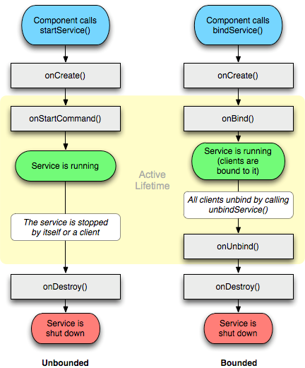
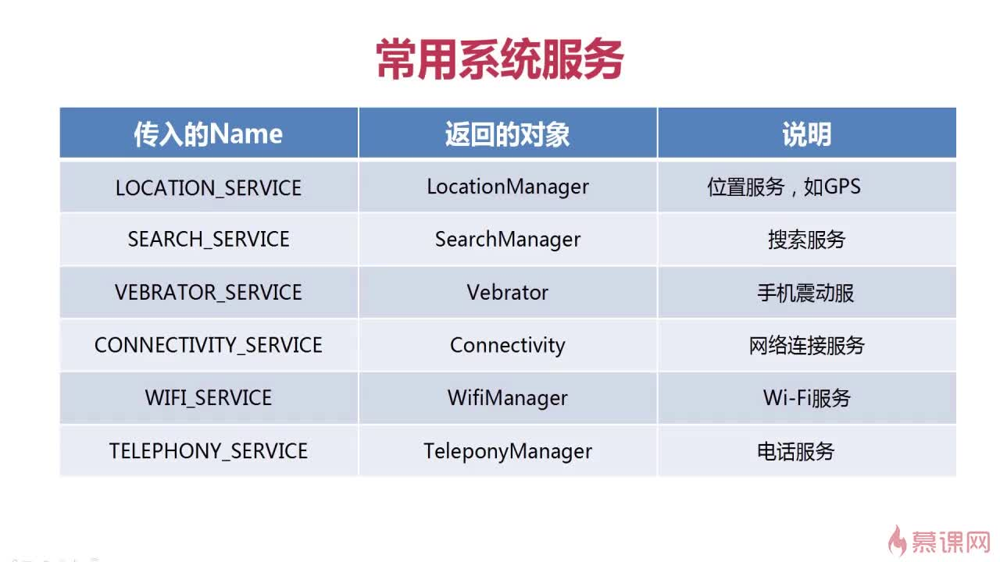
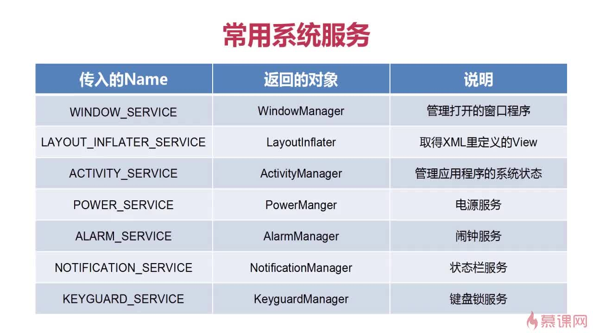

## 1 Activity 

### 1.1 Activity 生命周期 

* onCreate()：正在被创建，常用来**初始化工作**，比如调用 setContentView 加载界面布局资源，初始化 Activity 所需数据等；

* onRestart()：正在重新启动，一般情况下，当前 Acitivty 从不可见重新变为可见时，OnRestart 就会被调用；

* onStart()：正在被启动，此时 Activity 可见但不在前台，还处于后台，无法与用户交互；

* onResume()：获得焦点，此时 Activity 可见且在前台并开始活动，这是 与onStart 的区别所在；

* onPause()：正在停止，此时可做一些存储数据、停止动画等工作，但不能太耗时，因为这会影响到新 Activity 的显示，onPause 必须先执行完，新 Activity 的 onResume 才会执行；

* onStop()：即将停止，可以做一些稍微重量级的回收工作，比如注销广播接收器、关闭网络连接等，同样不能太耗时；

* onDestroy()：即将被销毁，Activity 生命周期中的最后一个回调，常做回收工作、资源释放；

### 1.2 横竖屏切换时候 Activity 的生命周期

* 不设置  **android:configChanges** ，切屏会销毁当前 Activity，重新加载各个生命周期，切横屏时会执行一次，切竖屏时会执行两次。

* 设置 android:configChanges="orientation"
  * 在Android5.1 即API 23级别下，切屏会重新调用各个生命周期，切横、竖屏时只会执行一次。
  * 在Android9 即API 28级别下，切屏不会重新调用各个生命周期，只会执行 onConfigurationChanged 方法
* 设置 android:configChanges="orientation|keyboardHidden|screenSize"：切屏不会重新调用各个生命周期，只会执行onConfigurationChanged方法。


### 1.3 ActivityA跳转ActivityB然后B按back返回A，各自的生命周期顺序，A与B均不透明？如果B是透明主题的又或是个DialogActivity呢？
```java
A -> B
A:onPause
B:onCreate -> onStart -> onResume
A:onStop
    
B -> A
B:onPause
A:onRestart -> onStart -> onResume -> onStop    
B:onStop -> onDestroy 

//B是透明主题
//A:不会调用 onStop   
```

### 1.4 Android中进程的优先级？

* 前台进程：与用户正在交互的 Activity 或者 Activity 用到的 Service 等，如果系统内存不足时前台进程是最晚被杀死的。
* 可见进程：处于暂停状态(onPause)的 Activity 或者绑定在其上的 Service，即被用户可见，但由于失了焦点而不能与用户交互。
* 服务进程：其中运行着使用 startService 方法启动的 Service，虽然不被用户可见，但是却是用户关心的，例如用户正在非音乐界面听的音乐或者正在非下载页面下载的文件等；当系统要空间运行，前两者进程才会被终止。
* 后台进程：其中运行着执行 onStop 方法而停止的程序，但是却不是用户当前关心的，例如后台挂着的QQ，这时的进程系统一旦没了有内存就首先被杀死。
* 空进程：不包含任何应用程序的进程，这样的进程系统是一般不会让他存在的。

### 1.5 Activty 和 Fragmengt 之间怎么通信，Fragmengt和Fragmengt怎么通信？

* Handler
* 广播
* 事件总线：EventBus、RxBus、Otto
* 接口回调
* Bundle 和 setArguments(bundle)

### 1.6 onSaveInstanceState()方法的作用 ? 何时会被调用？

系统**配置发生改变**时导致 Activity 被杀死并重新创建、资源内存不足导致优先级低的 Activity 被杀死。

系统会调用 onSaveInstanceState 来保存当前 Activity 的状态，此方法调用在onStop之前，与onPause 没有既定的时序关系；

当Activity被重建后，系统会调用 onRestoreInstanceState，并且把 onSaveInstanceState 方法所保存的 Bundle 对象同时传参给 onRestoreInstanceState 和 onCreate()，因此可以通过这两个方法判断Activity 是否被重建 ，调用在 onStart 之后；

###  1.7 Activity的四种启动模式、应用场景 ？

**standard标准模式**：每次启动一个 Activity 都会重新创建一个新的实例，不管这个实例是否已经存在，此模式的 Activity 默认会进入启动它的 Activity 所属的任务栈中；

**singleTop栈顶复用模式**：如果新 Activity 已经位于任务栈的栈顶，那么此 Activity 不会被重新创建，同时会回调 **onNewIntent** 方法，如果新 Activity 实例已经存在但不在栈顶，那么 Activity 依然会被重新创建；

**singleTask栈内复用模式**：只要 Activity 在一个任务栈中存在，那么多次启动此 Activity 都不会重新创建实例，并回调 **onNewIntent** 方法，此模式启动 Activity，系统首先会寻找是否 Activity 存在想要的任务栈，如果不存在，就会重新创建一个任务栈，然后把创建好 Activity 的实例放到栈中，具有 clearTop 功能；

**singleInstance单实例模式**：这是一种加强的 singleTask 模式，具有此种模式的 Activity 只能单独地位于一个任务栈中，且此任务栈中只有唯一一个实例；

### 1.8 Activity 常用的标记位 Flags？

**FLAG_ACTIVITY_NEW_TASK :** 对应singleTask启动模式；

**FLAG_ACTIVITY_SINGLE_TOP :** 对应singleTop启动模式；

**FLAG_ACTIVITY_CLEAR_TOP :**当它启动时，在同一个任务栈中所有位于它上面的 Activity 都要出栈。这个标记位一般会和 **singleTask** 模式一起出现，在这种情况下，被启动 Activity 的实例如果已经存在，那么系统就会回调 onNewIntent。如果被启动的 Activity 采用 standard 模式启动，那么它以及连同它之上的 Activity 都要出栈，系统会创建新的 Activity 实例并放入栈中；

**FLAG_ACTIVITY_EXCLUDE_FROM_RECENTS :** 具有这个标记的 Activity 不会出现在历史 Activity 列表中；

### 1.9 Activity 跟 window，view 之间的关系？

window （实现类是 PhoneWindow ）相当于一个容器，里面盛放着很多 view，这些 view 是以树状结构组织起来的。

一个 Activity 对应一个 Window，Activity 本身是没办法处理显示什么控件（view）的，是通过PhoneWindow 进行显示的。

### 1.10 如何启动其他应用的 Activity？

在保证有权限访问的情况下，通过隐式 Intent 进行目标 Activity 的 **IntentFilter** 匹配，原则是：

- 一个 intent 只有同时匹配某个 Activity 的 intent-filter 中的 action、category、data 才算完全匹配，才能启动该Activity；
- 一个 Activity 可以有多个 intent-filter，一个 intent 只要成功匹配任意一组 intent-filter，就可以启动该Activity；

#### Activity的启动过程？(重点)

### 1.10.1 根 Activity 启动

### 1.10.2 普通 Activity 启动


## 4 Fragment

#### Fragment的生命周期？

Fragment 从创建到销毁整个生命周期中涉及到的方法依次为：onAttach()→onCreate()→ onCreateView()→onActivityCreated()→onStart()→onResume()→onPause()→onStop()→onDestroyView()→onDestroy()→onDetach()，其中和 Activity 有不少名称相同作用相似的方法，而不同的方法有:

- **onAttach()**：当Fragment和Activity建立关联时调用；
- **onCreateView()**：当fragment创建视图调用，在onCreate之后；
- **onActivityCreated()**：当与Fragment相关联的Activity完成onCreate()之后调用；
- **onDestroyView()**：在Fragment中的布局被移除时调用；
- **onDetach()**：当Fragment和Activity解除关联时调用；


谈谈Activity和Fragment的区别？

相似点：都可包含布局、可有自己的生命周期

不同点：

- Fragment相比较于Activity多出4个回调周期，在控制操作上更灵活；
- Fragment可以在XML文件中直接进行写入，也可以在Activity中动态添加；
- Fragment可以使用show()/hide()或者replace()随时对Fragment进行切换，并且切换的时候不会出现明显的效果，用户体验会好；Activity虽然也可以进行切换，但是Activity之间切换会有明显的翻页或者其他的效果，在小部分内容的切换上给用户的感觉不是很好；

### add 与 replace 的区别

add 不会重新初始化 fragment，replace 会。所以如果在fragment生命周期内获取获取数据,使用replace会重复获取；

添加相同的 fragment 时，replace 不会有任何变化，add 会报 IllegalStateException异常；

replace 先 remove 掉相同id的所有fragment，然后在add当前的这个fragment，而add是覆盖前一个fragment。所以如果使用add一般会伴随hide()和show()，避免布局重叠；

使用 add，如果应用放在后台，或以其他方式被系统销毁，再打开时，hide() 中引用的 fragment 会销毁，所以依然会出现布局重叠bug，可以使用 replace 或使用 add 时，添加一个tag参数；

#### getFragmentManager、getSupportFragmentManager 、getChildFragmentManager之间的区别？

getFragmentManager()所得到的是所在fragment 的**父容器**的管理器， getChildFragmentManager()所得到的是在fragment  里面**子容器**的管理器， 如果是fragment嵌套fragment，那么就需要利用getChildFragmentManager()；

因为Fragment是3.0 Android系统API版本才出现的组件，所以3.0以上系统可以直接调用getFragmentManager()来获取FragmentManager()对象，而3.0以下则需要调用getSupportFragmentManager() 来间接获取；

### FragmentPagerAdapter与FragmentStatePagerAdapter的区别与使用场景？

相同点 ：二者都继承PagerAdapter

不同点 ：

* FragmentPagerAdapter 的每个 Fragment 会**持久**的保存在 FragmentManager 中，只要用户可以返回到页面中，它都不会被销毁。因此适用于那些数据**相对静态**的页，Fragment  数量也比较少的那种； 
* FragmentStatePagerAdapter 只保留当前页面，当页面不可见时，该 Fragment 就会被消除，释放其资源。因此适用于那些数据动态性较大、占用内存较多，多 Fragment 的情况；


## 3 BroadcastReceiver

#### 1、广播有几种形式 ? 都有什么特点 ？

普通广播：开发者自身定义 intent的广播（最常用），所有的广播接收器几乎会在同一时刻接受到此广播信息，**接受的先后顺序随机**；

有序广播：发送出去的广播被广播接收者**按照先后顺序接收**，同一时刻只会有一个广播接收器能够收到这条广播消息，当这个广播接收器中的逻辑执行完毕后，广播才会继续传递，且优先级（priority）高的广播接收器会先收到广播消息。有序广播可以被接收器截断使得后面的接收器无法收到它；

本地广播：仅在自己的应用内发送接收广播，也就是只有自己的应用能收到，数据更加安全，效率更高，但只能采用**动态注册**的方式；

粘性广播：这种广播会**一直滞留**，当有匹配该广播的接收器被注册后，该接收器就会收到此条广播；

### 广播注册有哪几种方式

```java
//动态注册
receiver = new MyReceiver();
		registerReceiver(receiver2, new IntentFilter(
				"XXX"));
//静态注册
<receiver android:name="XXX" >
        <intent-filter>
            <action android:name="android.intent.action.SCREEN_ON" />
            <action android:name="android.intent.action.SCREEN_OFF" />
            <action android:name="android.intent.action.CALL" />
            <action android:name="android.intent.action.AIRPLANE_MODE" />
        </intent-filter>
</receiver>

//区别：
//动态注册：不是常驻型广播，也就是说广播跟随程序的生命周期。
//静态注册：常驻型，也就是说当应用程序关闭后，如果有信息广播来，程序也会被系统调用自动运行       
```

#### 广播发送和接收的原理了解吗 ？（Binder机制、AMS）

## 4 Service

### 谈一谈Service的生命周期？

* onCreate()：onCreate() 在第一次创建 Service 时调用，多次执行 startService() 不会重复调用onCreate()，此方法适合完成一些初始化工作；
* onStartComand()：服务启动时调用，此方法适合完成一些数据加载工作，比如会在此处创建一个线程用于下载数据或播放音乐；
* onBind()：服务被绑定；
* onUnBind()：服务被解绑；
* onDestroy()：服务停止；



### Service的两种启动方式？区别在哪？

* startService()：onCreate() 只会被调用一次，多次调用 startService() 会多次执行onStartCommand() 和 onStart() 方法。如果外部没有调用 stopService() 或 stopSelf() 方法，service 会**一直运行**。
* bindService()：如果该服务之前还没创建，系统回调顺序为 onCreate()→onBind()。如果调用bindService() 方法前服务已经被绑定，多次调用 bindService() 方法不会多次创建服务及绑定。如果调用者希望与正在绑定的服务解除绑定，可以调用 unbindService() 方法，回调顺序为onUnbind()→onDestroy()；


### 如何保证Service不被杀死 ？

* onStartCommand方式中，返回START_STICKY或则START_REDELIVER_INTENT

* START_STICKY：如果返回START_STICKY，表示Service运行的进程被Android系统强制杀掉之后，Android系统会将该Service依然设置为started状态（即运行状态），但是不再保存onStartCommand方法传入的intent对象
  START_NOT_STICKY：如果返回START_NOT_STICKY，表示当Service运行的进程被Android系统强制杀掉之后，不会重新创建该Service
  START_REDELIVER_INTENT：如果返回START_REDELIVER_INTENT，其返回情况与START_STICKY类似，但不同的是系统会保留最后一次传入onStartCommand方法中的Intent再次保留下来并再次传入到重新创建后的Service的onStartCommand方法中

* 提高Service的优先级
  在AndroidManifest.xml文件中对于intent-filter可以通过android:priority = "1000"这个属性设置最高优先级，1000是最高值，如果数字越小则优先级越低，同时适用于广播；
  在onDestroy方法里重启Service
  当service走到onDestroy()时，发送一个自定义广播，当收到广播时，重新启动service；
  提升Service进程的优先级
  进程优先级由高到低：前台进程 一 可视进程 一 服务进程 一 后台进程 一 空进程
  可以使用startForeground将service放到前台状态，这样低内存时，被杀死的概率会低一些；
  系统广播监听Service状态
  将APK安装到/system/app，变身为系统级应用


注意：以上机制都不能百分百保证Service不被杀死，除非做到系统白名单，与系统同生共死

### 能否在Service开启耗时操作 ？ 

Service 默认并不会运行在子线程中，也不运行在一个独立的进程中，它同样执行在主线程中（UI线程）。所以，不要在 Service 里执行耗时操作，但，可以使用子线程，否则有可能出现主线程被阻塞（ANR）的情况。

### 常用的系统 Service？





### ActivityManagerService 作用

ActivityManagerService(AMS) 是 Android 中最核心的服务，主要负责系统中四大组件的启动、切换、调度及应用程序的管理和调度等工作。

## 5 ContentProvider

1、广播有几种形式 ? 都有什么特点 ？


参考回答：

普通广播：开发者自身定义 intent的广播（最常用），所有的广播接收器几乎会在同一时刻接受到此广播信息，接受的先后顺序随机；
有序广播：发送出去的广播被广播接收者按照先后顺序接收，同一时刻只会有一个广播接收器能够收到这条广播消息，当这个广播接收器中的逻辑执行完毕后，广播才会继续传递，且优先级（priority）高的广播接收器会先收到广播消息。有序广播可以被接收器截断使得后面的接收器无法收到它；
本地广播：仅在自己的应用内发送接收广播，也就是只有自己的应用能收到，数据更加安全，效率更高，但只能采用动态注册的方式；
粘性广播：这种广播会一直滞留，当有匹配该广播的接收器被注册后，该接收器就会收到此条广播；


推荐文章：

Android四大组件：BroadcastReceiver史上最全面解析


2、广播的两种注册方式 ？


参考回答：


3、广播发送和接收的原理了解吗 ？（Binder机制、AMS）


参考回答：

推荐文章：

广播的底层实现原理


## 6 数据存储

