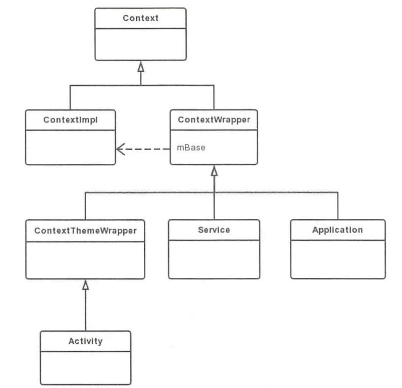

## 1 简介

Context 上下文对象，Android 中很多业务流程都涉及到 Context。



Context 数量 = Activity 数量 + Service 数量 + Application 数量(1)

## 2 Application Context 的创建过程

在 Activity 启动流程源码分析的启动过程中, 最后一个重要的方法是performLaunchActivity, 源码如下：

```java
private Activity performLaunchActivity(ActivityClientRecord r, Intent customIntent) {
    
    ...
    //创建 Application
    Application app = r.packageInfo.makeApplication(false, mInstrumentation);
    ...
    return activity;
}

```

主要看 r.packageInfo.makeApplication -> LpadedApk

```java
@UnsupportedAppUsage
public Application makeApplication(boolean forceDefaultAppClass,
            Instrumentation instrumentation) {
        //不为 null 就直接返回 Application
        if (mApplication != null) {
            return mApplication;
        }
        ...
        try {
            java.lang.ClassLoader cl = getClassLoader();
            if (!mPackageName.equals("android")) {
                ...
            }
            //创建 ContextImpl类型的 appContext
            ContextImpl appContext = ContextImpl.createAppContext(mActivityThread, this);
            //创建了一个 app 实例 反射
            app = mActivityThread.mInstrumentation.newApplication(
                    cl, appClass, appContext);
            appContext.setOuterContext(app);
        } catch (Exception e) {
            ...
        }
        mActivityThread.mAllApplications.add(app);
        mApplication = app;
        if (instrumentation != null) {
            try {
               //最终就调用了application.onCreate()方法
                instrumentation.callApplicationOnCreate(app);
            } catch (Exception e) {
                ...
            }
        }
        return app;
    }
```

