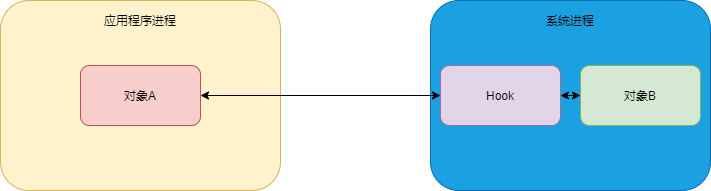

## 1 简介



对象 A 调用 对象 B 之前做一些处理，起到欺上瞒下的作用，Hook 就是一个钩子，也称 Hook 点，有了 Hook，可以在进程间进行行为更改。

Hook 点一般选择容易并且不易变化的对象，比如**静态变量和单例**。

## 2 Hook 技术分类

* API 语言分类
  * Hook Java：反射和代理
  * Hook Native
* 进程分类
  * 进程 Hook，应用程序进程，只能 Hook 当前的应用程序
  * 全局 Hook，Hook Zygote
* 实现方式分类
  * 反射和代理实现，只能 Hook 当前的应用程序进程
  * Hook 框架，比如 Xposed，实现全局 Hook，需要 root

## 3 Hook Activity 的 startActivity

例子：Hook Activity startActivity

```java
//startActivity 调用到 Activity.class 中下面的方法
public void startActivityForResult(@RequiresPermission Intent intent, int requestCode,
            @Nullable Bundle options) {
        if (mParent == null) {
            options = transferSpringboardActivityOptions(options);
            //Hook 点
            Instrumentation.ActivityResult ar =
                mInstrumentation.execStartActivity(
                    this, mMainThread.getApplicationThread(), mToken, this,
                    intent, requestCode, options);
            if (ar != null) {
                mMainThread.sendActivityResult(
                    mToken, mEmbeddedID, requestCode, ar.getResultCode(),
                    ar.getResultData());
            }
            if (requestCode >= 0) {
                mStartedActivity = true;
            }

            cancelInputsAndStartExitTransition(options);
        } else {
            if (options != null) {
                mParent.startActivityFromChild(this, intent, requestCode, options);
            } else {
                mParent.startActivityFromChild(this, intent, requestCode);
            }
        }
    }

```

```java
//定义代理类
public class InstrumentationProxy extends Instrumentation {
    private Instrumentation mInstrumentation;
    private static final String TAG = "InstrumentationProxy";
    public InstrumentationProxy(Instrumentation instrumentation) {
        mInstrumentation = instrumentation;
    }
      public ActivityResult execStartActivity(
            Context who, IBinder contextThread, IBinder token, Activity target,
            Intent intent, int requestCode, Bundle options) {
          Log.d(TAG,"这里是Hook点 who："+ who);
          try {
              final Class<Instrumentation> clazz = Instrumentation.class;
              final Method method = clazz.getDeclaredMethod("execStartActivity",
                      Context.class, IBinder.class, IBinder.class, Activity.class, Intent.class, int.class, Bundle.class);
              return (ActivityResult) method.invoke(mInstrumentation,who,contextThread,token,target,intent,requestCode,options);
          } catch (Exception e) {
              throw new RuntimeException(e);
          }


      }
}


public class MainActivity extends AppCompatActivity {

    @Override
    protected void onCreate(Bundle savedInstanceState) {
        super.onCreate(savedInstanceState);
        setContentView(R.layout.activity_main);
        replaceInstrumentation(this);
        final Intent intent = new Intent(Intent.ACTION_VIEW);
        intent.setData(Uri.parse("http://baidu.com"));
        startActivity(intent);
    }

    //替换原来的 Instrumentation
    private void replaceInstrumentation(Activity activity){
        try {
            //反射
            final Field field = Activity.class.getDeclaredField("mInstrumentation");
            field.setAccessible(true);
            final Instrumentation instrumentation = (Instrumentation)field.get(activity);
            final InstrumentationProxy proxy = new InstrumentationProxy(instrumentation);
            field.set(activity,proxy);
        } catch (Exception e) {
            e.printStackTrace();
        }
    }
}

//代理成功了
//out:
//01-12 22:54:10.830 1713-1713/com.test.all D/InstrumentationProxy: 这里是Hook点 who：com.test.all.MainActivity@39b11d7
```