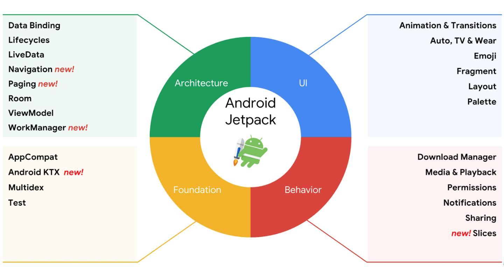

## 1 简介

Jetpack 是由一套库、工具和指南的集合，旨在帮助开发者快速的开发应用，Jetpack 构成如下所示：




由上图所示，Jetpack 主要由四部分组成：

* 架构 - Architecture：帮助开发者设计稳健、可测试且易维护的应用。

* 基础 - Foundation：提供了最基础的底层功能，如向后兼容性、测试、开发语言Kotlin支持，并包括多个平台开发的组件。
* 行为 - Behavior：帮助应用与标准的 Android 服务（如通知、权限、分享）相集成。
* 界面 - UI：辅助绘制界面的View类 & 各种辅助组件。

我们也可以在[官网](https://developer.android.google.cn/jetpack)上查看具体使用。


## 2 Lifecycle

Lifecycler 可以帮助开发者管理 Activity 和 Fragment 生命周期。

使用 MVP 例子：

```java
//IPresenter.java
public interface IPresenter extends LifecycleObserver {
    
    @OnLifecycleEvent(Lifecycle.Event.ON_START)
    void onStart();

    @OnLifecycleEvent(Lifecycle.Event.ON_RESUME)
    void onResume();

}

//MyPresenter.java
public class MyPresenter implements IPresenter {
    private static final String TAG = "TESTLIFE";

    @Override
    public void onStart() {
        Log.d(TAG, "onStart:MyPresenter");

    }

    @Override
    public void onResume() {
        Log.d(TAG, "onResume:MyPresenter");
    }

}

//MainActivity.java
//AppCompatActivity 实现 LifecycleOwner（被观察者） 接口
public class MainActivity extends AppCompatActivity {
    private MyPresenter mPresenter;
    private static final String TAG = "TESTLIFE";

    @Override
    protected void onCreate(Bundle savedInstanceState) {
        super.onCreate(savedInstanceState);
        setContentView(R.layout.activity_main);
        
        mPresenter = new MyPresenter();
        getLifecycle().addObserver(mPresenter);
    }

    @Override
    protected void onStart() {
        super.onStart();
        Log.d(TAG, "onStart:MainActivity");
    }

    @Override
    protected void onResume() {
        super.onResume();
        Log.d(TAG, "onResume:MainActivity");
    }
}

//out:
//2020-12-30 17:37:56.611 10457-10457/com.test.testjet D/TESTLIFE: onStart:MainActivity
//2020-12-30 17:37:56.611 10457-10457/com.test.testjet D/TESTLIFE: onStart:MyPresenter
//2020-12-30 17:37:56.613 10457-10457/com.test.testjet D/TESTLIFE: onResume:MainActivity 
//2020-12-30 17:37:56.614 10457-10457/com.test.testjet D/TESTLIFE: onResume:MyPresenter
```

明显可以看出 MyPersenter 可以感知出 Activity 生命周期变化。对比传统的 MVP 我们不需要在 Activity 生命周期发生变化时，去调用 Persenter的相关方法。

### 2.1 Lifecycler 原理

Lifecycler 使用 **Event 和 State** 这两个枚举来跟踪其关联组件的生命周期。

* Event：Lifecycler 生命周期对应的事件
* State：Lifecycler 生命周期所处的状态

```java
public abstract class Lifecycle {
    @RestrictTo(RestrictTo.Scope.LIBRARY_GROUP)
    @NonNull
    AtomicReference<Object> mInternalScopeRef = new AtomicReference<>();
    
    //添加观察者
    @MainThread
    public abstract void addObserver(@NonNull LifecycleObserver observer);
    
    //移除观察者
    @MainThread
    public abstract void removeObserver(@NonNull LifecycleObserver observer);

    @MainThread
    @NonNull
    public abstract State getCurrentState();

    @SuppressWarnings("WeakerAccess")
    public enum Event {
        ON_CREATE,
        ON_START,
        ON_RESUME,
        ON_PAUSE,  
        ON_STOP,
        ON_DESTROY,
        ON_ANY
    }


    @SuppressWarnings("WeakerAccess")
    public enum State {
        DESTROYED,
        INITIALIZED,
        CREATED,
        STARTED,
        RESUMED;
        public boolean isAtLeast(@NonNull State state) {
            return compareTo(state) >= 0;
        }
    }
}

```

从示例代码中我们可以看到如下代码：

```jaav
getLifecycle().addObserver(mPresenter);
```

getLifecycle()，点击进去。

```java
//ComponentActivity 是继承自 Activity 并实现了LifecycleOwner(标记类有 Android 的生命周期的)
public class ComponentActivity extends androidx.core.app.ComponentActivity implements
        LifecycleOwner,
        ViewModelStoreOwner,
        SavedStateRegistryOwner,
        ...
        {
    //LifecycleRegistry 是 Lifecycler 实现类   
    private final LifecycleRegistry mLifecycleRegistry = new LifecycleRegistry(this);

    ...
    protected void onCreate(@Nullable Bundle savedInstanceState) {
          super.onCreate(savedInstanceState);
          ReportFragment.injectIfNeededIn(this);//代码1
    } 
            
    @NonNull
    @Override
    public Lifecycle getLifecycle() {
        return mLifecycleRegistry;
    }
}            
```

把生命周期改变 Lifecycler 的 State 交给 ReportFragment 处理。

代码1 ：ReportFragment#injectIfNeededIn

```java
public class ReportFragment extends Fragment {
    private static final String REPORT_FRAGMENT_TAG = "androidx.lifecycle"
            + ".LifecycleDispatcher.report_fragment_tag";

   public static void injectIfNeededIn(Activity activity) {
        android.app.FragmentManager manager = activity.getFragmentManager();
        if (manager.findFragmentByTag(REPORT_FRAGMENT_TAG) == null) {
            manager.beginTransaction().add(new ReportFragment(), REPORT_FRAGMENT_TAG).commit();
            manager.executePendingTransactions();
        }
    }
        
   @Override
    public void onActivityCreated(Bundle savedInstanceState) {
    	super.onActivityCreated(savedInstanceState);
    	dispatchCreate(mProcessListener);
        //改变 State
    	dispatch(Lifecycle.Event.ON_CREATE);
	}

	@Override
	public void onStart() {
    	super.onStart();
    	dispatchStart(mProcessListener);
    	dispatch(Lifecycle.Event.ON_START);//代码1
	}
        
    private void dispatchStart(ActivityInitializationListener listener) {
        if (listener != null) {
            listener.onStart();
        }
    }    
    ...
	private void dispatchCreate(ActivityInitializationListener listener) {
    	if (listener != null) {
        	listener.onCreate();
    	}
	}     
}
```

代码1：很显然这里是一个关键点。

```java
 private void dispatch(Lifecycle.Event event) {
        Activity activity = getActivity();
        if (activity instanceof LifecycleRegistryOwner) {//是否是 LifecycleRegistryOwner
            ((LifecycleRegistryOwner) activity).getLifecycle().handleLifecycleEvent(event);//代码1
            return;
        }

        if (activity instanceof LifecycleOwner) {//是否是 LifecycleOwner
            Lifecycle lifecycle = ((LifecycleOwner) activity).getLifecycle();
            if (lifecycle instanceof LifecycleRegistry) {
                ((LifecycleRegistry) lifecycle).handleLifecycleEvent(event);//代码2
            }
        }
    }
```

LifecycleRegistryOwner 接口继承了 LifecycleOwner。LifecycleOwner# getLifecycle() 返回 Lifecycle，LifecycleRegistryOwner#getLifecycle() 返回 LifecycleRegistry。

代码1 和  代码2 调用 handleLifecycleEvent，明显是一个关键点。

```java
//LifecycleRegistry

public void handleLifecycleEvent(@NonNull Lifecycle.Event event) {
      State next = getStateAfter(event); //获取下一个状态
      moveToState(next);//改变状态
}

private void moveToState(State next) {
    ......
    sync();
    ......
}

private void sync() {
    LifecycleOwner lifecycleOwner = mLifecycleOwner.get();    
    //循环遍历所有观察者
    while (...) {
        ....
        //分发事件
        forwardPass(lifecycleOwner);
    }
}

//分发事件
private void forwardPass(LifecycleOwner lifecycleOwner) {
    Iterator<Entry<LifecycleObserver, ObserverWithState>> ascendingIterator =
            mObserverMap.iteratorWithAdditions();
    while (ascendingIterator.hasNext() && !mNewEventOccurred) {
        Entry<LifecycleObserver, ObserverWithState> entry = ascendingIterator.next();
        //ObserverWithState
        ObserverWithState observer = entry.getValue();
        while ((observer.mState.compareTo(mState) < 0 && !mNewEventOccurred
                && mObserverMap.contains(entry.getKey()))) {
            pushParentState(observer.mState);
            //分发事件 
            observer.dispatchEvent(lifecycleOwner, upEvent(observer.mState));
            popParentState();
        }
    }
}
```

我们来看看  ObserverWithState

```java
static class ObserverWithState {
        State mState;
        LifecycleEventObserver mLifecycleObserver;

        ObserverWithState(LifecycleObserver observer, State initialState) {
            mLifecycleObserver = Lifecycling.lifecycleEventObserver(observer);
            mState = initialState;
        }

        void dispatchEvent(LifecycleOwner owner, Event event) {
            State newState = getStateAfter(event);
            mState = min(mState, newState);
            mLifecycleObserver.onStateChanged(owner, event);
            mState = newState;
        }
}
```

代码1：如果生命周期变了 mLifecycleObserver. onStateChanged，LifecycleEventObserver 是一个接口

```java
class ReflectiveGenericLifecycleObserver implements LifecycleEventObserver {
    private final Object mWrapped;
    private final CallbackInfo mInfo;

    ReflectiveGenericLifecycleObserver(Object wrapped) {
        mWrapped = wrapped;
        mInfo = ClassesInfoCache.sInstance.getInfo(mWrapped.getClass());
    }

    @Override
    public void onStateChanged(LifecycleOwner source, Event event) {
        //CallbackInfo#invokeCallbacks
        mInfo.invokeCallbacks(source, event, mWrapped);//代码1
    }
}
```

CallbackInfo 其实就是 解析 OnLifecycleEcent 的注解，保存注解修饰的方法和事件，通过反射对事件的对应进行调用。

## 3 LiveData 

* 可观察的数据持有者，具有生命周期感知，能够在 Activity、Fragment、Service 中正确处理生命周期。
* 只有处于 Active 的观察者才会收到 LiveData 通知，如果观察者处于 Paused 或 Destroyed ，不会收到通知。

数据转换：

* map()： 可以转换 LiveData 的输出 
* switchMap() ：更改被 LiveData 观察的对象
* MediatorLiveData ：提供自定义数据转换

例子：

```java
public class MainActivity extends AppCompatActivity {  
    private static final String TAG = "TESTLIFE";
    @Override
    protected void onCreate(Bundle savedInstanceState) {

        super.onCreate(savedInstanceState);
        setContentView(R.layout.activity_main);       
        final MutableLiveData<String> data = new MutableLiveData<>();
        data.observe(this, new Observer<String>() {
            @Override
            public void onChanged(String s) {
                Log.d(TAG, s);
            }
        });
        //data.setValue("Test"); setValue 需要在主线程中调用
        data.postValue("Test");
    }
}
```

### 3.1 LiveData 原理

```java
@MainThread
public void observe(@NonNull LifecycleOwner owner, @NonNull Observer<? super T> observer) {
      assertMainThread("observe");
      //如果是 DESTROYED，直接 return
      if (owner.getLifecycle().getCurrentState() == DESTROYED) {
          return;
      }
      //LifecycleBoundObserver 包装类
      LifecycleBoundObserver wrapper = new LifecycleBoundObserver(owner, observer);
      //SafeIterableMap<Observer<? super T>, ObserverWrapper> mObservers 存储
      ObserverWrapper existing = mObservers.putIfAbsent(observer, wrapper);
      if (existing != null && !existing.isAttachedTo(owner)) {
          throw new IllegalArgumentException("Cannot add the same observer"
                  + " with different lifecycles");
      }
      if (existing != null) {
          return;
      }
      //LifecycleBoundObserver 添加 
      owner.getLifecycle().addObserver(wrapper);//代码1
}
```

接下来我们看看 LifecycleBoundObserver ，LifecycleBoundObserver  是 LiveData 内部类。

```java
 class LifecycleBoundObserver extends ObserverWrapper implements LifecycleEventObserver {
        ...
        //状态变化
        @Override
        public void onStateChanged(LifecycleOwner source, Lifecycle.Event event) {
            if (mOwner.getLifecycle().getCurrentState() == DESTROYED) {
                //如果 DESTROYED 移除
                removeObserver(mObserver);
                return;
            }
            activeStateChanged(shouldBeActive());//代码1
        }
      ...
 }    
```

代码1：调用 LiveData#activeStateChanged。

```java
void activeStateChanged(boolean newActive) {
            if (newActive == mActive) {
                return;
            }
            mActive = newActive;
            boolean wasInactive = LiveData.this.mActiveCount == 0;
            LiveData.this.mActiveCount += mActive ? 1 : -1;
            if (wasInactive && mActive) {
                onActive();
            }
            if (LiveData.this.mActiveCount == 0 && !mActive) {
                onInactive();
            }
            if (mActive) {
                dispatchingValue(this);//分发
            }
        }
    }
```

根据 Active 状态和处于 Active 状态的组件的数量，进行方法回调，处于 Active，进行分发。

```java
void dispatchingValue(@Nullable ObserverWrapper initiator) {
        if (mDispatchingValue) {
            mDispatchInvalidated = true;
            return;
        }
        //标记是否处于分发状态
        mDispatchingValue = true;
        do {
            mDispatchInvalidated = false;
            if (initiator != null) {
                //代码1
                considerNotify(initiator);
                initiator = null;
            } else {
                for (Iterator<Map.Entry<Observer<? super T>, ObserverWrapper>> iterator =
                        mObservers.iteratorWithAdditions(); iterator.hasNext(); ) {
                    considerNotify(iterator.next().getValue());
                    if (mDispatchInvalidated) {
                        break;
                    }
                }
            }
        } while (mDispatchInvalidated);
        mDispatchingValue = false;
    }
```

代码1：

```java
 private void considerNotify(ObserverWrapper observer) {
        if (!observer.mActive) {
            return;
        }
        if (!observer.shouldBeActive()) {
            observer.activeStateChanged(false);
            return;
        }
        if (observer.mLastVersion >= mVersion) {
            return;
        }
        observer.mLastVersion = mVersion;
        //调用 onChanged 回调
        observer.mObserver.onChanged((T) mData);
    }
```

接下来看看 postValue 和 setValue 方法。

```java
//线程
private final Runnable mPostValueRunnable = new Runnable() {
        @Override
        public void run() {
            Object newValue;
            synchronized (mDataLock) {
                newValue = mPendingData;
                mPendingData = NOT_SET;
            }
            //noinspection unchecked
            setValue((T) newValue);
        }
    }; 

protected void postValue(T value) {
        boolean postTask;
        synchronized (mDataLock) {
            postTask = mPendingData == NOT_SET;
            mPendingData = value;
        }
        if (!postTask) {
            return;
        }
        //将 setValue 切换到主线程
        ArchTaskExecutor.getInstance().postToMainThread(mPostValueRunnable);
    }

    @MainThread
    protected void setValue(T value) {
        assertMainThread("setValue");
        mVersion++;
        mData = value;
        //调用 dispatchingValue
        dispatchingValue(null);
    }
```

## 4 ViewModel

LiveData 通常和 ViewModel 一起使用，ViewModel 感知生命周期的形式来**存储和管理视图相关数据的**。

例子：

```java
public class MyViewModel extends ViewModel {
    private MutableLiveData<String> name;

    public MutableLiveData<String> getName() {
        if (name == null) {
            name = new MutableLiveData<>();
            addName();
        }
        return name;
    }

    private void addName() {
        name.setValue("Android");
    }

}


public class MainActivity extends AppCompatActivity {
    private MyPresenter mPresenter;
    private static final String TAG = "TESTLIFE";

    @Override
    protected void onCreate(Bundle savedInstanceState) {
        super.onCreate(savedInstanceState);
        setContentView(R.layout.activity_main);
        final MyViewModel myViewModel = ViewModelProviders.of(this).get(MyViewModel.class);
        myViewModel.getName().observe(this, new Observer<String>() {
            @Override
            public void onChanged(String s) {
                Log.d(TAG, s);
            }
        });
    }
}
```

### 4.1 ViewModel 原理

从例子可以看出 ViewModelProviders.of(this).get(MyViewModel.class); 是 ViewModel 入口。ViewModelProviders.of() 有许多的构造方法，这里以参数是 Activity 为例子。

```java
    @NonNull
    @MainThread
    public static ViewModelProvider of(@NonNull FragmentActivity activity,
            @Nullable Factory factory) {
        Application application = checkApplication(activity);//返回 Application
        if (factory == null) {
            //创建 AndroidViewModelFactory 
            factory = ViewModelProvider.AndroidViewModelFactory.getInstance(application);
        }
        //创建 ViewModelProvider 
        return new ViewModelProvider(activity.getViewModelStore(), factory);
    }
```


```java
   //ViewModelProvider#get  
   @NonNull
    @MainThread
    public <T extends ViewModel> T get(@NonNull String key, @NonNull Class<T> modelClass) {
        ViewModel viewModel = mViewModelStore.get(key);

        if (modelClass.isInstance(viewModel)) {
            //noinspection unchecked
            return (T) viewModel;
        } else {
            //noinspection StatementWithEmptyBody
            if (viewModel != null) {
                // TODO: log a warning.
            }
        }
        //反射创建 ViewModel 实现类
        viewModel = mFactory.create(modelClass);
        mViewModelStore.put(key, viewModel);
        return (T) viewModel;
    }
```

创建完 ViewModel 实现类之后，就调用 observer，这部分逻辑和 LiveData 一样。

 

## 参考阅读

* [即学即用Android Jetpack ](https://www.jianshu.com/p/66b93df4b7a6)

* [是时候更新手里的武器了—Jetpack最全简析](https://www.jianshu.com/p/f22e1f64c505)