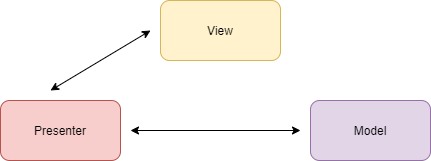

## 1 MVC

MVC： Model - View - Controller，是模型(model)－视图(view)－控制器(controller)的缩写，一种软件设计典范，用一种业务逻辑、数据、界面显示分离的方法组织代码，将业务逻辑聚集到一个部件里面，在改进和个性化定制界面及用户交互的同时，不需要重新编写业务逻辑。MVC被独特的发展起来用于映射传统的输入、处理和输出功能在一个逻辑的图形化用户界面的结构中。

* 模型层（Model）：针对业务建立的数据结构和相关的类；

* 视图层（View）：显示界面（XML 布局文件 或 Java 建立的界面）；

* 控制层（Controller）：Android 通常在 Activity、Fragment 中控制业务；


Android 中 MVC 的缺点：

* View 层和 Model 层耦合，不利于维护。
* 实际开发中 Activity、Fragment 作为控制层，耦合了太多的业务， 往往可能有几千行代码。

## 2 MVP

MVP ：Model - View - Presenter，是 MVC 演化的版本，使用 MVP 时 View 和 Model 不再耦合，View 和 Model 通过 Presenter  进行交互。



* Model：提供数据的存取功能，Presenter 通过 Model 获取、存储数据；
* View：负责处理用户事件和视图展示；
* Presenter：View 和 Model 沟通的桥梁，Model 获取的数据通过 Presenter 传递给 View；

### 3 MVVM

MVVM：Model - View - ViewModel，本质上是 MVC 层的演化版本，与 MVP 不同是，ViewModel 跟 Model 和 View 进行**双向绑定**，View 变化，ViewModel 就会通知 Model 数据改变，同样，Model 变化，ViewModel 也会通知 View。


缺点：

* 数据绑定使得 Bug 很难被调试；
* DataBinding 使用会生成大量的 Binding 类，可能影响编译速度；
* 数据双向绑定不利于代码重用；


```java
<?xml version="1.0" encoding="utf-8"?>
<layout xmlns:android="http://schemas.android.com/apk/res/android"
    xmlns:app="http://schemas.android.com/apk/res-auto"
    xmlns:tools="http://schemas.android.com/tools">
    <data>
        <variable
            name="person"
            type="com.yoyiyi.test.mvvm.Person" />
    </data>

    <LinearLayout
        android:layout_width="match_parent"
        android:orientation="vertical"
        android:layout_height="match_parent"
        tools:context=".MainActivity">
        <TextView
            android:layout_width="wrap_content"
            android:layout_height="wrap_content"
            android:text="@{person.name}" />

    </LinearLayout>
</layout>


public class MainActivity extends AppCompatActivity {

    @Override
    protected void onCreate(Bundle savedInstanceState) {
        super.onCreate(savedInstanceState);
        ActivityMainBinding binding = DataBindingUtil.setContentView(this, R.layout.activity_main);
        Person person = new Person("积极");
        binding.setP(person);
        
    }
 }   
```

### 3.1 基本用法

```java
//1.import 用法与别名
    <data>
        <import type="com.yoyiyi.test.mvvm.Person"
            alias="p1"/>
        <import type="com.yoyiyi.test.mvvm.alias.Person"
            alias="p2"/>
        
        <variable
            name="p1"
            type="p1" />
        <variable
            name="p2"
            type="p2" />
    </data>

//2.变量定义 java.lang.* 会被自动导入
   <data>       
        <variable
            name="name"
            type="String" />  
    </data>
    
//3.Converter 转换器
   <data>       
        <variable
            name="time"
            type="java.util.Date" />  
    </data>      
   
public class Utils {
    @BindingConversion
    public static String convertDate(Date date){
        return new SimpleDateFormat("yyyy-MM-dd").format(date);
    }

}    

//4.双向绑定 @={}
Observable、ObservableField、集合类型 Observable 容器类

```

