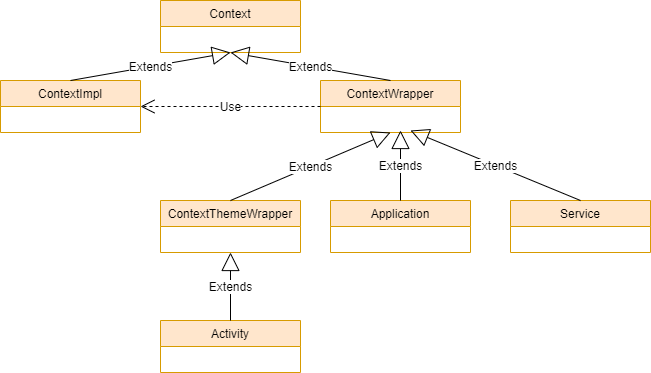
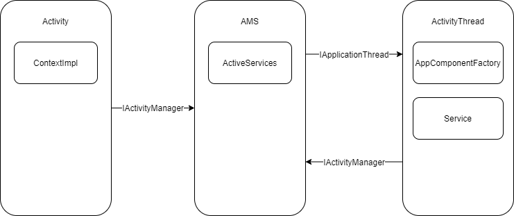

## 1 Context



* Activity、Service、Application 都是 ContextWrapper 的子类；
* ContextWrapper 里面引用着一个 ContextImpl 实例；
* ContextWrapper 里所有的方法都是通过调用 ContextImpl 进行实现；

## 2 源码

startService 会调用 ContextImpl 中。

### ContextImpl#startService()

```java
class ContextImpl extends Context {
    @Override
    public ComponentName startService(Intent service) {
        warnIfCallingFromSystemProcess();
        //1.调用 startServiceCommon 函数
        return startServiceCommon(service, false, mUser);
    }
    private ComponentName startServiceCommon(Intent service, boolean requireForeground,
            UserHandle user) {
        try {
            validateServiceIntent(service);
            service.prepareToLeaveProcess(this);
            //2.调用 AMS 的 startService()
            ComponentName cn = ActivityManager.getService().startService(
                mMainThread.getApplicationThread(), service, service.resolveTypeIfNeeded(
                            getContentResolver()), requireForeground,
                            getOpPackageName(), user.getIdentifier());
            return cn;
        } catch (RemoteException e) {
            throw e.rethrowFromSystemServer();
        }
    }
}
```

###  ActivityManagerService#startService()

```java
   public ComponentName startService(IApplicationThread caller, Intent service,
            String resolvedType, boolean requireForeground, String callingPackage, int userId)
            throws TransactionTooLargeException {
        .....
        synchronized(this) {
            final int callingPid = Binder.getCallingPid();
            final int callingUid = Binder.getCallingUid();
            final long origId = Binder.clearCallingIdentity();
            ComponentName res;
            try {
                //1.调用ActiveServices#startServiceLocked()；
                res = mServices.startServiceLocked(caller, service,
                        resolvedType, callingPid, callingUid,
                        requireForeground, callingPackage, userId);
            } finally {
                Binder.restoreCallingIdentity(origId);
            }
            return res;
        }
    }
```

### ActiveServices#startServiceLocked()

```java
ComponentName startServiceLocked(IApplicationThread caller, Intent service, String resolvedType,
            int callingPid, int callingUid, boolean fgRequired, String callingPackage, final int userId)
            throws TransactionTooLargeException {
        ...
        //1.创建并且封装启动 Service 的相关数据
        ServiceLookupResult res =
            retrieveServiceLocked(service, resolvedType, callingPackage,
                    callingPid, callingUid, userId, true, callerFg, false, false);
        if (res == null) {
            return null;
        }
        if (res.record == null) {
            return new ComponentName("!", res.permission != null
                    ? res.permission : "private to package");
        }
        ServiceRecord r = res.record;
        if (!mAm.mUserController.exists(r.userId)) {
            Slog.w(TAG, "Trying to start service with non-existent user! " + r.userId);
            return null;
        }
        ...
        //2.调用 startServiceInnerLocked()；
    ComponentName startServiceInnerLocked(Servic  
        ComponentName cmp = startServiceInnerLocked(smap, service, r, callerFg, addToStarting);
        return cmp;
    }
```

### ActiveServices#startServiceInnerLocked()

```java
    ComponentName startServiceInnerLocked(ServiceMap smap, Intent service, ServiceRecord r,
            boolean callerFg, boolean addToStarting) throws TransactionTooLargeException {
        ...
        //调用 bringUpServiceLocked
        String error = bringUpServiceLocked(r, service.getFlags(), callerFg, false, false); 
        if (error != null) {
            return new ComponentName("!!", error);
        }
        return r.name;
    }
```

### ActiveServices#bringUpServiceLocked()

```java
 private String bringUpServiceLocked(ServiceRecord r, int intentFlags, boolean execInFg,
            boolean whileRestarting, boolean permissionsReviewRequired)
            throws TransactionTooLargeException {
        ...
        final boolean isolated = (r.serviceInfo.flags&ServiceInfo.FLAG_ISOLATED_PROCESS) != 0;
        final String procName = r.processName;
        String hostingType = "service";
        ProcessRecord app;
        if (!isolated) {
            app = mAm.getProcessRecordLocked(procName, r.appInfo.uid, false);
            if (DEBUG_MU) Slog.v(TAG_MU, "bringUpServiceLocked: appInfo.uid=" + r.appInfo.uid
                        + " app=" + app);
            if (app != null && app.thread != null) {
                try {
                    app.addPackage(r.appInfo.packageName, r.appInfo.longVersionCode, mAm.mProcessStats);
                    //4.调用 realStartServiceLocked
                    realStartServiceLocked(r, app, execInFg);
                    return null;
                } catch (TransactionTooLargeException e) {
                    throw e;
                } catch (RemoteException e) {
                    Slog.w(TAG, "Exception when starting service " + r.shortName, e);
                }
            }
        } else {
            app = r.isolatedProc;
            if (WebViewZygote.isMultiprocessEnabled()
                    && r.serviceInfo.packageName.equals(WebViewZygote.getPackageName())) {
                hostingType = "webview_service";
            }
        }
       ...
    }
```

### ActiveServices#realStartServiceLocked()

```java
    private final void realStartServiceLocked(ServiceRecord r,
            ProcessRecord app, boolean execInFg) throws RemoteException {
        ...
        boolean created = false;
        try {
            if (LOG_SERVICE_START_STOP) {
                String nameTerm;
                int lastPeriod = r.shortName.lastIndexOf('.');
                nameTerm = lastPeriod >= 0 ? r.shortName.substring(lastPeriod) : r.shortName;
                EventLogTags.writeAmCreateService(
                        r.userId, System.identityHashCode(r), nameTerm, r.app.uid, r.app.pid);
            }
            synchronized (r.stats.getBatteryStats()) {
                r.stats.startLaunchedLocked();
            }
            mAm.notifyPackageUse(r.serviceInfo.packageName,
                                 PackageManager.NOTIFY_PACKAGE_USE_SERVICE);
            app.forceProcessStateUpTo(ActivityManager.PROCESS_STATE_SERVICE);
            //代码一：通知 ActivityThread，真正的创建Service；
            app.thread.scheduleCreateService(r, r.serviceInfo,
                    mAm.compatibilityInfoForPackageLocked(r.serviceInfo.applicationInfo),
                    app.repProcState);
            r.postNotification();
            created = true;
        } catch (DeadObjectException e) {
            ...
        } finally {
            ...
        }
        //代码二：通知ActivityThread调用Service的onStartCommand方法
        sendServiceArgsLocked(r, execInFg, true);
    
    }
```

### 代码一：**ActivityThread**#scheduleCreateService()

scheduleCreateService() 其实就是通过Handler机制进行线程切换，最后会调用handleCreateService();

```java
 private void handleCreateService(CreateServiceData data) {
        unscheduleGcIdler();
        //1.获取LoadedApk对象，负责解析manifest文件；
        LoadedApk packageInfo = getPackageInfoNoCheck(
                data.info.applicationInfo, data.compatInfo);
        Service service = null;
        try {
            //2.通过类加载器，创建Service实例
            java.lang.ClassLoader cl = packageInfo.getClassLoader();
            //3.创建 Servie 对象,AppComponentFactory#instantiateService()
            service = packageInfo.getAppFactory()
                    .instantiateService(cl, data.info.name, data.intent);
        } catch (Exception e) {
            ...
        }
        try {
            if (localLOGV) Slog.v(TAG, "Creating service " + data.info.name);
            ContextImpl context = ContextImpl.createAppContext(this, packageInfo);
            context.setOuterContext(service);
            Application app = packageInfo.makeApplication(false, mInstrumentation);
            //4.Service 对象,初始化基本设置
            service.attach(context, this, data.info.name, data.token, app,
                    ActivityManager.getService());
            //5.调用 service 的onCreate生命周期函数
            service.onCreate();
            mServices.put(data.token, service);
            ...
        }
    }
```

### 代码二：ActivityThread#scheduleServiceArgs()

```java
   private final void sendServiceArgsLocked(ServiceRecord r, boolean execInFg,
            boolean oomAdjusted) throws TransactionTooLargeException {
        ...        
       Exception caughtException = null;
        try {
            //调用 scheduleServiceArgs,实现其他的生命周期方法的调用
            r.app.thread.scheduleServiceArgs(r, slice);
        } catch (TransactionTooLargeException e) {
            ...
        }
        ...
    }
```

### ActivityThread#handleServiceArgs()

scheduleServiceArgs()最终通过 Handler 机制切换线程，并且调用handleServiceArgs()；

```java
 private void handleServiceArgs(ServiceArgsData data) {
        Service s = mServices.get(data.token);
        if (s != null) {
            try {
                if (data.args != null) {
                    data.args.setExtrasClassLoader(s.getClassLoader());
                    data.args.prepareToEnterProcess();
                }
                int res;
                if (!data.taskRemoved) {
                    //调用 Service#onStartCommand
                    res = s.onStartCommand(data.args, data.flags, data.startId);
                } else {
                    s.onTaskRemoved(data.args);
                    res = Service.START_TASK_REMOVED_COMPLETE;
                }
               ...
            } catch (Exception e) {
                ...
            }
        }
    }
```

## 3 总结

