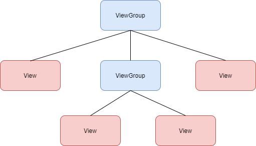
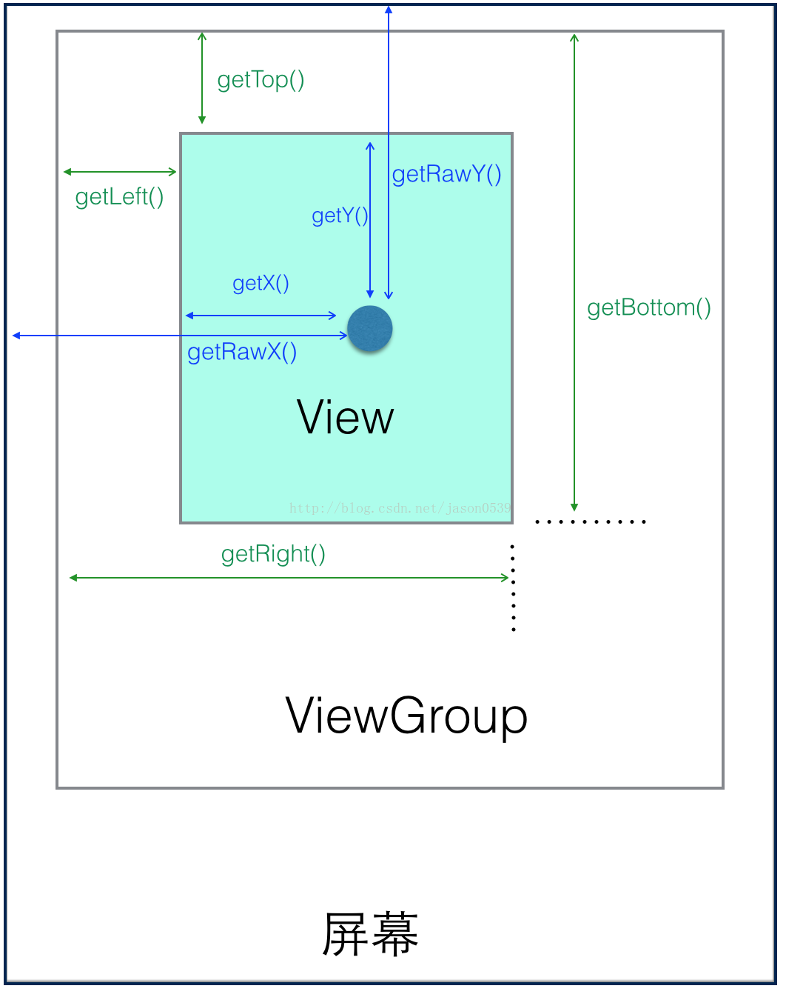

## 1 View 和 ViewGroup

* View 是 Android 控件的基类
* ViewGroup 继承 View

## 2 View 的坐标

### View 获取自身宽高

由上图可知 `View` 自身的高度计算公式：

- width = getRigth() - getLeft()
- height = getBottom() - getTop()

`View` 源码中提供的 `getWidth()` 和 `getHeight()` 获取 `View` 的宽高，内部处理是相同的。

### View 自身坐标

下面方法获取 `View` 到父控件的距离：

- getTop()：View 自身顶部到父控件顶部距离
- getBottom()：View 自身底部到父控件顶部距离
- getLeft()：View 自身左边到父控件左边距离
- getRight()：View 自身右边到父控件左边距离

### MotionEvent 提供方法

当我们点击手机屏幕时候，点击事件会封装成 `MotionEvent`，然后由 `onTouchEvent(MotionEvent ev)` 方法进行处理，`MotionEvent` 提供获取焦点左边的方法：

- getX()：视图坐标，点击位置距离控件左边距离
- getY()：视图坐标，点击位置距离控件顶部距离
- getRawX()：绝对坐标，点击位置距离整个屏幕左边距离
- getRawY()：绝对坐标，点击位置距离整个屏幕顶部距离

## 3 View 滑动

* layout()
* offsetLeftAndRight() 和 offsetTopAndBottom(）
* LayoutParmas
* 动画
* scrollTo 和 scrollBy
  * scrollTo  移动到具体点
  * scrollBy 移动增量，最终调用 scrollTo  
* Scroller 配合 View.computeScroll()