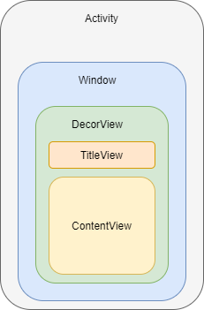

## 1 简介

View 绘制流程，指的是 measure、layout、draw。

* measure：测量
* layout：布局
* draw：绘制

## 2 View 的绘制流程入口

我们都知道，Activity 由 Window、DecorView(TitleView、ContentView)构成。



调用 Activity 的 startActivity 方法时，最终调用到 ActivityThread#handleLaunchActivity 方法来创建 Activity。

```java
private void handleLaunchActivity(...){
     //1.创建 Activity
    Activity a = performLaunchActivity(r, customIntent);
    if (a != null) {
        ...
        //2.将 Activity 的状态置为 Resume
        handleResumeActivity(...);
}
```

ActivityThread#handleResumeActivity()

```java
public void handleResumeActivity(...){
    ...
    //1.调用 performResumeActivit()
    final ActivityClientRecord r = performResumeActivity(token, finalStateRequest, reason);
    if (r.window == null && !a.mFinished && willBeVisible) {
            //2.获取 window
            r.window = r.activity.getWindow();
            //3.获取 DecorView
            View decor = r.window.getDecorView();
            //4.获取 WM, WindowManager 继承 ViewManager
            ViewManager wm = a.getWindowManager();
            WindowManager.LayoutParams l = r.window.getAttributes();
            a.mDecor = decor;
            l.type = WindowManager.LayoutParams.TYPE_BASE_APPLICATION;
            l.softInputMode |= forwardBit;
            if (r.mPreserveWindow) {
                ...
            }
            if (a.mVisibleFromClient) {
                if (!a.mWindowAdded) {
                    a.mWindowAdded = true;
                    //5.添加 View，WindowManagerImpl 中实现
                    wm.addView(decor, l);
                } else {
                    ...
                }
            }

}
```

WindowManagerImpl#addView()

```java
public void addView(...){
    ...
    //mGlobal -> WindowManagerGlobal    
    mGlobal.addView(view, params, mDispaly, mParentWindow);    
}
```

WindowManagerGlobal#addView()

```java
public void addView(View view, ViewGroup.LayoutParams params,
           Display display, Window parentWindow) {
     ...
     synchronized (mLock) {
         //1.创建 ViewRootImpl
         root = new ViewRootImpl(view.getContext(), display);
         
         try {
             //2.ViewRootImpl#setView
             root.setView(view, wparams, panelParentView);
         }
     }
     
 }
```

总结：

```java
-> ActivityThread#handleLaunchActivity 
-> ActivityThread#handleResumeActivity()
-> WindowManagerImpl#addView()
-> WindowManagerGlobal#addView()
-> ViewRootImpl#setView() // 这里还没有显示出来
```

## 3 ViewRootImpl 的 performTraveals

 ViewRootImpl#performTraveals 中 ViewTree 才开始真正的绘制流程。

```java
 private void performTraversals() {
     if (!mStopped || mReportNextDraw) {              
                if (focusChangedDueToTouchMode || mWidth != host.getMeasuredWidth()
                        || mHeight != host.getMeasuredHeight() || contentInsetsChanged ||
                        updatedConfiguration) {
                    int childWidthMeasureSpec = getRootMeasureSpec(mWidth, lp.width);
                    int childHeightMeasureSpec = getRootMeasureSpec(mHeight, lp.height);
                    //1.执行测量
                    performMeasure(childWidthMeasureSpec, childHeightMeasureSpec);
                }
      if (didLayout) {
          //2.执行布局
          performLayout(lp, mWidth, mHeight); 
      }
         
      if (!cancelDraw && !newSurface) {
           ...
           //3.执行绘制    
           performDraw();   
      }
         
 }
```

## 4 View 的 measure 

measure 用来测量 View 的宽高。

* View:  测量自身
* ViewGroup： 不仅要测量自身，还要**遍历调用子 View 的 measure()**

### 4.1 View#onMeasure()

View#onMeasure()

```java
protected void onMeasure(int widthMeasureSpec, int heightMeasureSpec) {
        setMeasuredDimension(getDefaultSize(getSuggestedMinimumWidth(), widthMeasureSpec),
                getDefaultSize(getSuggestedMinimumHeight(), heightMeasureSpec));
    }
```

View#setMeasuredDimension()

```java
   protected final void setMeasuredDimension(int measuredWidth, int measuredHeight) {
        boolean optical = isLayoutModeOptical(this);
        if (optical != isLayoutModeOptical(mParent)) {
            Insets insets = getOpticalInsets();
            int opticalWidth  = insets.left + insets.right;
            int opticalHeight = insets.top  + insets.bottom;

            measuredWidth  += optical ? opticalWidth  : -opticalWidth;
            measuredHeight += optical ? opticalHeight : -opticalHeight;
        }
        setMeasuredDimensionRaw(measuredWidth, measuredHeight);
    }
```

View# getDefaultSize()

```java
   public static int getDefaultSize(int size, int measureSpec) {
        int result = size;
        //获取测量模式
        int specMode = MeasureSpec.getMode(measureSpec);
        //获取测量大小
        int specSize = MeasureSpec.getSize(measureSpec);
        switch (specMode) {
        case MeasureSpec.UNSPECIFIED:
            result = size;
            break;
        case MeasureSpec.AT_MOST:
        case MeasureSpec.EXACTLY:
            result = specSize;//wrap_content 和 match_parent 效果一样
            break;
        }
        return result;
    }
```

View#getSuggestedMinimumWidth()

```java
protected int getSuggestedMinimumWidth() {
        //根据是否设置背景取值
        return (mBackground == null) ? mMinWidth : max(mMinWidth, mBackground.getMinimumWidth());
    }
```

### 4.2 ViewGroup 的 measure

## View 的 layout


## View 的 draw

