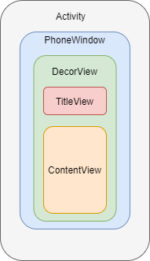

## 1 Activity 构成



平常布局展示在ContentView中。

## 2 事件分发

事件分发的本质其实就是把事件（Touch）封装成 **MotionEvent** 类，然后传递给 View 的层级处理。

MotionEvent 事件类型主要有下面四种：

|                           |                          |
| ------------------------- | ------------------------ |
| MotionEvent.ACTION_DOWN   | 按下事件（事件开始）     |
| MotionEvent.ACTION_UP     | 抬起事件（与 DOWN 对应） |
| MotionEvent.ACTION_MOVE   | 移动事件                 |
| MotionEvent.ACTION_CANCEL | 结束事件                 |

事件分发由三个方法协作完成：

- dispatchTouchEvent()：事件分发
- onTouchEvent()：消费事件、在 dispatchTouchEvent() 中调用
- onInterceptTouchEvent()：拦截事件、**只有 ViewGroup 有**、在 dispatchTouchEvent() 中调用

## 3 dispatchTouchEvent()

主要是负责分发，是安卓事件分发过程中的核心。

* 返回 **TRUE**，则表明对事件已经处理，不用继续调用其余组件的分发方法，即**停止分发**。
* 返回 **FALSE**，则表明对事件不能处理，需要按照规则**继续分发**事件，在不复写该方法的情况下，除了一些特殊的组件，其余组件都是默认返回 False。

### 3.1 Activity#dispatchTouchEvent()

可以用以下伪代码说明：

```java
public boolean dispatchTouchEvent(MotionEvent ev) {
    if (child.dispatchTouchEvent(ev)) {
        return true;//子 View 消费事件,返回 TRUE，让调用者知道该事件已被消费
    } else {
        return onTouchEvent(ev);//子 View 没有消费事件，调用自身的 onTouchEvent
    }
}
```

- 事件经过传递后，事件**被消费**了（返回 TRUE），则 Activity 的分发方法也返回 TRUE，表示该事件已经被消费了。
- 事件经过传递后，事件**没有被消费**（返回 FALSE），则 Activity 调用 **onTouchEvent()** 去处理。
- onTouchEvent 消费事件，返回 **TRUE**（表示已消费事件），并作为 dispatchTouchEvent() 的返回值，让调用它的对象知道 Activity 消费事件。
- onTouchEvent **没有消费事件**，返回 **FALSE**（表示未消费事件），并作为 dispatchTouchEvent() 的返回值。让调用它的对象知道该 Activity 没有消费事件，需要继续处理。

### 3.2 ViewGroup#dispatchTouchEvent()

```java
public boolean dispatchTouchEvent(MotionEvent ev) {
    if (!onInterceptTouchEvent(ev)) {
        return child.dispatchTouchEvent(ev);//不拦截，则传给子 View 进行分发处理
    } else {
        return onTouchEvent(ev);//拦截事件，交由自身 onTouchEvent 方法处理
    }
}
```

- 返回 FALSE（不拦截），则交给子 View 去调用 dispatchTouchEvent() 方法
- 返回 TRUE（拦截），则调用 ViewGroup 对象 onTouchEvent(ev) 方法处理。

### 3.3 View#dispatchTouchEvent()

```java
public boolean dispatchTouchEvent(MotionEvent ev) {
    //listener 不为空，调用 onTouch方法
    if (mOnTouchListener != null && mOnTouchListener.onTouch(this, event)) {
        return true;//若onTouch方法返回TRUE，消费事件，则 dispachtouTouchEvent返回 TRUE，让其调用者知道该事件已被消费，可见 setOnTouchListener 优先级比较高。
    }
    return onTouchEvent(ev);//没有消费事件，则调用对象自身的 onTouchEvent() 处理。
}
```

- onTouch() 返回 **TRUE**，则 dispatchTouchEvent 也会返回TRUE，表示消费该事件。
- onTouch() 返回 **FALSE**，或者 mOnTouchListener 为空，调用自身的 **onTouchEvent()** 处理，是否消费事件，可以由其返回值判断。

## 4 onInterceptTouchEvent

该方法是 ViewGroup 独有的，对事件进行提前拦截。一般情况下，该方法是默认返回 **FALSE**，表示不拦截。
如果自定义 ViewGroup 希望拦截事件，不希望事件传递，可以覆写该方法，返回 **TRUE**，即可阻止向下的传播过程。

子 View 也可以通过 **requestDisallowInterceptTouchEvent** 来设置  FLAG_DISALLOW_INTERCEPT 标志位，禁止 ViewGroup 拦截除了 DOWN 之外的事件。

* 返回 **TRUE**，则会将事件拦截，自身的 onTouchEvent 处理。

* 返回 **FALSE**，则继续传递给子 View 执行分发流程。

## 5 onTouchEvent

对事件进行处理。

* 返回 TRUE 表示已经处理了事件，
* 返回 FALSE 表示没有对事件进行处理，需要继续传递事件。一般情况下，默认为 FALSE。在 View 的onTouchEvent 方法中，如果设置了 setOnClickListenter、setOnLongClickListene 处理，返回 TRUE。

## 6 总结

* 当事件产生之后，传递顺序：Activity -> PhoneWindow -> 顶层 ViewGroup
* 事件传递中一般考虑 ViewGroup 的 **onInterceptTouchEvent()**，一般情况下我们不会重写 dispatchTouchEvent()。
* 对于根 ViewGroup，事件首先传递到 **dispatchTouchEvent():**
  * onInterceptTouchEvent() -> TRUE，则表示拦截事件，这个事件就由 o**nTouchEvent()**；
  * onInterceptTouchEvent() -> FALSE，则表示不拦截事件，这个事件会交给它的子 View **dispatchTouchEvent()**，
  * 如果事件传递到底层的 View，View 是没有子View的，就会调用 View 的 **dispatchTouchEvent()**，通常情况下，会调用 View 的 onTouchEvent() 处理事件。

