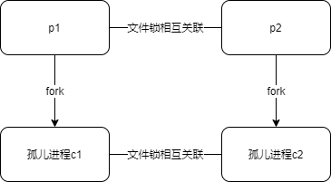

## 1 保活

保活目的其实就是让 App 永生不死，然而，说起来简单，实践起来困难，随着版本的升级，保活基本上起不到预期的效果，一般保活的手段从两个方面入手：

* 保证应用进程不备杀死
* 即使应用进程被杀死，也能够重新拉起来

## 2 保活原理

系统杀进程有两种方法：

* killBackgroundProcesses（原生系统，常通过这一种方式）
* forceStopPackage（比较强力）

分析第二种 forceStop 是如何工作的：

```java
//ActivityManagerService
public void forceStopPackage(final String packageName, int userId) {
    ...
    try {
        IPackageManager pm = AppGlobals.getPackageManager();
        synchronized(this) {
            int[] users = userId == UserHandle.USER_ALL
                    ? mUserController.getUsers() : new int[] { userId };
            for (int user : users) {

                ...
                if (mUserController.isUserRunning(user, 0)) {
                	// 根据 UID 和包名杀死进程 代码1
                    forceStopPackageLocked(packageName, pkgUid, "from pid " + callingPid);
                    finishForceStopPackageLocked(packageName, pkgUid);
                }
            }
        }
    } finally {
        Binder.restoreCallingIdentity(callingId);
    }
}

//代码1
final boolean forceStopPackageLocked(...) {
    //killPackageProcessesLocked 杀死进程  代码2
    boolean didSomething = mProcessList.killPackageProcessesLocked(packageName, appId, userId,
            ProcessList.INVALID_ADJ, callerWillRestart, true /* allowRestart */, doit,
            evenPersistent, true /* setRemoved */,
            packageName == null ? ("stop user " + userId) : ("stop " + packageName));

    didSomething |=
            mAtmInternal.onForceStopPackage(packageName, doit, evenPersistent, userId);

    // 清理 service
    // 清理 broadcastreceiver
    // 清理 providers
    // 清理其他

    return didSomething;
}

//代码2 最终走到 ProcessRecord#kill
void kill(String reason, boolean noisy) {
    if (!killedByAm) {
        Trace.traceBegin(Trace.TRACE_TAG_ACTIVITY_MANAGER, "kill");
        if (mService != null && (noisy || info.uid == mService.mCurOomAdjUid)) {
            mService.reportUidInfoMessageLocked(TAG,
                    "Killing " + toShortString() + " (adj " + setAdj + "): " + reason,
                    info.uid);
        }
        if (pid > 0) {
            EventLog.writeEvent(EventLogTags.AM_KILL, userId, pid, processName, setAdj, reason);
            //杀掉了目标进程
            Process.killProcessQuiet(pid);
            //uid 为单位 杀掉目标进程组 代码3
            ProcessList.killProcessGroup(uid, pid);
        } else {
            pendingStart = false;
        }
        if (!mPersistent) {
            killed = true;
            killedByAm = true;
        }
        Trace.traceEnd(Trace.TRACE_TAG_ACTIVITY_MANAGER);
    }
}

//代码3
int killProcessGroup(uid_t uid, int initialPid, int signal) {
    return KillProcessGroup(uid, initialPid, signal, 40 /*retries*/);
}

static int KillProcessGroup(uid_t uid, int initialPid, int signal, int retries) {
    ...
    int retry = retries;
    int processes;
    while ((processes = DoKillProcessGroupOnce(cgroup, uid, initialPid, signal)) > 0) {
        LOG(VERBOSE) << "Killed " << processes << " processes for processgroup " << initialPid;
        //循环 40 遍不断杀进程，每次杀完之后等 5ms 
        if (retry > 0) {
            std::this_thread::sleep_for(5ms);
            --retry;
        } else {
            break;
        }
    }
    ...
}
```

从上面代码可以看出，假如 循环 40 遍不断杀进程，40 遍进程还在，那么就可以逃过，原理就是 App 进程在被杀掉之后，在 5ms 内启动一堆新的进程，循环 40 次，只要每次都能够拉起新的进程，那 App 就能逃过系统的追杀。这里只要 逃过 200ms，就可以保活。

核心原理：任意一个进程死亡之后，都能让把其他所有进程全部拉起

* **2 个进程通过互相监听文件锁的方式，来感知彼此的死亡**
* **通过 fork 产生子进程，fork 的进程同属一个进程组，一个被杀之后会触发另外一个进程被杀，从而被文件锁感知**

具体做法：



* 创建 2 个进程 p1, p2，通过文件锁互相关联
* p1 经过 2 次 fork -> 孤儿进程 c1，p2 经过 2 次 fork -> 孤儿进程 c2
* c1,c2 通过文件锁互相关联
* 假设 p1 被杀，那么 p2 会立马感知到
* p1 和 c1 同属一个进程组，p1 被杀会触发 c1 被杀
* c1 死后 c2 立马感受到从而拉起 p1

## 2 参考阅读

* [Android 黑科技保活实现原理揭秘](http://weishu.me/2020/01/16/a-keep-alive-method-on-android/)
* [深度剖析APP保活案例](http://gityuan.com/2018/02/24/process-keep-forever/)

