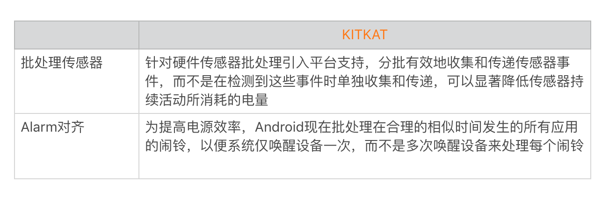
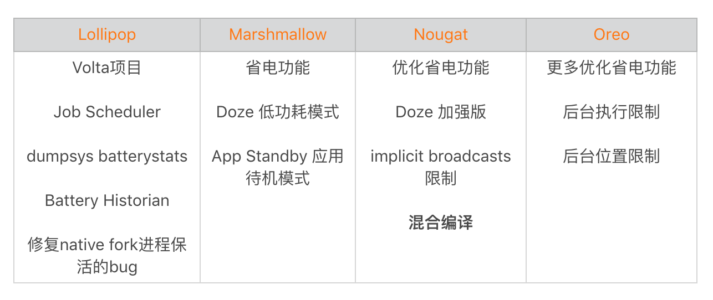

## 1 耗电演进历程

###  1.1 野蛮生长：Pre Android 5.0

在Android 5.0之前，系统并不是那么完善，对于电量优化还是比较少的。特别没有对应用的后台做严格的限制，多进程、fork native 进程以及广播拉起等各种保活技术。

常常有以下问题：

- 耗电与安装应用程序的数量有关：用户安装越多的应用程序，无论是否打开它们，手机耗电都会更快。
- App耗电量与App使用时间无关：用户希望App的耗电量应该与它的使用时间相关，但是有些应用即使常年不打开，依然非常耗电。
- 电量问题排查复杂：无论是电量的测量，还是耗电问题的排查都异常艰难。

在Android 5.0之前，系统也做一些省电相关的优化。



### 1.2 逐步收紧：Android 5.0～Android 8.0

Android 5.0 开启了一个[Volta项目](https://developer.android.com/about/versions/android-5.0?hl=zh-cn)，目标是改善电池的续航。在优化电量的同时，还增加了的dumpsys batteryst等工具生成设备电池使用情况统计数据。



但是还存在以下问题：

- 省电模式不够省电：Doze低功耗模式限制得不够严格，例如屏幕关闭还可以获取位置、后台应用的网络权限等。
- 用户对应用控制力度不够：用户不能简单的对某些应用做更加细致的电量和后台行为的控制，但是其实国内很多的厂商已经提前实现了这个功能。
- Target API开发者响应不积极：为了不受新版本的某些限制，大部分国内的应用坚持不把Target API升级到Oreo以上，所以很多省电的功能事实上并没有生效。

### 1.3 严格限制 9.0

Android 9.0开始，Google对[电源管理](https://developer.android.com/about/versions/pie/power?hl=zh-cn)引入了几个更加严格的限制。

## 2 工具

使用 [Battery Historian](https://github.com/google/battery-historian) 进行电量分析。

```java
//7.0和7.0以后
$ adb bugreport bugreport.zip
//6.0和6.0之前:
$ adb bugreport > bugreport.txt
//通过historian图形化展示结果
python historian.py -a bugreport.txt > battery.html
```

- Google 推出的一款 Android 电量分析工具，它支持 Android 5.0 及以上系统的电量分析。
- 它获取到的各个耗电模块的耗电信息要相对精确、丰富地多。例如 GPS、WaleLock、蓝牙 等的工作时间以及耗电量。
- 此外，它不仅可以针对单个 App 进行选择，也可以比对不同的电量场景的信息，比如 优化前、优化后 的信息。
- Battery Historian 的缺点在于它只能在线下使用。因此除了使用其在线下测试之外，我们还需要在线上增加一些电量的辅助监控，统计例如：耗电组件的使用次数、调用堆栈以及访问时间。这些都是与用户相关的基础电量消耗数据，如果有用户反馈，我们就可以通过这些信息来判断用户是不是有耗电的操作。

## 3 优化

我们很难在线上统计出 App 的电量消耗，而且各个手机厂商也硬件也各不相同，可以从下面四个方向考虑优化。

### 3.1 网络

- 减少网络请求的时机以及次数，对网络资源进行本地缓存，减少网络的请求。
- 对网络传输数据进行压缩，降低传输的时间与流量。
- 禁止使用轮询的方式来做业务操作。

### 3.2 传感器

根据场景选择传感器使用的模式，比如说在使用 GPS 的时候一般要避免使用高精度的模式，或者是尽量复用上一次的定位结果。不要进行频繁的 WIFI 扫描等

### 3.3 WakeLock

使用 WakeLock 注意事项：

* acquire、release 配对使用
* 尽量使用 acquire 的超时方法来设置超时时间，避免因为异常情况从而导致 WakeLock 而无法释放的情况
* 关于 WakeLock 的释放一定要写在 try-catch-finally 的 finally 当中，保证 WakeLock 在异常情况下的释放。

### 3.4. JobScheduler

JobScheduler 可以允许开发者在符合某些条件下创造执行在后台的任务，我们可以设置执行一些耗电操作的场景，比如说 处于 WIFI 状态下同时连接电源 的情况下。同时，要注意用户在离开界面后，要避免耗电的操作，比如说停止播放动画。通过这些操作，我们的 App 就不会比之前耗电了。类似的 Alerm

## 4 耗电监控

耗电监控可以使用 Facebook 开源库 [Battery-Metrics](https://github.com/facebookincubator/Battery-Metrics)s，可以监控包括 Alarm、WakeLock、Camera、CPU、Network 等信息，而且也有收集电量充电状态、电量水平等信息。

## 参考阅读

* [Android性能优化之电量篇](http://hukai.me/android-performance-battery/)
* Android应用性能优化最佳实践
* Android 开发高手课
* [Android 优化——电量优化](https://www.jianshu.com/p/627554db9f60)

