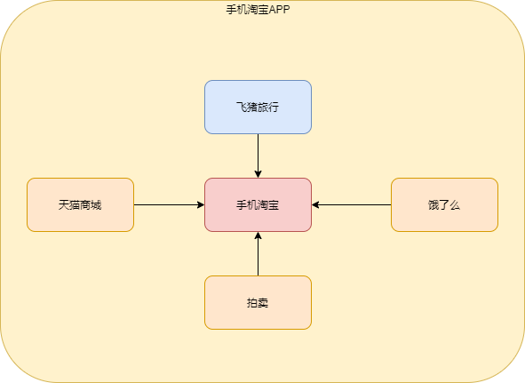
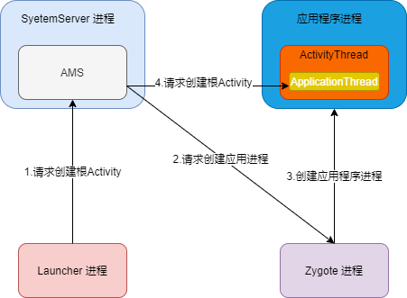
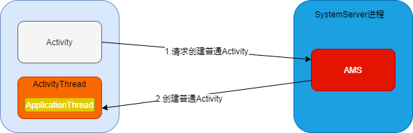

## 1 简介

插件化技术主要用于解决应用越来越庞大以及**功能模块的解耦**，主要解决以下的问题：

- 业务复杂，模块耦合
- 应用的接入
- 65536 限制，内存占用大

## 2 插件化的思想



如上图所示，手机淘宝APP 包含了主业务，以及外接的一些业务，如天猫商城，飞猪旅行等，这些外接业务可以以插件的形式存在。

插件化客户端又两部分组成：

* **宿主**：先被安装到手机中的 APK，也就是普通的 APP。
* **插件**：经过处理的 APK、so、和 dex 等文件。插件可以被宿主加载，也可以作为 APK 独立运行。

## 3 插件化框架对比

| 特性                             | VirtualApk | DroidPlugin | Small      | RePlugin   |
| -------------------------------- | ---------- | ----------- | ---------- | ---------- |
| 支持四大组件                     | 全支持     | 全支持      | Activity   | 全支持     |
| 组件无须在宿主 manifest 中预注册 | Y          | Y           | Y          | Y          |
| 插件可以依赖宿主                 | Y          | N           | Y          | Y          |
| 支持 PendingIntent               | Y          | Y           | N          | Y          |
| Android 特性支持                 | 几乎全部   | 几乎全部    | 大部分     | 几乎全部   |
| 兼容性适配                       | 高         | 高          | 中等       | 高         |
| 插件构建                         | Gradle构建 | 无          | Gradle构建 | Gradle构建 |

加载插件不需要和宿主有耦合、也无须通信：Replugin。

其他情况推荐使用 VirtualApk。

## 4 Activity 插件化

三种方式：

* 反射：性能问题
* 接口实现
* **Hook（Hook IActivityManger、Hook Instrumentation）**

**根 Activity 启动过程：**



**普通 Activity 启动过程：**



### 4.1 Hook IActivityManager 方案实现

步骤：

* 在 AndroidManifest.xml 注册 Activity 来进行占坑，用来通过 AMS 检验。
* 用插件 Activity 替换占坑的 Activity。

```xml
<!--1.占坑 -->
<activity android:name=".SubActivity"/>
```


### 4.2 Hook Instrumentation 方案实现


## 5 Service 插件化


## 6 ContentProvider 插件化


## 7  BroadcastReceiver 插件化


## 8 资源插件化


## 9 so 的插件化

