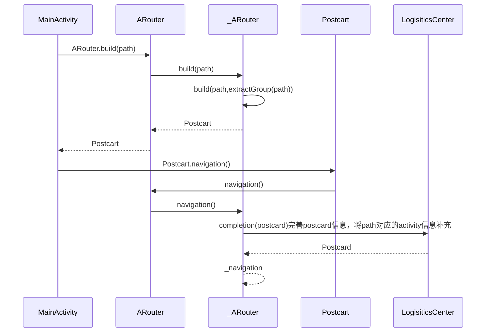

# 一、简介
这是 Android 进阶笔记第四篇，ARouter 的源码分析，众所周知，在日常开发中，随着项目业务越来越复杂，项目中的代码量也越来越多，如果维护、扩展、解耦等成了一个非常头疼问题，随之孕育而生的诸如插件化、组件化、模块化等热门技术。
而其中组件化中一项的难点，就是实现各个组件之间的通讯，我们通常解决方案采用路由中间件，来实现页面之间跳转关系。
[ARouter](https://github.com/alibaba/ARouter) 是阿里开源路由框架，常被用于组件之间、模块之间的跳转，由于是国人团队开发的，所以你懂的，中文文档非常详细。

# 二、入门
## 2.1.添加依赖
```java
android {
    defaultConfig {
        ...
        javaCompileOptions {
            annotationProcessorOptions {
                arguments = [AROUTER_MODULE_NAME: project.getName()]
            }
        }
    }
}

dependencies {
    api'com.alibaba:arouter-api:1.5.0'
    annotationProcessor 'com.alibaba:arouter-compiler:1.2.2'
}
```
## 2.2.初始化
在 Application 中初始化
```java
if (BuildConfig.DEBUG) {
     ARouter.openLog()     // 打印日志
     ARouter.openDebug()   // 开启调试模式(如果在InstantRun模式下运行，必须开启调试模式！线上版本需要关闭,否则有安全风险)
}
ARouter.init(this);
```
## 2.3.添加注解
```java
@Route(path = "/main/main_main")
public class MainActivity extend BaseActivity {
    ...
}
```
## 2.4.发起路由
```java
// 1.应用内简单的跳转(通过URL跳转在'进阶用法'中)
ARouter.getInstance().build("/main/main_main").navigation();

// 2.跳转并携带参数
ARouter.getInstance().build("/main/main_main")
            .withLong("id", 10086L)
            .withString("name", "Test")
            .navigation();
```
# 三、原理解析
在原理解析之前，我们先了解 ARouter 使用关键技术-**APT（Annotation Processing Tool）**，它是 javac 的一个工具，中文译名为编译时注解处理器，说白了，**APT 用来编译时，扫描和处理注解**，获取注解和被注解类等相关信息，拿到这些信息之后，自动生成一些代码，核心是 AbstractProcessor 这个类，APT 运用非常广泛，诸如 ButterKnife、EventBus、Dagger2 等使用运用到了 APT，ARouter 也不例外。运用 APT 技术我们可以自己写一些注解处理器，例如处理网络、打印出错信息等。
## 3.1 分析
我们来看看 ARouter 初始化
```java
//1.初始化
ARouter.init(application)

//2.ARouter#init
public static void init(Application application) {
        if (!hasInit) {
            logger = _ARouter.logger;
            _ARouter.logger.info(Consts.TAG, "ARouter init start.");
            //委托给_ARouter去初始化
            hasInit = _ARouter.init(application);
            if (hasInit) {
                _ARouter.afterInit();
            }
            //初始化之后调用afterInit
            _ARouter.logger.info(Consts.TAG, "ARouter init over.");
        }
    }
```
从上面我们可以看到 **ARouter 采用门面模式**，实际上委托给 _ARouter 处理，_ARouter 是整个框架的路由中心控制器，负责处理控制整个路由的流程。接下来，我们看看 _ARouter 初始化化。
```java
protected static synchronized boolean init(Application application) {
        mContext = application;
        //调用 LogisticsCenter 的初始化
        LogisticsCenter.init(mContext, executor);
        logger.info(Consts.TAG, "ARouter init success!");
        hasInit = true;
        mHandler = new Handler(Looper.getMainLooper());
        return true;
}

//LogisticsCenter#init
public synchronized static void init(Context context, ThreadPoolExecutor tpe) throws HandlerException {
        mContext = context;
        executor = tpe;
        try {
            long startInit = System.currentTimeMillis();
            loadRouterMap();
            if (registerByPlugin) {
                logger.info(TAG, "Load router map by arouter-auto-register plugin.");
            } else {
                Set<String> routerMap;
                //1.如果是debug模式，或者有更新
                if (ARouter.debuggable() || PackageUtils.isNewVersion(context)) {
                    logger.info(TAG, "Run with debug mode or new install, rebuild router map.");
       
                    //1.扫描包，获取ROUTE_ROOT_PAKCAGE（com.alibaba.android.arouter.routes）包下的类
                    routerMap = ClassUtils.getFileNameByPackageName(mContext, ROUTE_ROOT_PAKCAGE);
                    if (!routerMap.isEmpty()) {
                        context.getSharedPreferences(AROUTER_SP_CACHE_KEY, Context.MODE_PRIVATE).edit().putStringSet(AROUTER_SP_KEY_MAP, routerMap).apply();
                    }
                    PackageUtils.updateVersion(context);    // Save new version name when router map update finishes.
                } else {
                    
                    logger.info(TAG, "Load router map from cache.");
                    //2.获取本地缓存
                    routerMap = new HashSet<>(context.getSharedPreferences(AROUTER_SP_CACHE_KEY, Context.MODE_PRIVATE).getStringSet(AROUTER_SP_KEY_MAP, new HashSet<String>()));
                }

                logger.info(TAG, "Find router map finished, map size = " + routerMap.size() + ", cost " + (System.currentTimeMillis() - startInit) + " ms.");
                startInit = System.currentTimeMillis();
                for (String className : routerMap) {
                    //3.将 IRouteRoot，IRouteGroup和IProviderGroup的实现类，
                    //通过注解生成，并且加载 Warehouse(数据仓库)
                    // Warehouse:数据仓库，存储路由配置信息和具体生成的IProvider对象
                    if (className.startsWith(ROUTE_ROOT_PAKCAGE + DOT + SDK_NAME + SEPARATOR + SUFFIX_ROOT)) {
                        //1.加载 IRouteRoot，每个moudle下都会生成一个该类型的实现类，
                        //通过module名来区分的，作用是将每个module下所有的分组按照组名
                        //和对应分组的实现类(IRouteGroup接口的实现类)的 Class 对象做一个映射，
                        //然后保存在一个全局的 groupIndex 的 map 表中。
                        ((IRouteRoot) (Class.forName(className).getConstructor().newInstance())).loadInto(Warehouse.groupsIndex);
                    } else if (className.startsWith(ROUTE_ROOT_PAKCAGE + DOT + SDK_NAME + SEPARATOR + SUFFIX_INTERCEPTORS)) {
                        //2.加载 IInterceptorGroup 作用是将各个module下的  自定义的i nterceptor 按照优先级和 interceptor的       
                        // Class 对象做一个映射，然后保存在一个全局的 interceptorIndex 的 map 表中。
                        ((IInterceptorGroup) (Class.forName(className).getConstructor().newInstance())).loadInto(Warehouse.interceptorsIndex);
                    } else if (className.startsWith(ROUTE_ROOT_PAKCAGE + DOT + SDK_NAME + SEPARATOR + SUFFIX_PROVIDERS)) {
                         //3.加载 IProviderGroup 该类的作用的是将项目中自定义的提供序
                         //列化功能的类的相关信息以RouteMeta 类的对象保存在全局的providerIndex的map表中
                        ((IProviderGroup) (Class.forName(className).getConstructor().newInstance())).loadInto(Warehouse.providersIndex);
                    }
                }
            }

            logger.info(TAG, "Load root element finished, cost " + (System.currentTimeMillis() - startInit) + " ms.");

            if (Warehouse.groupsIndex.size() == 0) {
                logger.error(TAG, "No mapping files were found, check your configuration please!");
            }

            if (ARouter.debuggable()) {
                logger.debug(TAG, String.format(Locale.getDefault(), "LogisticsCenter has already been loaded, GroupIndex[%d], InterceptorIndex[%d], ProviderIndex[%d]", Warehouse.groupsIndex.size(), Warehouse.interceptorsIndex.size(), Warehouse.providersIndex.size()));
            }
        } catch (Exception e) {
            throw new HandlerException(TAG + "ARouter init logistics center exception! [" + e.getMessage() + "]");
        }
    }
```
从上面代码我们可以看到调用 LogisticsCenter，后勤中心主要完成两件事
- 获取到 com.alibaba.android.arouter.routes 包下的所有 class 文件类名
- 根据找到的类名去加载相关的实例到Warehouse中，com.alibaba.android.arouter.routes 包下面的 class 是注解解析器自动生成，主要 IRouteRoot，IRouteGroup 和 IProviderGroup 的实现类，当我们使用 @Route 注解某个类时，会将这个类的信息注入的到自动生成的上述实现类中。
接下来调用 afterInit()。
```java
//_ARouter#afterInit
static void afterInit() {
        // 调用 Postcard#build 方法，获取 InterceptorService 拦截服务控制器
        interceptorService = (InterceptorService) ARouter.getInstance().build("/arouter/service/interceptor").navigation();
    }
    
 //build 方法实际上，将 path 和 group 信息封装到 Postcard，生成一个要跳转的信息表
 protected Postcard build(String path) {
        if (TextUtils.isEmpty(path)) {
            throw new HandlerException(Consts.TAG + "Parameter is invalid!");
        } else {
            //生成具体实例
            PathReplaceService pService = ARouter.getInstance().navigation(PathReplaceService.class);
            if (null != pService) {
                path = pService.forString(path);
            }
            return build(path, extractGroup(path));
        }
    }

//Postcard#navigation 这个方法实现了跳转，我们点进去会发现，最后调用 _ARouter#navigation
//_ARouter#navigation
protected Object navigation(final Context context, final Postcard postcard, final int requestCode, final NavigationCallback callback) {
        PretreatmentService pretreatmentService = ARouter.getInstance().navigation(PretreatmentService.class);
        if (null != pretreatmentService && !pretreatmentService.onPretreatment(context, postcard)) {
            // Pretreatment failed, navigation canceled.
            return null;
        }

        try {
            //1.调用 LogisticsCenter#completion 的方法
            LogisticsCenter.completion(postcard);
             ......
         //不是绿色通道，通过拦截控制器依次调用不同拦截器处理信息  
        if (!postcard.isGreenChannel()) {  
            //每个拦截器的拦截方法调用都是在子线程中执行的
            interceptorService.doInterceptions(postcard, new InterceptorCallback() {
                @Override
                public void onContinue(Postcard postcard) {
                    _navigation(context, postcard, requestCode, callback);
                }
                @Override
                public void onInterrupt(Throwable exception) {
                    if (null != callback) {
                        //只要有一个拦截器拦截该包裹，则回调onInterrupt方法宣告本次路由被终止
                        callback.onInterrupt(postcard);
                    }
                }
            });
        } else {
            //2.如果是绿色通道，调用_navigation方法进行具体的导航
            return _navigation(context, postcard, requestCode, callback);
        }
        return null;
    }   
 }
 
//LogisticsCenter#completion
public synchronized static void completion(Postcard postcard) {
     ......
     //1.Warehouse.routes获取RouteMeta，RouteMeta 路由信息描述类，存储目标地址的类型，路径，参数等信
     RouteMeta routeMeta = Warehouse.routes.get(postcard.getPath());
     if (null == routeMeta) {   
            //如果没有路由信息，则尝试去数据仓库查找
           Class<? extends IRouteGroup> groupMeta = Warehouse.groupsIndex.get(postcard.getGroup());  
           if (null == groupMeta) {
               throw new NoRouteFoundException(TAG + "There is no route match the path [" + postcard.getPath() + "], in group [" + postcard.getGroup() + "]");
          } else {
                // Load route and cache it into memory, then delete from metas.
              try {
                    if (ARouter.debuggable()) {
                        logger.debug(TAG, String.format(Locale.getDefault(), "The group [%s] starts loading, trigger by [%s]", postcard.getGroup(), postcard.getPath()));
                    }

                    IRouteGroup iGroupInstance = groupMeta.getConstructor().newInstance();
                    iGroupInstance.loadInto(Warehouse.routes);
                    Warehouse.groupsIndex.remove(postcard.getGroup());

                    if (ARouter.debuggable()) {
                        logger.debug(TAG, String.format(Locale.getDefault(), "The group [%s] has already been loaded, trigger by [%s]", postcard.getGroup(), postcard.getPath()));
                    }
                } catch (Exception e) {
                    throw new HandlerException(TAG + "Fatal exception when loading group meta. [" + e.getMessage() + "]");
                }

                completion(postcard);   // Reload
            }  else {
             //找到路由信息后，则将配置的路由信息填充到Postcard对象中
              postcard.setDestination(routeMeta.getDestination());//要跳转 Activity.class 路径
              postcard.setType(routeMeta.getType());
              postcard.setPriority(routeMeta.getPriority());
              postcard.setExtra(routeMeta.getExtra());
                  Uri rawUri = postcard.getUri();
            if (null != rawUri) {   
                //这里主要是完成参数的填充
            }
            //针对不同的路由类型进行处理
            switch (routeMeta.getType()) {
                case PROVIDER:  
                    //如果是服务提供者，则尝试获取其具体实例，如果没有，则根据路由信息构造一个实例，初始化并存储到数据仓库，
                    Class<? extends IProvider> providerMeta = (Class<? extends IProvider>) routeMeta.getDestination();
                    IProvider instance = Warehouse.providers.get(providerMeta);
                    if (null == instance) { // There's no instance of this provider
                        IProvider provider;
                        provider = providerMeta.getConstructor().newInstance();
                            provider.init(mContext);
                            Warehouse.providers.put(providerMeta, provider);
                            instance = provider;
                    }
                    postcard.setProvider(instance);
                    //服务提供者被设置成绿色渠道，不用接受拦截检查
                    postcard.greenChannel();   
                    break;
                case FRAGMENT:
                   //fragment也不用拦截检查
                    postcard.greenChannel();  
                default:
                    break;
           }
    }

//_ARouter#_navigation
//根据不同类型，路由处理和导航也不一样
private Object _navigation(final Context context, final Postcard postcard, final int requestCode, final NavigationCallback callback) {
        final Context currentContext = null == context ? mContext : context;

        switch (postcard.getType()) {
           //是 ACTIVITY 数据填充到intent，并且调用 startActivity
            case ACTIVITY:
                
                final Intent intent = new Intent(currentContext, postcard.getDestination());
                intent.putExtras(postcard.getExtras());

                // Set flags.
                int flags = postcard.getFlags();
                if (-1 != flags) {
                    intent.setFlags(flags);
                } else if (!(currentContext instanceof Activity)) {    // Non activity, need less one flag.
                    intent.setFlags(Intent.FLAG_ACTIVITY_NEW_TASK);
                }

                // Set Actions
                String action = postcard.getAction();
                if (!TextUtils.isEmpty(action)) {
                    intent.setAction(action);
                }

                // Navigation in main looper.
                runInMainThread(new Runnable() {
                    @Override
                    public void run() {
                     
                        startActivity(requestCode, currentContext, intent, postcard, callback);
                    }
                });

                break;
            //PROVIDER类型，则直接返回其服务提供者
            case PROVIDER:
                return postcard.getProvider();
             //如果是BOARDCAST 、 CONTENT_PROVIDER 、 FRAGMENT，则创建其需要的实体，并填充数据，返回对象   
            case BOARDCAST:
            case CONTENT_PROVIDER:
            case FRAGMENT:
                Class fragmentMeta = postcard.getDestination();
                try {
                    Object instance = fragmentMeta.getConstructor().newInstance();
                    if (instance instanceof Fragment) {
                        ((Fragment) instance).setArguments(postcard.getExtras());
                    } else if (instance instanceof android.support.v4.app.Fragment) {
                        ((android.support.v4.app.Fragment) instance).setArguments(postcard.getExtras());
                    }

                    return instance;
                } catch (Exception ex) {
                    logger.error(Consts.TAG, "Fetch fragment instance error, " + TextUtils.formatStackTrace(ex.getStackTrace()));
                }
            case METHOD:
            case SERVICE:
            default:
                return null;
        }

        return null;
    }
```
上面的初始化代码其实就可以了解其原理，下面我们可以画出时序图，了解大致流程。
# 四、总结

ARouter 通过 apt  技术，生成保存**路径(路由path)**和**被注解(@Router)的组件类**的映射关系的类，利用这些保存了映射关系的类，根据用户的请求 postcard（明信片）寻找到要跳转的目标地址(class),使用 Intent 跳转。

