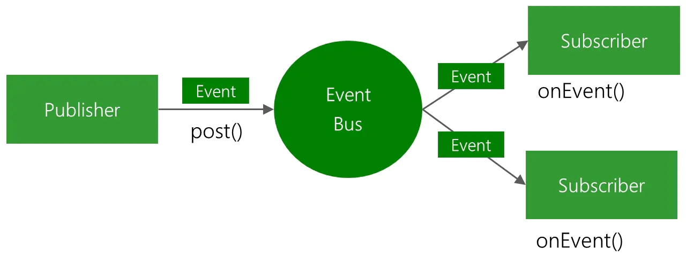

## 1 简介

EventBus 是用于Android 的事件**发布-订阅**总线。

```java
//1、创建事件实体类
public class MessageEvent {
    private String message;
    //setter/getter
}

//2、注册
EventBus.getDefault().register(this)

//3、发送事件
val message = Message()
message.message = "发送"
EventBus.getDefault().post(message)    

//4、添加方法
@Subscribe(threadMode = ThreadMode.MAIN)
fun onEvent(event: MessageEvent) {
     Log.d("test", event.message)
}    
    
//5、解绑
EventBus.getDefault().unregister(this)    
```

官方原理图：



EventBus 的核心就是**观察者模式**。

* EventBus 相当于**被观察者**，内部存放一个**subscriptionsByEventType**（订阅方法）集合，包含所有的观察者，也就是调用了 registe r的所有 Activity 或者 Fragment 中的订阅方法。
* 当使用 post 发送事件时，遍历 **subscriptionsByEventType**，拿到观察者，通过反射调用观察者中的事件处理方法。

## 2 原理

从基本使用中，我们可以从 Event 的 getDefault 方法分析其原理。

### 2.1 EventBus.getDefault().register()

```java
//使用 DCl 单例模式创建 EventBus
public static EventBus getDefault() {
        EventBus instance = defaultInstance;
        if (instance == null) {
            synchronized (EventBus.class) {
                instance = EventBus.defaultInstance;
                if (instance == null) {
                    instance = EventBus.defaultInstance = new EventBus();
                }
            }
        }
        return instance;
    }
//new EventBus()
public EventBus() {
     //调用 EventBus 另外一个有参数构造方法
     this(DEFAULT_BUILDER);//DEFAULT_BUILDER 其实就是 EventBusBuilder
    
}

//EventBusBuilder
EventBusBuilder() { //什么也没有做    
}
```

EventBus#register 

```java
 public void register(Object subscriber) {
    Class<?> subscriberClass = subscriber.getClass();
    //根据当前注册类获取 subscriberMethods 订阅方法列表
    List<SubscriberMethod> subscriberMethods = subscriberMethodFinder.findSubscriberMethods(subscriberClass);
    synchronized (this) {
        for (SubscriberMethod subscriberMethod : subscriberMethods) {
            //进行注册
            subscribe(subscriber, subscriberMethod);
        }
    }
}

```

SubscriberMethodFinder#findSubscriberMethods

```java
    List<SubscriberMethod> findSubscriberMethods(Class<?> subscriberClass) {
        //缓存中有 subscriberClass 对象对应的所有订阅方法列表,直接return
        //SubscriberMethod 描述订阅类的订阅方法
        List<SubscriberMethod> subscriberMethods = METHOD_CACHE.get(subscriberClass);
        if (subscriberMethods != null) {
            return subscriberMethods;
        }
        //ignoreGeneratedIndex 判断是否使用生成的 APT 代码去优化寻找接收事件的过程，如开启，将会通过 subscriberInfoIndexes 来快速得到接收事件方法的相关信息，提高了性能
        if (ignoreGeneratedIndex) {//默认 false
            subscriberMethods = findUsingReflection(subscriberClass);
        } else {
            subscriberMethods = findUsingInfo(subscriberClass);
        }
        if (subscriberMethods.isEmpty()) {
           ...
        } else {
            METHOD_CACHE.put(subscriberClass, subscriberMethods);
            return subscriberMethods;
        }
    }
```

SubscriberMethodFinder#findUsingInfo

```java
private List<SubscriberMethod> findUsingInfo(Class<?> subscriberClass) {
        //代码1 创建 FindState 是 SubscriberMethodFinder 内部类，作一些，初始化、回收对象
        FindState findState = prepareFindState();
        findState.initForSubscriber(subscriberClass);
        while (findState.clazz != null) {
            findState.subscriberInfo = getSubscriberInfo(findState);
            if (findState.subscriberInfo != null) {
                SubscriberMethod[] array = findState.subscriberInfo.getSubscriberMethods();
                for (SubscriberMethod subscriberMethod : array) {
                    if (findState.checkAdd(subscriberMethod.method, subscriberMethod.eventType)) {
                        findState.subscriberMethods.add(subscriberMethod);
                    }
                }
            } else {
                //代码2 获取订阅者类中的所有声明方法，寻找以 @Subscribe作为注解的方法进行处理
                //将 threadMode，优先级,sticky 等信息封装到 SubscriberMethod 对象中，添加到 subscriberMethods 列表中
                findUsingReflectionInSingleClass(findState);
            }
            findState.moveToSuperclass();
        }
       //代码4 
        return getMethodsAndRelease(findState);
    }

```

代码1 SubscriberMethodFinder#prepareFindState

```java

private FindState prepareFindState() {
        synchronized (FIND_STATE_POOL) {
            for (int i = 0; i < POOL_SIZE; i++) {
                //从已有的 FindState[] FIND_STATE_POOL对象池中找
                FindState state = FIND_STATE_POOL[i];
                if (state != null) {
                    FIND_STATE_POOL[i] = null;
                    return state;
                }
            }
        }
        //没有 直接 new 一个 FindState
        return new FindState();
    }
```

代码2 SubscriberMethodFinder#findUsingReflectionInSingleClass

```java
private void findUsingReflectionInSingleClass(FindState findState) {
        Method[] methods;
        try {
			//获取订阅者的所有方法,例子中是 MainActivity 
            methods = findState.clazz.getDeclaredMethods();
        } catch (Throwable th) {
            methods = findState.clazz.getMethods();
            findState.skipSuperClasses = true;
        }
        for (Method method : methods) {
            int modifiers = method.getModifiers();//获取方法的修饰符 判断是否 public 
            if ((modifiers & Modifier.PUBLIC) != 0 && (modifiers & MODIFIERS_IGNORE) == 0) {
                Class<?>[] parameterTypes = method.getParameterTypes();
                if (parameterTypes.length == 1) {//判断参数是否是一个,按照上面的实例代码,这里的parameterTypes就是String类
                    Subscribe subscribeAnnotation = method.getAnnotation(Subscribe.class);//获取注解
                    if (subscribeAnnotation != null) {
                        Class<?> eventType = parameterTypes[0];
                        if (findState.checkAdd(method, eventType)) {
                            ThreadMode threadMode = subscribeAnnotation.threadMode();
                            findState.subscriberMethods.add(new SubscriberMethod(method, eventType, threadMode,
                                    subscribeAnnotation.priority(), subscribeAnnotation.sticky()));//添加进subscriberMethods的中的所有订阅方法会在findUsingInfo函数中返回
                        }
                    }
                }
                ...
            }
        }
    }
```

代码4 SubscriberMethodFinder#getMethodsAndRelease

```java
 private List<SubscriberMethod> getMethodsAndRelease(FindState findState) {
      //获取 subscriberMethods   
     List<SubscriberMethod> subscriberMethods = new ArrayList<>(findState.subscriberMethods);
        //回收
        findState.recycle();
        synchronized (FIND_STATE_POOL) {
            for (int i = 0; i < POOL_SIZE; i++) {
                if (FIND_STATE_POOL[i] == null) {
                    FIND_STATE_POOL[i] = findState;
                    break;
                }
            }
        }
       //返回 subscriberMethods
        return subscriberMethods;
    }
```

register() 调用 subscribe 方法

```java
public void register(Object subscriber) {
    Class<?> subscriberClass = subscriber.getClass();
    List<SubscriberMethod> subscriberMethods = subscriberMethodFinder.findSubscriberMethods(subscriberClass);
    synchronized (this) {
        for (SubscriberMethod subscriberMethod : subscriberMethods) {
            //subscribe 
            subscribe(subscriber, subscriberMethod);
        }
    }
}
```

EventBus#subscribe

```java
 private void subscribe(Object subscriber, SubscriberMethod subscriberMethod) {
        Class<?> eventType = subscriberMethod.eventType;
        //在构造函数中记录下订阅者和订阅方法
        Subscription newSubscription = new Subscription(subscriber, subscriberMethod);
        CopyOnWriteArrayList<Subscription> subscriptions = subscriptionsByEventType.get(eventType);
        if (subscriptions == null) {
            subscriptions = new CopyOnWriteArrayList<>();
            subscriptionsByEventType.put(eventType, subscriptions);
        } else {
            ...
        }

        int size = subscriptions.size();
        for (int i = 0; i <= size; i++) {
            ////根据优先级来添加
            if (i == size || subscriberMethod.priority > subscriptions.get(i).subscriberMethod.priority) {
                subscriptions.add(i, newSubscription);
                break;
            }
        }
       //typesBySubscriber:根据订阅者来获取到所有的订阅方法参数类型
        List<Class<?>> subscribedEvents = typesBySubscriber.get(subscriber);
        if (subscribedEvents == null) {
            subscribedEvents = new ArrayList<>();
            typesBySubscriber.put(subscriber, subscribedEvents);
        }
        subscribedEvents.add(eventType);

        if (subscriberMethod.sticky) {//粘性事件
            if (eventInheritance) { 
                Set<Map.Entry<Class<?>, Object>> entries = stickyEvents.entrySet();
                for (Map.Entry<Class<?>, Object> entry : entries) {
                    Class<?> candidateEventType = entry.getKey();
                    if (eventType.isAssignableFrom(candidateEventType)) {
                        Object stickyEvent = entry.getValue();
                        checkPostStickyEventToSubscription(newSubscription, stickyEvent);
                    }
                }
            } else {
                Object stickyEvent = stickyEvents.get(eventType);
                checkPostStickyEventToSubscription(newSubscription, stickyEvent);
            }
        }
    }
```

总结：

* 通过 getDefault 获取 EventBus 实例
* 从缓存获取订阅方法的列表，如果不存在，通过反射获取订阅者所有的方法，遍历再通过权限修饰符、参数长度(只允许一个参数)、@Subscribe 判断是否成为订阅者，构建 SubscriberMethod（订阅方法），最后订阅函数列表构建完成添加进入缓存。
* 遍历订阅方法集合，调用 subscribe ：
  * 初始化并完善 subscriptionsByEventType（map）：存储->事件类型和其对应的订阅方法和订阅类的键值对。
  * 初始化并完善 typesBySubscriber （map）：存储->订阅者类和订阅者类所有订阅方法的事件类型集合的映射对

### 2.2 EventBus.getDefault().post()

```java
 public void post(Object event) {
        //currentPostingThreadState 是 ThreadLocal 类型的对象,里面存储 PostingThreadState
        //PostingThreadState:一个 eventQueue 和 其他标志位
        PostingThreadState postingState = currentPostingThreadState.get();
        List<Object> eventQueue = postingState.eventQueue;
        eventQueue.add(event);
        if (!postingState.isPosting) {
            postingState.isMainThread = isMainThread();
            postingState.isPosting = true;
            if (postingState.canceled) {
                throw new EventBusException("Internal error. Abort state was not reset");
            }
            try {
                while (!eventQueue.isEmpty()) {
                    //代码1 
                    postSingleEvent(eventQueue.remove(0), postingState);
                }
            } finally {
                postingState.isPosting = false;
                postingState.isMainThread = false;
            }
        }
    }
```

代码1  Event#postSingleEvent()

```java
  private void postSingleEvent(Object event, PostingThreadState postingState) throws Error {
      //获取事件类型
        Class<?> eventClass = event.getClass();
        boolean subscriptionFound = false;
        if (eventInheritance) {
            List<Class<?>> eventTypes = lookupAllEventTypes(eventClass);
            int countTypes = eventTypes.size();
            for (int h = 0; h < countTypes; h++) {
                Class<?> clazz = eventTypes.get(h);
                subscriptionFound |= postSingleEventForEventType(event, postingState, clazz);
            }
        } else {
            //代码1
            subscriptionFound = postSingleEventForEventType(event, postingState, eventClass);
        }
        if (!subscriptionFound) {
            //一些错误
            ...
        }
    }

```

代码1 EventBus#postSingleEventForEventType

```java

private boolean postSingleEventForEventType(Object event, PostingThreadState postingState, Class<?> eventClass) {
        CopyOnWriteArrayList<Subscription> subscriptions;
        synchronized (this) {
		//subscriptionsByEventType 装的是订阅者和订阅方法,根据发送事件的类型来获取到对应的订阅者和订阅方法，取出 subscriptions
            subscriptions = subscriptionsByEventType.get(eventClass);
        }
        if (subscriptions != null && !subscriptions.isEmpty()) {
            for (Subscription subscription : subscriptions) {
                postingState.event = event; //事件
                postingState.subscription = subscription;
                boolean aborted = false;
                try {
                    postToSubscription(subscription, event, postingState.isMainThread);
                    aborted = postingState.canceled;
                } finally {
                    postingState.event = null;
                    postingState.subscription = null;
                    postingState.canceled = false;
                }
                if (aborted) {
                    break;
                }
            }
            return true;
        }
        return false;

```


```java
private void postToSubscription(Subscription subscription, Object event, boolean isMainThread) {
      //根据 threadMode 来判断在那个线程中使用
        switch (subscription.subscriberMethod.threadMode) {
            case POSTING://反射
                invokeSubscriber(subscription, event);
            case MAIN:
                if (isMainThread) {
                    invokeSubscriber(subscription, event);
                } else {
                    mainThreadPoster.enqueue(subscription, event);
                }
                break;
            case MAIN_ORDERED:
                if (mainThreadPoster != null) {
                    mainThreadPoster.enqueue(subscription, event);
                } else {                  
                    invokeSubscriber(subscription, event);
                }
                break;
            case BACKGROUND:
                if (isMainThread) {
                    //加入到后台队列中
                    backgroundPoster.enqueue(subscription, event);
                } else {
                    invokeSubscriber(subscription, event);
                }
                break;
            case ASYNC:
                asyncPoster.enqueue(subscription, event);//总是开启线程来调用
                break;
            default:
                throw new IllegalStateException("Unknown thread mode: " + subscription.subscriberMethod.threadMode);
        }
    }
```

总结：

* 将事件加入当前线程的事件队列
* 遍历这个事件队列
  * 获取 subscriptions 
  * 根据 threadMode 判断在那个线程中执行

### 2.3 EventBus.getDefault().postSticky()

```java
public void postSticky(Object event) {
       //锁住了stickyEvents -> private final Map<Class<?>, Object> stickyEvents;
        synchronized (stickyEvents) {
            //存放事件
            stickyEvents.put(event.getClass(), event);
        }       
        post(event);
    }
```

### 2.4 EventBus.getDefault().unregister()

```java
    public synchronized void unregister(Object subscriber) {
        //获取了当前订阅者类的事件类型的类对象集合
        List<Class<?>> subscribedTypes = typesBySubscriber.get(subscriber);
        if (subscribedTypes != null) {
            for (Class<?> eventType : subscribedTypes) {
                //删除所有包含当前订阅者的 subscription
                unsubscribeByEventType(subscriber, eventType);
            }
            //直接 remove 掉
            typesBySubscriber.remove(subscriber);
        } else {
            logger.log(Level.WARNING, "Subscriber to unregister was not registered before: "   subscriber.getClass());
        }
    }
```

