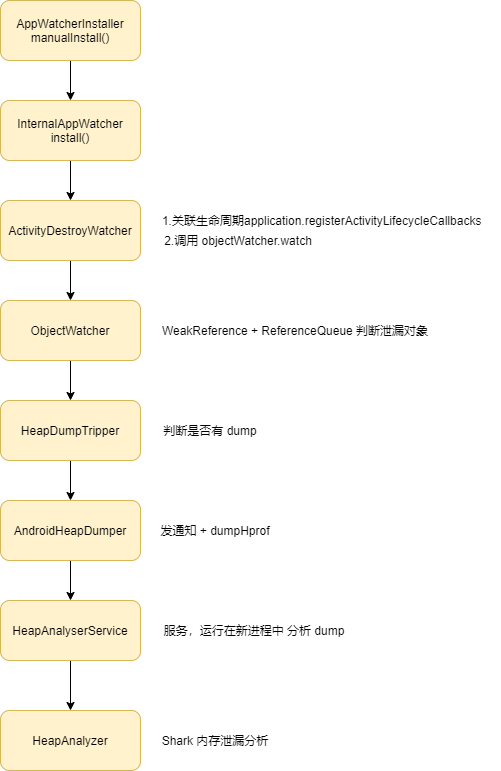

## 1 基本使用

```java
debugImplementation 'com.squareup.leakcanary:leakcanary-android:2.5'
```

假如导入成功，logcat 会打印。

```java
D/LeakCanary: LeakCanary is running and ready to detect memory leaks.
```

和 1.x 版本不同，不需要使用 LeakCanary.install(this)。

1.6.3 版本开始，heap 分析库从 haha 库转换为 **Shark** 库，Java 语言切换成 Kotlin。

## 2 原理

```kotlin
internal sealed class AppWatcherInstaller : ContentProvider() {
  internal class MainProcess : AppWatcherInstaller()
  internal class LeakCanaryProcess : AppWatcherInstaller()
  //AppWatcher.install 初始化在 ContentProvider.onCreate
  override fun onCreate(): Boolean {
    val application = context!!.applicationContext as Application
	//调用 manualInstall
    AppWatcher.manualInstall(application)
    return true
  }
  ...  
}

//InternalAppWatcher#install
//最终调用 InternalAppWatcher#install
fun install(application: Application) {
    //检查是否是主线程
    checkMainThread()
    if (this::application.isInitialized) {
      return
    }
    InternalAppWatcher.application = application
    if (isDebuggableBuild) {
      SharkLog.logger = DefaultCanaryLog()
    }

    val configProvider = { AppWatcher.config }
	//对 Activity 进行 install， 对 Activity 生命周期 onDestroy 进行观察
    ActivityDestroyWatcher.install(application, objectWatcher, configProvider)
	//对 Fragment 进行 install，与 Activity 类似
    FragmentDestroyWatcher.install(application, objectWatcher, configProvider)
    onAppWatcherInstalled(application)
  }


//ActivityDestroyWatcher
internal class ActivityDestroyWatcher private constructor(
  private val objectWatcher: ObjectWatcher,
  private val configProvider: () -> Config
) {

  private val lifecycleCallbacks =
    object : Application.ActivityLifecycleCallbacks by noOpDelegate() {
      override fun onActivityDestroyed(activity: Activity) {
        if (configProvider().watchActivities) {
		 //ObjectWatcher 实现内存泄漏监控
          objectWatcher.watch(
              activity, "${activity::class.java.name} received Activity#onDestroy() callback"
          )
        }
      }
    }

  companion object {
    fun install(
      application: Application,
      objectWatcher: ObjectWatcher,
      configProvider: () -> Config
    ) {
      val activityDestroyWatcher =
        ActivityDestroyWatcher(objectWatcher, configProvider)
	  //向 Application 统一注册生命周期回调，监听 Activity onDestroy 回调。 	
      application.registerActivityLifecycleCallbacks(activityDestroyWatcher.lifecycleCallbacks)
    }
  }
}

//ObjectWatcher#watch
@Synchronized fun watch(
    watchedObject: Any,
    description: String
  ) {
    if (!isEnabled()) {
      return
    }
	//1.清除 ReferenceQueue 中引用  代码1
    removeWeaklyReachableObjects()
    val key = UUID.randomUUID()
        .toString()
    val watchUptimeMillis = clock.uptimeMillis()
	//2.把 Activity 包装成弱引用，放到 ReferenceQueue 中 
    val reference =
      KeyedWeakReference(watchedObject, key, description, watchUptimeMillis, queue)
    SharkLog.d {
      "Watching " +
          (if (watchedObject is Class<*>) watchedObject.toString() else "instance of ${watchedObject.javaClass.name}") +
          (if (description.isNotEmpty()) " ($description)" else "") +
          " with key $key"
    }

    watchedObjects[key] = reference
	//3.5s 之后发出检测
    checkRetainedExecutor.execute {
      moveToRetained(key) //代码2 
    }
  }
 
//代码1 -> removeWeaklyReachableObjects
 private fun removeWeaklyReachableObjects() {
    var ref: KeyedWeakReference?
    do {
      ref = queue.poll() as KeyedWeakReference?
      if (ref != null) {
        watchedObjects.remove(ref.key)
      }
    } while (ref != null)
  } 
  
//代码2  -> moveToRetained
  @Synchronized private fun moveToRetained(key: String) {
    removeWeaklyReachableObjects()
    val retainedRef = watchedObjects[key]
    if (retainedRef != null) {//如果 retainedRef 不为 null 说明可能内存泄漏，触发内存泄漏处理
      retainedRef.retainedUptimeMillis = clock.uptimeMillis()
      onObjectRetainedListeners.forEach { it.onObjectRetained() } //代码3
    }
  } 
  
  
  //代码3 onObjectRetained
  override fun onObjectRetained() = scheduleRetainedObjectCheck()
  fun scheduleRetainedObjectCheck() {
    if (this::heapDumpTrigger.isInitialized) {//判断是否存在内存泄漏
      heapDumpTrigger.scheduleRetainedObjectCheck()
    }
  }
  
```
如果内存泄漏最终就开始 HeapDump 内存分析
```kotlin
 private fun dumpHeap(
    retainedReferenceCount: Int,
    retry: Boolean
  ) {
    ...
    when (val heapDumpResult = heapDumper.dumpHeap()) {//代码1 调用 AndroidHeapDumper#dumpHeap
      ...
      is HeapDump -> { //如果是 HeapDump 开始内存分析
       ...
		//代码2 调用 HeapAnalyzerService，是一个 service 实际分析
        HeapAnalyzerService.runAnalysis(
            context = application,
            heapDumpFile = heapDumpResult.file, //主要是分析 dump heap 文件
            heapDumpDurationMillis = heapDumpResult.durationMillis
        )
      }
    }
  }

```
代码1 AndroidHeapDumper#dumpHeap
```kotlin
 override fun dumpHeap(): DumpHeapResult {
   ...
   //发出 Notification 
    val notificationManager =
      context.getSystemService(Context.NOTIFICATION_SERVICE) as NotificationManager
    if (Notifications.canShowNotification) {
      val dumpingHeap = context.getString(R.string.leak_canary_notification_dumping)
      val builder = Notification.Builder(context)
          .setContentTitle(dumpingHeap)
      val notification = Notifications.buildNotification(context, builder, LEAKCANARY_LOW)
      notificationManager.notify(R.id.leak_canary_notification_dumping_heap, notification)
    }

    val toast = waitingForToast.get()
    
    return try {
      val durationMillis = measureDurationMillis {
	   //Debug.dumpHprofData dump hprof 内存分析文件 给 HeapAnalyzerService 分析作用
        Debug.dumpHprofData(heapDumpFile.absolutePath)
      }
      if (heapDumpFile.length() == 0L) {
        SharkLog.d { "Dumped heap file is 0 byte length" }
        NoHeapDump
      } else {
        HeapDump(file = heapDumpFile, durationMillis = durationMillis)
      }
    } catch (e: Exception) {
      SharkLog.d(e) { "Could not dump heap" }
      // Abort heap dump
      NoHeapDump
    } finally {
      cancelToast(toast)
      notificationManager.cancel(R.id.leak_canary_notification_dumping_heap)
    }
  }

```

代码2 HeapAnalyzerService#runAnalysis 分析 dump heap 文件，HeapAnalyzerService 是一个单独进程。

```kotlin
 //HeapAnalyzerService#analyzeHeap 分析 dump heap 文件
  private fun analyzeHeap(
    heapDumpFile: File,
    config: Config
  ): HeapAnalysis {    
    ....
    return heapAnalyzer.analyze( //最终 HeapAnalyzer 来分析
       ...
    )
  }

```

HeapAnalyzer#analyze 分析内存泄漏

```kotlin
fun analyze(
   ...
  ): HeapAnalysis {
    val analysisStartNanoTime = System.nanoTime()

    if (!heapDumpFile.exists()) {
      val exception = IllegalArgumentException("File does not exist: $heapDumpFile")
      return HeapAnalysisFailure(
          heapDumpFile = heapDumpFile,
          createdAtTimeMillis = System.currentTimeMillis(),
          analysisDurationMillis = since(analysisStartNanoTime),
          exception = HeapAnalysisException(exception)
      )
    }

    return try {
      listener.onAnalysisProgress(PARSING_HEAP_DUMP)
      val sourceProvider = ConstantMemoryMetricsDualSourceProvider(FileSourceProvider(heapDumpFile))
      sourceProvider.openHeapGraph(proguardMapping).use { graph ->
	   //代码1 由 FindLeakInput 进行分析 
        val helpers =
          FindLeakInput(graph, referenceMatchers, computeRetainedHeapSize, objectInspectors)
        val result = helpers.analyzeGraph(
            metadataExtractor, leakingObjectFinder, heapDumpFile, analysisStartNanoTime
        )
        ...
  }

```
代码1 FindLeakInput#analyzeGraph

```kotlin
private fun FindLeakInput.analyzeGraph(
    metadataExtractor: MetadataExtractor,
    leakingObjectFinder: LeakingObjectFinder,
    heapDumpFile: File,
    analysisStartNanoTime: Long
  ): HeapAnalysisSuccess {
    listener.onAnalysisProgress(EXTRACTING_METADATA)
    val metadata = metadataExtractor.extractMetadata(graph)
    
    listener.onAnalysisProgress(FINDING_RETAINED_OBJECTS)
	//从 hprof 中获取泄漏的对象 id 集合
    val leakingObjectIds = leakingObjectFinder.findLeakingObjectIds(graph)
    //代码1 针对疑似泄漏对象，计算 gcroot 最短引用路径，确定是否真的发生泄漏
    val (applicationLeaks, libraryLeaks) = findLeaks(leakingObjectIds) //代码2
    return HeapAnalysisSuccess(
        heapDumpFile = heapDumpFile,
        createdAtTimeMillis = System.currentTimeMillis(),
        analysisDurationMillis = since(analysisStartNanoTime),
        metadata = metadata,
        applicationLeaks = applicationLeaks,
        libraryLeaks = libraryLeaks
    )
  }

```

代码1 FindLeakInput.findLeaks
```kotlin
 private fun FindLeakInput.findLeaks(leakingObjectIds: Set<Long>): Pair<List<ApplicationLeak>, List<LibraryLeak>> {
     ... 
	 //构建 LeakTrace
    return buildLeakTraces(shortestPaths, inspectedObjectsByPath, retainedSizes)
  }

private fun buildLeakTraces(
    shortestPaths: List<ShortestPath>,
    inspectedObjectsByPath: List<List<InspectedObject>>,
    retainedSizes: Map<Long, Pair<Int, Int>>?
  ): Pair<List<ApplicationLeak>, List<LibraryLeak>> {
 
 //构建传递 LeakTrace 引用链
 val leakTrace = LeakTrace(
          gcRootType = GcRootType.fromGcRoot(shortestPath.root.gcRoot),
          referencePath = referencePath,
          leakingObject = leakTraceObjects.last()
      )
}	  
```

总结：


