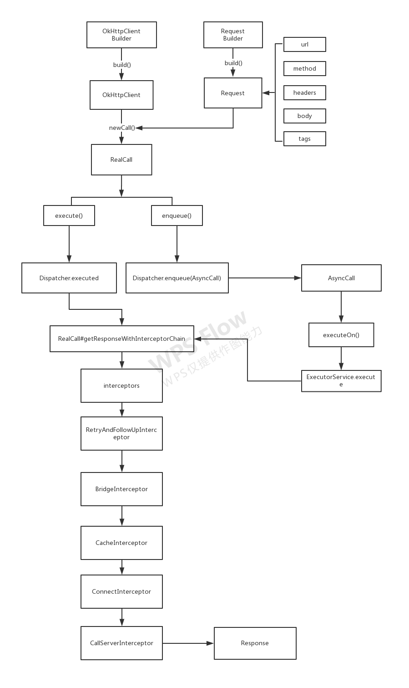

## 1 简介
基于 Okhttp 4.X 的源码分析，看了许多博客都是基于 3.X 源码分析，Okhttp 4.X 已经换成 Kotlin，不过不管是 Java 还是 Kotlin 其框架思想差不多，不可能因为改了一种语言，其框架整个思想都变了吧。 

## 2 入门
下面写一个小例子，请求度娘的网址，代码如下：
```java
val url = "http://www.baidu.com"
//1.创建一个 Request
val request = Request.Builder().url(url)
            .method("GET", null)
            .build()
//2.创建一个 Client
val okHttpClient = OkHttpClient.Builder().build()
//3.得到一个 Call
val call = okHttpClient.newCall(request)
//4.1.异步请求
call.enqueue(object : Callback {
    override fun onFailure(call: Call, e: IOException) {
    }

    override fun onResponse(call: Call, response: Response) {
         val result = response.body?.string()
         Log.d("result", result)
    }
})
//4.2.同步请求
val response = call.execute() //阻塞
val result = response.body?.string()
Log.d("result", result)
```
当然，实在项目中，不可能每一个请求都这样写一遍，那岂不是要累死，都是要我们经过二次封装。一眼看去，Okhttp 请求步骤还是挺简单，没几行代码，就完成了数据请求，这只是表象，作为一名开发者，我们不仅要会熟练运用 API，更重要的是，要学会汲取框架中优秀设计思想，这只有一条路径，那就是啃源码。

## 3 源码解析
上面的一次请求，设置到几个类，下面我们来看看这几个类。
### 3.1 涉及到类和接口
#### 3.1.1 OkHttpClient
OkHttpClient创建，用的是建造者模式，最终调用的 Builder，Builder里面许多配置选项。
```java
 class Builder constructor() {
    internal var dispatcher: Dispatcher = Dispatcher()//任务调度器，最终的请求都是有这调度器来完成
    internal var connectionPool: ConnectionPool = ConnectionPool()//连接池
    internal val interceptors: MutableList<Interceptor> = mutableListOf()//拦截器集合
    internal val networkInterceptors: MutableList<Interceptor> = mutableListOf()//网络拦截器集合
    internal var eventListenerFactory: EventListener.Factory = EventListener.NONE.asFactory()//监听工厂
    internal var retryOnConnectionFailure = true//连接失败是否重试，默认为 true
    internal var authenticator: Authenticator = Authenticator.NONE//本地身份验证
    internal var followRedirects = true//http 是否支持重定向，默认为 true
    internal var followSslRedirects = true//ssl 是否支持重定向，默认为 true
    internal var cookieJar: CookieJar = CookieJar.NO_COOKIES//Cookie
    internal var cache: Cache? = null//缓存
    internal var dns: Dns = Dns.SYSTEM//DNS 解析
    internal var proxy: Proxy? = null// 代理
    internal var proxySelector: ProxySelector? = null//代理选择器
    internal var proxyAuthenticator: Authenticator = Authenticator.NONE//代理身份验证
    internal var socketFactory: SocketFactory = SocketFactory.getDefault()//socket身份验证
    internal var sslSocketFactoryOrNull: SSLSocketFactory? = null//ssl socket 工厂
    internal var x509TrustManagerOrNull: X509TrustManager? = null//证书验证
    internal var connectionSpecs: List<ConnectionSpec> = DEFAULT_CONNECTION_SPECS//传输层版本和连接协议 TLS等
    internal var protocols: List<Protocol> = DEFAULT_PROTOCOLS//协议
    internal var hostnameVerifier: HostnameVerifier = OkHostnameVerifier//用于确认主机名
    internal var certificatePinner: CertificatePinner = CertificatePinner.DEFAULT//证书链
    internal var certificateChainCleaner: CertificateChainCleaner? = null//证书确认
    internal var callTimeout = 0//请求超时时间
    internal var connectTimeout = 10_000//连接超时时间
    internal var readTimeout = 10_000//读取超时时间
    internal var writeTimeout = 10_000//写入超时时间
    internal var pingInterval = 0// 长连接时命令间隔
    ......
}
```
#### 3.1.2 Request
Request创建过程。
```java
open fun build(): Request {
     return Request(
         checkNotNull(url) { "url == null" },//地址
         method,//请求方式
         headers.build(),//请求头
         body,//请求体
         tags.toImmutableMap()//请求 tag
     )
 }
```
#### 3.1.3 Call
对于 OkHttp 一次请求来言，最终的请求都封装在 Call 的实现类 RealCall 中。
```java
interface Call : Cloneable {

  //返回当前请求
  fun request(): Request
  
  //同步请求，会阻塞当前线程，直到返回结果
  @Throws(IOException::class)
  fun execute(): Response

  //异步请求，将请求添加到队列中，等到请求返回
  fun enqueue(responseCallback: Callback)

  //取消请求
  fun cancel()

  //判断请求是否执行完成了
  fun isExecuted(): Boolean

  //判断请求是否被取消
  fun isCanceled(): Boolean

  //返回超时
  fun timeout(): Timeout

  //克隆
  public override fun clone(): Call

  //工厂，创建一个 Call
  interface Factory {
    fun newCall(request: Request): Call
  }
}
```
### 3.2 基本流程
在开始分析之前先分析整体流程，如下图：


#### 3.2.1 请求分析
当我们调用 OkHttpClient.newCall(request) 看看发生了什么，调用如下代码：
```java
 override fun newCall(request: Request): Call {
    //调用 RealCall 的 newRealCall 方法
    return RealCall.newRealCall(this, request, forWebSocket = false)
  }

//RealCall.kt  
companion object {
    fun newRealCall(
      client: OkHttpClient,
      originalRequest: Request,
      forWebSocket: Boolean//是不是 WebSocket 请求
    ): RealCall {
      // Safely publish the Call instance to the EventListener.
      return RealCall(client, originalRequest, forWebSocket).apply {
        //Okhttp 的网络层 
        transmitter = Transmitter(client, this)
      }
    }
 }
```
不难发现，实际上是调用了 RealCall 类，这个类是对 Request 进行封装。
#### 3.2.2 请求方式
经过上面分析，我们不难发现，不论是同步，或者异步请求，最终会走到 RealCall 里面，所以 RealCall 请求方式分为两种：
* 同步请求（execute）
* 异步请求（enqueue）

##### 3.2.2.1 同步请求
```java
//直接请求，并返回结果
override fun execute(): Response {
    synchronized(this) {
      check(!executed) { "Already Executed" }
      executed = true
    }
    transmitter.timeoutEnter()
    transmitter.callStart()
    try {
      client.dispatcher.executed(this)//任务调度器同步调度
      return getResponseWithInterceptorChain()//责任链模式的InterceptorChain，会阻塞
    } finally {
      client.dispatcher.finished(this)
    }
 }
```
##### 3.2.2.2 异步请求
```java
//构造一个 AsyncCall 加入到队列中
override fun enqueue(responseCallback: Callback) {
    synchronized(this) {
      check(!executed) { "Already Executed" }
      executed = true
    }
    transmitter.callStart()
    client.dispatcher.enqueue(AsyncCall(responseCallback)) //任务调度器进行调度
 }

//AsyncCall 实际上是一个 Runnable
internal inner class AsyncCall(
    private val responseCallback: Callback
  ) : Runnable {
    @Volatile private var callsPerHost = AtomicInteger(0)

    fun callsPerHost(): AtomicInteger = callsPerHost

    fun reuseCallsPerHostFrom(other: AsyncCall) {
      this.callsPerHost = other.callsPerHost
    }

    fun host(): String = originalRequest.url.host

    fun request(): Request = originalRequest

    fun get(): RealCall = this@RealCall
    
    fun executeOn(executorService: ExecutorService) {
      client.dispatcher.assertThreadDoesntHoldLock()
      var success = false
      try {
        //线程池中执行 run 方法
        executorService.execute(this)
        success = true
      } catch (e: RejectedExecutionException) {
        //线程池满了，饱和策略处理。
        val ioException = InterruptedIOException("executor rejected")
        ioException.initCause(e)
        transmitter.noMoreExchanges(ioException)
        responseCallback.onFailure(this@RealCall, ioException)
      } finally {
        if (!success) {
          //最后完成 finished 
          client.dispatcher.finished(this) // This call is no longer running!
        }
      }
    }

    override fun run() {
      threadName("OkHttp ${redactedUrl()}") {
        var signalledCallback = false
        //超时
        transmitter.timeoutEnter()
        try {
          //拦截器返回的 Response
          val response = getResponseWithInterceptorChain()
          signalledCallback = true
          responseCallback.onResponse(this@RealCall, response)
        } catch (e: IOException) {
          if (signalledCallback) {
            // Do not signal the callback twice!
            Platform.get().log("Callback failure for ${toLoggableString()}", INFO, e)
          } else {
            responseCallback.onFailure(this@RealCall, e)
          }
        } catch (t: Throwable) {
          cancel()
          if (!signalledCallback) {
            val canceledException = IOException("canceled due to $t")
            canceledException.addSuppressed(t)
            responseCallback.onFailure(this@RealCall, canceledException)
          }
          throw t
        } finally {
          //结束请求
          client.dispatcher.finished(this)
        }
      }
    }
  }
```
从上面的代码来看不管异步请求和同步请求，有两个非常重要的点：
* 最终都是调用 **Dispatcher** 中的 enqueue()  和 executed()（注意不是 execute）；
* 都会走 **getResponseWithInterceptorChain()**
#### 3.2.3 请求调度
请求调度，用到任务调度器 Dispatcher，Dispatcher 有些地方翻译成分发器，有些地方翻译任务调度器，这里采用任务调度器。这个类用于控制并发的请求，从上面的步骤，我们可以看出 RealCall 中的 exqueue() 和 execute() 最终都走到 这个类中方法中。
```java
//控制并发请求
class Dispatcher constructor() {
  //默认最大并发请求为64
  @get:Synchronized var maxRequests = 64
    set(maxRequests) {
      require(maxRequests >= 1) { "max < 1: $maxRequests" }
      synchronized(this) {
        field = maxRequests
      }
      promoteAndExecute()
    }

 //默认每个主机最大请求数为5
  @get:Synchronized var maxRequestsPerHost = 5
    set(maxRequestsPerHost) {
      require(maxRequestsPerHost >= 1) { "max < 1: $maxRequestsPerHost" }
      synchronized(this) {
        field = maxRequestsPerHost
      }
      promoteAndExecute()
    }

  //空闲 Callback
  @set:Synchronized
  @get:Synchronized
  var idleCallback: Runnable? = null
  
  //自定义线程池
  private var executorServiceOrNull: ExecutorService? = null
  //线程池
  @get:Synchronized
  @get:JvmName("executorService") val executorService: ExecutorService
    get() {
      //设置默认线程池参数
      if (executorServiceOrNull == null) {
        executorServiceOrNull = ThreadPoolExecutor(0, Int.MAX_VALUE, 60, TimeUnit.SECONDS,
            SynchronousQueue(), threadFactory("OkHttp Dispatcher", false))
      }
      return executorServiceOrNull!!
    }

  //1.将要运行的异步请求队列
  private val readyAsyncCalls = ArrayDeque<AsyncCall>()

  //2.正在运行的异步请求队列
  private val runningAsyncCalls = ArrayDeque<AsyncCall>()

  //3.正在运行的同步请求队列
  private val runningSyncCalls = ArrayDeque<RealCall>()

  //自定义线程池
  constructor(executorService: ExecutorService) : this() {
    this.executorServiceOrNull = executorService
  }
 ......
 }
```
##### 3.2.3.1 Dispatcher#promoteAndExecute
```java
  private fun promoteAndExecute(): Boolean {
    this.assertThreadDoesntHoldLock()

    val executableCalls = mutableListOf<AsyncCall>()
    val isRunning: Boolean
    synchronized(this) {
      val i = readyAsyncCalls.iterator()
      while (i.hasNext()) {//遍历将要运行的异步请求队列
        val asyncCall = i.next()
        if (runningAsyncCalls.size >= this.maxRequests) break //超过最大并发请求
        if (asyncCall.callsPerHost().get() >= this.maxRequestsPerHost) continue //主机最大连接数判断
        i.remove()//将asyncCall 从准备队列移除
        asyncCall.callsPerHost().incrementAndGet()//主机连接数+1
        executableCalls.add(asyncCall)//添加到执行请求集合
        runningAsyncCalls.add(asyncCall)//将asyncCall添加到正在运行的队列
      }
      isRunning = runningCallsCount() > 0
    }

    for (i in 0 until executableCalls.size) { //遍历执行请求集合
      val asyncCall = executableCalls[i]
      //执行请求 AsyncCall 中的 executeOn，从5.2.2.2. AsyncCall  源码看出
      //其实就是执行ExecutorService#execute
      asyncCall.executeOn(executorService)
    }
    return isRunning
  }

```
##### 3.2.3.2 Dispatcher#finished
```java
 private fun <T> finished(calls: Deque<T>, call: T) {
    val idleCallback: Runnable?
    synchronized(this) {
      if (!calls.remove(call)) throw AssertionError("Call wasn't in-flight!")
      idleCallback = this.idleCallback
    }
    val isRunning = promoteAndExecute()
    if (!isRunning && idleCallback != null) {
      idleCallback.run()
    }
  }
```
异步请求完成之后，调用 Dispatcher#finished，用来处理队列中的任务，没有任务处理，则空闲callback 会回调。
#### 3.2.4 请求处理
请求处理通过，**getResponseWithInterceptorChain()**
```java
 //RealCall.kt 
 @Throws(IOException::class)
  fun getResponseWithInterceptorChain(): Response {
    // Build a full stack of interceptors.
    val interceptors = mutableListOf<Interceptor>()
    //添加自定义的拦截器，自定义拦截器会被优先处理
    interceptors += client.interceptors
    //添加重试和重定向拦截器
    interceptors += RetryAndFollowUpInterceptor(client)
    //添加转换桥拦截器
    interceptors += BridgeInterceptor(client.cookieJar)
    //添加缓存拦截器
    interceptors += CacheInterceptor(client.cache)
    //添加链接拦截器
    interceptors += ConnectInterceptor
    if (!forWebSocket) {
      //不是websocket添加网络拦截器
      interceptors += client.networkInterceptors
    }
    //添加读取响应拦截器
    interceptors += CallServerInterceptor(forWebSocket)

    val chain = RealInterceptorChain(interceptors, transmitter, null, 0, originalRequest, this,
        client.connectTimeoutMillis, client.readTimeoutMillis, client.writeTimeoutMillis)//得到拦截器链

    var calledNoMoreExchanges = false
    try {
      val response = chain.proceed(originalRequest)//链式调用，任务处理
      if (transmitter.isCanceled) {
        response.closeQuietly()
        throw IOException("Canceled")
      }
      return response
    } catch (e: IOException) {
      calledNoMoreExchanges = true
      throw transmitter.noMoreExchanges(e) as Throwable
    } finally {
      if (!calledNoMoreExchanges) {
        transmitter.noMoreExchanges(null)
      }
    }
  }
```
上面几行代码，就完成了所有的网络请求，采用是**责任链模式**，上级每处理一个就传递给下一级，最后的得到一个拦截器链。
### 3.3 拦截器
到此基本结束请求，我们在回过头来看，原来 Okhttp 的核心在于一个个**拦截器**，下面具体来分析拦截器。
#### 3.3.1 Interceptor.Chain 
RealInterceptorChain 实现了 Interceptor.Chain
```java
 interface Chain {
    fun request(): Request
    //最核心是这个方法
    @Throws(IOException::class)
    fun proceed(request: Request): Response
    fun connection(): Connection?
    fun call(): Call
    fun connectTimeoutMillis(): Int
    fun withConnectTimeout(timeout: Int, unit: TimeUnit): Chain
    fun readTimeoutMillis(): Int
    fun withReadTimeout(timeout: Int, unit: TimeUnit): Chain
    fun writeTimeoutMillis(): Int
    fun withWriteTimeout(timeout: Int, unit: TimeUnit): Chain
 }
```
其中最核心是 process
```java
 @Throws(IOException::class)
  fun proceed(request: Request, transmitter: Transmitter, exchange: Exchange?): Response {
    if (index >= interceptors.size) throw AssertionError()
    calls++
    // If we already have a stream, confirm that the incoming request will use it.
    check(this.exchange == null || this.exchange.connection()!!.supportsUrl(request.url)) {
      "network interceptor ${interceptors[index - 1]} must retain the same host and port"
    }
    // If we already have a stream, confirm that this is the only call to chain.proceed().
    check(this.exchange == null || calls <= 1) {
      "network interceptor ${interceptors[index - 1]} must call proceed() exactly once"
    }
    // Call the next interceptor in the chain.
    val next = RealInterceptorChain(interceptors, transmitter, exchange,
        index + 1, request, call, connectTimeout, readTimeout, writeTimeout)//创建新的拦截链，拦截器集合+1
    val interceptor = interceptors[index] //得到下一个拦截器
    @Suppress("USELESS_ELVIS")
    val response = interceptor.intercept(next) ?: throw NullPointerException(//执行interceptor.intercept
        "interceptor $interceptor returned null")
   .....
    check(response.body != null) { "interceptor $interceptor returned a response with no body" }

    return response //返回 response 
  }
```
#### 3.3.2 内置拦截器
Okhttp 有五个内置拦截器：
* RetryAndFollowUpInterceptor：失败重试和重定向
* BridgeInterceptor：把请求转换为服务器能识别的请求，把服务器响应转换成用户能看得懂的响应
* CacheInterceptor：缓存的读取和更新
* ConnectInterceptor：与服务建立连接
* CallServerInterceptor：从服务器读取响应数据

##### 3.3.2.1 RetryAndFollowUpInterceptor
作用：负责失败重试和重定向
```java
class RetryAndFollowUpInterceptor(private val client: OkHttpClient) : Interceptor {
  @Throws(IOException::class)
  override fun intercept(chain: Interceptor.Chain): Response {
    var request = chain.request()
    val realChain = chain as RealInterceptorChain//转换成 RealInterceptorChain
    val transmitter = realChain.transmitter()
    var followUpCount = 0
    var priorResponse: Response? = null
    while (true) {
      transmitter.prepareToConnect(request)
      if (transmitter.isCanceled) {
        throw IOException("Canceled")
      }
      var response: Response
      var success = false
      try {
        response = realChain.proceed(request, transmitter, null)//处理拦截器
        success = true
      } catch (e: RouteException) {
        //通过路由尝试连接失败，不发送该请求
        if (!recover(e.lastConnectException, transmitter, false, request)) {
          throw e.firstConnectException
        }
        continue
      } catch (e: IOException) {
        //尝试与服务器通信失败，但是请求可能已经发送
        val requestSendStarted = e !is ConnectionShutdownException
        if (!recover(e, transmitter, requestSendStarted, request)) throw e
        continue
      } finally {
    
        if (!success) {
          transmitter.exchangeDoneDueToException()
        }
      }

      if (priorResponse != null) { //创建一个响应体为空的 Response
        response = response.newBuilder()
            .priorResponse(priorResponse.newBuilder()
                .body(null)
                .build())
            .build()
      }

      val exchange = response.exchange
      val route = exchange?.connection()?.route()//路由
      val followUp = followUpRequest(response, route) //判断重定向

      if (followUp == null) {
        if (exchange != null && exchange.isDuplex) {
          transmitter.timeoutEarlyExit()
        }
        return response //不需要路由，返回 response
      }

      val followUpBody = followUp.body
      if (followUpBody != null && followUpBody.isOneShot()) {
        return response
      }

      response.body?.closeQuietly()
      if (transmitter.hasExchange()) {
        exchange?.detachWithViolence()
      }

      if (++followUpCount > MAX_FOLLOW_UPS) {//如果超过最大重定向次数抛异常
        throw ProtocolException("Too many follow-up requests: $followUpCount")
      }

      request = followUp //把重定向结果，赋值给 request
      priorResponse = response//把返回体，赋值给之前的返回体
    }
  }

  /**
   * Report and attempt to recover from a failure to communicate with a server. Returns true if
   * `e` is recoverable, or false if the failure is permanent. Requests with a body can only
   * be recovered if the body is buffered or if the failure occurred before the request has been
   * sent.
   */
  private fun recover(
    e: IOException,
    transmitter: Transmitter,
    requestSendStarted: Boolean,
    userRequest: Request
  ): Boolean {
    // The application layer has forbidden retries.
    if (!client.retryOnConnectionFailure) return false

    // We can't send the request body again.
    if (requestSendStarted && requestIsOneShot(e, userRequest)) return false

    // This exception is fatal.
    if (!isRecoverable(e, requestSendStarted)) return false

    // No more routes to attempt.
    if (!transmitter.canRetry()) return false
    // For failure recovery, use the same route selector with a new connection.
    return true
  }

  private fun requestIsOneShot(e: IOException, userRequest: Request): Boolean {
    val requestBody = userRequest.body
    return (requestBody != null && requestBody.isOneShot()) ||
        e is FileNotFoundException
  }

  private fun isRecoverable(e: IOException, requestSendStarted: Boolean): Boolean {
    // If there was a protocol problem, don't recover.
    if (e is ProtocolException) {
      return false
    }

    // If there was an interruption don't recover, but if there was a timeout connecting to a route
    // we should try the next route (if there is one).
    if (e is InterruptedIOException) {
      return e is SocketTimeoutException && !requestSendStarted
    }

    // Look for known client-side or negotiation errors that are unlikely to be fixed by trying
    // again with a different route.
    if (e is SSLHandshakeException) {
      // If the problem was a CertificateException from the X509TrustManager,
      // do not retry.
      if (e.cause is CertificateException) {
        return false
      }
    }
    if (e is SSLPeerUnverifiedException) {
      // e.g. a certificate pinning error.
      return false
    }
    // An example of one we might want to retry with a different route is a problem connecting to a
    // proxy and would manifest as a standard IOException. Unless it is one we know we should not
    // retry, we return true and try a new route.
    return true
  }


  @Throws(IOException::class)
  private fun followUpRequest(userResponse: Response, route: Route?): Request? { //判断重定向，并拿到request
    val responseCode = userResponse.code

    val method = userResponse.request.method
    when (responseCode) {
      HTTP_PROXY_AUTH -> {//407 需要代理授权，请求者应当使用代理
        val selectedProxy = route!!.proxy
        if (selectedProxy.type() != Proxy.Type.HTTP) {
          throw ProtocolException("Received HTTP_PROXY_AUTH (407) code while not using proxy")
        }
        return client.proxyAuthenticator.authenticate(route, userResponse)
      }

      HTTP_UNAUTHORIZED -> return client.authenticator.authenticate(route, userResponse) //401

      HTTP_PERM_REDIRECT, HTTP_TEMP_REDIRECT -> {//308 307
       //307、308状态代码以响应GET或HEAD以外的请求，则用户代理不得自动重定向请求
        if (method != "GET" && method != "HEAD") {
          return null
        }
        return buildRedirectRequest(userResponse, method)
      }

      HTTP_MULT_CHOICE, HTTP_MOVED_PERM, HTTP_MOVED_TEMP, HTTP_SEE_OTHER -> {//300 301 302 303
        //要完成请求，您需要进一步进行操作。通常，这些状态代码是永远重定向
        return buildRedirectRequest(userResponse, method)
      }

      HTTP_CLIENT_TIMEOUT -> {//408  服务器等候请求时发生超时
        if (!client.retryOnConnectionFailure) {
          // The application layer has directed us not to retry the request.
          return null
        }

        val requestBody = userResponse.request.body
        if (requestBody != null && requestBody.isOneShot()) {
          return null
        }
        val priorResponse = userResponse.priorResponse
        if (priorResponse != null && priorResponse.code == HTTP_CLIENT_TIMEOUT) {
          // We attempted to retry and got another timeout. Give up.
          return null
        }

        if (retryAfter(userResponse, 0) > 0) {
          return null
        }

        return userResponse.request
      }

      HTTP_UNAVAILABLE -> {//503 服务不可用
        val priorResponse = userResponse.priorResponse
        if (priorResponse != null && priorResponse.code == HTTP_UNAVAILABLE) {
          // 重试，依旧不可以
          return null
        }

        if (retryAfter(userResponse, Integer.MAX_VALUE) == 0) {
          // 立刻重试
          return userResponse.request
        }

        return null
      }
      else -> return null
    }
  }


  companion object {
    /**
     * How many redirects and auth challenges should we attempt? Chrome follows 21 redirects; Firefox,
     * curl, and wget follow 20; Safari follows 16; and HTTP/1.0 recommends 5.
     */
    private const val MAX_FOLLOW_UPS = 20
  }
}
```
##### 3.3.2.2 BridgeInterceptor
作用：连接桥拦截器，对请求头和响应头进行处理。
```java
class BridgeInterceptor(private val cookieJar: CookieJar) : Interceptor 
  @Throws(IOException::class)
  override fun intercept(chain: Interceptor.Chain): Response {
    val userRequest = chain.request()
    val requestBuilder = userRequest.newBuilder()
    val body = userRequest.body
    if (body != null) {
      val contentType = body.contentType()
      if (contentType != null) {
        requestBuilder.header("Content-Type", contentType.toString()) //增加Content-Type
      }

      val contentLength = body.contentLength()
      if (contentLength != -1L) {
        requestBuilder.header("Content-Length", contentLength.toString())
        requestBuilder.removeHeader("Transfer-Encoding")
      } else {
        requestBuilder.header("Transfer-Encoding", "chunked")
        requestBuilder.removeHeader("Content-Length")
      }
    }

    if (userRequest.header("Host") == null) {
      requestBuilder.header("Host", userRequest.url.toHostHeader())//增加Host
    }

    if (userRequest.header("Connection") == null) {
      requestBuilder.header("Connection", "Keep-Alive")//增加Connection
    }

    // If we add an "Accept-Encoding: gzip" header field we're responsible for also decompressing
    // the transfer stream.
    var transparentGzip = false
    if (userRequest.header("Accept-Encoding") == null && userRequest.header("Range") == null) {
      transparentGzip = true
      requestBuilder.header("Accept-Encoding", "gzip") //增加gzip压缩支持
    }

    val cookies = cookieJar.loadForRequest(userRequest.url)
    if (cookies.isNotEmpty()) {
      requestBuilder.header("Cookie", cookieHeader(cookies))//chuli1Cookie
    }

    if (userRequest.header("User-Agent") == null) {
      requestBuilder.header("User-Agent", userAgent)
    }

    val networkResponse = chain.proceed(requestBuilder.build()))//执行拦截器
    cookieJar.receiveHeaders(userRequest.url, networkResponse.headers)
    val responseBuilder = networkResponse.newBuilder()
        .request(userRequest)
    //gzip解压
    if (transparentGzip &&
        "gzip".equals(networkResponse.header("Content-Encoding"), ignoreCase = true) &&
        networkResponse.promisesBody()) {
      val responseBody = networkResponse.body
      if (responseBody != null) {
        val gzipSource = GzipSource(responseBody.source())
        val strippedHeaders = networkResponse.headers.newBuilder()
            .removeAll("Content-Encoding")
            .removeAll("Content-Length")
            .build()
        responseBuilder.headers(strippedHeaders)
        val contentType = networkResponse.header("Content-Type")
        responseBuilder.body(RealResponseBody(contentType, -1L, gzipSource.buffer()))
      }
    }

    return responseBuilder.build()
  }

  //cookie 处理
  private fun cookieHeader(cookies: List<Cookie>): String = buildString {
    cookies.forEachIndexed { index, cookie ->
      if (index > 0) append("; ")
      append(cookie.name).append('=').append(cookie.value)
    }
  }
}
```
##### 3.3.2.3 CacheInterceptor
作用：缓存的读取和更新
```java
 @Throws(IOException::class)
  override fun intercept(chain: Interceptor.Chain): Response {
    val cacheCandidate = cache?.get(chain.request())//获取缓存
    val now = System.currentTimeMillis()
    val strategy = CacheStrategy.Factory(now, chain.request(), cacheCandidate).compute()
    val networkRequest = strategy.networkRequest
    val cacheResponse = strategy.cacheResponse

    cache?.trackResponse(strategy)

    if (cacheCandidate != null && cacheResponse == null) {
      // 缓存不可用，关闭
      cacheCandidate.body?.closeQuietly()
    }

    //没有网络，没有缓存，返回错误码 504
    if (networkRequest == null && cacheResponse == null) {
      return Response.Builder()
          .request(chain.request())
          .protocol(Protocol.HTTP_1_1)
          .code(HTTP_GATEWAY_TIMEOUT)
          .message("Unsatisfiable Request (only-if-cached)")
          .body(EMPTY_RESPONSE)
          .sentRequestAtMillis(-1L)
          .receivedResponseAtMillis(System.currentTimeMillis())
          .build()
    }

    // 没有网络，使用缓存
    if (networkRequest == null) {
      return cacheResponse!!.newBuilder()
          .cacheResponse(stripBody(cacheResponse))
          .build()
    }

    var networkResponse: Response? = null
    try {
      networkResponse = chain.proceed(networkRequest)//下一个拦截器
    } finally {
      // 关闭
      if (networkResponse == null && cacheCandidate != null) {
        cacheCandidate.body?.closeQuietly()
      }
    }

   
    if (cacheResponse != null) {
      if (networkResponse?.code == HTTP_NOT_MODIFIED) { //如果是 304，返回缓存
        val response = cacheResponse.newBuilder()
            .headers(combine(cacheResponse.headers, networkResponse.headers))
            .sentRequestAtMillis(networkResponse.sentRequestAtMillis)
            .receivedResponseAtMillis(networkResponse.receivedResponseAtMillis)
            .cacheResponse(stripBody(cacheResponse))
            .networkResponse(stripBody(networkResponse))
            .build()

        networkResponse.body!!.close()

        // Update the cache after combining headers but before stripping the
        // Content-Encoding header (as performed by initContentStream()).
        cache!!.trackConditionalCacheHit()
        cache.update(cacheResponse, response)
        return response
      } else {
        cacheResponse.body?.closeQuietly()
      }
    }
    //使网络请求
    val response = networkResponse!!.newBuilder()
        .cacheResponse(stripBody(cacheResponse))
        .networkResponse(stripBody(networkResponse))
        .build()

    if (cache != null) {
      if (response.promisesBody() && CacheStrategy.isCacheable(response, networkRequest)) {
        val cacheRequest = cache.put(response)//更新缓存
        return cacheWritingResponse(cacheRequest, response)
      }

      if (HttpMethod.invalidatesCache(networkRequest.method)) {//PATCH、PUT、DELETE、MOVE不需要缓存
        try {
          cache.remove(networkRequest)
        } catch (_: IOException) {
          // The cache cannot be written.
        }
      }
    }
    return response //返回 response 
  }
```
##### 3.3.2.4 ConnectInterceptor
作用：服务器进行连接
```java
object ConnectInterceptor : Interceptor {
  @Throws(IOException::class)
  override fun intercept(chain: Interceptor.Chain): Response {
    val realChain = chain as RealInterceptorChain
    val request = realChain.request()
    val transmitter = realChain.transmitter()
    val doExtensiveHealthChecks = request.method != "GET"
    val exchange = transmitter.newExchange(chain, doExtensiveHealthChecks)///创建socket进行连接
    return realChain.proceed(request, transmitter, exchange)
  }
}
```
##### 3.3.2.5 CallServerInterceptor
作用：发送请求和接收请求
```java

class CallServerInterceptor(private val forWebSocket: Boolean) : Interceptor {

  @Throws(IOException::class)
  override fun intercept(chain: Interceptor.Chain): Response {
    val realChain = chain as RealInterceptorChain
    val exchange = realChain.exchange()
    val request = realChain.request()
    val requestBody = request.body
    val sentRequestMillis = System.currentTimeMillis()
    exchange.writeRequestHeaders(request) //写入请求头
    var invokeStartEvent = true
    var responseBuilder: Response.Builder? = null
    if (HttpMethod.permitsRequestBody(request.method) && requestBody != null) {
      if ("100-continue".equals(request.header("Expect"), ignoreCase = true)) {
        exchange.flushRequest()
        responseBuilder = exchange.readResponseHeaders(expectContinue = true)
        exchange.responseHeadersStart()
        invokeStartEvent = false
      }
      if (responseBuilder == null) {
        if (requestBody.isDuplex()) {
          // Prepare a duplex body so that the application can send a request body later.
          exchange.flushRequest()
          val bufferedRequestBody = exchange.createRequestBody(request, true).buffer()
          requestBody.writeTo(bufferedRequestBody)
        } else {
          // Write the request body if the "Expect: 100-continue" expectation was met.
          val bufferedRequestBody = exchange.createRequestBody(request, false).buffer()//写入请求体
          requestBody.writeTo(bufferedRequestBody)
          bufferedRequestBody.close()
        }
      } else {
        exchange.noRequestBody()
        if (!exchange.connection()!!.isMultiplexed) {
          // If the "Expect: 100-continue" expectation wasn't met, prevent the HTTP/1 connection
          // from being reused. Otherwise we're still obligated to transmit the request body to
          // leave the connection in a consistent state.
          exchange.noNewExchangesOnConnection()
        }
      }
    } else {
      exchange.noRequestBody()
    }

    if (requestBody == null || !requestBody.isDuplex()) {
      exchange.finishRequest()
    }
    if (responseBuilder == null) {
      responseBuilder = exchange.readResponseHeaders(expectContinue = false)!!// 读取响应头
      if (invokeStartEvent) {
        exchange.responseHeadersStart()
        invokeStartEvent = false
      }
    }
    var response = responseBuilder
        .request(request)
        .handshake(exchange.connection()!!.handshake())
        .sentRequestAtMillis(sentRequestMillis)
        .receivedResponseAtMillis(System.currentTimeMillis())
        .build()
    var code = response.code //读取响应体
    if (code == 100) {
      // Server sent a 100-continue even though we did not request one. Try again to read the actual
      // response status.
      responseBuilder = exchange.readResponseHeaders(expectContinue = false)!!
      if (invokeStartEvent) {
        exchange.responseHeadersStart()
      }
      response = responseBuilder
          .request(request)
          .handshake(exchange.connection()!!.handshake())
          .sentRequestAtMillis(sentRequestMillis)
          .receivedResponseAtMillis(System.currentTimeMillis())
          .build()
      code = response.code
    }

    exchange.responseHeadersEnd(response)

    response = if (forWebSocket && code == 101) {
      // Connection is upgrading, but we need to ensure interceptors see a non-null response body.
      response.newBuilder()
          .body(EMPTY_RESPONSE)
          .build()
    } else {
      response.newBuilder()
          .body(exchange.openResponseBody(response))
          .build()
    }
    if ("close".equals(response.request.header("Connection"), ignoreCase = true) ||
        "close".equals(response.header("Connection"), ignoreCase = true)) {
      exchange.noNewExchangesOnConnection()
    }
    if ((code == 204 || code == 205) && response.body?.contentLength() ?: -1L > 0L) {
      throw ProtocolException(
          "HTTP $code had non-zero Content-Length: ${response.body?.contentLength()}")
    }
    return response
  }
}
//写入请求头、写入请求体、读取响应头、读取响应体
```
至此，Okhttp的主体流程已经非常清晰了，但是其中还有一些小方面没有写，比如连接池、缓存策略等，有空时候再补上去。
## 4 参考
* [okhttp架构图](https://www.jianshu.com/p/07d03949c885)

* [OKhttp源码解析详解系列](https://www.jianshu.com/p/d98be38a6d3f)
* [Android开源框架源码鉴赏：Okhttp](https://juejin.im/post/5a704ed05188255a8817f4c9)
* [OkHttp源码分析，基于OKHttp4.0版本](https://www.jianshu.com/p/925faf8d358b)
* [网络请求statusCode(状态码) 200、300、400、500序列](https://blog.csdn.net/ziyuzhiye/article/details/99852028)