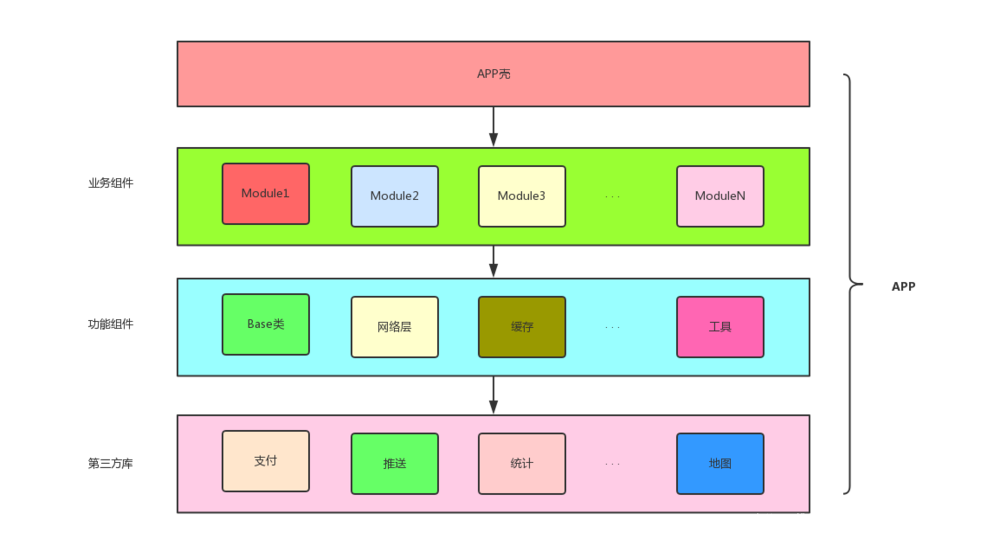
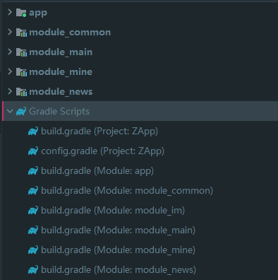

## 1 简介

通俗来讲，将一个功能完整的 App 或模块拆分成多个子模块, 每个子模块可以独立编译和运行。也可以任意组合成另一个新的 App 或模块, 每个模块即不相互依赖但又可以相互交互, 遇到某些特殊情况甚至可以升级或者降级。

## 2 组件化架构

组件化架构通常如下图所示：



* App 壳：负责管理各个业务组件，和打包 apk，没有具体的业务功能；
* 业务组件： 根据具体业务而独立形成一个个单独工程，即可以单独打包成一个 apk，也可以变成组件的一部分；
* 功能组件（common）：支撑业务组件的基础，例如网络请求、数据管理等；
* 第三方库：包含第三方的库，微信、分享、推送、IM 等；

实际项目中应用类似如下结构：



* app：壳

* module_main：业务组件

* module_mine：业务组件，我的模块

* module_news：业务组件，新闻模块

* module_common：公共模块

* config.gradle：统一管理 SDK 和 依赖库。

  ```groovy
  //在 project -> build.gradle 中使用 apply from: "config.gradle"
  ext {
      /**
       * module 开关统一
       * true：module 作为 application，可单独打包为apk
       * false：module 作为 library，可作为宿主 application 的组件
       */
      isMineModule = false
      isNewsModule = false
      isMainModule = false
      
      //1.android开发版本配置
      build_version = [
              compileSdkVersion: 28,
              ...
      ]
  
      //2.version配置
      versions = [
              android              : '3.4.1'
              ...
       ]  
      
      //3.依赖库
      libs = [
              "support_v4"      : "androidx.legacy:legacy-support-v4:${versions["support"]}",
          ...
      ]    
  ```

  在业务组件的 gradle 中配置。

  ```groovy
  if (Boolean.valueOf(rootProject.ext.isMineModule)) {
      //作为独立App应用运行
      apply plugin: 'com.android.application'
  } else {
      //作为组件运行
      apply plugin: 'com.android.library'
  }
  apply plugin: 'kotlin-android'
  ...
  ```

  在 app 的 build.gradle 中配置。

  ```java
  //主模块
  implementation project(':module_main')
  //我的模块
  if (Boolean.valueOf(rootProject.ext.isMineModule)) {    
       implementation project(':module_mine')
  }    
   //新闻模块
  if (Boolean.valueOf(rootProject.ext.isNewsModule)) { 
       implementation project(':module_news')
  }  
  ```

  至此，组件化架构的搭建基本完成。

## 3 注意

### 3.1 Application

需要在 common 组件中创建 BaseAppliaction，提供全局唯一的 context，上层业务组件在组件化模式下，均需继承于 BaseAppliaction。

### 3.2  applicationId管理

可为不同组件设置不同的 applicationId，也可以缺省，在 AS 中，默认的 applicationId 与包名一致。

组件的 applicationId 在其 build.gradle 文件的 defaultConfig 中进行配置。

```groovy
defaultConfig {
    if (Boolean.valueOf(rootProject.ext.isModuleNews)) {
    //组件模式下设置applicationId
    applicationId "com.miya.news"
}    
```

### 3.3  manifest管理

组件在集成模式和组件化模式，需要配置不同的manifest文件。

```groovy
   /*
    * SourceSets 可以指定哪些源文件（或文件夹下的源文件）要被编译,哪些源文件要被排除。
    * 
    */
    sourceSets {
        main {
            if (Boolean.valueOf(rootProject.ext.isModuleNews)) {//apk
                manifest.srcFile 'src/main/manifest/AndroidManifest.xml'
            } else {
                //在这个包下创建
                manifest.srcFile 'src/main/AndroidManifest.xml'
                java {
                    //library模式下，排除java/debug文件夹下的所有文件
                    exclude '*module'
                }
            }
        }
    }
 
```

### 3.4 资源名冲突问题

多人开发中，可以通过设置资源名前缀 resourcePrefix 以及约束资源名。在业务组件 build.gradle 配置。

```groovy
android {
    //统一资源前缀，规范资源引用
    resourcePrefix "mine_"
}
```

针对图片、字体、string 等资源，有一个方法是，新建一个 module_res 保存所有的资源文件。

### 3.5 组件跳转

可以使用 ARouter 这种的路由第三方库。

### 3.6 混淆

#### 一：在 app 模块中管理所有的混淆规则

**优点**：所有混淆规则在app模块的`proguard-rule.pro`文件中统一管理

**缺点**：移除某些模块后，需手动移除 app 模块中的混淆规则。理论上混淆规则添加多了不会造成崩溃或者编译不通过，但是会影响编译效率

#### 二：组件模块管理各自的混淆规则

**优点**：将混淆文件解耦到每个模块中，并且不会影响编译效。


