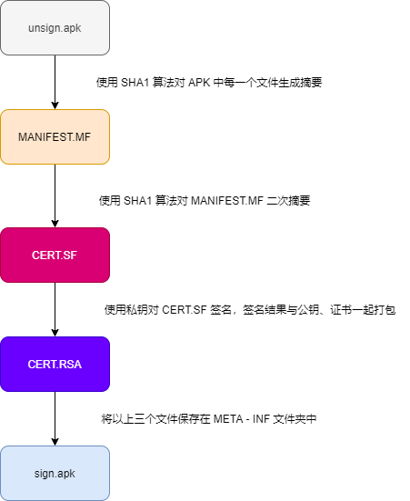

## 1 APK 打包过程

*

* 打包资源文件，生成 R.java 文件
  - aapt 工具（aapt.exe） -> AndroidManifest.xml 和 布局文件 XMl 都会编译 -> R.java -> AndroidManifest.xml 会被 aapt 编译成二进制
  - res 目录下资源 -> 编译，变成二进制文件，生成 resource id -> 最后生成 resouce.arsc（文件索引表）
* 处理 aidl 文件，生成相应的 Java 文件
  * aidl 工具（aidl.exe）
* 编译项目源代码，生成 class 文件
* 转换所有 class 文件，生成 classes.dex 文件
  * dx.bat
* 打包生成 APK 文件
  * apkbuilder 工具打包到最终的 .apk 文件中
*  对APK文件进行签名
*  对签名后的 APK 文件进行对齐处理（正式包）
  * 对 APK 进行对齐处理，用到的工具是 zipalign

## 2 签名方案

- v1 方案：基于 JAR 签名。
- v2 方案：解决 JAR 签名方案的安全性问题和渠道包，在 Android 7.0 引入，。
- v3 方案：v2 升级版，在 Android 9.0 引入。

### 2.1 签名工具

* **jarsigner**：jdk 自带的签名工具，对 jar 进行签名。使用 keystore 文件进行签名。生成的签名文件默认使用 keystore 的别名命名。
* **apksigner**：Android sdk 提供的专门用于 Android 应用的签名工具。使用 pk8、x509.pem 文件进行签名。 pk8 是私钥文件，x509.pem 是含有公钥的文件。生成的签名文件统一使用“CERT”命名。

### 2.2 V1 签名

[详解Android v1、v2、v3签名(小结）](https://www.jb51.net/article/174939.htm)