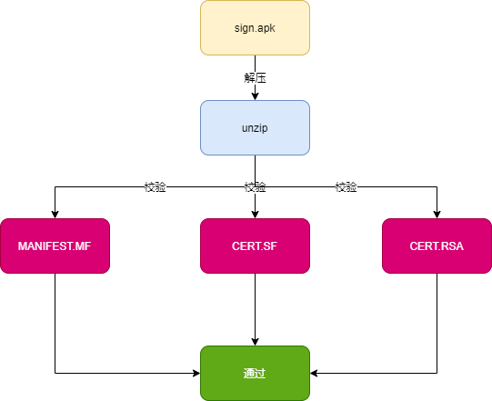
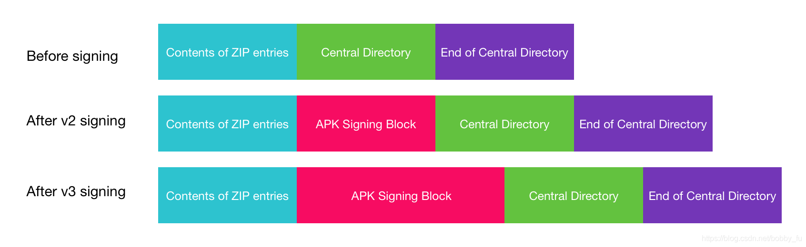

## 1 APK 打包过程

*

* 打包资源文件，生成 R.java 文件
  - aapt 工具（aapt.exe） -> AndroidManifest.xml 和 布局文件 XMl 都会编译 -> R.java -> AndroidManifest.xml 会被 aapt 编译成二进制
  - res 目录下资源 -> 编译，变成二进制文件，生成 resource id -> 最后生成 resouce.arsc（文件索引表）
* 处理 aidl 文件，生成相应的 Java 文件
  * aidl 工具（aidl.exe）
* 编译项目源代码，生成 class 文件
* 转换所有 class 文件，生成 classes.dex 文件
  * dx.bat
* 打包生成 APK 文件
  * apkbuilder 工具打包到最终的 .apk 文件中
*  对APK文件进行签名
*  对签名后的 APK 文件进行对齐处理（正式包）
  * 对 APK 进行对齐处理，用到的工具是 zipalign

## 2 签名方案

- v1 方案：基于 JAR 签名。
- v2 方案：解决 JAR 签名方案的安全性问题和渠道包，在 Android 7.0 引入，。
- v3 方案：v2 升级版，在 Android 9.0 引入。

### 2.1 签名工具

* **jarsigner**：jdk 自带的签名工具，对 jar 进行签名。使用 keystore 文件进行签名，生成的签名文件默认使用 keystore 的别名命名。
* **apksigner**：Android sdk 提供的专门用于 Android 应用的签名工具。使用 pk8、x509.pem 文件进行签名。 pk8 是私钥文件，x509.pem 是含有公钥的文件。生成的签名文件统一使用“CERT”命名。

### 2.2 V1 签名

#### 2.2.1 签名

#### 2.2.2 校验

- 检查 APK 中包含的所有文件，对应的摘要值与 MANIFEST.MF 文件中记录的值一致。
- 使用证书文件（RSA 文件）检验签名文件（SF 文件）没有被修改过。
- 使用签名文件（SF 文件）检验 MF 文件没有被修改过。

#### 2.2.3 v1 弊端

* 签名检验速度慢：对所有文件进行摘要绩，如果 Android 机器差，安装速度慢。
* 完整性保障不够：META-INF 目录用来存放签名，但可以随意添加文件。

### 2.3 v2 签名

 v2 是一种**全文件签名方案**，能够发现对 APK 的受保护部分进行的所有更改，从而有助于加快验证速度并增强完整性保证。

v2 将**验证归档中的所有字节**，而不是单个 ZIP 条目，因此，在签署后无法再运行 ZIPalign（必须在签名之前执行）。正因如此，现在，在编译过程中，Google 将**压缩、调整和签署合并成一步完成**。

v2 会在原先 APK 块中增加了一个**新的块（签名块）**，新的块存储了签名、摘要、签名算法、证书链和额外属性等信息，这个块有特定的格式。最终的签名APK其实就有四块：头文件区、V2签名块、中央目录、尾部。下图是V1签名和V2签名的组成。

相对与 v1 签名方案，v2 签名方案不再以文件为单位计算摘要了，而是以 **1 MB 为单位**将文件拆分为多个连续的块（chunk），**每个分区**的最后一个块可能会小于 1 MB。

### 2.4 v3 签名

 v3 签名在v2的基础上，仍然采用检查整个压缩包的校验方式。不同的是在签名部分增可以添加新的证书，即可以不用修改 ApplicationID 来完成证书的更新迭代。

其实 v3 就是加入了证书的**旋转校验**，即可以在一次的升级安装中使用新的证书，新的私钥来签名APK。当然这个新的证书是需要老证书来保证的，类似一个证书链。

签名机制主要有两种用途：

- 使用特殊的 key 签名可以获取到一些不同的权限
- 验证数据保证不被篡改，防止应用被恶意的第三方覆盖

## 3 总结

| 版本 | 简介                                                         |
| ---- | ------------------------------------------------------------ |
| v1   | 签名以文件的形式存在于apk包中，这个版本的apk包就是一个标准的zip包 |
| v2   | 签名信息被塞到了apk文件本身中，这时apk已经不符合一个标准的zip压缩包的文件结构 |
| v3   | 添加了一种更新证书的方式，这部分更新证书的数据同样被放在了签名信息中 |

## 4 参考

[详解Android v1、v2、v3签名(小结）](https://www.jb51.net/article/174939.htm)

[Android P v3签名新特性](https://blog.csdn.net/bobby_fu/article/details/103843038)