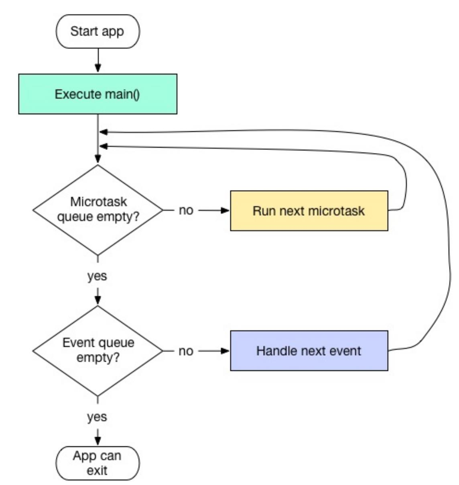

## 1 计数器应用实例

```java


```


## 1 路由管理

路由通常指界面，路由管理，管理页面之间如何跳转。


### 1.1 MaterialPageRoute 

继承⾃ PageRoute 类，PageRoute 类是⼀个抽象类，表示占有整个屏幕空间的⼀个模态路由页面，还定义了路由构建及切换时**过渡动画**的相关接⼝及属性。

```dart
MaterialPageRoute({ 
    WidgetBuilder builder,//构建路由⻚⾯的具体内容
    RouteSettings settings, //路由的配置信息，如路由名称、是否初始路由（⾸⻚）
    bool maintainState = true,//路由没⽤的时 是否释放其所占⽤的所有资源，
    bool fullscreenDialog = false,//是否是全屏的模态对话框
})
```

### 1.2 Navigator

路由管理的 widget，通过⼀个栈。

* Future push(BuildContext context, Route route) ：路由⼊栈
* bool pop(BuildContext context, [ result ])：栈顶路由出栈

### 1.3 命名路由 

给路由起⼀个**名字**，通过路由名字直接打开新的路由。

优点：直观

缺点：不能直接传递路由参数

### 1.4 路由表 

要想使⽤命名路由，须先提供并注册⼀个路由表（routing table）。

```dart
Map<String, WidgetBuilder> routes；
```

### 1.5 注册路由表

```dart
return MaterialApp( 
    title: 'Flutter Demo',
    theme: ThemeData( primarySwatch: Colors.blue, ),//注册路由表 
    //注册路由表
    routes:{ 
        "new_page":(context)=>NewRoute(), 
    } ,
    home: MyHomePage(title: 'Flutter Demo Home Page'),
);

//使用
Navigator.pushNamed(context, "new_page");
```

## 3 包管理

使用  pubspec.yaml （位于项⽬根⽬录）来管理第三⽅依赖包。

[Pub仓库](https://pub.dartlang.org/) Google官⽅的Dart Packages仓库。

```yaml
name: flutter_in_action #名称。
description: First Flutter application. #描述、简介
version: 1.0.0+1 #版本号

dependencies: #依赖的其它包或插件
	flutter: 
	  sdk: flutter 
	cupertino_icons: ^0.1.2 

dev_dependencies: #开发环境依赖的⼯具包（⽽不是flutter应⽤本身依赖的包）
	flutter_test: sdk: flutter 

flutter: #开发环境依赖的⼯具包（⽽不是flutter应⽤本身依赖的包）
	uses-material-design: true
```

### 3.1 其他依赖

```yaml
#1.依赖本地包
dependencies: 
	pkg1:
		path: ../../code/pkg1
            
#2.依赖Git
dependencies: 
	pkg1:
    	git:
    		url: git://github.com/xxx/pkg1.git
```

## 4 资源管理

 assets：资源，静态数据（例如JSON⽂件）、配置⽂件、图标和图⽚（JPEG，WebP，GIF，动画WebP / GIF， 

PNG，BMP和WBMP）等。

### 4.1 指定资源

```yaml
flutter: 
	assets: #包含在应⽤程序中的⽂件
		- assets/my_icon.png 
		- assets/background.png
```

加载资源：通过 AssetBundle 对象访问其asset 。

### 4.2 加载文本 assets

* 通过 **rootBundle 对象**加载：每个Flutter应⽤程序都有⼀个 rootBundle 对象， 通过它可以轻松访问主资源包，直接使⽤ package:flutter/services.dart 中全局静态的 rootBundle 对象来加载asset即可。 

* 通过 **DefaultAssetBundle 加载**：建议使⽤ DefaultAssetBundle 来获取当前 BuildContext 的AssetBundle。 这种⽅法不是使⽤应⽤程序构建的默认asset bundle，⽽是使⽗级widget在运⾏时动态替换的不同的AssetBundle，这对于本地化或测试场景很有⽤。 

```dart
import 'dart:async' show Future; 
import 'package:flutter/services.dart' show rootBundle; 

Future<String> loadAsset() async { 
    return await rootBundle.loadString('assets/config.json'); 
}
```

### 4.3 加载图⽚

**AssetImage**  加载图片。

```dart
Widget build(BuildContext context) { 
    return new DecoratedBox( 
        decoration: new BoxDecoration( 
          image: new DecorationImage( 
            image: new AssetImage('graphics/background.png'),//AssetImage 是 ImageProvider
        ),
     ),
   ); 
}

//期望直接得到⼀个显示图⽚ 的widget，
Widget build(BuildContext context) { 
    return Image.asset('graphics/background.png'); 
}
```

要加载依赖包中的图像，必须给 AssetImage 提供 package 参数。

```dart
new AssetImage('icons/heart.png', package: 'my_icons')
new Image.asset('icons/heart.png', package: 'my_icons')    
```

打包包中的 assets 

```yaml
…/lib/backgrounds/background1.png 


flutter: 
	assets: - packages/fancy_backgrounds/backgrounds/background1.png #lib 是隐含的
```

### 4.4 特定平台 assets 

* Android：mipmap
* Assets.xcassets/AppIcon.appiconset

## 5 调试Flutter 应用

* Dart 分析器 
* Dart Observatory (语句级的单步调试和分析器) 

## 6 Dart 线程模型

Dart 在单线程中是以消息循环机制来运⾏的，包含两个任务队列:

* 微任务队列  microtask queue，来源于Dart内部
* 事件队列 event queue。微任务队列的执⾏优先级⾼于事件队列，外部事件任务都在事件队列中，如IO、计时器、点击、以及绘制事件等。



## 7 Flutter异常捕获 

Dart中可以通过 try/catch/finally 来捕获代码块异常。

```dart
@override 
void performRebuild() { 
    ...
    try { 
        //执⾏build⽅法 
        built = build(); 
    } catch (e, stack) {
        // 有异常时则弹出错误提示 
        built = ErrorWidget.builder(_debugReportException('building $this', e, stack));       }
    ... 
}
```

## 8 其它异常捕获与⽇志收集 

在Dart中，异常分两类

* 同步异常，try/catch 捕获

* 异步异常

  ```dart
  var future = new Future.value(499); 
  runZoned(() { 
      var future2 = future.then((_) { throw "error in first error-zone"; }); 
      runZoned(() { 
          var future3 = future2.catchError((e) { print("Never reached!"); });
      }, onError: (e) { print("unused error handler"); }); 
  }, onError: (e) { print("catches error of first error-zone."); });
  ```

模板

```dart
void collectLog(String line){
    ... //收集⽇志 
}
void reportErrorAndLog(FlutterErrorDetails details){ 
    ... //上报错误和⽇志逻辑 
}FlutterErrorDetails makeDetails(Object obj, StackTrace stack){
    ...// 构建错误信息 
}

void main() { 
    FlutterError.onError = (FlutterErrorDetails details) {
        reportErrorAndLog(details); 
    };
    runZoned( 
        () => runApp(MyApp()), 
        zoneSpecification: ZoneSpecification( 
            print: (Zone self, ZoneDelegate parent, Zone zone, String line) {                            collectLog(line); //⼿机⽇志 
            }, 
        ),
        onError: (Object obj, StackTrace stack) { 
            var details = makeDetails(obj, stack); 
            reportErrorAndLog(details); 
        },
    ); 
}
```

