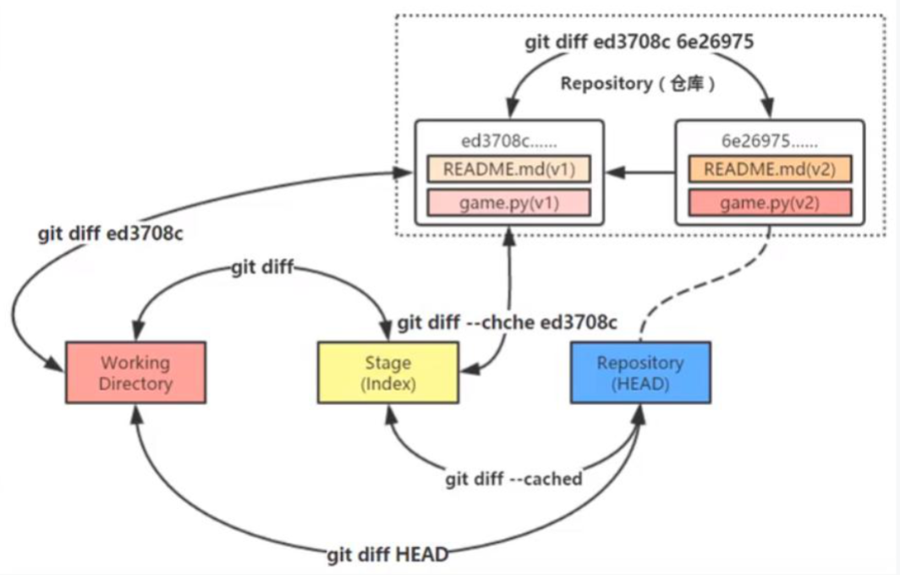

## 1 比较

```python
# 比较暂存区域与工作目录
git diff

# 比较两个历史快照
git diff 快照1 快照2

# 比较当前工作目录和 Git 仓库中的快照
git diff 快照id
# 比较工作目录和最新的快照
git diff HEAD

# 比较暂存区域和 Git 仓库快照
git diff --cache
# 比较指定暂存区域和 Git 仓库快照
git diff --cache 快照id
```

