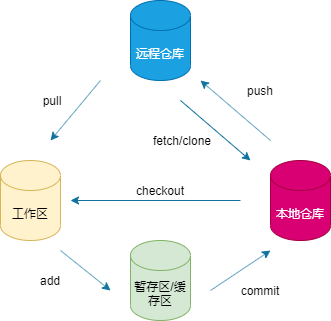

## 1 创建

### 1.1 git init
创建新目录
```java
git init
//例
cd TestGit
git init
```

### 1.2 git clone
拷贝 Git 仓库本地
```java
git clone [url]
//例
git clone https://github.com/test/test.git
```

## 2 提交与修改

### 2.1 git add
将文件添加到暂存区
```java
1.添加一个或多个文件到暂存区
git add [file1] [file2] ...
//例
git add a.txt b.txt

2.添加指定目录到暂存区，包括子目录
git add [dir]
//例
git add com

3.添加当前目录下的所有文件到暂存区
git add .
```

### 2.2 git status
查看上次提交之后是否有对文件进行再次修改
```java
//1.查看
git status

//2.查看简短结果
git status -s
```

### 2.3 git diff
比较文件不同，文件在暂存区和工作区的差异
```java
//1.暂存区和工作区的差异
git diff [file]
//例
git diff a.txt

//2.暂存区和上一次提交(commit)的差异
git diff --cached [file]
git diff --staged [file]
//例
git diff --cached a.txt

//3.两次提交之间的差异
git diff bc88 6e66
```

### 2.4 git commit
将暂存区内容添加到本地仓库中
```java
//1.提交暂存区内容到本地仓库中
git commit -m [message]
//例
git commit -m "初始化项目"

//2.提交指定文件到本地仓库中
git commit [file1] [file2] -m [message]
//例
git commit a.txt b.txt -m "初始化项目"

//3.不需要 git add 命令，直接来提交
git commit -a
```

### 2.5 git reset
回退版本，可以指定退回某一次提交的版本
```java
git reset [--soft | --mixed | --hard] [HEAD]
--mixed 为默认，可以不用带该参数，用于重置暂存区的文件与上一次的提交(commit)保持一致，工作区文件内容保持不变。

//1.回退
git reset  [HEAD] 
//回退所有内容到上一个版本  
git reset HEAD^             
//回退到上上一个版本 
git reset HEAD^^ a.txt        
//回退到指定版本
git reset 65ee            

//2.--soft 参数用于回退到某个版本
git reset --soft
//回退上上上一个版本
git reset --soft HEAD~3 

//3.--hard 删除回退点之前的所有信息
git reset --hard
````

### 2.6 git rm
删除文件
```java
//1.将文件从暂存区和工作区中删除
git rm [file]
//例
git rm a.txt

//2.强制从暂存区和工作区中删除文件
git rm -f [file]
//例
git rm -f a.txt

//3.将文件从暂存区中删除
git rm --cached [file]
//例
git rm --cached b.txt

//4.递归删除
git rm –r * 
//删除 testDir 目录
git rm –r testDir
```

### 2.7 git mv
移动或重命名一个文件、目录或软连接
```java
git mv [file] [newfile]
//例
git mv a.txt aa.txt 
```

## 3 提交命令
### 3.1 git log
查看历史提交记录
```java
git log [参数1] [参数2]
//--oneline  查看历史记录的简洁的版本

//--graph    查看历史中分支、合并信息

//--reverse  逆向显示所有日志

//--author   找指定用户的提交日志
git log --author=zzq

//--since 和 --before，或--until 和 --after 指定日期
git log --oneline --before={2020-04-18} --after={2020-10-18}
```

### 3.1 git blame
以列表形式查看指定文件的历史修改记录
```java
git blame [file] 
//例
git blame a.txt
```

## 4 远程仓库
### 4.1 git remote
```java
//1.查看所有远程仓库
git remote -v

//2.显示某个远程仓库的信息
git remote show [remote]

//3.添加远程版本库
git remote add [本地的版本库] [url]

//4.删除远程仓库
git remote rm name 

//5.修改仓库名 
git remote rename old_name new_name  
```

### 4.2 git fetch 
从远程仓库获取代码库
```java
//1.远程仓库获取代码库
git fetch [alias]
//例
git fetch origin

//2.合并到本地
git merge [alias]/[branch]
//例
git merge origin/master
```

### 4.3 git pull

远程获取代码并合并本地的版本

```java
git pull <远程主机名> <远程分支名>:<本地分支名>
//例
git pull origin master:test //拉取远程 origin 的 master 分支，与本地的 test 分支合并
git pull origin master //如果远程分支是与当前分支合并，则冒号后面的部分可以省略
```

4.4 git push

将本地的分支版本上传到远程并合并

```java
git push <远程主机名> <本地分支名>:<远程分支名>
git push <远程主机名> <本地分支名> //如果本地分支名与远程分支名相同，则可以省略冒号
//例
git push origin master
//1.--force 强制
git push --force origin master 

//2.--delete 删除主机分支
git push --force origin master
```

## 5 总结

