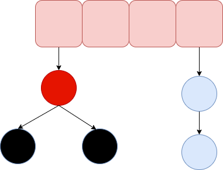

## 1 简介

HashMap 主要用来存放键值对，它的实现是基于哈希表的 Map 接口。

JDK1.7 的 HashMap 由 **数组+链表** 组成的，数组是 HashMap 的主体，链表采用拉链法解决哈希冲突。

JDK1.8 的 HashMap 由 **数组+链表 + 红黑树**，当链表长度大于阈值（默认为 8）（判断数组长度是否超过 64，超过了，就会进行扩容）会将链表转化为红黑树。

## 2 数据结构

JDK1.7 的 HashMap 由 **数组+链表** 组成的，数组是 HashMap 的主体，链表采用拉链法解决哈希冲突。

HashMap 通过 key 的 hashCode 经过扰动函数，得到 hash 值，之后通过 （n - 1）& hash 得到元素的存放位置，如果当前位置存在元素，判断该元素与要存入的元素的 hash 值和 key 是否相同，如果相同，直接覆盖，不相同就通过拉链法解决哈希冲突。

JDK1.8 的 HashMap 由 **数组+链表 + 红黑树**，当链表长度大于阈值（默认为 8）（先判断数组长度是否超过 64，超过了，就会先进行扩容）会将链表转化为红黑树。

```java
//JDK 1.7 hash
static int hash(int h) {
    h ^= (h >>> 20) ^ (h >>> 12);
    return h ^ (h >>> 7) ^ (h >>> 4);
}

//JDK 1.8 hash
static final int hash(Object key) {
    int h;
    return (key == null) ? 0 : (h = key.hashCode()) ^ (h >>> 16);
}
```

JDK 1.7 数组结构


JDK 1.8 数组结构，当链表长度大于阈值（默认为8）时，先调用 treeifyBin()，当数组长度大于或者等于 64 时，转换红黑树，以减少搜索时间。否则，执行 resize() 方法对数组扩容。



## 3 源码

```java
public class HashMap<K,V> extends AbstractMap<K,V> implements Map<K,V>, Cloneable, Serializable {
    private static final long serialVersionUID = 362498820763181265L;
    //初始容量 16
    static final int DEFAULT_INITIAL_CAPACITY = 1 << 4;
    //最大容量
    static final int MAXIMUM_CAPACITY = 1 << 30;
    //默认的填充因子
    static final float DEFAULT_LOAD_FACTOR = 0.75f;
    //用来确定何时将解决 hash 冲突的链表转变为红黑树
    static final int TREEIFY_THRESHOLD = 8;
    //用来确定何时将解决 hash 冲突的红黑树转变为链表
    static final int UNTREEIFY_THRESHOLD = 6;
    static final int MIN_TREEIFY_CAPACITY = 64;
    //存储元素的数组，总是2的幂次倍
    transient Node<k,v>[] table;
    //存放具体元素的集
    transient Set<map.entry<k,v>> entrySet;
    //存放元素的个数，注意这个不等于数组的长度。
    transient int size;
    //每次扩容和更改map结构的计数器
    transient int modCount;
    //临界值 当实际大小(容量*填充因子)超过临界值时，会进行扩容
    int threshold;
    //加载因子
    final float loadFactor;
}

```


```java
 　// Node<K,V> 类用来实现数组及链表的数据结构
 　 static class Node<K,V> implements Map.Entry<K,V> {
         final int hash; //保存节点的 hash　值
         final K key; //保存节点的　key　值
         V value;　//保存节点的　value 值
         //指向链表结构下的当前节点的　next 节点，红黑树　TreeNode　节点中也有用到
         Node<K,V> next;　
         Node(int hash, K key, V value, Node<K,V> next) {
             this.hash = hash;
             this.key = key;
             this.value = value;
             this.next = next;
         }
 
         public final K getKey()        { }
         public final V getValue()      {  }
         public final String toString() { }
 
         public final int hashCode() {           
         }
 
         public final V setValue(V newValue) {          
         }
 
         public final boolean equals(Object o) {            
         }
     }
     
     public class LinkedHashMap<K,V> {
           static class Entry<K,V> extends HashMap.Node<K,V> {
                 Entry<K,V> before, after;
                 Entry(int hash, K key, V value, Node<K,V> next) {
                     super(hash, key, value, next);                }    
            }
     }    
     
 　//TreeNode<K,V> 继承 LinkedHashMap.Entry<K,V>，用来实现红黑树相关的存储结构
    static final class TreeNode<K,V> extends LinkedHashMap.Entry<K,V> {
         TreeNode<K,V> parent;  //存储当前节点的父节点
         TreeNode<K,V> left;　//存储当前节点的左孩子
         TreeNode<K,V> right;　//存储当前节点的右孩子
         TreeNode<K,V> prev;    //存储当前节点的前一个节点
         boolean red;　// 存储当前节点的颜色（红、黑）
         TreeNode(int hash, K key, V val, Node<K,V> next) {
             super(hash, key, val, next);
         }
}

```

### 3.1 构造方法

```java
 //指定初始容量及装载因子
public HashMap(int initialCapacity, float loadFactor) {
          if (initialCapacity < 0)
              throw new IllegalArgumentException("Illegal initial capacity: " +
                                                initialCapacity);
          if (initialCapacity > MAXIMUM_CAPACITY)
              initialCapacity = MAXIMUM_CAPACITY;
          if (loadFactor <= 0 || Float.isNaN(loadFactor))
              throw new IllegalArgumentException("Illegal load factor: " +
                                                loadFactor);
         this.loadFactor = loadFactor;
         this.threshold = tableSizeFor(initialCapacity);
 }

 //仅指定初始容量，装载因子的值采用默认的　0.75
public HashMap(int initialCapacity) {
         this(initialCapacity, DEFAULT_LOAD_FACTOR);
}

//所有参数均采用默认值
public HashMap() {
    this.loadFactor = DEFAULT_LOAD_FACTOR; // all other fields defaulted
}
```

### 3.2 put

JDK 1.7

```java
public V put(K key, V value)
    if (table == EMPTY_TABLE) {
    inflateTable(threshold);
}
    if (key == null)
        return putForNullKey(value);
    int hash = hash(key);
    int i = indexFor(hash, table.length);
    for (Entry<K,V> e = table[i]; e != null; e = e.next) { // 先遍历
        Object k;
        if (e.hash == hash && ((k = e.key) == key || key.equals(k))) {
            V oldValue = e.value;
            e.value = value;
            e.recordAccess(this);
            return oldValue;
        }
    }

    modCount++;
    addEntry(hash, key, value, i);  // 再插入
    return null;
}
```

- 根据key 得到 hash 值，定位位置，如果定位到的数组位置没有元素直接插入。
- 否则，遍历以这个元素为头结点的链表，依次和插入的 key 比较，如果 key 相同就直接覆盖，不同就采用**头插法**插入元素。

JDK 1.8

```java
public V put(K key, V value) {
    return putVal(hash(key), key, value, false, true);
}

final V putVal(int hash, K key, V value, boolean onlyIfAbsent,
                   boolean evict) {
    Node<K,V>[] tab; Node<K,V> p; int n, i;
    //table未初始化或者长度为0，进行扩容
    if ((tab = table) == null || (n = tab.length) == 0)
        n = (tab = resize()).length;
    // (n - 1) & hash 确定元素存放在哪个桶中，桶为空，新生成结点放入桶中(此时，这个结点是放在数组中)
    if ((p = tab[i = (n - 1) & hash]) == null)
        tab[i] = newNode(hash, key, value, null);
    // 桶中已经存在元素
    else {
        Node<K,V> e; K k;
        //比较桶中第一个元素(数组中的结点)的hash值相等，key相等
        if (p.hash == hash &&
            ((k = p.key) == key || (key != null && key.equals(k))))
                //将第一个元素赋值给e，用e来记录
                e = p;
        //hash值不相等，即key不相等；为红黑树结点
        else if (p instanceof TreeNode)
            // 放入树中
            e = ((TreeNode<K,V>)p).putTreeVal(this, tab, hash, key, value);
        //为链表结点
        else {
            // 在链表最末插入结点
            for (int binCount = 0; ; ++binCount) {
                //到达链表的尾部
                if ((e = p.next) == null) {
                    //在尾部插入新结点
                    p.next = newNode(hash, key, value, null);
                    //结点数量达到阈值(默认为 8 )，执行 treeifyBin 方法
                    //这个方法会根据 HashMap 数组来决定是否转换为红黑树。
                    //只有当数组长度大于或者等于 64 的情况下，才会执行转换红黑树操作，以减少搜索时间。否则，就是只是对数组扩容。
                    if (binCount >= TREEIFY_THRESHOLD - 1) // -1 for 1st
                        treeifyBin(tab, hash);
                    //跳出循环
                    break;
                }
                //判断链表中结点的key值与插入的元素的key值是否相等
                if (e.hash == hash &&
                    ((k = e.key) == key || (key != null && key.equals(k))))
                    //相等，跳出循环
                    break;
                //用于遍历桶中的链表，与前面的e = p.next组合，可以遍历链表
                p = e;
            }
        }
        //表示在桶中找到key值、hash值与插入元素相等的结点
        if (e != null) {
            //记录e的value
            V oldValue = e.value;
            //onlyIfAbsent为false或者旧值为null
            if (!onlyIfAbsent || oldValue == null)
                //用新值替换旧值
                e.value = value;
            //访问后回调
            afterNodeAccess(e);
            //返回旧值
            return oldValue;
        }
    }
 
    ++modCount;
    //实际大小大于阈值则扩容
    if (++size > threshold)
        resize();
    //插入后回调
    afterNodeInsertion(evict);
    return null;
}
```

- 如果定位到的数组位置没有元素就直接插入。
- 否则，要插入的 key 比较，如果 key 相同就直接覆盖，否则，就判断 p 是否是一个树节点是就调用`e = ((TreeNode<K,V>)p).putTreeVal(this, tab, hash, key, value)`将元素添加进入。如果不是就遍历链表插入(插入的是链表尾部)。

### 3.3 get

```java
public V get(Object key) {
    Node<K,V> e;
    return (e = getNode(hash(key), key)) == null ? null : e.value;
}

final Node<K,V> getNode(int hash, Object key) {
    Node<K,V>[] tab; Node<K,V> first, e; int n; K k;
    if ((tab = table) != null && (n = tab.length) > 0 &&
        (first = tab[(n - 1) & hash]) != null) {
        // 数组元素相等
        if (first.hash == hash && // always check first node
            ((k = first.key) == key || (key != null && key.equals(k))))
            return first;
        // 桶中不止一个节点
        if ((e = first.next) != null) {
            // 在树中get
            if (first instanceof TreeNode)
                return ((TreeNode<K,V>)first).getTreeNode(hash, key);
            // 在链表中get
            do {
                if (e.hash == hash &&
                    ((k = e.key) == key || (key != null && key.equals(k))))
                    return e;
            } while ((e = e.next) != null);
        }
    }
    return null;
}
```

### 3.4 resize

```java
final Node<K,V>[] resize() {
    Node<K,V>[] oldTab = table;
    int oldCap = (oldTab == null) ? 0 : oldTab.length;
    int oldThr = threshold;
    int newCap, newThr = 0;
    if (oldCap > 0) {
        //超过最大值就不再扩充了
        if (oldCap >= MAXIMUM_CAPACITY) {
            threshold = Integer.MAX_VALUE;
            return oldTab;
        }
        //没超过最大值，扩充为原来的2倍
        else if ((newCap = oldCap << 1) < MAXIMUM_CAPACITY && oldCap >= DEFAULT_INITIAL_CAPACITY)
            newThr = oldThr << 1; 
    }
    else if (oldThr > 0) 
        newCap = oldThr;
    else {
        // signifies using defaults
        newCap = DEFAULT_INITIAL_CAPACITY;
        newThr = (int)(DEFAULT_LOAD_FACTOR * DEFAULT_INITIAL_CAPACITY);
    }
    //计算新的resize上限
    if (newThr == 0) {
        float ft = (float)newCap * loadFactor;
        newThr = (newCap < MAXIMUM_CAPACITY && ft < (float)MAXIMUM_CAPACITY ? (int)ft : Integer.MAX_VALUE);
    }
    threshold = newThr;
    @SuppressWarnings({"rawtypes","unchecked"})
        Node<K,V>[] newTab = (Node<K,V>[])new Node[newCap];
    table = newTab;
    if (oldTab != null) {
        //把每个bucket都移动到新的buckets中
        for (int j = 0; j < oldCap; ++j) {
            Node<K,V> e;
            if ((e = oldTab[j]) != null) {
                oldTab[j] = null;
                if (e.next == null)
                    newTab[e.hash & (newCap - 1)] = e;
                else if (e instanceof TreeNode)
                    ((TreeNode<K,V>)e).split(this, newTab, j, oldCap);
                else {
                    Node<K,V> loHead = null, loTail = null;
                    Node<K,V> hiHead = null, hiTail = null;
                    Node<K,V> next;
                    do {
                        next = e.next;
                        //原索引
                        if ((e.hash & oldCap) == 0) {
                            if (loTail == null)
                                loHead = e;
                            else
                                loTail.next = e;
                            loTail = e;
                        }
                        //原索引+oldCap
                        else {
                            if (hiTail == null)
                                hiHead = e;
                            else
                                hiTail.next = e;
                            hiTail = e;
                        }
                    } while ((e = next) != null);
                    //原索引放到bucket里
                    if (loTail != null) {
                        loTail.next = null;
                        newTab[j] = loHead;
                    }
                    //原索引+oldCap放到bucket里
                    if (hiTail != null) {
                        hiTail.next = null;
                        newTab[j + oldCap] = hiHead;
                    }
                }
            }
        }
    }
    return newTab;
}
```

