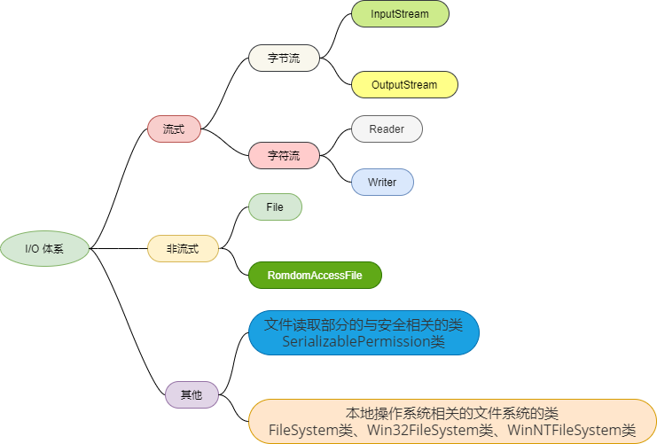
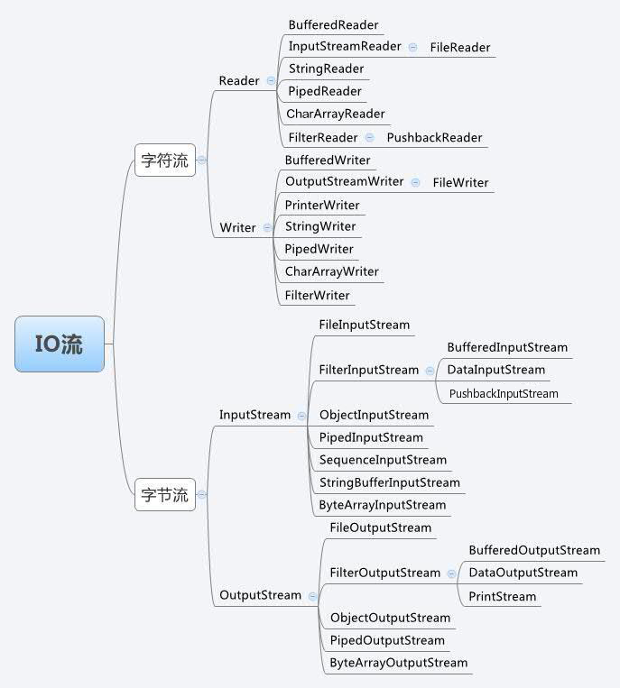
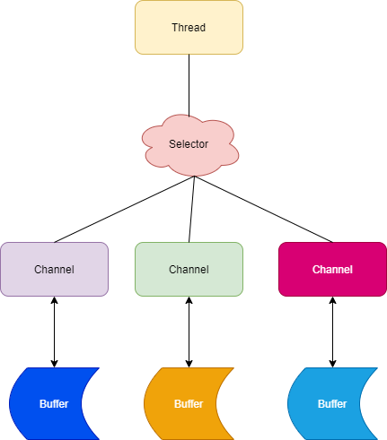

## 1 概述



在整个 Java.io 包中最重要的就是5个类和一个接口。

5个类：

- File
- OutputStream
- InputStream
- Writer
- Reader

一个接口：

- Serializable

Java I/O主要包括如下3层次：

* 流式部分——最主要部分，包**括字节流、字符流**，如：OutputStream、InputStream、Writer、Reader 等

* 非流式部分——如：File、RandomAccessFile 和 FileDescriptor 等

* 其他——文件读取部分的与安全相关的类，如：SerializablePermission ，以及与本地操作系统相关的文件系统的类，如：FileSystem 和 Win32FileSystem 和 WinNTFileSystem 


## 2 分类



### 2.1 按I/O类型来总体分类

   * Memory
     * 从/向内存数组读写数据: CharArrayReader、 CharArrayWriter、ByteArrayInputStream、ByteArrayOutputStream
     * 从/向内存字符串读写数据 :StringReader、StringWriter、StringBufferInputStream
   * Pipe 管道 实现管道的输入和输出（进程间通信）: PipedReader、PipedWriter、PipedInputStream、PipedOutputStream
   * File 文件流 对文件进行读、写操作 ：FileReader、FileWriter、FileInputStream、FileOutputStream
   * ObjectSerialization 对象输入、输出 ：ObjectInputStream、ObjectOutputStream
   * DataConversion 数据流 按基本数据类型读、写（处理的数据是Java的基本类型（如布尔型，字节，整数和浮点数））：DataInputStream、DataOutputStream
   * Printing 包含方便的打印方法 ：PrintWriter、PrintStream
   * Buffering 缓冲  在读入或写出时，对数据进行缓存，以减少I/O的次数：BufferedReader、BufferedWriter、BufferedInputStream、BufferedOutputStream
   * Filtering 滤流，在数据进行读或写时进行过滤：FilterReader、FilterWriter、FilterInputStream、FilterOutputStream过
   * Concatenation 合并输入 把多个输入流连接成一个输入流 ：SequenceInputStream 
   * Counting 计数 在读入数据时对行记数 ：LineNumberReader、LineNumberInputStream
   * Peeking Ahead 通过缓存机制，进行预读 ：PushbackReader、PushbackInputStream
   * Converting between Bytes and Characters：按照一定的编码/解码标准将字节流转换为字符流，或进行反向转换（Stream到Reader,Writer的转换类）：InputStreamReader、OutputStreamWriter

### 2.2 按数据来源（去向）分类
   * File（文件）：FileInputStream、FileOutputStream、 FileReader、FileWriter 
   * byte[]：ByteArrayInputStream、ByteArrayOutputStream 
   * Char[]：CharArrayReader、CharArrayWriter 
   * String：StringBufferInputStream、StringReader、StringWriter 
   * 网络数据流：InputStream、OutputStream、Reader、Writer 
   * 字节流：InputStream / OutputStream

## 3 常用类

### 3.1 File 

File 类可以用于表示文件和目录的信息。

```java
//读取目录
public class TestFile {
    public static void main(String args[]) {
        String dirname = "/tmp";
        File f1 = new File(dirname);
        if (f1.isDirectory()) {
            System.out.println("目录 " + dirname);
            String s[] = f1.list();
            for (int i = 0; i < s.length; i++) {
                File f = new File(dirname + "/" + s[i]);
                if (f.isDirectory()) {
                    System.out.println(s[i] + " 是一个目录");
                } else {
                    System.out.println(s[i] + " 是一个文件");
                }
            }
        } else {
            System.out.println(dirname + " 不是一个目录");
        }
    }
}
```

### 3.2 FileInputStream

该流用于从文件读取数据，它的对象可以用关键字 new 来创建。

```java
File file = new File("F:/abc.txt"); 
FileInputStream fis = new FileInputStream(file); 
```

### 3.3 FileInputStream 

用来处理以文件作为数据输出目的数据流；或者说是从内存区读数据入文件。

```java
File file = new File("F:/abc.txt"); 
FileOutputStream  fos = new FileOutputStream (file); 
```

### 3.4 缓冲输入输出流 BufferedInputStream / BufferedOutputStream  

缓冲流就是每一个数据流分配一个缓冲区，一个缓冲区就是一个临时存储数据的内存。这样可以减少访问硬盘的次数,提高传输效率。

BufferedInputStream:当向缓冲流写入数据时候，数据先写到缓冲区，待缓冲区写满后，系统一次性将数据发送给输出设备。

BufferedOutputStream :当从向缓冲流读取数据时候，系统先从缓冲区读出数据，待缓冲区为空时，系统再从输入设备读取数据到缓冲区。

```java
//将文件读入内存
FileInputStream fis = new FileInputStream("F:/abc.txt");
BufferedInputStream bis = new BufferedInputStream(fis);

//将内存写入文件
FileOutputStream fos = new FileOutputStream("F:/abc.txt");
BufferedOutputStream bos = new BufferedOutputStream  (fos);
```

### 3.5 BufferedReader

读取字符。

```java
//在控制台读取字符
public class TestReader {
    public static void main(String args[]) throws IOException {
        char c;
        // 使用 System.in 创建 BufferedReader
        BufferedReader br = new BufferedReader(new InputStreamReader(System.in));
        System.out.println("输入字符, 按下 'q' 键退出。");
        // 读取字符
        do {
            c = (char) br.read();//读取一个字符
            System.out.println(c);
        } while (c != 'q');
    }
}
```

### 3.6 ObjectOutputStream/ObjectInputStream

序列化：将一个对象转换成字节序列，方便存储和传输。

- 序列化：ObjectOutputStream.writeObject()
- 反序列化：ObjectInputStream.readObject()

不会对静态变量进行序列化，因为序列化只是保存对象的状态，静态变量属于类的状态。

```java
public class TestObjectStream {
    private static class Person implements Serializable {
        private String name;
        private int age;

        //保证属性不会被序列化
        private transient String des;

        public Person(String name, int age,String des) {
            this.name = name;
            this.age = age;
            this.des = des;
        }

        public String getName() {
            return name;
        }

        public void setName(String name) {
            this.name = name;
        }

        public int getAge() {
            return age;
        }

        public void setAge(int age) {
            this.age = age;
        }

        public String getDes() {
            return des;
        }

        public void setDes(String des) {
            this.des = des;
        }

        @Override
        public String toString() {
            return "Person{" +
                    "name='" + name + '\'' +
                    ", age=" + age +
                    ", des='" + des + '\'' +
                    '}';
        }
    }


    public static void main(String[] args) throws Exception {
        Person p1 = new Person("张三", 29,"不知道");
        String objectFile = "person.data";
        System.out.println(p1);
        
        ObjectOutputStream objectOutputStream = new ObjectOutputStream(new FileOutputStream(objectFile));
        objectOutputStream.writeObject(p1);
        objectOutputStream.close();

        ObjectInputStream objectInputStream = new ObjectInputStream(new FileInputStream(objectFile));
        Person p2 = (Person) objectInputStream.readObject();
        objectInputStream.close();
        System.out.println(p2);//Person{name='张三', age=29, des='null'}
    }
}
```

## 4 BIO、NIO、AIO

### 4.1 IO模型主要分类

- 同步(synchronous) IO和异步(asynchronous) IO
- 阻塞(blocking) IO和非阻塞(non-blocking)IO
- 同步阻塞(blocking-IO)简称BIO
- 同步非阻塞(non-blocking-IO)简称NIO
- 异步非阻塞(asynchronous-non-blocking-IO)简称AIO

### 4.2 BIO（同步阻塞I/O)

数据的读取写入必须阻塞在一个线程内等待其完成，**面向流**。

比如泡面，这种模式下，需要一直坐着，不能干其他事，等泡面泡好。

### 4.3 NIO（同步非阻塞I/O)

在 Java 1.4 中引入了 NIO 框架，对应 java.nio 包，提供了 **Channel , Selector，Buffer **等抽象。它支持面向**缓冲的**，基于通道的I/O操作方法。

比如泡面，这种模式下，不需要一直坐着，可以去看电影，但，过几秒就去看看泡面泡好了没有。

#### 4.3.1 Buffer（缓冲区）

Buffer是一个对象，它包含一些要写入或者要读出的数据。

#### 4.3.2 Channel（通道）

NIO 通过Channel（通道） 进行读写。

通道是双向的，可读也可写，而流的读写是单向的。无论读写，通道只能和Buffer交互。因为 Buffer，通道可以异步地读写。

#### 4.3.3 Selector（选择器）

选择器用于使用单个线程处理多个通道。因此，它需要较少的线程来处理这些通道。线程之间的切换对于操作系统来说是昂贵的。 因此，为了提高系统效率选择器是有用的。

#### 4.3.3 NIO 读数据和写数据方式

NIO中的所有IO都是从 Channel（通道） 开始的。

- 从通道进行数据读取 ：创建一个缓冲区，然后请求通道读取数据。
- 从通道进行数据写入 ：创建一个缓冲区，填充数据，并要求通道写入数据。



### 4.4 AIO（异步非阻塞I/O)

AIO 也就是 NIO 2，异步IO的缩写。在 Java 7 中引入了 NIO 的改进版 NIO 2,它是异步非阻塞的IO模型。异步 IO 是基于事件和回调机制实现的，也就是应用操作之后会直接返回，不会堵塞在那里，当后台处理完成，操作系统会通知相应的线程进行后续的操作。

虽然 NIO 在网络操作中，提供了非阻塞的方法，但是 NIO 的 IO 行为还是同步的。对于 NIO 来说，我们的业务线程是在 IO 操作准备好时，得到通知，接着就由这个线程自行进行 IO 操作，IO操作本身是同步的。

比如泡面，这种模式下，不需要一直坐着，也不需要过几秒就是看看，可以去看电影，给泡面安装一个闹钟，泡好了，就通知。

### 4.5 BIO、NIO、AIO适用场景

- BIO：适用于连接数目比较小且固定的架构，这种方式对服务器资源要求比较高，并发局限于应用中，JDK1.4以前的唯一选择。
- NIO：适用于连接数目多且连接比较短（轻操作）的架构，比如聊天服务器，并发局限于应用中，编程比较复杂。
- AIO：使用于连接数目多且连接比较长（重操作）的架构，比如相册服务器，充分调用 OS 参与并发操作，编程比较复杂，JDK7开始支持。