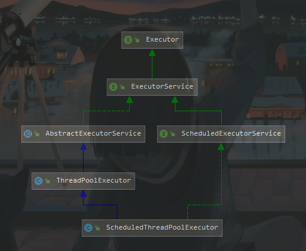
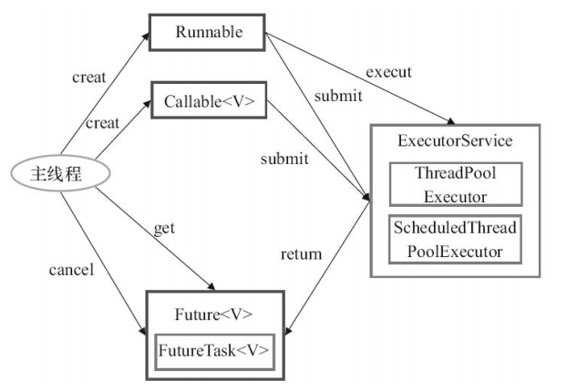
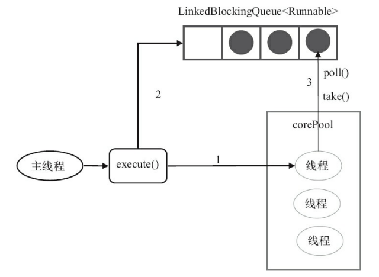
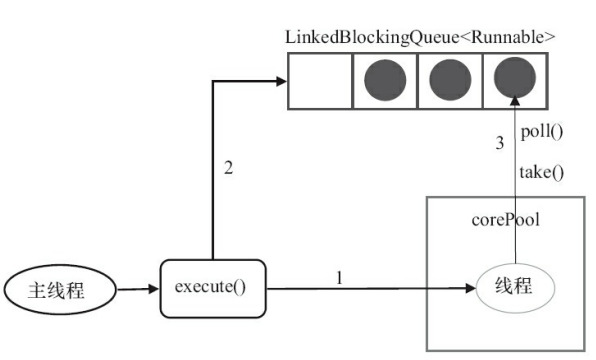
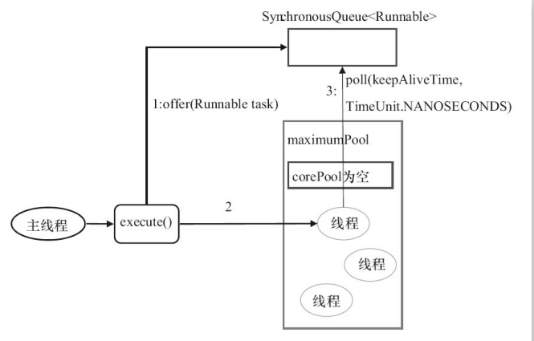
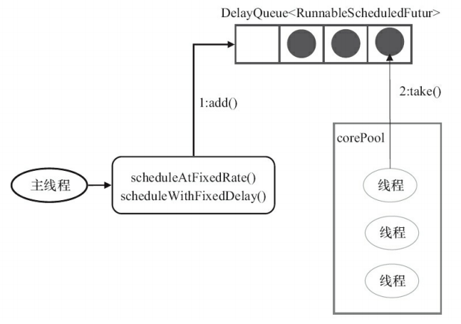
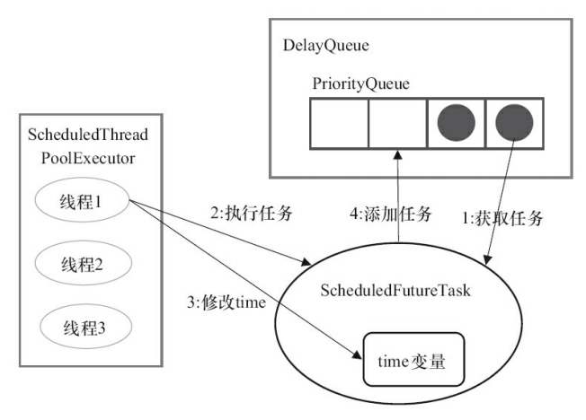

## 1 简介

在需要异步或者并发编程中，常常使用线程池，所谓线程池，就是事先创建好一堆线程，装到一个池子里面，需要用到时候取出来，这样带来了以下的好处：

* **降低资源消耗**。通过重复利用已创建的线程降低线程创建和销毁造成的消耗。 
* **提高响应速度**。当任务到达时，任务可以不需要等到线程创建就能立即执行。 
* **提高线程的可管理性**。线程是稀缺资源，如无限制地创建，不仅会消耗系统资源， 还会降低系统的稳定性，使用线程池可以进行统一分配、调优和监控。

## 2 处理流程


## 3 Executor 框架

Java 线程既是工作单元，也是执行机制，在 Java 5 之后，引入 Executor 充当执行机制，工作单元由 Runnable 和 Callable 提供。

### 3.1 结构

* 任务：需要实现 **Runnable** 或 **Callable** 接口。
* 任务的执行：
  * 执行机制核心接口 **Executor**
  * 继承 Executor 的 **ExecutorService**（ThreadPoolExecutor 和 ScheduleThreadPoolExecutor）
* 异步计算结果：
  * 接口 Future
  * 实现 Future 接口的 FutureTask 类



### 3.2 使用



1. 主线程首先创建实现 Runnable 或 Callable 接口的任务对象。
2. 把任务对象交给 ExecutorService 执行
   * ExecutorService.execute（Runnable task）
   * ExecutorService.submit（Runnable task）
   * ExecutorService.submit（Callable  task）
3. 如果执行 ExecutorService.submit（…），将返回一个实现 Future 接口的对象，由于 FutureTask 实现了 Runnable，我们也可以创建 FutureTask，然后直接交给 ExecutorService 执行。
4. 主线程可以执行 FutureTask.get() 方法来等待任务执行完成。主线程也可以执行 FutureTask.cancel（boolean mayInterruptIfRunning）来取消此任务的执行。

## 4 ThreadPoolExecutor 

ThreadPoolExecutor 是 Executor 最为核心的类，由四部分组成。

- corePool：核心线程池的大小。 

- maximumPool：最大线程池的大小。 

- BlockingQueue：用来暂时保存任务的工作队列。 

- RejectedExecutionHandler：当 ThreadPoolExecutor 已经关闭或 ThreadPoolExecutor 已经饱和时（达到了最大线程池大小且工作队列已满），execute() 方法将要调用的 Handler。 

```java
public ThreadPoolExecutor(int corePoolSize,//核心线程数量
                              int maximumPoolSize,//最大线程数
                              long keepAliveTime,//当线程数 > 核心线程数时，多余的空闲线程存活的最长时间
                              TimeUnit unit,//时间单位
                              BlockingQueue<Runnable> workQueue,//任务队列，用来储存等待执行任务的队列
                              ThreadFactory threadFactory,//线程工厂，用来创建线程，一般默认即可
                              RejectedExecutionHandler handler) {//拒绝策略，当提交的任务过多而不能及时处理时，可以定制策略来处理任务
        if (corePoolSize < 0 ||
            maximumPoolSize <= 0 ||
            maximumPoolSize < corePoolSize ||
            keepAliveTime < 0)
            throw new IllegalArgumentException();
        if (workQueue == null || threadFactory == null || handler == null)
            throw new NullPointerException();
        this.acc = System.getSecurityManager() == null ?
                null :
                AccessController.getContext();
        this.corePoolSize = corePoolSize;
        this.maximumPoolSize = maximumPoolSize;
        this.workQueue = workQueue;
        this.keepAliveTime = unit.toNanos(keepAliveTime);
        this.threadFactory = threadFactory;
        this.handler = handler;
    }
```

- corePoolSize（线程池的核心线程数基本大小）：当提交一个任务到线程池时，线程池会创建一个线程来执行任务，即使其他空闲的基本线程能够执行新任务也会创建线程，等到需要执行的任务数大于线程池基本大小时就不再创建。如果调用了线程池的 prestartAllCoreThreads() 方法， 线程池会提前创建并启动所有基本线程。 

* runnableTaskQueue（任务队列）：用于保存等待执行的任务的阻塞队列。

  * ArrayBlockingQueue：基于数组结构的**有界阻塞队列**，此队列按FIFO（先进先出）原则对元素进行排序。 

  * LinkedBlockingQueue：基于链表结构的**阻塞队列**，此队列按FIFO排序元素，吞吐量通常要高于ArrayBlockingQueue，Executors.newFixedThreadPool() 使用了这个队列。

  * SynchronousQueue：**不存储元素的阻塞队列**。每个插入操作必须等到另一个线程调用移除操作，否则插入操作一直处于阻塞状态，吞吐量通常要高于Linked-BlockingQueue，Executors.newCachedThreadPool 使用了这个队列。 

  * PriorityBlockingQueue：一个具有优先级的无限阻塞队列。
  
* maximumPoolSize（线程池最大数量）：线程池允许创建的最大线程数。如果队列满了，并且已创建的线程数小于最大线程数，则线程池会再创建新的线程执行任务。值得注意的是，如果使用了无界的任务队列这个参数就没什么效果。 

* ThreadFactory：用于设置创建线程的工厂，可以通过线程工厂给每个创建出来的线程设置更有意义的名字。

* RejectedExecutionHandler（饱和策略）：当队列和线程池都满了，说明线程池处于饱和状态，必须采取策略处理提交的新任务。默认情况下是 AbortPolicy，在JDK 1.5中Java线程池框架提供了以下4种策略,也可以根据应用场景需要来实现 RejectedExecutionHandler 接口自定义策略。如记录日志或持久化存储不能处理的任务。 。 

  * AbortPolicy：直接抛出异常。 

  * CallerRunsPolicy：只用调用者所在线程来运行任务。 

  * DiscardOldestPolicy：丢弃队列里最近的一个任务，并执行当前任务。 

  * DiscardPolicy：不处理，丢弃掉。 

* keepAliveTime（线程活动保持时间）：线程池的工作线程空闲后，保持存活的时间。如果任务很多，并且每个任务执行的时间比较短，可以调大时间，提高线程的利用率。 

* TimeUnit（线程活动保持时间的单位）：可选的单位有天（DAYS）、小时（HOURS）、分钟 （MINUTES）、毫秒（MILLISECONDS）、微秒（MICROSECONDS，千分之一毫秒）和纳秒（NANOSECONDS，千分之一微秒）。

## 5 常用的线程池

### 5.1 FixedThreadPool

**可重用固定线程数**的线程池。

```java
//Executors.java
public static ExecutorService newFixedThreadPool(int nThreads) {
        return new ThreadPoolExecutor(nThreads, nThreads,
                                      0L, TimeUnit.MILLISECONDS,
                                      new LinkedBlockingQueue<Runnable>());
    }
```

FixedThreadPool 的 corePoolSize 和 maximumPoolSize 都被设置为 nThreads。

**execute() 执行过程**：



* 当前运行的线程数少于 corePoolSize，则创建新线程来执行任务。 
* 当前运行的线程数等于corePoolSize，将任务加入 LinkedBlockingQueue。
* 线程执行完 1中的任务后，会在循环中反复从 LinkedBlockingQueue 获取任务来执行

#### 5.1.1 注意

FixedThreadPool 使用**无界队列** LinkedBlockingQueue（队列的容量为 Intger.MAX_VALUE）作为线程池的工作队列会对线程池带来如下影响 ：

1. 当线程池中的线程数达到 corePoolSize 后，新任务将在无界队列中等待，因此线程池中的线程数不会超过 corePoolSize；
2. 由于使用无界队列时 maximumPoolSize 将是一个无效参数，因为不可能存在任务队列满的情况。所以，通过创建  FixedThreadPool 的源码可以看出创建的  FixedThreadPool 的  corePoolSize 和 maximumPoolSize被设置为同一个值。
3. 由于 1 和 2，使用无界队列时 keepAliveTime 将是一个无效参数；
4. 运行中的 FixedThreadPool（未执行 shutdown() 或  shutdownNow()）不会拒绝任务，在任务比较多的时候会导致 **OOM**（内存溢出）。

### 5.2 SingleThreadExecutor

只有一个线程的线程池。

```java
public static ExecutorService newSingleThreadExecutor(ThreadFactory threadFactory) {
        return new FinalizableDelegatedExecutorService
            (new ThreadPoolExecutor(1, 1,
                                    0L, TimeUnit.MILLISECONDS,
                                    new LinkedBlockingQueue<Runnable>(),
                                    threadFactory));
    }
```

corePoolSize  和 maximumPoolSize 都被设置为 1。

**execute() 执行过程**：



* 如果当前运行的线程数少于 corePoolSize，则创建一个新的线程执行任务；

* 当前线程池中有一个运行的线程后，将任务加入 LinkedBlockingQueue;

* 线程执行完当前的任务后，会在循环中反复从 LinkedBlockingQueue 中获取任务来执行；

#### 5.2.1 注意

使用无界队列 LinkedBlockingQueue 作为线程池的工作队列（队列的容量为 Intger.MAX_VALUE）。SingleThreadExecutor 使用无界队列作为线程池的工作队列会对线程池带来的影响与 FixedThreadPool 相同，可能会导致 OOM，

### 5.3 CachedThreadPool 

会**根据需要创建新线程**的线程池。

```java
public static ExecutorService newCachedThreadPool(ThreadFactory threadFactory) {
       return new ThreadPoolExecutor(0, Integer.MAX_VALUE,
                                      60L, TimeUnit.SECONDS,
                                      new SynchronousQueue<Runnable>(),
                                      threadFactory);
 }
```

corePoolSize 被设置为 0，即 corePool 为空；maximumPoolSize被设置为 Integer.MAX_VALUE，即 maximumPool 是无界的。 keepAliveTime设置为 60L，意味着 CachedThreadPool 中的空闲线程等待新任务的最长时间为60秒，空闲线程超过60秒后将会被终止。

**execute() 执行过程**：



1. 首先执行 SynchronousQueue.offer(Runnable task) 提交任务到任务队列。如果当前 maximumPool 中有闲线程正在执行 SynchronousQueue.poll(keepAliveTime,TimeUnit.NANOSECONDS)，那么主线程执行 offer 操作与空闲线程执行的 poll 操作配对成功，主线程把任务交给空闲线程执行，execute() 方法执行完成，否则执行下面的步骤 2；
2. 当初始 maximumPool 为空，或者 maximumPool 中没有空闲线程时，将没有线程执行 SynchronousQueue.poll(keepAliveTime,TimeUnit.NANOSECONDS)。这种情况下，步骤 1 将失败，此时 CachedThreadPool 会创建新线程执行任务，execute 方法执行完成；
3. 在步骤 2 中新创建的线程将任务执行完后，会执行 SynchronousQueue.poll（keepAliveTime，TimeUnit.NANOSECONDS）。这个poll操作会让空闲线程最多在SynchronousQueue中等待60秒钟。如果60 秒钟内主线程提交了一个新任务（主线程执行步骤1）），那么这个空闲线程将执行主线程提交的新任务；否则，这个空闲线程将终止。由于空闲60秒的空闲线程会被终止，因此长时间保持空闲的 CachedThreadPool不会使用任何资源。 

#### 5.3.1 注意

允许创建的非核心线程数量为 Integer.MAX_VALUE ，可能会创建大量线程，从而导致 OOM。

### 5.4 ScheduledThreadPoolExecutor

继承自ThreadPoolExecutor。它主要用来在给定的**延迟**之后运行任务，或**定期**执行任务。



ScheduledThreadPoolExecutor 的执行主要分为两大部分：

1. 当调用 ScheduledThreadPoolExecutor 的 scheduleAtFixedRate() 方法或者 scheduleWithFixedDelay() 方法时，会向 ScheduledThreadPoolExecutor 的 DelayQueue 添加一个实现了 RunnableScheduledFuture 接口的 ScheduledFutureTask 。
2. 线程池中的线程从 DelayQueue 中获取 ScheduledFutureTask，然后执行任务。

ScheduledThreadPoolExecutor 为了实现周期性的执行任务，对 ThreadPoolExecutor 做了如下修改：

- 使用 **DelayQueue** 作为任务队列；
- 获取任务的方不同；
- 执行周期任务后，增加了额外的处理；

#### 5.4.1 定期执行任务



1. 线程 1 从 DelayQueue 中获取已到期的 ScheduledFutureTask（DelayQueue.take()）。到期任务是指ScheduledFutureTask 的 time 大于等于当前时间。 

2. 线程1执行这个 ScheduledFutureTask。 

3. 线程1修改 ScheduledFutureTask 的 time 变量为下次将要被执行的时间。 

4. 线程1把这个修改 time 之后的 ScheduledFutureTask 放回 DelayQueue 中（DelayQueue.add()）。