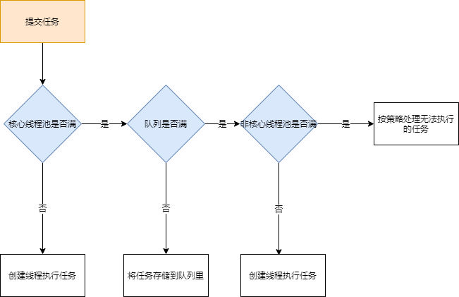

## 1 简介

在需要异步或者并发编程中，常常使用线程池，所谓线程池，就是事先创建好一堆线程，装到一个池子里面，需要用到时候取出来，这样带来了以下的好处：

* **降低资源消耗**。通过重复利用已创建的线程降低线程创建和销毁造成的消耗。 
* **提高响应速度**。当任务到达时，任务可以不需要等到线程创建就能立即执行。 
* **提高线程的可管理性**。线程是稀缺资源，如果无限制地创建，不仅会消耗系统资源， 还会降低系统的稳定性，使用线程池可以进行统一分配、调优和监控

## 2 处理流程

