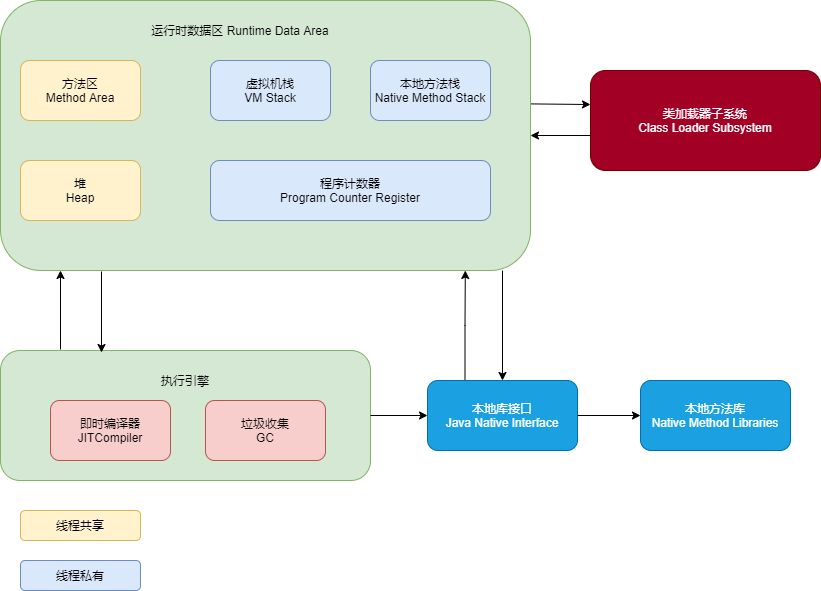
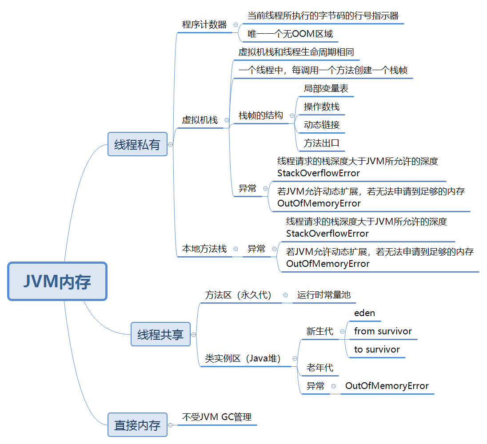
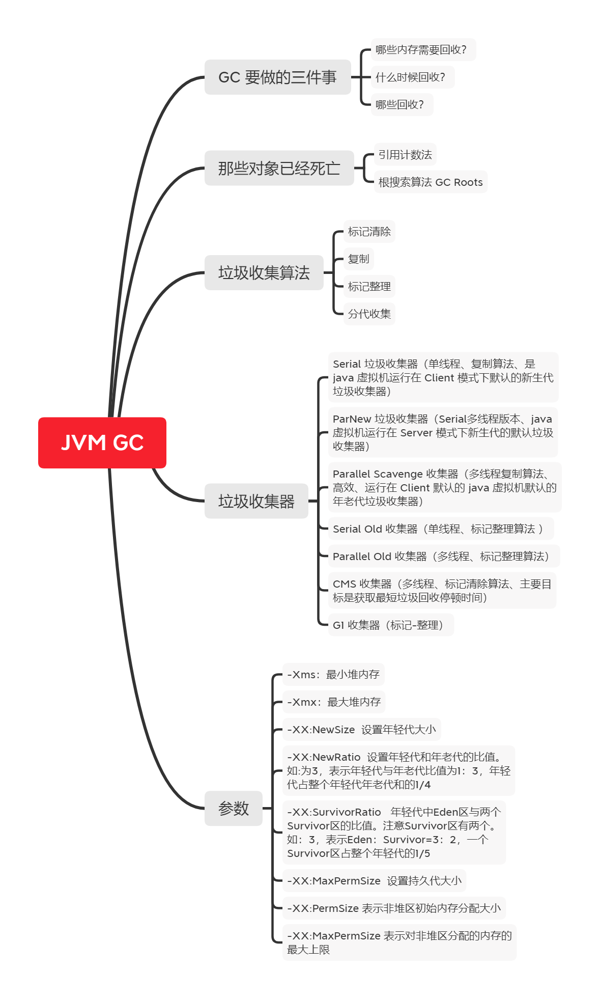

####  1 访问修饰符public、private、protected、以及不写（默认）时的区别？

| 修饰符    | 当前类 | 同 包 | 子 类 | 其他包 |
| --------- | ------ | ----- | ----- | ------ |
| public    | √      | √     | √     | √      |
| protected | √      | √     | √     | ×      |
| default   | √      | √     | ×     | ×      |
| private   | √      | ×     | ×     | ×      |

#### 2 String 是最基本的数据类型吗？

不是，是**引用类型**，Java 中的基本数据类型只有8个：byte、short、int、long、float、double、char、boolean；

#### 3 float f=3.4;是否正确？

不正确，3.4 是双精度数 ，将双精度型（double）赋值给浮点型（float）属于下转型会造成精度损失，float f =(float)3.4，float f =3.4F;

#### 4 short s1 = 1; s1 = s1 + 1;有错吗?short s1 = 1; s1 += 1;有错吗？

short s1 = 1; s1 = s1 + 1：1是int类型， s1+1 结果也是 int  型，需要强制转换类型才能赋值给short型。

short s1 = 1; s1 += 1：正确，会隐含的强制类型转换 s1 = (short)(s1 + 1)。

#### 5 int 和 Integer 有什么区别？

* int 是基本数据类型

* Integer 是 int 是**包装类**，从 Java 5 开始引入了**自动装箱/拆箱**机制，每个基本类型都对应一个包装类。

 原始类型：boolean，char，byte，short，int，long，float，double 

 包装类型：Boolean，Character，Byte，Short，Integer，Long，Float，Double

```java
Integer x = 2;     // 自动装箱  Integer.valueOf(2)
int y = x;         // 自动拆箱  X.intValue()
```

#### 6 new Integer(120) 与 Integer.valueOf(120) 有何区别？

- new Integer(123) 每次都会新建一个对象；
- Integer.valueOf(123) 会使用缓存池中的对象，多次调用会取得同一个对象的引用。

```java
//valueOf 会使用缓存池
public static Integer valueOf(int i) {
    if (i >= IntegerCache.low && i <= IntegerCache.high)
        return IntegerCache.cache[i + (-IntegerCache.low)];
    return new Integer(i);
}


static final int low = -128;
static final int high;
static final Integer cache[];

//整型字面量的值在-128到127之间，不会 new 对象,而是直接引用常量池中的Integer对象
static {
    // high value may be configured by property
    int h = 127;
    String integerCacheHighPropValue =
        sun.misc.VM.getSavedProperty("java.lang.Integer.IntegerCache.high");
    if (integerCacheHighPropValue != null) {
        try {
            int i = parseInt(integerCacheHighPropValue);
            i = Math.max(i, 127);
            // Maximum array size is Integer.MAX_VALUE
            h = Math.min(i, Integer.MAX_VALUE - (-low) -1);
        } catch( NumberFormatException nfe) {
            // If the property cannot be parsed into an int, ignore it.
        }
    }
    high = h;

    cache = new Integer[(high - low) + 1];
    int j = low;
    for(int k = 0; k < cache.length; k++)
        cache[k] = new Integer(j++);

    // range [-128, 127] must be interned (JLS7 5.1.7)
    assert IntegerCache.high >= 127;
}

//例子：
Integer f1 = 100; 
Integer f2 = 100; 
Integer f3 = 150;
Integer f4 = 150;

System.out.println(f1 == f2);//true
System.out.println(f3 == f4);//false
```

#### 7 &和&&的区别

* &
  * 按位与
  * 逻辑与（没有短路功能）
* &&
  * 逻辑与（具有短路功能）

#### 8 Math.round(11.5) 等于多少？Math.round(-11.5)等于多少？

四舍五入。

Math.round(11.5) => 12 

Math.round(-11.5) => -11

#### 9 switch 是否能作用在 byte 上，是否能作用在 long 上，是否能作用在String上？

switch 支持 int 和枚举类型，可以用 char,byte,short,int 类型，**jdk7 中支持 string 类型**，但是不支持 long 类型Java。

#### 10 一个".java"源文件中是否可以包含多个类（不是内部类）？有什么限制？

可以，但一个源文件中最多只能有一个公开类（public class）而且文件名必须和公开类的类名完全保持一致。

#### 11 用最有效率的方法计算2乘以8

 2 << 3

#### 12 数组有没有 length() 方法？String 有没有 length() 方法？

数组没有 length()，只有 length 属性。

String 有 length() 方法。

#### 13 在 Java中，如何跳出当前的多重嵌套循

使用标号。

```java
ok:
for(int i = 0;i < 10;i++){
     for(int j = 0;j < 10;j++){
     system.out.println("i="+i+",j="+j);
     if(j==5) break ok;
   }
}
```

#### 14 构造器（constructor）是否可被重写（override）

不能，但是能被重载。

#### 15 两个对象值相同 x.equals(y) == true，但却可有不同的 hashcode，对不对？

不对，如果两个对象 x和 y 满足 x.equals(y) == true，它们的哈希码（hash code）应当相同。

#### 16 是否可以继承 String 类？

String 类是 final 类，不可被继承。

#### 17 当一个对象被当作参数传递到一个方法后，此方法可改变这个对象的属性，并可返回变化后的结果，那么这里到底是值传递还是引用传递？

值传递，Java **没有引用传递**，看似引用传递，其实传递的是地址的值。

#### 18 String 和 StringBuilder、StringBuffer的区别？

* String ：只读字符串，内容是不能被改变的。
* StringBuilder：字符串对象可以直接进行修改，Java 5 引入，线程不安全。
* StringBuffer：字符串对象可以直接进行修改，方法都被 synchronized 修饰，**线程安全**。

#### 19 重载（Overload）和重写（Override）的区别，重载的方法能否根据返回类型进行区分？

* 重载（Overload）：在一个类中，方法名字相同，而参数不同。
* 重写（Override）：子类对父类的方法进行重新编写， 返回值和形参都不能改变。

返回值类型作为函数运行之后的一个状态，他是保持方法的调用者与被调用者进行通信的关键，并不能作为某个方法的标识，所以通过返回类型并不能区分重载的方法，应该根据所要区分的方法的方法名是否相同并且方法中所带的参数去区分。

#### 20 抽象类（abstract class）和接口（interface）有什么异同？

* 抽象类和接口都**不能够实例化**，但可以定义抽象类和接口类型的引用。
* 一个类如果继承了某个抽象类或者实现了某个接口都需要对其中的抽象方法全部进行实现，否则该类仍然需要被声明为抽象类。
* 接口比抽象类更加抽象，因为抽象类中可以定义构造器，可以有抽象方法和具体方法，而接口中不能定义构造器而且其中的方法全部都是抽象方法。
* 抽象类中的成员可以是 private、默认、protected、public 的，而接口中的成员全都是 public 的。
* 抽象类中可以定义成员变量，而接口中定义的成员变量实际上都是常量。
* 有抽象方法的类必须被声明为抽象类，而抽象类未必要有抽象方法。

#### 21 char 型变量中能不能存贮一个中文汉字，为什么？

**可以**，Java 中使用编码是 Unicode，一个 char 类型占2个字节，一个中文占两个字节。

#### 22 静态嵌套类(Static Nested Class)和内部类（Inner Class）的不同？

* 静态嵌套类：可以**不依赖**于外部类实例被实例化。
* 内部类：需要外部类实例化后才能被实例化。

```java
//下面的代码哪些地方会产生编译错误？
class Outer {

    class Inner {}

    public static void foo() { 
        new Inner(); //错误： new Outer().new Inner();11
    }

    public void bar() { 
        new Inner(); 
    }

    public static void main(String[] args) {
        new Inner(); //错误： new Outer().new Inner();
    }
}
```

#### 23 抽象的（abstract）方法是否可同时是静态的（static）,是否可同时是本地方法（native），是否可同时被 synchronized 修饰？

不能。

#### 24 静态变量和实例变量的区别？

静态变量：被 static 修饰符修饰的变量，也称为类变量，它属于类，可以通过 **类名.静态变量** 调用。

实例变量：实例变量依赖于某一实例，，可以通过 **实例.变量** 调用。

#### 25 一个类中静态（static）方法是否可以调用非静态（non-static）方法？

不可以，静态方法只能访问静态成员，因为非静态方法的调用要先创建对象，在调用静态方法时可能对象并没有被初始化。

#### 26 如何实现对象克隆

* 浅复制：实现Cloneable接口并重写Object类中的clone()方法；
* 深复制：实现 Serializable 接口，通过对象的序列化和反序列化实现克隆，可以实现真正的深度克隆，代码如下。

```java
public class MyUtils {

    private MyUtils() {
        throw new AssertionError();
    }

    @SuppressWarnings("unchecked")
    public static <T extends Serializable> T clone(T obj) throws Exception {
        ByteArrayOutputStream bout = new ByteArrayOutputStream();
        ObjectOutputStream oos = new ObjectOutputStream(bout);
        oos.writeObject(obj);

        ByteArrayInputStream bin = new ByteArrayInputStream(bout.toByteArray());
        ObjectInputStream ois = new ObjectInputStream(bin);
        return (T) ois.readObject();
    }
}
```

#### 27 String s = new String("xyz");创建了几个字符串对象？

两个对象，一个是静态区的 "xyz"，一个是用 new 创建在堆上的对象。

#### 28 接口是否可继承（extends）接口？抽象类是否可实现（implements）接口？抽象类是否可继承具体类（concrete class）？

可以

#### 29 断点续传

断点续传就是在上一次下载断开的位置开始继续下载。 HTTP 协议中， 可以在请求报文头中加入 Range 段， 来表示客户机希望从何处继续下载。  HTTP/1.1 开始就支持了（这也是分快传输的实现）。 一般断点下载时才用到 **Range 和 Content-Range** 实体头，断线续传的 HTTP 状态码是 206。

使用 Java 可以类似以下：

* setRequestProperty("Range","bytes=startIndex-endIndex")，告诉服务器，数据从哪里开始，到哪里结束。
* 客户端使用 RandomAccessFile 的 seek() 在任意位置写入操作。

#### 30 Java 中的final关键字有哪些用法？

* 修饰类：该类不能被继承；
* 修饰方法：方法不能被重写；
* 修饰变量：变量只能一次赋值以后值不能被修改（常量）；

#### 31 try{}里有一个return语句，那么紧跟在这个try后的finally{}里的代码会不会被执行，什么时候被执行，在return前还是后?

会执行，在方法返回调用者前执行。

#### 32 阐述final、finally、finalize的区别？

final：

* 修饰类：该类不能被继承；
* 修饰方法：方法不能被重写；
* 修饰变量：变量只能一次赋值以后值不能被修改（常量）；

finally：

* 放在try…catch…的后面构造总是执行代码块

finalize：

* Object 类中的方法，重写 finalize() 方法可以进行一些释放资源操作。

#### 33 Collection和Collections的区别？

* Collection 是一个接口，它是Set、List等容器的父接口；

* Collections 是个一个工具类，提供一系列的静态方法来辅助容器操作；

#### 34 Thread 类的 sleep() 方法和对象的 wait() 方法都可以让线程暂停执行，它们有什么区别?

* sleep()：会持有锁；
* wait()：会释放锁，需要调用对象的 notify() 或 notifyAll() 方法；

#### 35 线程的 sleep() 方法和 yield() 方法有什么区别？

* sleep()：线程转入阻塞（blocked）状态。
* yield()：线程转入就绪（ready）状态，暂停当前正在执行的线程对象，并执行其他线程，但是无法保证达到让出目的，可能被立马有被调度。

#### 36 实现多线程程序有几种实现方式？

* Runnable
* Thread
* Callable

#### 37 Java 语言有什么特点？

* 简单性
* 面向对象
* 分布性
* 编译和解释性
* 稳健性
* 安全性
* 可移植性
* 高性能
* 支持多线程
* 动态性

#### 38 JVM、JDK、JRE 区别？

* JDK ：是 Java 开发工具包，是 Sun公司针对 Java 程序员的产品，JDK 中**包含 JRE**；

* JRE： 是运行基于 Java 语言编写的程序所不可缺少的**运行环境**，JRE 中包含了 JVM。

* JVM：Java 虚拟机，是实现  Java 跨平台，“一次编译，随处运行”的核心，运行 Java **字节码**，Java 程序会被编译成 .class 文件

> Java 程序运行经过三个步骤：
>
> Java 文件（源代码）-----JDK 中 javac 的编译-----> .class 文件（JVM 可理解的 Java 文件） -----JVM-----> 机器可执行的二进制机器码

#### 39 Oracle JDK 和 OpenJDK 的对比？

* Oracle JDK 版本将每三年发布一次，而 OpenJDK 版本每三个月发布一次；
* OpenJDK 是一个参考模型并且是**完全开源**的，而 Oracle JDK 是 OpenJDK 的一个实现，并不是完全开源的；

* Oracle JDK 比 OpenJDK 更稳定。OpenJDK 和 Oracle JDK 的代码几乎相同，但 Oracle JDK有更多的类和一些错误修复。因此，如果您想开发企业/商业软件，我建议您选择 Oracle JDK，因为它经过了彻底的测试和稳定。某些情况下，有些人提到在使用 OpenJDK 可能会遇到了许多应用程序崩溃的问题，但是，只需切换到 Oracle JDK 就可以解决问题；

* 在响应性和 JVM 性能方面，Oracle JDK 与 OpenJDK 相比提供了更好的性能；

* Oracle JDK 不会为即将发布的版本提供长期支持，用户每次都必须通过更新到最新版本获得支持来获取最新版本；

* Oracle JDK 根据二进制代码许可协议获得许可，而 OpenJDK 根据 GPL v2 许可获得许可。


#### 40 Java 和 C++ 的区别?

1. Java 源码先编译，成为中间码，中间码再被解释器解释成机器码。对于Java而言，中间码就是字节码(.class)，而解释器在JVM中内置了。
2. C++ 源码一次编译，直接在编译的过程中链接了，形成了**机器码**。
3. C++ 比 Java执行速度快，但是 Java 可以利用 JVM 跨平台。
4. Java 是纯面向对象的语言，所有代码（包括函数、变量）都必须在类中定义。而 C++ 中还有面向过程的东西，比如是全局变量和全局函数。
5. C++ 中有指针，Java 中没有，但是有引用。
6. C++ 支持多继承，Java 中类都是单继承的。但是继承都有传递性，同时 Java 中的接口是多继承，类对接口的实现也是多实现。
7. C++中，开发需要自己去管理内存， Java 中 JVM 有自己的GC机制，虽然有自己的 GC 机制，但是也会出现OOM 和内存泄漏的问题。C++ 中有析构函数，Java 中 Object 的 finalize 方法。
8. C++ 运算符可以重载， Java 中不可以。同时 C++ 中支持强制自动转型，Java 中不行，会出现ClassCastException（类型不匹配）。

#### 41 import java 和 javax 有什么区别？

刚开始的时候  Java API 所必需的包是 java 开头的包，javax 当时只是扩展 API 包来使用。然而随着时间的推移，javax 逐渐地扩展成为 Java API 的组成部分。但是，将扩展从 javax 包移动到 java 包确实太麻烦了，最终会破坏一堆现有的代码。因此，最终决定 javax 包将成为标准API的一部分。所以，实际上 java 和 javax **没有区别**，这都是一个名字。

#### 42 Java 语言是编译与解释并存？

编译：所有的 Java 代码都是要编译的，.java 不经过编译没啥卵用。

解释：java 代码编译后生成字节码（ .class 文件 ）不能直接运行，它是解释运行在 JVM 上的，所以它是解释运行的。

#### 43 字符型常量和字符串常量的区别？

* 形式上: 字符常量是单引号（‘ ’）引起的一个字符; 字符串常量是双引号（" "）引起的 0 个或若干个字符.

* 含义上: 字符常量相当于一个整型值( ASCII 值),可以参加表达式运算; 字符串常量代表一个地址值(该字符串在内存中存放位置).

* 占内存大小：字符常量只占 2 个字节; 字符串常量占若干个字节 (**注意： char 在 Java 中占两个字节**)。

#### 44 Java 基本类型占用内存大小？

- byte/8 bit
- char/16 bit
- short/16 bit
- int/32 bit
- float/32 bit
- long/64 bit
- double/64 bit
- boolean/~

#### 45 Java 注释

```java
// 单行注释
/* 多行注释 */
```

#### 46 自增自减运算符

++i，先加 1 后赋值。

i++，先赋值后加 1。

符号在先，先加/减，符号在后，后加/减。

#### 47 Java 标识符和关键字

**标识符**：是为方法、变量或其他用户定义项所定义的名称。标识符可以有一个或多个字符。在 Java 语言中，标识符的构成规则如下：

- 标识符由数字（0~9）和字母（A~Z 和 a~z）、美元符号（$）、下划线（_）以及 Unicode 字符集中符号大于 0xC0 的所有符号组合构成（各符号之间没有空格）。
- 标识符的第一个符号为字母、下划线和美元符号，后面可以是任何字母、数字、美元符号或下划线。

**关键字**（或者保留字）：是对编译器有特殊意义的固定单词，不能在程序中做其他目的使用。关键字具有专门的意义和用途，和自定义的标识符不同，不能当作一般的标识符来使用。

Java 语言目前定义了 51 个关键字，这些关键字不能作为变量名、类名和方法名来使用。

1. 数据类型：boolean、int、long、short、byte、float、double、char、class、interface。
2. 流程控制：if、else、do、while、for、switch、case、default、break、continue、return、try、catch、finally。
3. 修饰符：public、protected、private、final、void、static、strict、abstract、transient、synchronized、volatile、native。
4. 动作：package、import、throw、throws、extends、implements、this、supper、instanceof、new。
5. 保留字：true、false、null、goto、const。

#### 48 continue、break、和 return 的区别？

* continue ：跳出当前循环，继续下一次循环。
* break ：跳出整个循体，继续执行循环下面的语句。
* return:
  * return：直接使用 return 结束方法执行，用于没有返回值函数的方法
  * return value ：return 一个特定值，用于有返回值函数的方法

#### 49 == 和 equals 区别？

* **==**：判断两个对象的**地址**是否相等（基本数据类型比较的是值，引用数据类型比较的是内存地址）
* **equals()**：判断两个对象内容是否相等，是 Object 里面的方法。

```java
public boolean equals(Object obj) {
      return (this == obj);
}
//类没有覆盖 equals()方法，通过 equals() 比较该类的两个对象时，等价于“==”。
//类覆盖 equals() 方法，来判断两个对象的内容相等。
```

#### 50 hashCode()与 equals()

hashCode()：作用是**获取哈希码**，也称为散列码，实际上是返回一个 int 整数。这个**哈希码的作用**是确定该对象在哈希表中的索引位置。

```java
散列表的本质是通过数组实现的。当我们要获取散列表中的某个“值”时，实际上是要获取数组中的某个位置的元素。而数组的位置，就是通过“键”来获取的；更进一步说，数组的位置，是通过“键”对应的散列码计算得到的。
```

重写  equals 时必须重写 hashCode 方法：

如果两个对象相等，则 hashcode 一定相同的。两个对象相等,对两个对象分别调用 equals 方法都返回 true。但是，两个对象有相同的 hashcode 值，它们也不一定是相等的 。因此，equals 方法被覆盖过，则 hashCode() 也必须被覆盖。

#### 51 Java 只有值传递

* 值传递：在调用函数时，将实际参数值复制一份传递到被调用函数中，在被调函数中修改参数值不会影响原实参值。
* 引用传递：在调用函数时，将实际参数的地址直接传递到被调用的函数中，在被调函数中修改参数值会影响原实参值。

Java 程序设计语言总是采用**按值调用**，方法得到的是所有参数值的一个拷贝，也就是说，方法不能修改传递给它的任何参数变量的内容。

#### 52 在 Java 中定义一个不做事且没有参数的构造方法的作用？

Java 程序在执行子类的构造方法之前，如果没有用 `super()`来调用父类特定的构造方法，则会调用父类中“没有参数的构造方法”。因此，如果父类中只定义了有参数的构造方法，而在子类的构造方法中又没有用 `super()`来调用父类中特定的构造方法，则编译时将发生错误，因为 Java 程序在父类中找不到没有参数的构造方法可供执行。解决办法是在父类里加上一个不做事且没有参数的构造方法。

#### 53 对象的相等与指向他们的引用相等,两者有什么不同?

* 对象的相等：比内存中存放的内容是否相等
* 引用相等：内存地址是否相等

#### 54 面向对象三大特征

* 封装：隐藏对象的属性和实现细节，仅对外公开接口，控制在程序中属性的读和修改的访问级别，将抽象得到的数据和行为（或功能）相结合，**形成一个有机的整体**，也就是将数据与操作数据的源代码进行有机的结合，形成“类”，其中数据和函数都是类的成员。
* 继承：允许创建分等级层次的类。**继承就是子类继承父类的特征和行为**，使得子类对象（实例）具有父类的实例域和方法，或子类从父类继承方法，使得子类具有父类相同的行为。
* 多态：同一个行为具有多个不同表现形式或形态的能力。是指一个类实例（对象）的相同方法在不同情形有不同表现形式。多态机制使具有不同内部结构的对象可以共享相同的外部接口。这意味着，虽然针对不同对象的具体操作不同，但通过一个公共的类，它们（那些操作）可以通过相同的方式予以调用。

#### 55 在一个静态方法内调用一个非静态成员为什么是非法的？

由于静态方法可以不通过对象进行调用，因此在静态方法里，不能调用其他非静态变量，也不可以访问非静态变量成员。

#### 56 Object 类常见的方法？

```java
//native方法，用于返回当前运行时对象的Class对象，使用了final关键字修饰，故不允许子类重写。
public final native Class<?> getClass()
    
//native方法，用于返回对象的哈希码，主要使用在哈希表中，比如JDK中的HashMap。
public native int hashCode() 
    
//用于比较2个对象的内存地址是否相等，String类对该方法进行了重写用户比较字符串的值是否相等。    
public boolean equals(Object obj)

//naitive方法，用于创建并返回当前对象的一份拷贝。一般情况下，对于任何对象 x，表达式 x.clone() != x 为true，x.clone().getClass() == x.getClass() 为true。Object本身没有实现Cloneable接口，所以不重写clone方法并且进行调用的话会发生CloneNotSupportedException异常。
protected native Object clone() throws CloneNotSupportedException

//返回类的名字@实例的哈希码的16进制的字符串。建议Object所有的子类都重写这个方法。    
public String toString()

//native方法，并且不能重写。唤醒一个在此对象监视器上等待的线程(监视器相当于就是锁的概念)。如果有多个线程在等待只会任意唤醒一个。    
public final native void notify()

//native方法，并且不能重写。跟notify一样，唯一的区别就是会唤醒在此对象监视器上等待的所有线程，而不是一个线程。    
public final native void notifyAll()

//native方法，并且不能重写。暂停线程的执行。注意：sleep方法没有释放锁，而wait方法释放了锁 。timeout是等待时间。    
public final native void wait(long timeout) throws InterruptedException

//多了nanos参数，这个参数表示额外时间（以毫微秒为单位，范围是 0-999999）。 所以超时的时间还需要加上nanos毫秒。    
public final void wait(long timeout, int nanos) throws InterruptedException

//跟之前的2个wait方法一样，只不过该方法一直等待，没有超时时间这个概念    
public final void wait() throws InterruptedException

//实例被垃圾回收器回收的时候触发的操作    
protected void finalize() throws Throwable { }
```

#### 57 Java 序列化中如果有些字段不想进行序列化，如何做？

使用 transient 。

```java
public class Person {
    private String name;
    private Integer age;
    private transient Integer weigth;
    ...
}
```

#### 59  BIO、NIO、AIO 区别？

##### BIO 同步阻塞IO

基于**流模型**实现的，交互的方式是同步、阻塞方式，也就是说在读入输入流或者输出流时，在读写动作完成之前，线程会一直阻塞在那里，它们之间的调用时可靠的线性顺序。

优点：代码比较简单、直观

缺点：IO 的效率和扩展性很低，容易成为应用性能瓶颈

#####  NIO 同步非阻塞IO

 Java 1.4 引入的 java.nio 包，提供了 Channel、Selector、Buffer 等新的抽象，可以构建**多路复用**的、同步非阻塞 IO 程序，同时提供了更接近操作系统底层高性能的数据操作方式。

##### AIO 异步非阻塞IO

是 Java 1.7 之后引入的包，是 NIO 的升级版本，提供了异步非堵塞的 IO 操作方式，所以称为AIO（Asynchronous IO），异步 IO 是基于事件和回调机制实现的，也就是应用操作之后会直接返回，不会堵塞在那里，当后台处理完成，操作系统会通知相应的线程进行后续的操作。

#### 60 重载和重写的区别？

重载：发生在同一个类中，方法名必须相同，参数类型不同、个数不同、顺序不同，方法返回值和访问修饰符可以不同，发生在编译时。

重写：发生在父子类中，方法名、参数列表必须相同，返回值范围、抛出异常小于等于父类，访问修饰符大于等于父类。如果父类方法访问修饰符为 private，则子类就不能重写该方法，两同一小。

#### 61 成员变量与局部变量区别？

* 语法：成员变量是属于类的，局部变量是在代码块或方法中定义的变量或是方法的参数；成员变量可以被 public,private,static 等修饰符所修饰，局部变量不能被访问控制修饰符及 static 所修饰；成员变量和局部变量都能被 final 所修饰。

* 变量在内存中的存储方式：如果成员变量是使用`static`修饰的，这个成员变量是属于类，如果没有使用`static`修饰，这个成员变量是属于实例；而对象存在于堆内存，局部变量则存在于栈内存。

* 变量在内存中的生存时间：成员变量是对象的一部分，它随着对象的创建而存在，而局部变量随着方法的调用而存在。

* 默认值：成员变量以类型的默认值赋值（被 final 修饰的成员变量须显式地赋值）；局部变量则不会自动赋值。

#### 62 类的构造方法的作用是什么? 若一个类没有声明构造方法，该程序能正确执行吗? 为什么?

作用：类对象初始化工作。

可以，一个类如果没有声明构造方法也会有默认的不带参数的构造方法。

#### 63 运行时数据区



#### 64 JVM 内存区域



##### 线程私有

* 程序计数器：一块较小的内存空间, 是当前线程所执行的字节码的行号指示器。
* 虚拟机栈：描述 Java 方法执行的内存模型，每个方法在执行的同时都会创建一个栈帧，方法执行就是入栈和出栈的过程。用于存储局部变量表、操作数栈、动态链接、方法出口等信息。
* 本地方法栈：和虚拟机栈作用类似。

##### 线程共享

* 堆：创建的**对象和数组**都保存在 Java 堆内存中，也是垃圾收集器进行垃圾收集的最重要的内存区域。现代 VM 采用**分代收集算法**， Java 堆从 GC 的角度还可以细分为: **新生代**(*Eden 区*、*From Survivor 区*和 *To Survivor 区*)和**老年代**。
* 方法区/永久代：存储被 JVM 加载的类信息、常量、静态变量、即时编译器编译后的代码等数据。
* 运行时常量池：是方法区的一部分，Class 文件中除了有类的版本、字段、方法、接口等描述等信息外，还有一项信息是常量池，用于**存放编译期生成的各种字面量和符号引用**，这部分内容将在类加载后存放到方法区的运行时常量池中。

##### 直接内存

**并不是 JVM 运行时数据区的一部分**, 但也会被频繁的使用: 在 JDK 1.4 引入的 NIO 提供了基于 Channel 与 Buffer 的 IO 方式, 它可以使用 Native 函数库直接分配堆外内存, 然后使用 DirectByteBuffer 对象作为这块内存的引用进行操作， 避免了在 Java 堆和 Native 堆中来回复制数据, 在一些场景中可以显著提高性能。

##### Java 堆

Java 堆从 GC 的角度还可以细分为: 

* 新生代：Eden 区*、*From Survivor 区、To Survivor 区
* 老年代

##### 新生代

用来存放新生的对象。一般占据堆的 1/3 空间。由于频繁创建对象，所以新生代会频繁触发**MinorGC** 进行垃圾回收，又分为 Eden 区、ServivorFrom、ServivorTo 三个区。

* Eden：Java 新对象的出生地（如果新创建的对象占用内存很大，则直接分配到老年代），当 Eden 区内存不够的时候就会触发 MinorGC（采用复制算法：复制->清空->互换），对新生代区进行一次垃圾回收。
* ServivorFrom：上一次 GC 的幸存者，作为这一次 GC 的被扫描者。
* ServivorTo：保留了一次 MinorGC 过程中的幸存者。

##### MinorGC 过程：

采用复制算法：复制->清空->互换

* eden、servicorFrom 复制到 ServicorTo，年龄+1：先把 Eden 和 ServivorFrom 区域中存活的对象复制到 ServicorTo 区域（如果有对象的年龄达到了老年的标准，则赋值到老年代区），同时把这些对象的年龄+1（如果 ServicorTo 不够位置了就放到老年区）；
* 清空 eden、servicorFrom：然后，清空 Eden 和 ServicorFrom 中的对象；
* ServicorTo 和 ServicorFrom 互换：ServicorTo 和 ServicorFrom 互换，原 ServicorTo 成为下一次 GC 时的 ServicorFrom 区。

##### 老年代

主要存放**生命周期长的内存对象**。老年代的对象比较稳定，所以 MajorGC 不会频繁执行。在进行 MajorGC 前一般都先进行了一次 MinorGC，使得有新生代的对象晋身入老年代，导致空间不够用时才触发。当无法找到足够大的连续空间分配给新创建的较大对象时也会提前触发一次 MajorGC 进行垃圾回收腾出空间。

 MajorGC 采用**标记清除**算法：首先扫描一次所有老年代，标记出存活的对象，然后回收没有标记的对象。MajorGC 的耗时比较长，因为要扫描再回收。MajorGC 会产生内存碎片，为了减少内存损耗，一般需要进行合并或者标记出来方便下次直接分配。当老年代也满了装不下的时候，就会抛出 OOM（Out of Memory）异常。

##### 永久代

指内存的永久保存区域，主要存放 Class 和 Meta（元数据）的信息，Class 在被加载的时候被放入永久区域，它和和存放实例的区域不同，GC 不会在主程序运行期对永久区域进行清理。所以这也导致了永久代的区域会随着加载的 Class 的增多而胀满，最终抛出 OOM 异常。

##### Java8 与元数据

Java 8 中永久代已经被移除，被一个称为“元数据区”（元空间）的区域所取代，区别在于：元空间并不在虚拟机中，而是使用**本地内存**。因此，默认情况下，元空间的大小仅受本地内存限制。类的元数据放入 native memory，字符串池和类的静态变量放入 Java 堆中，可以加载多少类的元数据就不再由 MaxPermSize 控制, 而由系统的实际可用空间来控制。

#### 65 垃圾回收与算法



##### 如何确定垃圾？

* 引用计数法：有引用+1，无引用-1。

* 可达性分析（GC Roots）：如果在 GC Roots 和一个对象之间没有可达路径，该对象不可达。不可达对象变为可回收对象至少要经过两次标记 过程。两次标记后仍然是可回收对象，则将面临回收。可作 GC Roots 的对象：

  * 虚拟机栈（栈帧中的本地变量表）中引用的对象

  * 本地方法栈中 JNI（即一般说的Native方法）引用的对象

  * 方法区中类静态属性引用的对象

  * 方法区中常量引用的对象

##### 算法
* 标记清除：碎片化严重
  
* 标记整理
  
* 复制
  
* 分代：新生代（复制）、老年代（标记整理、标记清除）
  
##### 四种引用
* 强引用：最常见的就是强引用，把一个对象赋给一个引用变量，这个引用变量就是一个强引用。当一个对象被强引用变量引用时，它处于可达状态，它是不可能被垃圾回收机制回收的，即使该对象以后永远都不会被用到 JVM 也不会回收。因此强引用是造成 Java 内存泄漏的主要原因之一。
* 软引用：用 SoftReference 类来实现，当系统内存空间不足时它会被回收。
* 弱引用：用 WeakReference 类来实现，只要垃圾回收机制一运行，不管 JVM 的内存空间是否足够，总会回收该对象占用的内存。
* 虚引用：用 PhantomReference 类来实现，它不能单独使用，和引用队列联合使用。虚引用的主要作用是跟踪对象被垃圾回收的状态。
  

#### 66 Java IO/NIO  

##### 阻塞IO模型 

最传统的一种 IO 模型，即在读写数据过程中会发生**阻塞**现象。当用户线程发出 IO 请求之后，内核会去查看数据是否就绪，如果没有就绪就会等待数据就绪，而用户线程就会处于阻塞状态，用户线程交出 CPU。当数据就绪之后，内核会将数据拷贝到用户线程，并返回结果给用户线程，用户线程才解除 block 状态。

##### 非阻塞IO/NIO

当用户线程发起一个 read 操作后，并不需要等待，而是马上就得到了一个结果。如果结果是一个error 时，它就知道数据还没有准备好，于是它可以再次发送 read 操作。一旦内核中的数据准备好了，并且又再次收到了用户线程的请求，那么它马上就将数据拷贝到了用户线程，然后返回。 所以事实上，在非阻塞 IO 模型中，**用户线程需要不断地询问**内核数据是否就绪，也就说非阻塞 IO不会交出 CPU，而会一直占用 CPU。

##### 多路复用IO模型（阻塞IO）

Java NIO 实际上就是多路复用 IO。在多路复用 IO模型中，会有一个线程**（内核线程）**不断去轮询多个 socket 的状态，只有当 socket 真正有读写事件时，才真正调用实际的 IO 读写操作。用 select, poll, epoll 监听多个 IO 对象，当 IO 对象有变化（有数据）的时候就通知用户进程。

##### 信号驱动IO模型

当用户线程发起一个 IO 请求操作，会给对应的 socket 注册一个信号函数，然后用户线程会继续执行，不阻塞，当内核数据就绪时会发送一个信号给用户线程，用户线程接收到信号之后，便在信号函数中调用 IO 读写操作来进行实际的 IO 请求操作。

##### 异步IO模型

当用户线程发起 read 操作之后，立刻就可以开始去做其它的事。而另一方面，从内核的角度，当它受到一个 asynchronous read 之后， 它会立刻返回，说明 read 请求已经成功发起了，因此不会对用户线程产生任何 block。然后，内核会等待数据准备完成，然后将数据拷贝到用户线程，当这一切都完成之后，内核会给用户线程发送一个信号，告诉它 read 操作完成了。也就说用户线程完全不需要实际的整个 IO 操作是如何 进行的，只需要先发起一个请求，当接收内核返回的成功信号时表示 IO 操作已经完成，可以直接 去使用数据了。

1. BIO（阻塞IO）：阻塞IO和非阻塞IO的区别在于发起IO请求是否阻塞
2. NIO（非阻塞IO）：
3. AIO（异步IO）：同步IO和异步IO的区别就在于处理IO请求是否阻塞

##### IO与NIO的区别

* IO是面向流的，NIO是面向缓冲的
* IO是阻塞的，NIO是非阻塞的
* IO是单线程的，NIO通过选择器来模拟多线程（一个线程 Thread 使用一个选择器 Selector 通过轮询的方式去监听多个通道 Channel 上的事件，从而让一个线程就可以处理多个事件）
* NIO 概括起来**面向缓冲和通道、非阻塞、多路复用**

##### NIO

NIO 主要为三个部件一起协作：Channel（通道）、Buffer（缓冲区）、Selector（选择器）

* Channel：通道，双向，区别于流，读写操作
* Buffer：缓冲区，实际上一个容器，是一个连续数组
* Selector：能够检测多个注册的通道是否有事件发生，如果有事件发生，便获取事件然后针对每个事件进行相应的响应处理

#### 67 JVM 类加载机制

* 加载：在内存中生成一个代表这个类的 java.lang.Class 对 象，作为方法区这个类的各种数据的入口（zip、jar、war、jsp）
* 连接
  * 验证：确保 Class 文件的字节流中包含的信息是否符合当前虚拟机的要求 
  * 准备：正式为类变量分配内存并设置类变量的初始值阶段，即在方法区中分配这些变量所使用的内存空间
  * 解析：虚拟机将常量池中的符号**引用替换为直接引用**的过程
* 初始化：前面的类加载阶段之后，除了在加载阶段可以自定义类加载器以外，其它操作都由 JVM 主导。到了初始阶段，才开始真正执行类中定义的 Java 程序代码，执行**类构造器<client>方法的过程，**如果一个类中没有对**静态变量**赋值也没有**静态语句块**，那么编译 器可以不为这个类生成<client>()方法器可以不为这个类生成<client>()方法
* 使用
* 卸载

##### 类加载器

* 启动类加载器(Bootstrap ClassLoader)：负责加载 **JAVA_HOME\lib** 目录中的，或通过-Xbootclasspath 参数指定路径中的，且被虚拟机认可（按文件名识别，如 rt.jar）的类。
* 扩展类加载器(Extension ClassLoader)：负责加载 **JAVA_HOME\lib\ext** 目录中的，或通过 java.ext.dirs 系统变量指定路径中的类库。 
* 应用程序类加载器(Application ClassLoader)：负责加载用户路径（classpath）上的类库。

##### 双亲委派机制

当一个类收到了类加载请求，他首先不会尝试自己去加载这个类，而是把这个请求委派给父类去完成，每一个层次类加载器都是如此，因此所有的加载请求都应该传送到启动类加载其中，只有当父类加载器反馈自己无法完成这个请求的时候（在它的加载路径下没有找到所需加载的 Class），子类加载器才会尝试自己去加载。 

* 防止重复加载
* 安全

#### 68 Java 集合


集合类存放于 java.util 包中，主要有 3 种：

* list(列表包含 Queue）
* set
* map

##### List

 存储的元素是有序的、可重复的。

- Arraylist： 基于数组
- Vector：基于数组、线程安全
- LinkedList： 双向链表(JDK1.6 之前为循环链表，JDK1.7 取消了循环)

##### Set

存储的元素是无序的、不可重复的。注重独一无二的性质。

- HashSet（无序，唯一）: 基于 HashMap 实现的，底层采用 HashMap 来保存元素
- LinkedHashSet：是 HashSet 的子类，其内部是通过  LinkedHashMap 来实现的
- TreeSet（有序，唯一）： 红黑树(自平衡的排序二叉树)

##### Map

使用键值对（key-value）存储。

* HashMap：
  * JDK 1.7 由数组 + 链表
  * JDK 1.8 之后当链表长度大于阈值（默认为 8）（将链表转换成红黑树前会判断，如果当前数组的长度小于 64，那么会选择先进行数组扩容，而不是转换为红黑树）时，将链表转化为红黑树，减少搜索时间。
* LinkedHashMap：继承自 HashMap，底层仍然是基于拉链式散列结构即由数组和链表或红黑树组成
* Hashtable： 数组+链表组成的，数组是 HashMap的主体，链表为了解决哈希冲突而存在的
* TreeMap： 红黑树（自平衡的排序二叉树）

##### ConCurrentHashMap

* Java 1.7：Segment，默认有 16 个 
* Java 1.8：加入红黑树

#### 69 Java 线程创建方式

* Thread
* Runnable
* Callable

 #### 70 线程的生命周期

* **新建**：当程序使用 **new** 关键字创建了一个线程之后，该线程就处于新建状态，此时仅由 JVM 为其分配内存，并初始化其成员变量的值。

* **就绪**：当线程对象调用了 **start()** 之后，该线程处于就绪状态。Java 虚拟机会为其创建方法调用栈和程序计数器，等待调度运行。 

* **运行**：如果处于就绪状态的线程获得了 **CPU**，开始执行 run() 方法的线程执行体，则该线程处于运行状态。 

* **阻塞**：线程因为某种原因放弃了 cpu 使用权，也即让出了 cpu timeslice，暂时停止运行，直到线程进入可运行(runnable)状态，才有机会再次获得 cpu timeslice 转到运行(running)状态。阻塞分三种： 

  * 等待阻塞（wait -> 等待对列）：运行(running)的线程执行 wait()方法，JVM 会把该线程放入等待队列(waitting queue) 中。 

  * 同步阻塞(lock->锁池)：运行(running)的线程在获取对象的同步锁时，若该同步锁被别的线程占用，则 JVM 会把该线程放入锁池(lock pool)中。
  * 其他阻塞(sleep/join)：运行(running)的线程执行 Thread.sleep(long ms) 或 join()，或者发出了 I/O 请求时，JVM 会把该线程置为阻塞状态。当 sleep() 状态超时、join() 等待线程终止或者超时、或者 I/O 处理完毕时，线程重新转入可运行(runnable)状态。 

* **死亡**：线程会以下面三种方式结束，结束后就是死亡状态。 

  * 正常结束： run() 或 call() 方法执行完成，线程正常结束。 

  * 异常结束：线程抛出一个未捕获的 Exception 或 Error。 

  * 调用 stop：直接调用该线程的 stop() 方法来结束该线程—该方法通常容易导致死锁，不推荐使用。

#### 71 终止线程 4 种方式

* 正常运行结束：程序运行结束，线程自动结束。

* 使用退出标志退出线程

  ```java
  public MyThread extends Thread {
      public volatile boolean exit = false; 
      @Overrive
      public void run() { 
           while (!exit){
              //do something
           }
     }
  }
  ```

* interrupt() 结束线程

  ```java
  1.线程处于阻塞状态：如使用了 sleep,同步锁的 wait,socket 中的 receiver,accept 等方法时，会使线程处于阻塞状态。当调用线程的 interrupt()方法时，会抛出 InterruptException 异常。阻塞中的那个方法抛出这个异常，通过代码捕获该异常，然后 break 跳出循环状态，从而让我们有机会结束这个线程的执行。通常很多人认为只要调用 interrupt 方法线程就会结束，实际上是错的， 一定要先捕获 InterruptedException 异常之后通过 break 来跳出循环，才能正常结束 run 方法。
  
  2.线程未处于阻塞状态：使用 isInterrupted() 判断线程的中断标志来退出循环。当使用 interrupt()方法时，中断标志就会置 true，和使用自定义的标志来控制循环是一样的道理。
  
  public class MyThread extends Thread {
   	public void run() { 
   		while (!isInterrupted()){ //非阻塞过程中通过判断中断标志来退出
   			try{
   				Thread.sleep(5*1000);
   			}catch(InterruptedException e){
   				e.printStackTrace();
  			    break;
   			}
   		}
   	} 
  }
  ```

* stop() 方法终止（不推荐、线程不安全）：可能导致了线程所持有的所有锁的突然释放(不可控制)，那么导致数据不一致性。

#### 72 sleep() 和 wait()?

* sleep() 是 Thread 类中的方法，wait() 是Object 中的方法
* sleep() 会持有锁，wait() 会释放锁

#### 73 start() 和 run 区别?

* start() 启动线程，线程进去就绪状态。
* run() 称为线程体，包含了要执行的这个线程的内容，线程就进入了运行状态，开始运 行 run 函数当中的代码。run 方法运行结束， 此线程终止。然后 CPU 再调度其它线程。 

#### 74 Java 锁

##### 乐观锁

每次去拿数据都认为别人不会修改锁，但是在更新的时候会判断一下在此期间别人有没有去更新这个数据，采取在写时先读出当前版本号，然后加锁操作（比较跟上一次的版本号，如果一样则更新），如果失败则要重复读-比较-写的操作。

乐观锁基本都是通过 **CAS** 操作实现的，CAS 是一种更新的原子操作，比较当前值跟传入值是否一样，一样则更新，否则失败。 

##### 悲观锁

每次去拿数据都认为别人会修改锁，常见的悲观锁，synchronized，AQS 框架下的锁则是先尝试cas 乐观锁去获取锁，获取不到， 才会转换为悲观锁，如 RetreenLock。 

##### 自旋锁

如果持有锁的线程能在很短时间内释放锁资源，那么那些等待竞争锁的线程就不需要做内核态和用户态之间的切换进入阻塞挂起状态，它们只需要等一等（自旋），等持有锁的线程释放锁后即可立即获取锁，这样避免**用户态和内核态**的切换的消耗。

但是线程自旋是需要消耗 cup 的，就是让 cup 在做无用功，如果一直获取不到锁，那线程也不能一直占用 cup 自旋做无用功，所以需要设定一个自旋等待的最大时间。如果大于自旋时间，这时争用线程会停止自选进入阻塞状态。

JDK1.6 中-XX:+UseSpinning 开启；
-XX:PreBlockSpin=10 为自旋次数；
JDK1.7 后，去掉此参数，由 jvm 控制；

##### synchronized 同步锁

悲观锁、可重入锁。每个对象都有个 monitor 对象，加锁就是在竞争 monitor 对象，代码块加锁是在前后分别加
上 **monitorenter 和 monitorexit 指令**来实现的，方法加锁是通过一个标记位来判断的。

##### ReentrantLock

ReentantLock 继承接口 Lock 并实现了接口中定义的方法，他是一种可重入锁，除了能完成 synchronized 所能完成的所有工作外，还提供了诸如可响应中断锁、可轮询锁请求、定时锁等避免多线程死锁的方法。

##### 公平锁

锁的分配机制是公平的，通常先对锁提出获取请求的线程会先被分配到锁，其实就是先来先得。

##### 非公平锁

按随机、就近原则分配锁的机制。

##### **Semaphore** 信号量

基于计数的信号量。它可以设定一个阈值，基于此，多个线程竞争获取许可信号，做完自己的申请后归还，超过阈值后，线程申请许可信号将会被阻塞。Semaphore 可以用来构建一些对象池，资源池之类的，比如数据库连接池。

```java
// 创建一个计数阈值为 5 的信号量对象
// 只能 5 个线程同时访问
Semaphore semp = new Semaphore(5);
try { // 申请许可
	semp.acquire();
try {
    // 业务逻辑        
} catch (Exception e) {
    
} finally {
	// 释放许可
	semp.release();
}  catch (InterruptedException e) { 

}
```

##### 可重入锁（递归锁）

也叫做递归锁，指的是同一线程 外层函数获得锁之后 ，内层递归函数仍然有获取该锁的代码，但不受
影响。在 JAVA 环境下 ReentrantLock 和 synchronized 都是 可重入锁。

##### ReadWriteLock 读写锁

为了提高性能，Java 提供了读写锁，在读的地方使用读锁，在写的地方使用写锁，灵活控制，如果没有写锁的情况下，读是无阻塞的，在一定程度上提高了程序的执行效率。读写锁分为读锁和写锁，多个读锁不互斥，读锁与写锁互斥，这是由 jvm 自己控制的，你只要上好相应的锁即可。

#####  共享锁

共享锁则允许多个线程同时获取锁，并发访问共享资源，如：ReadWriteLock。共享锁则是一种乐观锁，它放宽了加锁策略，允许多个执行读操作的线程同时访问共享资源。java 的并发包中提供了 ReadWriteLock，读-写锁。它允许一个资源可以被多个读操作访问，或者被一个 写操作访问，但两者不能同时进行。

#####  独占锁

每次只能有一个线程能持有锁，ReentrantLock 就是以独占方式实现的互斥锁。独占锁是一种悲观保守的加锁策略，它避免了读/读冲突，如果某个只读线程获取锁，则其他读线程都只能等待，这种情况下就限制了不必要的并发性，因为读操作并不会影响数据的一致性。

##### 重量级锁（Mutex Lock）

Synchronized 是通过对象内部的一个叫做监视器锁（monitor）来实现的，依赖于操作系统 Mutex Lock 所实现的锁，称为''重量级锁''。

##### 轻量级锁

目标：减少无实际竞争情况下，使用重量级锁产生的性能消耗。

使用轻量级锁时，不需要申请互斥量，**仅仅将 Mark Word中的部分字节 CAS 更新指向线程栈中的 Lock Record**，如果更新成功，则轻量级锁获取成功，记录锁状态为轻量级锁；否则，说明已经有线程获得了轻量级锁，目前发生了锁竞争（不适合继续使用轻量级锁），接下来膨胀为重量级锁。

##### 偏向锁

目标：减少无竞争且只有一个线程使用锁的情况下，使用轻量级锁产生的性能消耗。轻量级锁每次申请、释放锁都至少需要一次 CAS，但偏向锁只有初始化时需要一次CAS。

在某个线程获得锁之后，消除这个线程锁重入（CAS）的开销，看起来让这个线程得到了偏护。

**锁升级**
随着锁的竞争，锁可以从**偏向锁 -> 轻量级锁 -> 重量级锁**（单向，没有锁的降级）。本意是在没有多线程竞争的前提下，减少传统的重量级锁使用产生的性能消耗。轻量级锁所适应的场景是线程交替执行同步块的情况，如果存在同一时间访问同一锁的情况，就会导致轻量级锁膨胀为重量级锁。

- 偏向锁：无实际竞争，且将来只有第一个申请锁的线程会使用锁。
- 轻量级锁：无实际竞争，多个线程交替使用锁；允许短时间的锁竞争。
- 重量级锁：有实际竞争，且锁竞争时间长。

##### **锁优化**

* 减少锁持有时间：只用在有线程安全要求的程序上加锁。
* 减小锁粒度：将大对象（这个对象可能会被很多线程访问），拆成小对象，大大增加并行度，降低锁竞争。
  降低了锁的竞争，偏向锁，轻量级锁成功率才会提高。

##### 锁分离

常见锁分离为读写锁 ReadWriteLock，根据功能进行分离成读锁和写锁，这样读读不互斥，读写互斥，写写互斥，即保证了线程安全，又提高了性能。

##### 锁粗化

通常情况下，为了保证多线程间的有效并发，会要求每个线程持有锁的时间尽量短，即在使用完公共资源后，应该立即释放锁。但是，凡事都有一个度，如果对同一个锁不停的进行请求、同步和释放，其本身也会消耗系统宝贵的资源，反而不利于性能的优化 。

##### 锁清除

是在编译器级别的事情。在即时编译器时，如果发现不可能被共享的对象，则可以消除这些对象的锁操作，多数是因为程序员编码不规范引起。

#### 75 ThreadPoolExecutor 

```java
public ThreadPoolExecutor(int corePoolSize,int maximumPoolSize, long keepAliveTime,
TimeUnit unit, BlockingQueue<Runnable> workQueue) {
this(corePoolSize, maximumPoolSize, keepAliveTime, unit, workQueue,
	Executors.defaultThreadFactory(), defaultHandler);
}

1. corePoolSize：指定了线程池中的核心线程数量。
2. maximumPoolSize：指定了线程池中的最大线程数量。
3. keepAliveTime：当前线程池数量超过 corePoolSize 时，多余的空闲线程的存活时间，即多
次时间内会被销毁。
4. unit：keepAliveTime 的单位。
5. workQueue：任务队列，被提交但尚未被执行的任务。
6. threadFactory：线程工厂，用于创建线程，一般用默认的即可。
7. handler：拒绝策略，当任务太多来不及处理，如何拒绝任务。

JDK 内置的拒绝策略如下：
1. AbortPolicy：直接抛出异常，阻止系统正常运行。
2. CallerRunsPolicy：只要线程池未关闭，直接在调用者线程中，运行当前被丢弃的任务。显然这样做不会真的丢弃任务，但是，任务提交线程的性能极有可能会急剧下降。
3. DiscardOldestPolicy：丢弃最老的一个请求，也就是即将被执行的一个任务，并尝试再次提交当前任务。
4. DiscardPolicy：丢弃无法处理的任务，不予任何处理。如果允许任务丢失，这是最好的一种方案。

以上内置拒绝策略均实现了 RejectedExecutionHandler 接口，若以上策略仍无法满足实际需要，完全可以自己扩展 RejectedExecutionHandler 接口。
```

##### 76 Java 阻塞队列

* ArrayBlockingQueue ：由数组结构组成的有界阻塞队列。 

* LinkedBlockingQueue ：由链表结构组成的有界阻塞队列。 

* PriorityBlockingQueue ：支持优先级排序的无界阻塞队列。 

* DelayQueue：使用优先级队列实现的无界阻塞队列。 

* SynchronousQueue：不存储元素的阻塞队列。 

* LinkedTransferQueue：由链表结构组成的无界阻塞队列。 

* LinkedBlockingDeque：由链表结构组成的双向阻塞队列

#### 77 CyclicBarrier、CountDownLatch、Semaphore **的用法**

##### CyclicBarrier

回环栅栏：等待至 barrier 状态再全部同时执行，通过它可以实现让一组线程等待至某个状态之后再全部同时执行。叫做回环是因为当所有等待线程都被释放以后，CyclicBarrier 可以被重用。我们暂且把这个状态就叫做 barrier，当调用 await()方法之后，线程就处于 barrier 了。  **一般用于一组线程互相等待至某个状态**。

##### CountDownLatch（线程计数器）

位于 java.util.concurrent 包下，利用它可以实现类似计数器的功能。比如有一个任务 A，它要等待其他 4 个任务执行完毕之后才能执行，此时就可以利用 CountDownLatch 来实现这种功能了。**一般用于某个线程 A 等待若干个其他线程执行完任务之后，它才执行**。

##### Semaphore 

信号量：控制同时访问的线程个数，通过 acquire() 获取一个许可，如果没有就等待，而 release() 释放一个许可。

##### 78 volatile

禁止指令重排：禁止了指令重排。

变量可见性：是保证该变量对所有线程可见。

#### 79 **ThreadLocal** 作用（线程本地存储）

创建线程变量副本。

* 每个线程中都有一个自己的 ThreadLocalMap 类对象，可以将线程自己的对象保持到其中，各管各的，线程可以正确的访问到自己的对象。
* 将一个共用的 ThreadLocal 静态实例作为 key，将不同对象的引用保存到不同线程的 ThreadLocalMap 中，然后在线程执行的各处通过这个静态 ThreadLocal 实例的 get()方法取得自己线程保存的那个对象，避免了将这个对象作为参数传递的麻烦。

#### 80 进程调度算法

* 先来先服务调度算法（FCFS）
* 短作业(进程)优先调度算法（SJF）
* 高优先权优先调度算法
* 高响应比优先调度算法
* 基于时间片的轮转调度算法

#### 81 CAS（比较并交换-乐观锁机制-锁自旋）

CAS 是英文单词 Compare And Swap 的缩写，翻译过来就是比较并替换。CAS机制当中使用了3个基本操作数：内存地址V，旧的预期值A，要修改的新值B。更新一个变量的时候，V == A，V = B；

#### 82 AQS

AbstractQueuedSynchronizer 类如其名，抽象的队列式的同步器，AQS 定义了一套多线程访问共享资源的同步器框架，许多同步类实现都依赖于它，如常用的 ReentrantLock/Semaphore/CountDownLatch。

它维护了一个 **volatile int state（代表共享资源）和一个 FIFO 线程等待队列（多线程争用资源被阻塞时会进入此队列）**。这里 volatile 是核心关键词，具体 volatile 的语义，state 的访问方式有三种:

* getState()
* setState()
* compareAndSetState()

```java
1．isHeldExclusively()：该线程是否正在独占资源。只有用到 condition 才需要去实现它。
2．tryAcquire(int)：独占方式。尝试获取资源，成功则返回 true，失败则返回 false。 
3．tryRelease(int)：独占方式。尝试释放资源，成功则返回 true，失败则返回 false。 
4．tryAcquireShared(int)：共享方式。尝试获取资源。负数表示失败；0 表示成功，但没有剩余
可用资源；正数表示成功，且有剩余资源。
5．tryReleaseShared(int)：共享方式。尝试释放资源，如果释放后允许唤醒后续等待结点返回
true，否则返回 false。
```

