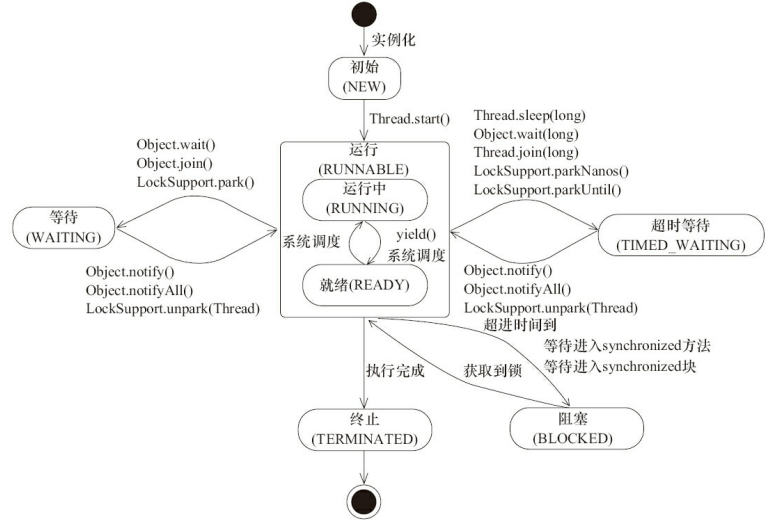
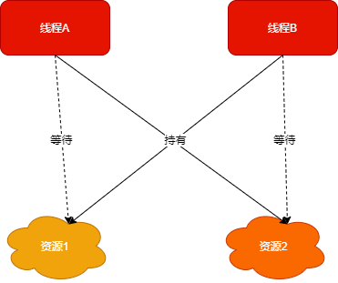
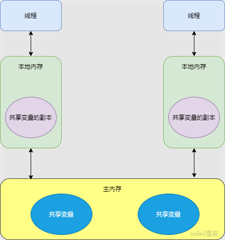
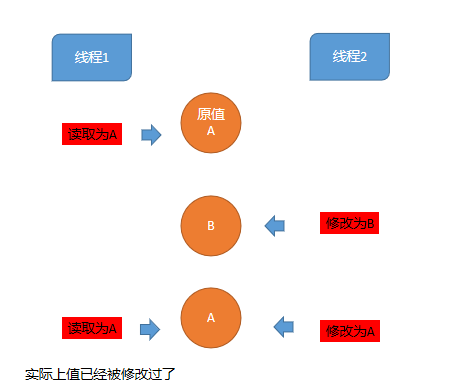

## 1 进程与线程

### 1.1 进程与线程

进程：系统进行**资源分配和调度**的基本单位。

线程：操作系统能够进行**运算调度**的最小单位。

### 1.2 并发与并行

- **并发：** 一个时间段内，多个任务在执行 (单位时间内不一定同时执行)；
- **并行：** 单位时间内，多个任务同时执行。

## 2 多线程

### 2.1 多线程的实现

* 继承 Thread
* 实现 Runnable 接口
* 实现 Callable 接口

```java
public class TestThread {

    public static class MyThread extends Thread {
        @Override
        public void run() {
            System.out.println(Thread.currentThread() + ":继承Thread");
        }
    }
    
    public static class MyRunnable implements Runnable{

        @Override
        public void run() {
            System.out.println(Thread.currentThread() + ":实现Runnable");
        }
    }

    public static class MyCallable implements Callable<String> {


        @Override
        public String call() throws Exception {
            Thread.sleep(500);
            System.out.println(Thread.currentThread() + ":实现Callable");
            return "Test";
        }
    }


    public static void main(String[] args) throws ExecutionException, InterruptedException {
        //1.继承Thread
        MyThread thread1 = new MyThread();
        thread1.start();

        //2.实现Runnable
        Thread thread2 = new Thread(new MyRunnable());
        thread2.start();

        //3.实现Callable 有返回值，通过 FutureTask 进行封装
        MyCallable myCallable = new MyCallable();
        FutureTask<String> futureTask = new FutureTask<>(myCallable);
        Thread thread3 = new Thread(futureTask);
        thread3.start();
        String s = futureTask.get();
        System.out.println(s);
    }
}

//out:
//Thread[Thread-0,5,main]:继承Thread
//Thread[Thread-1,5,main]:实现Runnable
//Thread[Thread-2,5,main]:实现Callable
//Test
```

### 2.2 Daemon -- 守护线程

 守护线程是程序运行时在后台提供服务的线程，不属于程序中不可或缺的部分，当所有非守护线程结束时，程序也就终止，同时会杀死所有守护线程。

setDaemon() 方法可以将一个线程设置为守护线程。

```java
Thread thread = new Thread(new MyRunnable());
thread.setDaemon(true);
thread.start();
```

### 2.3 线程的生命周期

Java 运行的生命周期包括以下六个状态：

| 状态名称              | 说明                                                   |
| --------------------- | ------------------------------------------------------ |
| NEW 初始状态          | 线程被创建，但是还没有调用 start() 方法                |
| RUNNABLE 运行状态     | 将操作系统的就绪和运行状态称为 - 运行中                |
| BLOCKED 阻塞状态      | 线程阻塞于锁                                           |
| WAITING 等待状态      | 当前线程需要等待其他线程作出一些特定动作（通知或中断） |
| TIME_WAITING 超时等待 | 指定时间自行返回                                       |
| TERMINATED 终止状态   | 线程已经执行完毕                                       |




线程创建之后处于 **NEW（新建）** 状态;

调用 start() 方法后开始运行，线程处于 **READY（可运行**）状态;

可运行状态的线程获得了 **CPU 时间片**（timeslice）后就处于 **RUNNING（运行）** 状态;

线程执行 wait() 方法之后，线程进入 **WAITING（等待）** 状态。进入等待状态的线程需要依靠其他线程的通知才能够返回到运行状态;

 **TIME_WAITING(超时等待)** 状态相当于在等待状态的基础上增加了超时限制，比如 sleep（long millis）方法或 wait（long millis）方法可以将 Java 线程置于 TIMED WAITING 状态。

当超时时间到达后 Java 线程将会返回到 **RUNNABLE** 状态。

当线程调用同步方法时，在没有获取到锁的情况下，线程将会进入到 **BLOCKED（阻塞）** 状态。

线程在执行 Runnable 的 run() 方法之后将会进入到 **TERMINATED（终止）** 状态。

### 2.4 线程常用方法

```java
public static Thread currentThread() 返回目前正在执行的线程。
public final String getName() 返回线程的名称
public final int getPriority() 返回线程的优先级
public boolean isInterrupted()	判断目前线程是否被中断，如果是，返回true，否则返回false
public final boolean isActive()	判断线程是否在活动，如果是返回true，否则返回false
public final void join() throws InterruptedException 指定的线程加入到当前线程
public final synchronized void join(long millis) throws InterruptedException 等待millis毫秒后。
public void run() 执行线程
public  final  void setName() 设定线程名称
public final void  setPriority（int newPriority）	设定线程的优先级
public static void sleep（long millis） throws InterruptedException	使目前正在执行的线程休眠millis毫秒
public void start() 开始执行线程。
public static void yield() 将目前正在执行的线程暂停一次，允许其他线程执行
public final void setDaemon(boolean on)	将一个线程设置成后台运行
public final void setPriority(int newPriority)	更改线程的优先级

```

#### 2.4.1 sleep()

Thread.sleep(millisec) 方法会休眠当前正在执行的线程，millisec 单位为毫秒。

sleep() 可能会抛出 InterruptedException，因为异常不能跨线程传播回 main() 中，因此必须在本地进行处理。线程中抛出的其它异常也同样需要在本地进行处理。

```java
public void run() {
    try {
        Thread.sleep(1000);
    } catch (InterruptedException e) {
        e.printStackTrace();
    }
}
```

#### 2.4.2 yield()

让出当前时间片给其他线程执行，建议具有相同优先级的其它线程可以运行。

```java
public void run() {
    Thread.yield();
}
```

#### 2.4.3 中断 interrupt()、interrupted() 和 isInterrupted()

* interrupt()：改变中断状态而已，它不会中断一个正在运行的线程，通知线程应该中断了，该处理了。如果线程在wait， sleep，join的时候受阻，调用了interrupt()方法，那么不仅会清除中断标志位，还会抛出 InterruptedException异常。
* interrupted()：第一次使用返回 true，并清除中断标志位，在此之后查询中断状态 isInterrupt() 都会返回false。
* isInterrupted()：判断目前线程是否被中断，如果是，返回 true，否则返回 false。

```java
public class Interrupt {
    public static void main(String[] args) throws Exception {
        Thread t = new Thread(new MyRunnable());
        t.start();
 
        Thread.sleep(100);
        t.interrupt();
 
        System.out.println("主线程结束");
    }
 
    public static class MyRunnable implements Runnable {
        public void run() {
            System.out.println("子线程开始");
            try {
                Thread.sleep(500); // 此时被interrupt()会抛出InterruptedException
            } catch (InterruptedException e) {
                Thread thread = Thread.currentThread();
                System.out.println("再次中断之前isInterrupted():" + thread.isInterrupted());
                System.out.println("再次中断之前interrupted():" + Thread.interrupted());
                // 再次调用interrupt方法中断自己，将中断状态设置为“中断”
                thread.interrupt();
                System.out.println("再次interrupt()后isInterrupted():" + thread.isInterrupted());
                System.out.println("再次interrupt()后第一次interrupted()返回:" + Thread.interrupted());// clear status
                // interrupted()判断是否中断，还会清除中断标志位
                System.out.println("interrupted()后此时再判断IsInterrupted: " + thread.isInterrupted());
                System.out.println("---------After Interrupt Status Cleared----------");
                System.out.println("再次interrupt()后第二次interrupted()返回: " + Thread.interrupted());
                System.out.println("此时再判断IsInterrupted: " + thread.isInterrupted());
            }
            System.out.println("Worker stopped.");
        }
    }
}
```

### 2.5 上下文切换

线程上下文是指某一时间点 CPU 寄存器和程序计数器的内容，CPU 通过时间片分配算法来循环执行任务（线程），因为时间片非常短，所以 CPU 通过不停地切换线程执行。

换言之，单 CPU 这么频繁，多核 CPU 一定程度上可以减少上下文切换。

### 2.6 死锁

多个线程同时被阻塞，它们中的一个或者全部都在等待某个资源被释放。由于线程被无限期地阻塞，因此程序不可能正常终止。



线程 A 持有资源 2，等待资源 1。线程 B 持有资源 1，等待资源 B，造成了死锁。

* 互斥：该资源任意一个时刻只由一个线程占用。
* 请求和保持：一个线程因请求资源而阻塞时，对已获得的资源保持不放。
* 不可剥夺：线程已获得的资源在末使用完之前不能被其他线程强行剥夺，只有自己使用完毕后才释放资源。
* 环路等待：线程之间形成一种头尾相接的循环等待资源关系。

#### 2.6.1 避免死锁

1. **破坏互斥条件** ：无法破坏，因为用锁本来就是想让他们互斥的（临界资源需要互斥访问）。
2. **破坏请求与保持条件** ：一次性申请所有的资源。
3. **破坏不剥夺条件** ：占用部分资源的线程进一步申请其他资源时，如果申请不到，可以主动释放它占有的资源。
4. **破坏环路条件** ：靠按序申请资源来预防。按某一顺序申请资源，释放资源则反序释放。破坏环路等待条件。

### 2.7 线程协作

#### 2.7.1 join()

把指定的线程加入到当前线程，可以将两个交替执行的线程合并为**顺序执行**的线程。

```java
public class TestJoin {

    private static class A extends Thread {
        @Override
        public void run() {
            System.out.println("A");
        }
    }

    private static class B extends Thread {
        private A a;

        public B(A a) {
            this.a = a;
        }

        @Override
        public void run() {
            try {
                a.join();
            } catch (InterruptedException e) {
                e.printStackTrace();
            }
            System.out.println("B");
        }
    }

    public static void main(String[] args) {
        A a = new A();
        B b = new B(a);
        b.start();
        a.start();
    }

}
```

#### 2.7.2 wait() 、notify()、 notifyAll()

wait() 使得线程等待某个条件满足，线程在等待时会被挂起，当其他线程的运行使得这个条件满足时，其它线程会调用 notify() 或者 notifyAll() 来**唤醒挂起的线程**。

```java
public class TestWait {
    private static class WaitExample {

        public synchronized void before() {
            System.out.println("before");
            notifyAll();// notify() 单一线程唤醒，多个线程不保证顺序
        }

        public synchronized void after() {
            try {
                wait();
            } catch (InterruptedException e) {
                e.printStackTrace();
            }
            System.out.println("after");
        }
    }

    public static void main(String[] args) {
        ExecutorService executorService = Executors.newCachedThreadPool();
        WaitExample example = new WaitExample();
        executorService.execute(example::after);
        executorService.execute(example::before);
    }
}
//out:
//before
//after
```

#### 2.7.3 wait() 和 sleep() 的区别

- wait() 是 Object 的方法，而 sleep() 是 Thread 的静态方法；
- wait() 会释放锁，sleep() 不会释放锁。

#### 2.7.4 await()、signal()、signalAll()

java.util.concurrent 类库中提供了 Condition 类来实现线程之间的协作，可以在 Condition 上调用 await() 方法使线程等待，其它线程调用 signal() 或 signalAll() 方法唤醒等待的线程。

```java
public class TestAwait {
    private static class WaitExample {
        private Lock lock = new ReentrantLock();
        private Condition condition = lock.newCondition();
        
        public void before() {
            lock.lock();
            try {
                System.out.println("before");
                condition.signalAll();
            } finally {
                lock.unlock();
            }
        }

        public void after() {
            lock.lock();
            try {
                condition.await();
                System.out.println("after");
            } catch (InterruptedException e) {
                e.printStackTrace();
            } finally {
                lock.unlock();
            }
        }
    }

    public static void main(String[] args) {
        ExecutorService executorService = Executors.newCachedThreadPool();
        WaitExample example = new WaitExample();
        executorService.execute(example::after);
        executorService.execute(example::before);
    }
}
//out:
//before
//after
```

### 2.8 为什么线程启动要调用 start()，而不是直接调用 run()?

调用 start() 可启动线程并使线程进入就绪状态，时间片轮转到，就开始执行，直接执行 run() 的话不会以多线程的方式执行。

## 3 线程同步

### 3.1 synchronized

解决的是多个线程之间访问资源的同步性，保证被它修饰的方法或者代码块在任意时刻只能有一个线程执行。

在 Java 早期版本中，synchronized 属于重量级锁，效率低下，因为**监视器锁（monitor**）是依赖于底层的操作系统的 Mutex Lock 来实现的，Java 的线程是映射到操作系统的原生线程之上的，如果要挂起或者唤醒一个线程，都需要操作系统帮忙完成，而操作系统实现线程之间的切换时需要从**用户态转换到内核态**，这个状态之间的转换需要相对比较长的时间，时间成本相对较高。

Java 6 之后 Java 官方对从 JVM 层面对 synchronized 较大优化，JDK1.6 对锁的实现引入了大量的优化，如自旋锁、适应性自旋锁、锁消除、锁粗化、偏向锁、轻量级锁等技术来减少锁操作的开销。

#### 3.1.1 synchronized三种使用方式

```java
//修饰实例方法: 作用于当前对象实例加锁，进入同步代码前要获得当前对象实例的锁
synchronized void method() {
  //...
}

/*修饰静态方法: 也就是给当前类加锁，会作用于类的所有对象实例，因为静态成员不属于任何一个实例对象，是类成员。所以如果一个线程A调用一个实例对象的非静态 synchronized 方法，而线程B需要调用这个实例对象所属类的静态 synchronized 方法，是允许的，不会发生互斥现象，因为访问静态 synchronized 方法占用的锁是当前类的锁，而访问非静态 synchronized 方法占用的锁是当前实例对象锁。*/
synchronized staic void  method() {
  //...
}

//指定加锁对象，对给定对象加锁，进入同步代码库前要获得给定对象的锁。
public void method() {
   synchronized (this) { 
        //...
    }
} 
```

#### 3.1.2 synchronized 原理

##### 3.1.2.1  同步语句块

```java
public void method() {
   synchronized (this) { 
        //...
    }
 } 
```

使用的是 **monitorenter** 和 **monitorexit** 指令，其中monitorenter 指令指向同步代码块的开始位置，monitorexit 指令则指明同步代码块的结束位置。锁计数器为 0，可获取，获取后将锁计数器设为 1 也就是加 1。相应的在执行monitorexit 指令后，将锁计数器设为0，表明锁被释放。如果获取对象锁失败，那当前线程就要阻塞等待，直到锁被另外一个线程释放为止。

##### 3.1.2.2  修饰实例方法

```java
synchronized void method() {
  //...
}
```

使用 ACC_SYNCHRONIZED 标识，指明了该方法是一个同步方法，JVM 通过该 ACC_SYNCHRONIZED 访问标志来辨别一个方法是否声明为同步方法，从而执行相应的同步调用。

ACC_SYNCHRONIZED 会去隐式调⽤刚才的两个指令：monitorenter 和monitorexit。归根究底，还是 monitor对象的争夺。

#### 3.1.3 JDK 1.6 锁优化

**无锁 -> 偏向锁 -> 轻量级锁 -> 重量级锁**

##### 3.1.3.1 适应性自旋锁

思想：让一个线程在请求一个共享数据的锁时执行忙循环（自旋）一段时间，如果在这段时间内能获得锁，就可以**避免进入阻塞状态**。

缺点：需要进行忙循环操作**占用 CPU 时间**，它只适用于**共享数据的锁定状态很短的场景**。若锁被其他线程长时间占用，会带来许多性能上的开销。所以自旋的次数不再固定。由前一次在同一个锁上的自旋时间及锁的拥有者的状态来决定。

> 如果共享数据的锁定状态持续时间较短，切换线程不值得（会有上下文切换），可以利用自旋锁尝试一定的次数。

##### 3.1.3.2 锁消除

JIT 编译时，会去除不可能存在竞争的锁。通过 **JIT 的逃逸分析**来**消除一些没有在当前同步块以外被其他线程共享的数据的锁的保护**，通过逃逸分析在 TLAB 来分配对象，这样就不存在共享数据带来的线程安全问题。

##### 3.1.3.3 锁粗化

减少不必要的紧连在一起的 lock，unlock 操作，**将多个连续的锁扩展成一个范围更大的锁**。

##### 3.1.3.4 偏向锁（重入锁）

为了在无线程竞争的情况下避免在锁获取过程中执行不必要的 CAS 原子指令，因为 CAS 原子指令虽然相对于重量级锁来说开销比较小但还是存在非常可观的本地延迟（因为 **CAS 的底层是利用 LOCK 指令 + cmpxchg 汇编指令来保证原子性的**，LOCK 指令会锁总线，其他 CPU 的内存操作将会被阻塞，因为 CPU 架构如果是 CMU 的话，控制信号、数据信号等是通过共享总线传到内存控制器中）。减少同一线程获取锁的代价，省去了大量有关**锁申请**的操作。

总结：只有一个线程访问同步块时，使用偏向锁。

##### 3.1.3.5 轻量级锁

这种锁实现的背后基于这样一种假设，即在真实的情况下我们程序中的大部分同步代码一般都处于无锁竞争状态（即单线程执行环境），在无锁竞争的情况下完全可以**避免调用操作系统层面的重量级互斥锁**(重量级锁的底层就是这样实现的)，只需要依靠一条 CAS 原子指令就可以完成锁的获取及释放。**当存在锁竞争的情况下，执行 CAS 指令失败的线程将调用操作系统互斥锁进入到阻塞状态，当锁被释放的时候被唤醒。**

总结：需要执行 CAS 操作自旋来获取锁，如果执行同步块的时间比较少，那么多个线程之间执行使用轻量级锁交替执行。

##### 3.1.3.6 锁的对比

| 锁       | 优点                                                         | 缺点                                           | 适用场景                           |
| -------- | ------------------------------------------------------------ | ---------------------------------------------- | ---------------------------------- |
| 偏向锁   | 加锁和解锁不需要额外的消耗, 和执行非同步代码方法的性能相差无几 | 如果线程间存在锁竞争, 会带来额外的锁撤销的消耗 | 适用于只有一个线程访问的同步场景   |
| 轻量级锁 | 竞争的线程不会阻塞, 提高了程序的响应速度                     | 如果始终得不到锁竞争的线程, 使用自旋会消耗CPU  | 追求响应时间, 同步快执行速度非常快 |
| 重量级锁 | 线程竞争不适用自旋, 不会消耗CPU                              | 线程堵塞, 响应时间缓慢                         | 追求吞吐量, 同步快执行时间速度较长 |

### 3.2 ReentrantLock

主要利用 **CAS+AQS 队列** 来实现，支持**公平锁和非公平锁**。

#### 3.2.1 CAS

Compare and Swap，比较并交换。有3个操作数：

* 内存值 V
* 预期值 A
* 要修改的新值B

当且仅当预期值A和内存值V相同时，将内存值V修改为B，否则什么都不做。该操作是一个原子操作，被广泛的应用在Java的底层实现中。在Java中，CAS 主要是由sun.misc.Unsafe这个类通过JNI调用CPU底层指令实现

## 4 ThreadLocal

### 4.1 简介

在使用多线程场景中，对同一个共享变量进行访问，会容易出现并发问题，造成所得到的结果不正确，通常采取的办法是在访问这个共享变量进行同步操作，一般加锁操作。

但是，众所周知，加锁操作，一定程度上会减低程序性能。假如这个变量并不需要保证在各个线程共享，各个线程都可以独立操作这个变量时，不用在意是否在读取这个变量时候，这个变量已被其他线程修改了值，那么完全可以不用同步操作，这就涉及到我们今天要讲的 ThreadLocal 这个类。

ThreaLocal 是 JKD 包提供，位于 java.lang 包下，它提供线程本地变量，简而言之，**就是为每一个线程创建一个变量副本，线程操作是自己本地内存中的值**，从而使每个线程都可以对这个变量为所欲为了。典型的应用场景是，数据库打开关闭操作。
### 4.2 使用

ThreadLocal 使用也非常简单，下面写一个简单例子：

```java
@Test
public void testThreadLocal() {
    final ThreadLocal<String> local = new ThreadLocal<>();
    Thread threadA = new Thread(new Runnable() {
         @Override
         public void run() {
             local.set("线程A对变量为所欲为");
             System.out.println("线程A："   local.get());
         }
    });
    Thread threadB = new Thread(new Runnable() {
         @Override
         public void run() {
             local.set("线程B对变量为所欲为");
             System.out.println("线程B："   local.get());
         }
    });
    threadA.start();
    threadB.start();
}
//输出：
//线程A：线程A对变量为所欲为
//线程B：线程B对变量为所欲为
```

以上程序可以看出，两个线程都通过 set 对 local 设置值，之后通过 get 读取  local  值，但是都是操作自己本地副本。

### 4.3 原理

ThreaLocal 的代码量很少，原理也比较简单，简单来说，内部维护了一个 Map，这个 Map 是 ThreadLocal 一个内部静态类，叫 ThreadLocalMap。因为每一个线程都可以关联多个 ThreadLocal 变量，所以设计成 Map结构。接下来看看各个方法主要实现逻辑：

#### 4.3.1 void set(T value)

```java
public void set(T value) {
     //1.获取当前线程
     Thread t = Thread.currentThread();
     //2.以当前线程 t 为 key，获取当前 threadLocals 变量
     ThreadLocalMap map = getMap(t);
     //3.如果存在，把 value 设置到 threadLocals 中
     if (map != null)
         map.set(this, value);
     //4.如果不存在，创建当前线程对应的 Map
     else
         createMap(t, value);
}

ThreadLocalMap getMap(Thread t) {
    //获取线程自己的变量 threadLocals
    return t.threadLocals;
}

void createMap(Thread t, T firstValue) {
     //创建当前线程的 threadLocals 变量
     t.threadLocals = new ThreadLocalMap(this, firstValue);
}
```

#### 4.3.2 T get(T value)

```java
public T get() {
    //1.获取当前线程
     Thread t = Thread.currentThread();
    //2.以当前线程 t 为 key，获取当前 threadLocals 变量
     ThreadLocalMap map = getMap(t);
    //3.如果不为 null，就返回 key 对应的本地变量的值
     if (map != null) {
         ThreadLocalMap.Entry e = map.getEntry(this);
         if (e != null) {
             @SuppressWarnings("unchecked")
             T result = (T)e.value;
             return result;
         }
     }
    //4.如果为null，就进行初始化
     return setInitialValue();
}

//逻辑和 void set() 差不多
private T setInitialValue() {
      T value = initialValue();
      Thread t = Thread.currentThread();
      ThreadLocalMap map = getMap(t);
      if (map != null)
          map.set(this, value);
      else
          createMap(t, value);
      return value;
}

protected T initialValue() {
      return null;
}
```

#### 4.3.3 void remove()

```java
public void remove() {
     //1.以当前线程 t 为 key，获取当前 threadLocals 变量
     ThreadLocalMap m = getMap(Thread.currentThread());
     //2.如果不为 null，删除本地变量
     if (m != null)
         m.remove(this);
}
```

### 4.4 问题

在使用 ThreadLocal 中，由于每一个线程都持有一个 threadLocals 变量，他是一个 HashMap 类型，key 为当前线程，value 为变量副本，如果一个线程一直不消亡，会一直持有变量副本，容易造成内存泄露，所以，为了保险起见，在使用完变量副本之后，要调用 remove() 方法来删除本地变量副本。

## 5 volatile 

### 5.1 Java 内存模型(JMM)




在 JDK1.2 之前，Java 内存模型实现总是从主存（即共享内存）读取变量，是不需要进行特别的注意的。而在当前的 Java 内存模型下，线程可以把变量保存本地内存（比如机器的寄存器）中，而不是直接在主存中进行读写。这就可能造成一个线程在主存中修改了一个变量的值，而另外一个线程还继续使用它在寄存器中的变量值的拷贝，造成**数据的不一致**。

#### 5.2 volatile关键字

volatile 是 Java 虚拟机提供的**轻量级**的同步机制。在某些情况下，比锁要更加方便。如果一个字段被声明为volatile，Java线程内存模型确保所有线程看到这个变量的值是一致的。

* 可见性：当写一个 volatile 变量时。JMM 会把该线程对应的工作内存的共享变量刷新到主内存中当去读取一个 volatile 变量时。JMM 会把该线程对应的工作内存设置为无效。
* 有序性（禁止指令重排）：通过插入内存屏障防止在内存屏障前前后进行指令重排序优化写前写后各插入一个。
* **不保证原子性**

### 5.3 volatile 和 synchronized 区别

- volatile 的本质是告诉 JMM 当前变量在工作内存中的值是不确定的，需要从**主存**中读取，synchronized 则是锁定当前变量只有该线程可以访问，并阻塞其他线程
- volatile 仅仅使用在**变量**级别 synchronized 可以使用在 **变量、方法、代码块**
- volatile 仅能实现变量的可见性，不能保证原子性。sync 可以保证可见性、 原子性
- volatile 不会造成线程的阻塞， synchronized 可能会造成线程的阻塞
- volatile 标记的变量不会被编译器优化，synchronized  可以被编译器优化

## 6 Atomic 原子类

### 6.1 概述

`JUC` 原子类位于 `java.util.concurrent.atomic` 包下，顾名思义，其作用是在多线程编程中，保证线程安全，具有原子操作的特点。

原子类的底层使用了处理器提供的原子指令，采用更为高效的方式 **`CAS` (`compare and swap`) + `volatile`  和 `native`**方法，对比传统的 `synchronized`，把同步交给**硬件层面**来处理，是一种非阻塞式。

但是，并非所有保证线程安全操作都可以采用这种方式，`Atomic` 适用于粒度比较小型，例如在多线程下使用计数器这种需求。


### 6.2 分类

根据操作的数据类型，将 JUC 包中的原子类分为 4 类。

#### 6.2.1 基本类型

使用原子的方式更新基本类型，包含以下 3 个类。

- AutomicBoolean：原子更新布尔类型。
- AutomicInteger：原子更新整型。
- AutomicLong：原子更新长整型。

#### 6.2.2 数组类型

使用原子的方式更新数组里的某个元素，包含以下 3 个类。

- AtomicIntegerArray：整型数组原子类
- AtomicLongArray：长整型数组原子类
- AtomicReferenceArray ：引用类型数组原子类

#### 6.2.3 引用类型

使用原子的方式更新引用类型，包含以下 3 个类。

- AtomicReference：原子更新引用类型。
- AtomicReferenceFieldUpdater：原子更新引用类型里的字段。
- AtomicMarkableReference：原子更新带有标记位的引用类型。

#### 6.2.4 对象的属性修改类型

使用原子的方式更新引用类型（类）里面的字段，包含以下 3 个类。

- AtomicIntegerFieldUpdater：原子更新整型的字段的更新器。 
- AtomicLongFieldUpdater：原子更新长整型字段的更新器
- AtomicStampedReference：原子更新带有版本号的引用类型

### 6.3 基本类型原子类

使用原子的方式更新引用类型，包含以下 3 个类。

- AtomicReference：原子更新引用类型。
- AtomicReferenceFieldUpdater：原子更新引用类型里的字段。
- AtomicMarkableReference：原子更新带有标记位的引用类型，可以原子更新一个布尔类型的标记位和引用类型。

基本类型原子类提供的方法几乎相同，以 AtomicInteger 为例子来介绍。

```java
public final int get() //获取当前值
public final int getAndSet(int newValue)//获取当前值，并设置新值
public final int getAndIncrement()//获取当前值，并自增，相当于 i++
public final int incrementAndGet() //先自增，再返回，相当于 ++i
public final int getAndDecrement() //获取当前值，并自减，相当于 i--
public final int getAndAdd(int delta) //获取当前的值，并加上预期值  
boolean compareAndSet(int expect, int update) //如果输入的数值等于预期值，则以原子方式将该值设置为输入值（update）
public final void lazySet(int newValue)//最终会设置成newValue，使用lazySet设置值后，可能导致其他线程在之后的一小段时间内还是可以读到旧的值    
```

#### 6.3.1 基本使用

基本类型原子类是用来保证多线程环境线程安全。

```java
public class TestAtomic {
    private volatile int count = 0;
    //保证线程安全，需加锁
    public synchronized void increment() {
        count++;
    }

    public int getCount() {
        return count;
    }
}

public class TestAtomic {
    private AtomicInteger count = new AtomicInteger(0);
    //不需要加锁，就可以保证线程安全
    public void increment() {
         count.incrementAndGet();
    }
    
    public int getCount() {
        return count.get();
    }
}
```

#### 6.3.2 原理

查看 AtomicInteger 源码

```java
public class AtomicInteger extends Number implements java.io.Serializable {
    //采用 Unsafe，这个类是位于 sun.misc 下，里面基本是本地方法，可以直接操作内存
    private static final Unsafe unsafe = Unsafe.getUnsafe();
    private static final long valueOffset;
    static {
        try {
            //用获取某个字段相对 Java 对象的“起始地址”的偏移量
            valueOffset = unsafe.objectFieldOffset
                (AtomicInteger.class.getDeclaredField("value"));
        } catch (Exception ex) { throw new Error(ex); }
    }
    //volatile 保证线程可见
    private volatile int value;
}
```

主要利用 **`CAS` (`compare and swap`) + `volatile`  和 `native`** 方法 保证原子操作，比 synchronized 更加高效。

### 6.4 数组类型原子类

使用原子的方式更新数组里的某个元素，包含以下 3 个类。

- AtomicIntegerArray：整型数组原子类
- AtomicLongArray：长整型数组原子类
- AtomicReferenceArray ：引用类型数组原子类

数组类型原子类提供的方法几乎相同，以 AtomicIntegerArray为例子来介绍。

```java
public final int get(int i) //获取 i 位置元素的值
public final int getAndSet(int i, int newValue)//返回 i位置的值，并设置为新值：newValue
public final int getAndIncrement(int i)//获取 i 位置元素的值，并让该位置的元素自增
public final int getAndDecrement(int i) //获取 i 位置元素的值，并让该位置的元素自减
public final int getAndAdd(int i, int delta) //获取 i 位置元素的值，并加上预期的值
boolean compareAndSet(int i, int expect, int update) //如果当前值等于预期值，则以原子方式将 i 位置的元素设置为 update
public final void lazySet(int i, int newValue)//将i 位置的元素设置为newValue,使用 lazySet 设置之后可能导致其他线程在之后的一小段时间内还是可以读到旧的值。
```

```java
public class TestAtomic {  
   public void test() {
        int[] value = new int[]{1, 8, 9, 4};
        AtomicIntegerArray aia = new AtomicIntegerArray(value);
        System.out.println(aia.incrementAndGet(0));//2
    }    
}
```

### 6.5 引用类型原子类

由于基本类型原子类只能更新一个变量，在很多场景中，我们需要更新多个变量，这时候就需要使用到引用类型原子类，包含以下 3 个类。

- AtomicReference：原子更新引用类型。
- AtomicStampedReference：原子更新带有版本号的引用类型。该类将整数值与引用关联起来，可用于解决原子的更新数据和数据的版本号，可以解决使用 CAS 进行原子更新时可能出现的 ABA 问题，内部维护一个时间戳，当 AtomicStampedReference 对应的数值被修改时，除了更新数据本身外，还必须要更新时间戳。当AtomicStampedReference 设置对象值时，对象值以及时间戳都必须满足期望值，写入才会成功。因此，即使对象值被反复读写，写回原值，只要时间戳发生变化，就能防止不恰当的写入。
- AtomicMarkableReference：原子更新带有标记位的引用类型。

引用类型原子类提供的方法几乎相同，以 AtomicInteger 为例子来介绍。

```java
public class TestAtomic {
   public void test() {
        AtomicReference<Book> atomicRefernceBook = new AtomicReference<>(); 
        Book book1 = new Book("第一行代码", 80);
        atomicRefernceBook.set(book1);
        Book book2 = new Book("第二行代码", 180);
        atomicRefernceBook.compareAndSet(book1, book2);
        System.out.println(atomicRefernceBook.get().getName()); //第二行代码   
        System.out.println(atomicRefernceBook.get().getPrice());//180
    }    
}


public class Book {
    private String name;
    private int price;
    /***get/set**/
}
```

代码中首先构建一个 Book 对象，然后把 Book 对象设置进 AtomicReferenc 中，最后调用 compareAndSet 方法进行原子更新操作。

CAS 的 ABA 问题：



### 6.6 对象的属性修改类型

使用原子的方式更新引用类型（类）里面的字段，包含以下 3 个类。

- AtomicIntegerFieldUpdater：原子更新整型的字段的更新器。 
- AtomicLongFieldUpdater：原子更新长整型字段的更新器
- AtomicStampedReference：原子更新带有版本号的引用类型

要想原子地更新字段类需要两步：

1. 因为原子更新字段类都是抽象类，每次使用的时候必须使用静态方法 newUpdater() 创建一个更新器，并且需要设置想要更新的类和属性。
2. 更新类的字段（属性）必须使用 public volatile 修饰符。

```java
public class TestAtomic {  
   public void test() {
        AtomicIntegerFieldUpdater<Book> atfu = AtomicIntegerFieldUpdater.newUpdater(Book.class, "price");//想要更新的类和属性
		Book book = new Book("第一行代码", 80);
		System.out.println(atfu.getAndIncrement(book));//80
		System.out.println(atfu.get(book));//81
    }    
}

public class Book {
    private String name;
    public volatile int price;
    /***get/set**/
}
```

## 7 JUC-AQS

AQS 的全称为（AbstractQueuedSynchronizer），**抽象同步队列**，在 java.util.concurrent.locks 包下面，是一个抽象类。

```
public abstract class AbstractQueuedSynchronizer
    extends AbstractOwnableSynchronizer
    implements java.io.Serializable {...}
```

维护一个 **volatile int state（代表共享资源）**和一个 **FIFO 线程等待队列（CLH）**（多线程争用资源被阻塞时会进入此队列）

AQS 定义两种资源共享方式

* Exclusive：独占，只有一个线程能执行，如 ReentrantLock，分为公平锁和非公平锁
  * 公平锁：按照线程在队列中的排队顺序，先到先得。
  * 非公平锁：当线程要获取锁时，无视队列顺序直接去抢锁，谁抢到就是谁的。
* Share：共享，多个线程可同时执行，如 Semaphore / CountDownLatch

**AQS的核心思想**：

**AQS 基于 CLH 队列，用 volatile 修饰共享变量 state，线程通过 CAS 去改变状态符，成功则获取锁成功，失败则进入等待队列，等待被唤醒。**

* 如果被请求的共享资源空闲，则将当前请求资源的线程设置为有效的工作线程，并将共享资源设置为锁定状态
* 如果被请求的共享资源被占用，那么就需要一套线程阻塞等待以及被唤醒时锁分配的机制，这个机制AQS是用CLH队列锁实现的，即将暂时获取不到锁的线程加入到队列中。（CLH--Craig，Landin，and Hagersten）队列是一个虚拟的双向队列，虚拟的双向队列即不存在队列实例，仅存在节点之间的关联关系。）
  

### 7.1.1 模板

同步器的设计是基于模板方法模式的，如果需要自定义同步器一般的方式是这样：

1. 使用者继承  AbstractQueuedSynchronizer 并重写指定的方法。（这些重写方法很简单，无非是对于共享资源 state 的获取和释放）
2. 将 AQS 组合在自定义同步组件的实现中，并调用其模板方法，而这些模板方法会调用使用者重写的方法。

```java
//自定义同步器时需要重写以下 AQS 提供的模板方法：、
isHeldExclusively()//该线程是否正在独占资源。只有用到condition才需要去实现它。
tryAcquire(int)//独占方式。尝试获取资源，成功则返回true，失败则返回false。
tryRelease(int)//独占方式。尝试释放资源，成功则返回true，失败则返回false。
tryAcquireShared(int)//共享方式。尝试获取资源。负数表示失败；0表示成功，但没有剩余可用资源；正数表示成功，且有剩余资源。
tryReleaseShared(int)//共享方式。尝试释放资源，成功则返回true，失败则返回false。
```

### 7.1.2 AQS 组件

- Semaphore(信号量)-允许多个线程同时访问： synchronized  和 ReentrantLock 都是一次只允许一个线程访问某个资源，Semaphore(信号量)可以指定多个线程同时访问某个资源。
- CountDownLatch(倒计时器）： CountDownLatch 是一个同步工具类，用来协调多个线程之间的同步。这个工具通常用来控制线程等待，它可以让某一个线程等待直到倒计时结束，再开始执行。
- CyclicBarrier (循环栅栏)：CyclicBarrier  和  CountDownLatch 非常类似，它也可以实现线程间的技术等待，但是它的功能比  CountDownLatch 更加复杂和强大。主要应用场景和  CountDownLatch 类似。CyclicBarrier 的字面意思是可循环使用（Cyclic ）的屏障（Barrier）。它要做的事情是，让一组线程到达一个屏障（也可以叫同步点）时被阻塞，直到最后一个线程到达屏障时，屏障才会开门，所有被屏障拦截的线程才会继续干活。CyclicBarrier 默认的构造方法是 CyclicBarrier(int parties)，其参数表示屏障拦截的线程数量，每个线程调用 await() 方法告诉 CyclicBarrier 我已经到达了屏障，然后当前线程被阻塞。