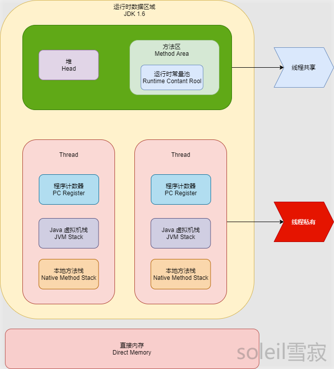
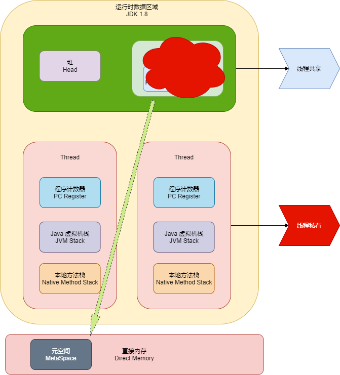
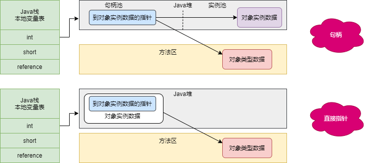
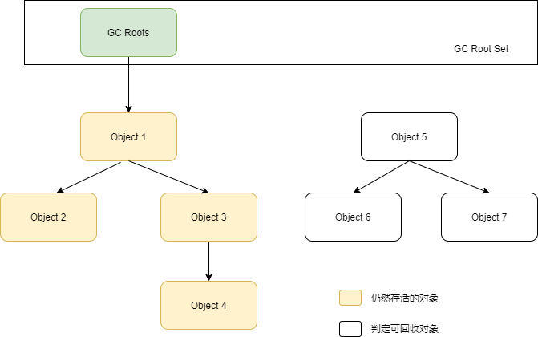
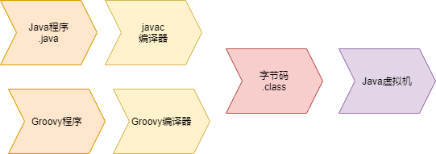
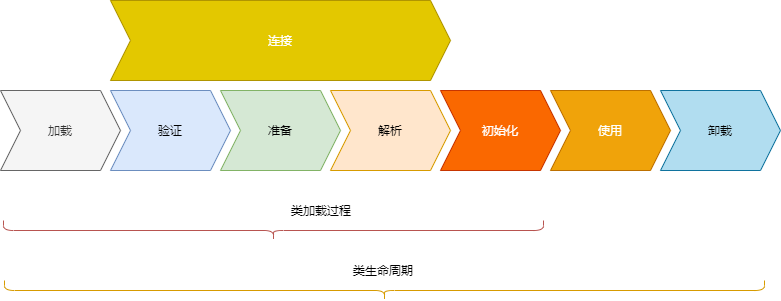
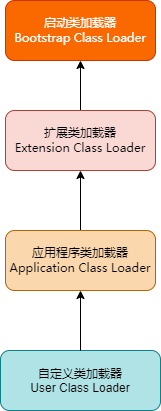

## 1 Java 内存区域（运行时数据区）

Java 不同版本内存区域有所不同，如下图所示。






**线程私有：**

* 程序计数器
* 虚拟机栈
* 本地方法栈

**线程共享：**

* 堆
* 方法区
* 直接内存（非运行时数据的一部分）

### 1.1 程序计数器

当前线程所执行的字节码的行号指示器。

程序计数器是唯一一个不会出现 OutOfMemoryError 的内存区域，它的生命周期随着线程的创建而创建，随着线程的结束而死亡。

### 1.2 Java 虚拟机栈

生命周期和线程相同，描述的是 Java **方法执行的内存模型**，每次方法调用的数据都是通过栈传递的。

每个 Java 方法在执行的同时会创建一个栈帧用于存储**局部变量表、操作数栈、常量池引用**等信息。从方法调用直至执行完成的过程，对应着一个栈帧在 Java 虚拟机栈中入栈和出栈的过程。

可能出现两种错误：StackOverFlowError 和 OutOfMemoryError。

- StackOverFlowError： 若 Java 虚拟机栈的内存大小不允许动态扩展，那么当线程请求栈的深度超过当前 Java 虚拟机栈的最大深度的时候，就抛出 StackOverFlowError 错误。
- OutOfMemoryError： 若 Java 虚拟机堆中没有空闲内存，并且垃圾回收器也无法提供更多内存的话。就会抛出 OutOfMemoryError 错误。

### 1.3 本地方法栈

和虚拟机栈所发挥的作用非常相似，只是本地方法栈使用到的是 Native 方法。

本地方法被执行的时候，在本地方法栈也会创建一个**栈帧**，用于存放该本地方法的局部变量表、操作数栈、动态链接、出口信息。

可能出现两种错误：StackOverFlowError 和 OutOfMemoryError。

### 1.4 堆

**几乎**所有对象都在这里**分配内存**，**存放对象实例**，是垃圾收集的主要区域（"GC 堆"）。但是，随着 JIT 编译期的发展与**逃逸分析**技术逐渐成熟，栈上分配、标量替换优化技术将会导致一些微妙的变化。从 JDK1.7开始已经默认开启逃逸分析，如果某些方法中的对象引用没有被返回或者未被外面使用（也就是未逃逸出去），那么对象可以直接在**栈上分配内存**。

现在收集器基本都采用分代垃圾收集算法：

在 JDK 7 版本及 JDK 7 版本之前，堆内存被通常被分为下面三部分：

* 新生代内存(Young Generation)
* 老生代(Old Generation)
* 永生代(Permanent Generation)

JDK 8 版本之后方法区（HotSpot 的永久代）被彻底移除了（JDK1.7 就已经开始了），使用是元空间（使用直接内存）。

堆容易出现的就是 OutOfMemoryError 错误：

* OutOfMemoryError: GC Overhead Limit Exceeded ： 当JVM花太多时间执行垃圾回收并且只能回收很少的堆空间时，就会发生此错误。

* java.lang.OutOfMemoryError: Java heap space ：假如在创建新的对象时, 堆内存中的空间不足以存放新创建的对象, 就会引发`java.lang.OutOfMemoryError: Java heap space` 错误。(和本机物理内存无关，和你配置的内存大小有关！)

### 1.5 方法区

存储已被虚拟机加载的**类信息、常量、静态变量、即时编译器编译后的代码**缓存等数据。虽然 Java 虚拟机规范把方法区描述为堆的一个逻辑部分，但是它却有一个别名叫做 **Non-Heap（非堆）**，目的应该是与 Java 堆区分开来，方法区也被称为永久代。

注意：

* JDK 6，HotSpot 开发团队就有放弃永久代，逐步改为采用**本地内存**（Native Memory）来实现方法区的计划了。
* JDK 7，已经把原本放在永久代的**字符串常量池、静态变量**等移出。
* JDK 8，终于完全废弃了永久代的概念，改用与 JRockit、J9 一样在本地内存中实现的**元空间**（Meta- space）来代替，把 JDK 7 中永久代还剩余的内容（主要是类型信息）全部移到元空间中。 

Java 方法有两种返回方式：

* return 语句。

* 抛出异常。

#### 1.5.1 运行时常量池

运行时常量池是**方法区的一部分**。Class 文件中除了有类的版本、字段、方法、接口等描述信息外，还有常量池表，用于存放编译期生成的**各种字面量和符号**引用。

既然运行时常量池是方法区的一部分，自然受到方法区内存的限制，当常量池无法再申请到内存时会抛出 OutOfMemoryError 错误。

### 1.6 直接内存

并不是虚拟机运行时数据区的一部分，也不是《Java虚拟机规范》中定义的内存区域。但是这部分内存也被频繁地使用，而且也可能导致 OutOfMemoryError 异常出现。

## 2 对象的创建


### 2.1 类加载检查

虚拟机遇到一条 new 指令时，首先将去检查这个指令的参数是否能在常量池中定位到这个类的符号引用，并且检查这个符号引用代表的类是否已被加载过、解析和初始化过。如果没有，那必须先执行相应的类加载过程。

### 2.2 分配内存

类加载检查通过后，接下来虚拟机将为新生对象分配内存。分配方式有：**指针碰撞** 和 **空闲列表**两种。选择哪种分配方式由 Java 堆是否规整决定，而 Java 堆是否规整又由所采用的垃圾收集器是否带有压缩整理功能决定。在实际开发过程中，创建对象是很频繁的事情，作为虚拟机来说，必须要保证线程是安全的。

#### 2.2.1 内存分配两种

选择以上两种方式中的哪一种，取决于 Java 堆内存是否规整。而 Java 堆内存是否规整，取决于 GC 收集器的算法是"标记-清除"，还是"标记-整理"（也称作"标记-压缩"），值得注意的是，复制算法内存也是规整的。

* 指针碰撞（规整）
* 空闲列表（不规整）

#### 2.2.2  内存分配并发

- **CAS + 失败重试**： CAS 是乐观锁的一种实现方式。乐观锁就是每次不加锁而是假设没有冲突而去完成某项操作，如果因为冲突失败就重试，直到成功为止。**虚拟机采用 CAS 配上失败重试的方式保证更新操作的原子性。**
- **TLAB**： 为每一个线程预先在 Eden 区分配一块儿内存，JVM 在给线程中的对象分配内存时，首先在 TLAB 分配，当对象大于 TLAB 中的剩余内存或 TLAB 的内存已用尽时，再采用上述的 CAS 进行内存分配。

### 2.3 初始化零值

虚拟机将分配到的内存空间都初始化为零值。

### 2.4 设置对象头

虚拟机要对对象进行必要的设置，例如这个对象是哪个类的实例、如何才能找到类的元数据信息、对象的哈希吗、对象的 GC 分代年龄等信息。 这些信息存放在对象头中。

### 2.5 执行init方法

在上面工作都完成之后，从虚拟机的视角来看，一个新的对象已经产生了，但从 Java 程序的视角来看，对象创建才刚开始，所以要执行程序写的 init 方法。

## 3 对象的内存布局

在 Hotspot 虚拟机中，对象在内存中的布局可以分为 3 块区域：**对象头**、**实例数据**、**对齐填充**。

* 对象头
  * **用于存储对象自身的运行时数据**（哈希码、GC 分代年龄、锁状态标志等等）。
  * **类型指针**，即对象指向它的类元数据的指针，虚拟机通过这个指针来确定这个对象是那个类的实例。
* 实例数据：**对象真正存储的有效信息**，也是在程序中所定义的各种类型的字段内容。
* 对齐填充：仅仅起占位作用，不是必然存在的，也没有什么特别的含义。

## 4 对象的访问定位

建立对象就是为了使用对象， Java 程序通过栈上的 reference 数据来操作堆上的具体对象，有两种方式。

* **句柄**: Java 堆中将会划分出一块内存来作为句柄池，reference 中存储的就是对象的句柄地址，而句柄中包含了对象实例数据与类型数据各自的具体地址信息。
* **直接指针**:那么 Java 堆对象的布局中就必须考虑如何放置访问类型数据的相关信息，而 reference 中存储的直接就是对象的地址。



使用句柄：reference 中存储的是稳定的句柄地址，在对象被移动时只会改变句柄中的实例数据指针，而 reference 本身不需要修改。

直接指针：速度快，节省了一次指针定位的时间开销。

## 5 对象已经死亡？

在堆里面存放着几乎所有的对象实例，垃圾收集器在对堆进行回收前，第一件事就是要确定这些对象之中哪些还“存活”着，哪些已经“死去”（即不可能再被任何途径使用的对象）。

### 5.1 引用计数法

给对象中添加一个引用计数器，当有一个地方引用它，计数器就加 1；当引用失效，计数器就减 1；计数器为 0 的对象就是不可能再被使用的。

这个方法实现简单、效率高，但是无法解决**循环引用**问题。

```java
public class TestGC {
    Object instance = null;
    public static void main(String[] args) {
        TestGC a = new TestGC();
        TestGC b = new TestGC();
        a.instance = b;
        b.instance = a;
        a = null;
        a = null;//循环引用无法解决
    }
}
```

### 5.2 可达性分析算法

通过一系列的称为 **“GC Roots”** 的对象作为起点，从这些节点开始向下搜索，节点所走过的路径称为引用链，当一个对象到 GC Roots 没有任何引用链相连的话，则证明此对象是不可用的。



可作为 GC Roots 的对象包括下面几种:

- 虚拟机栈(栈帧中的本地变量表)中引用的对象
- 本地方法栈(Native 方法)中引用的对象
- 方法区中
  * 类静态属性引用的对象
  * 常量引用的对象

### 5.3 方法区的回收

方法区主要**存放永久代对象**，而永久代对象的回收率比新生代低很多，所以在方法区上进行回收性价比不高。

主要是对常量池的回收和对类的卸载。

为了避免内存溢出，在大量使用反射和动态代理的场景都需要虚拟机具备类卸载功能。

类的卸载条件很多，需要满足以下三个条件，并且满足了条件也不一定会被卸载：

- 该类所有的实例都已经被回收，此时堆中不存在该类的任何实例。
- 加载该类的 ClassLoader 已经被回收。
- 该类对应的 Class 对象没有在任何地方被引用，也就无法在任何地方通过反射访问该类方法。

### 5.4 不可达的对象并非“非死不可”

即使在可达性分析法中不可达的对象，也并非是“非死不可”的，这时候它们暂时处于“**缓刑阶段**”，一个对象死亡，至少要经历两次标记过程；可达性分析法中不可达的对象被第一次标记并且进行一次筛选，筛选的条件是此对象是否有必要执行 finalize 方法。当对象没有覆盖 finalize 方法，或 finalize 方法已经被虚拟机调用过时，虚拟机将这两种情况视为没有必要执行。

被判定为需要执行的对象将会被放在一个队列中进行第二次标记，除非这个对象与引用链上的任何一个对象建立关联，否则就会被真的回收。

### 5.4 引用分类

#### 5.4.1 强引用

对象不会被回收。

使用 new 方式来创建。

#### 5.4.2 软引用

只有在**内存不够**的情况下才会被回收。

使用 SoftReference 类来创建。

#### 5.4.3 弱引用

一定会被回收，只能存活到下一次垃圾回收发生之前。

使用 WeakReference 类来创建。

#### 5.4.4 虚引用

也称为“幽灵引用”或者“幻影引用”，它是最弱的一种引用关系。

使用 PhantomReference 来创建。

## 6 垃圾收集算法

### 6.1 标记-清除算法


该算法分为“标记”和“清除”阶段：先标记出所有不需要回收的对象，在标记完成后统一回收掉所有没有被标记的对象。它是最基础的收集算法，后续的算法都是对其不足进行改进得到。有两问题：

* 效率问题
* 空间问题（产生大量不连续的碎片）

### 6.2 复制算法


将内存分为大小相同的两块，每次使用其中的一块。当这一块的内存使用完后，就将还存活的对象复制到另一块去，然后再把使用的空间一次清理掉。这样就使每次的内存回收都是对内存区间的一半进行回收。

### 6.3 标记-整理


根据老年代的特点提出的一种标记算法，标记过程仍然与“标记-清除”算法一样，但后续步骤不是直接对可回收对象回收，而是让所有存活的对象向一端移动，然后直接清理掉端边界以外的内存。

### 6.4 分代算法

新生代：每次收集都会有大量对象死去，可以选择**复制**算法，只需要付出少量对象的复制成本就可以完成每次垃圾收集。

老年代：对象存活几率是比较高的，而且没有额外的空间对它进行分配担保，所以我们必须选择“**标记-清除**”或“**标记-整理**”算法进行垃圾收集。

## 7 垃圾收集器

| 收集器                   | 简介                                                         |
| ------------------------ | ------------------------------------------------------------ |
| Serial 收集器            | 串行、单线程                                                 |
| ParNew 收集器            | Serial 收集器的多线程、新生代收集器                          |
| Parallel Scavenge 收集器 | 多线程收集器、吞吐量优先                                     |
| Serial Old 收集器        | Serial 收集器的老年代版本、                                  |
| Parallel Old 收集器      | Parallel Scavenge 收集器的老年代版本、在注重吞吐量以及 CPU 资源敏感的场合，都可以优先考虑 Parallel Scavenge 加 Parallel Old 收集器。 |
| CMS 收集器               | 标记 - 清除算法、流程（初始标记、并发标记、重新标记、并发清除） |
| G1 收集器                | 面向服务端应用的垃圾收集器，在多 CPU 和大内存的场景下有很好的性能。HotSpot 开发团队期望未来可以替换掉 CMS 收集器。G1 可以直接对新生代和老年代一起回收。 |

## 8 内存分配与回收策略

### 8.1 Minor GC 和 Full GC

- Minor GC：回收新生代，新生代对象存活时间短， Minor GC 会频繁执行，执行的速度一般比较快。
- Full GC：回收老年代和新生代，老年代对象其存活长，因此 Full GC 很少执行，执行速度会比 Minor GC 慢很多。

Full GC 触发条件：

* 调用 System.gc()
* 老年代空间不足
* 空间分配担保失败
* JDK 1.7 及以前的永久代空间不足
* Concurrent Mode Failure：CMS GC 的过程中同时有对象要放入老年代，而此时老年代空间不足。

### 8.2 内存分配策略

* 对象优先在 Eden 分配

*  大对象直接进入老年代

* 长期存活的对象进入老年代

* 动态对象年龄判定

  * 虚拟机并不是永远要求对象的年龄必须达到 MaxTenuringThreshold 才能晋升老年代，如果在 Survivor 中相同年龄所有对象大小的总和大于 Survivor 空间的一半，则年龄大于或等于该年龄的对象可以直接进入老年代，无需等到 MaxTenuringThreshold 中要求的年龄。

*  空间分配担保

  * 在发生 Minor GC 之前，虚拟机先检查老年代最大可用的连续空间是否大于新生代所有对象总空间。

    如果是， Minor GC 可以确认是安全的。

    如果不是，虚拟机会查看 HandlePromotionFailure 的值是否允许担保失败，如果允许那么就会继续检查老年代最大可用的连续空间是否大于历次晋升到老年代对象的平均大小，如果大于，将尝试着进行一次 Minor GC；如果小于，或者 HandlePromotionFailure 的值不允许冒险，那么就要进行一次 Full GC。

## 9 类文件结构



在 Java 中，JVM 可以理解的代码就叫做字节码（即扩展名为 .class 的文件），它不面向任何特定的处理器，只面向虚拟机。

.class文件是不同的语言在 Java 虚拟机之间的重要桥梁，同时也是支持 Java 跨平台很重要的一个原因。

### 9.1 Class 文件结构

```java
ClassFile {
    u4             magic; //Class 文件的标志，魔数
    u2             minor_version;//Class 的小版本号
    u2             major_version;//Class 的大版本号
    u2             constant_pool_count;//常量池的数量
    cp_info        constant_pool[constant_pool_count-1];//常量池
    u2             access_flags;//Class 的访问标记
    u2             this_class;//当前类
    u2             super_class;//父类
    u2             interfaces_count;//接口
    u2             interfaces[interfaces_count];//一个类可以实现多个接口
    u2             fields_count;//Class 文件的字段属性
    field_info     fields[fields_count];//一个类会可以有个字段
    u2             methods_count;//Class 文件的方法数量
    method_info    methods[methods_count];//一个类可以有个多个方法
    u2             attributes_count;//此类的属性表中的属性数
    attribute_info attributes[attributes_count];//属性表集合
}
```

u2 和 u4 分别代表两个字节和四个字节的无符号数，_info 结尾表示是一个表结构，表结构可以理解为一个类，用于表示复合数据结构的数据。

### 9.2 魔数与Class文件的版本 

每个 Class 文件的头4个字节被称为魔数（Magic Number），它的唯一作用是确定这个文件是否为一个能被虚拟机接受的Class文件。

紧接着魔数的 4 个字节存储的是Class文件的版本号：第 5 和第 6 个字节是次版本号（Minor Version），第 7 和第 8 个字节是主版本号（Major Version）。、

### 9.3 常量池 

紧接着主、次版本号之后的是常量池入口，常量池可以比喻为Class文件里的资源仓库，它是Class 文件结构中与其他项目关联最多的数据，通常也是占用Class文件空间最大的数据项目之一，另外，它还是在Class文件中第一个出现的表类型数据项目。 

常量池中主要存放两大类常量

* **字面量**（Literal）:比较接近于Java语言层面的常量概念，如文本字符串、被声明为final的常量值等
* **符号引用**（Symbolic References）:属于编译原理方面的概念，主要包括下面几类常量： 
  * 被模块导出或者开放的包（Package） 
  * 类和接口的全限定名（Fully Qualified Name） 
  * 字段的名称和描述符（Descriptor） 
  * 方法的名称和描述符 
  * 方法句柄和方法类型（Method Handle、Method Type、Invoke Dynamic） 
  * 动态调用点和动态常量（Dynamically-Computed Call Site、Dynamically-Computed Constant） 

### 9.4 访问标志

紧接着的2个字节代表访问标志（access_flags），这个标志用于识别一些类或者接口层次的访问信息，包括：这个Class是类还是接口；是否定义为public类型；是否定义为abstract 类型；如果是类的话，是否被声明为final；等等。

### 9.5 类索引、父类索引与接口索引集合 

类索引（this_class）和父类索引（super_class）都是一个u2类型的数据，而接口索引集合（interfaces）是一组u2类型的数据的集合，Class文件中由这三项数据来确定该类型的继承关系。类索引用于确定这个类的全限定名，父类索引用于确定这个类的父类的全限定名。

### 9.6 字段表集合 

用于描述接口或者类中声明的变量。

### 9.7 方法表集合 

Class文件存储格式中对方法的描述与对字段的描述采用了几乎完全一致的方式，方法表的结构如同字段表一样，依次包括访问标志（access_flags）、名称索引（name_index）、描述符索引（descriptor_index）、属性表合（attributes）几项，仅在访问标志和属性表集合的可选项中有所区别。 

### 9.8 属性表集合

Class文件、字段表、方法表都可以携带自己的属性表集合，以描述某些场景专有的信息。

## 10 类加载机制



系统加载 Class 类型的文件三步:**加载->连接->初始化**。连接过程又可分为三步:**验证->准备->解析**。

### 10.1 加载

主要完成下面3件事情：

1. 通过全类名获取定义此类的二进制字节流（ ZIP 包、JAR、EAR、WAR、网络、动态代理生成 等）
2. 将字节流所代表的**静态存储结构**转换为方法区的**运行时数据结构**
3. 在内存中生成一个代表该类的 Class 对象，作为方法区这些数据的访问入口

### 10.2 连接

#### 10.2.1 验证

确保 Class 文件的字节流中包含的信息符合当前虚拟机的要求，并且不会危害虚拟机自身的安全。

#### 10.2.2 准备

类变量是被 static 修饰的变量，准备阶段为类变量分配内存并设置初始值，使用的是方法区的内存。

实例变量不会在这阶段分配内存，它会在对象实例化时随着对象一起被分配在堆中**。实例化不是类加载**的一个过程，类加载发生在所有实例化操作之前，并且类加载只进行一次，实例化可以进行多次。

初始值一般为 0 值。

```java
public static int value = 1;//被初始化为 0
public static final int value = 1;//变量是常量 初始化为 1
```

#### 10.2.3 解析

将常量池的符号引用替换为直接引用的过程，也就是得到类或者字段、方法在内存中的指针或者偏移量。

其中解析过程在某些情况下可以在初始化阶段之后再开始，这是为了支持 Java 的动态绑定。

### 10.3 初始化

真正执行类中定义的 Java 程序代码(字节码)，初始化阶段是执行初始化方法 `<clinit> ()`方法的过程。

在准备阶段，类变量已经赋过一次系统要求的初始值，而在初始化阶段，可以通过程序制定的主观计划去初始化类变量和其它资源。

<clinit>() 是由编译器自动收集类中所有类变量的赋值动作和静态语句块中的语句合并产生的，编译器收集的顺序由语句在源文件中出现的顺序决定。特别注意的是，静态语句块只能访问到定义在它之前的类变量，定义在它之后的类变量只能赋值，不能访问。例如以下代码：

```java
public class Test {
    static {
        i = 0;                // 给变量赋值可以正常编译通过
        System.out.print(i);  // 这句编译器会提示“非法向前引用”
    }
    static int i = 1;
}
```

由于父类的 <clinit>() 方法先执行，也就意味着父类中定义的静态语句块的执行要优先于子类。例如以下代码：

```java
static class Parent {
    public static int A = 1;
    static {
        A = 2;
    }
}

static class Sub extends Parent {
    public static int B = A;
}

public static void main(String[] args) {
     System.out.println(Sub.B); 
}
```

接口中不可以使用静态语句块，但仍然有类变量初始化的赋值操作，因此接口与类一样都会生成 <clinit>() 方法。但接口与类不同的是，执行接口的 <clinit>() 方法不需要先执行父接口的 <clinit>() 方法。只有当父接口中定义的变量使用时，父接口才会初始化。另外，接口的实现类在初始化时也一样不会执行接口的 <clinit>() 方法。

虚拟机会保证一个类的 <clinit>() 方法在多线程环境下被正确的加锁和同步，如果多个线程同时初始化一个类，只会有一个线程执行这个类的 <clinit>() 方法，其它线程都会阻塞等待，直到活动线程执行 <clinit>() 方法完毕。如果在一个类的 <clinit>() 方法中有耗时的操作，就可能造成多个线程阻塞，在实际过程中此种阻塞很隐蔽。

## 11 类与类加载器

### 11.1 类加载器分类

从 Java 虚拟机的角度来讲，只存在以下两种不同的类加载器：

* 启动类加载器（Bootstrap ClassLoader），使用 C++ 实现，是虚拟机自身的一部分；
* 所有其它类的加载器，使用 Java 实现，独立于虚拟机，继承自抽象类 java.lang.ClassLoader。

从  Java 开发人员的角度来看，类加载器分为三类:

- **启动类加载器（Bootstrap ClassLoader）**：此类加载器负责将存放在 **<JRE_HOME>\lib** 目录中的，或者被 -Xbootclasspath 参数所指定的路径中的，并且是虚拟机识别的（仅按照文件名识别，如 rt.jar，名字不符合的类库即使放在 lib 目录中也不会被加载）类库加载到虚拟机内存中。启动类加载器无法被 Java 程序直接引用，用户在编写自定义类加载器时，如果需要把加载请求委派给启动类加载器，直接使用 null 代替即可。
- **扩展类加载器（Extension ClassLoader）**：这个类加载器是由 ExtClassLoader（sun.misc.Launcher$ExtClassLoader）实现的。它负责将 **<JAVA_HOME>/lib/ext** 或者被 java.ext.dir 系统变量所指定路径中的所有类库加载到内存中，开发者可以直接使用扩展类加载器。
- **应用程序类加载器（Application ClassLoader）**：这个类加载器是由 AppClassLoader（sun.misc.Launcher$AppClassLoader）实现的。由于这个类加载器是 ClassLoader 中的 getSystemClassLoader() 方法的返回值，因此一般称为系统类加载器。它负责加载用户类路径（ClassPath）上所指定的类库，开发者可以直接使用这个类加载器，如果应用程序中没有自定义过自己的类加载器，一般情况下这个就是程序中默认的类加载器。



### 11.2 双亲委派机制

如果一个类加载器收到了类加载的请求，它首先不会自己去尝试加载这个类，而是把这个请求委派给父类加载器去完成，每一个层次的类加载器都是如此，因此所有的加载请求最终都应该传送到最顶层的启动类加载器中，只有当父加载器反馈自己无法完成这个加载请求（它的搜索范围中没有找到所需的类）时，子加载器才会尝试自己去完成加载。

简而言之：**下向上检查是否加载过类，上到下尝试加载类**。

双亲委派机制好处：

* **避免类的重复加载**，JVM 区分不同类的方式不仅仅根据类名，相同的类文件被不同的类加载器加载产生的是两个不同的类。
* **安全**，保证了 Java 的核心 API 不被篡改。例如，自定义一个 String 类替代了 系统的 String 类。

自定义加载器，需要继承 ClassLoader 。

* 不想打破双亲委派模型，就重写 ClassLoader 类中的 **findClass()** 方法即可，无法被父类加载器加载的类最终会通过这个方法被加载。
* 想打破双亲委派模型则需要重写 **loadClass()** 方法。

```java
//类加载器源码分析
private final ClassLoader parent; 
protected Class<?> loadClass(String name, boolean resolve)
        throws ClassNotFoundException
    {
        synchronized (getClassLoadingLock(name)) {
            // 检查请求的类是否已经被加载过
            Class<?> c = findLoadedClass(name);
            if (c == null) {
                long t0 = System.nanoTime();
                try {
                    if (parent != null) {
                        //父加载器不为空，调用父加载器loadClass()方法处理
                        c = parent.loadClass(name, false);
                    } else {
                       //父加载器为空，使用启动类加载器 BootstrapClassLoader 加载
                        c = findBootstrapClassOrNull(name);
                    }
                } catch (ClassNotFoundException e) {
                   //抛出异常说明父类加载器无法完成加载请求
                }

                if (c == null) {
                    long t1 = System.nanoTime();
                    //尝试加载
                    c = findClass(name);
                    // this is the defining class loader; record the stats
                    sun.misc.PerfCounter.getParentDelegationTime().addTime(t1 - t0);
                    sun.misc.PerfCounter.getFindClassTime().addElapsedTimeFrom(t1);
                    sun.misc.PerfCounter.getFindClasses().increment();
                }
            }
            if (resolve) {
                resolveClass(c);
            }
            return c;
        }
    }
```

