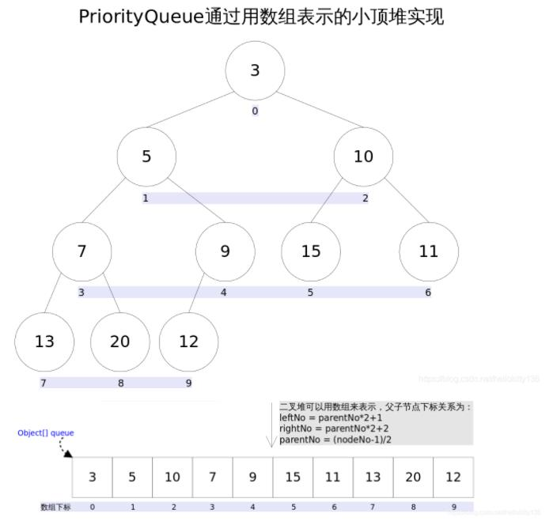

## 1 简介

PriorityQueue 是一个基于优先级的无界优先队列，添加到 PriorityQueue 的元素都经过会自动排序，默认实现的是最小堆，也可以通过 Comparator接口进行自定义排序。

```java
public static void main(String[] args) {
	PriorityQueue<Integer> queue = new PriorityQueue<>();
    //PriorityQueue<Integer> queue = new PriorityQueue<>((o1, o2) -> o2 - o1); 大顶推
    queue.offer(8);
    queue.offer(2);
    queue.offer(1);
    while (queue.size() != 0) {
         System.out.print(queue.poll() + " "); //输出： 1 2 8
    }
}
```

## 2 原理

小顶堆实现原理如下：



我们可以得出以下公式，轻易计算出某个节点的父节点以及子节点的下标。

```
leftNo = parentNo * 2 + 1
rightNo = parentNo * 2 + 2
parentNo = (nodeNo - 1) / 2
```

peek() 和 element 操作是常数时间，add(), offer(), 无参数的 remove() 以及 poll() 时间复杂度都是 log(N)。我们看看主要的源码。

```java
//队列操作的次数
transient int modCount = 0;

//队列中元素的个数
private int size = 0;

//add()
public boolean add(E e) {
    //调用的offer方法
    return offer(e);
}

//offer()
public boolean offer(E e) {
    if (e == null)
        throw new NullPointerException();
    modCount++;
    int i = size;
    //如果队列元素个数大于等于队列的长度，则需要进行扩容
    if (i >= queue.length)
        grow(i + 1);
    size = i + 1;
    //如果是第一个元素，直接插入即可
    if (i == 0)
        queue[0] = e;
    else
        siftUp(i, e);//不是，则需要进行调整
    return true;
}

//队列扩容
private void grow(int minCapacity) {
    //原始队列容量
    int oldCapacity = queue.length;
    //如果原始队列容量 < 64，则翻倍扩容，否则扩容 50%
    int newCapacity = oldCapacity + ((oldCapacity < 64) ?
                                     (oldCapacity + 2) :
                                     (oldCapacity >> 1));
    
    //如果扩容后的队列大小超过了最大队列大小，则需要进行特殊处理
    if (newCapacity - MAX_ARRAY_SIZE > 0)
        newCapacity = hugeCapacity(minCapacity);
    queue = Arrays.copyOf(queue, newCapacity);
}
private static int hugeCapacity(int minCapacity) {
    if (minCapacity < 0) // overflow
        throw new OutOfMemoryError();
    return (minCapacity > MAX_ARRAY_SIZE) ?
        Integer.MAX_VALUE :
        MAX_ARRAY_SIZE;
}

//元素添加
private void siftUp(int k, E x) {
    //使用构造方法传进来的比较器
    if (comparator != null)
        siftUpUsingComparator(k, x);
    else
        //使用默认的比较器
        siftUpComparable(k, x);
}
private void siftUpComparable(int k, E x) {
    Comparable<? super E> key = (Comparable<? super E>) x;
    while (k > 0) {
        //获取父节点的下标
        int parent = (k - 1) >>> 1;
        //父节点的元素值
        Object e = queue[parent];
        //如果新插入的元素比父节点的元素值大，循环结束，新插入节点直接插入最后即可
        if (key.compareTo((E) e) >= 0)
            break;
        //否则需要把父节点元素值放到新插入节点的下标（可以理解为父节点与新插入元素调换位置）
        queue[k] = e;
        //重复进行，知道父节点比子节点小
        k = parent;
    }
    //新插入元素放入排序后的下标
    queue[k] = key;
}

//poll()
public E poll() {
    if (size == 0)
        return null;
    int s = --size;
    modCount++;
    E result = (E) queue[0];//0下标处的那个元素就是最小的那个
    E x = (E) queue[s];
    queue[s] = null;
    if (s != 0)
        siftDown(0, x);
    return result;
}

//siftDown()
private void siftDown(int k, E x) {
    int half = size >>> 1;
    while (k < half) {
        //首先找到左右孩子中较小的那个，记录到 c 里，并用 child 记录其下标
        int child = (k << 1) + 1;//leftNo = parentNo * 2 + 1
        Object c = queue[child];
        int right = child + 1;
        if (right < size &&
            comparator.compare((E) c, (E) queue[right]) > 0)
            c = queue[child = right];
        if (comparator.compare(x, (E) c) <= 0)
            break;
        queue[k] = c;//交换位置
        k = child;
    }
    queue[k] = x;
}

//remove()
public boolean remove(Object o) {
    //通过遍历数组的方式找到第一个满足o.equals(queue[i])元素的下标
    int i = indexOf(o);
    if (i == -1)
        return false;
    int s = --size;
    if (s == i) //删除的是最后一个元素，直接删除
        queue[i] = null;
    else {
        E moved = (E) queue[s];
        queue[s] = null;
        siftDown(i, moved);//删除的不是最后一个元素，调整
        ......
    }
    return true;
}
```

