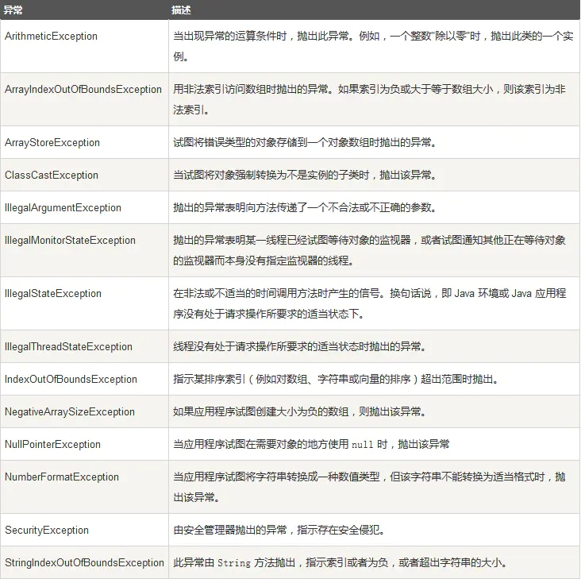
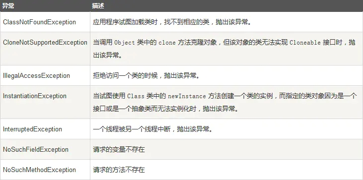

#### 1 分类

* Error： JVM 无法处理的错误
* Exception：
  * **受检异常** ：需要用 try…catch… 语句捕获并进行处理，并且可以从异常中恢复
  * **非受检异常** ：是程序运行时错误，例如空指针异常。

#### 2 异常处理

* Error（错误）：一般表示代码运行时 JVM 出现问题。比如 NoClassDefFoundError 等。比如说当jvm耗完可用内存时，将出现 OutOfMemoryError。此类错误发生时，JVM将终止线程。

* 非受检异常：将由系统自动抛出，应用本身可以选择处理或者忽略该异常。

* 受检异常：进行捕获或者抛出该方法之外交给上层处理。要么使用 try-catch 捕获，要么 throws 该异常。

#### 3 常见的受检异常

#### 4 常见非受检异常

