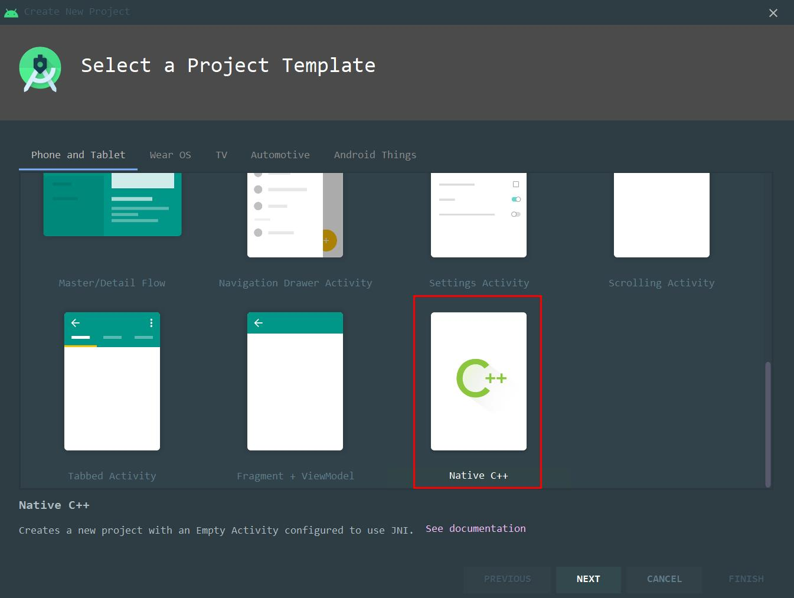

## 1 简介 

JNI 是 Java Native Interface 的缩写，译为 **Java 本地接口**，当 Java 无法处理一些任务时，就需要 JNI 技术来解决，例如游戏、音视频、图像处理等。

## 2 示例

使用 AS 就可以创建 Native C++ 工程，这里以 AS 为例子。



然后一路 next，就可以创建一个 Native C++ 的项目。

创建的项目中，可以看到以下模板代码：

```java
//MainActivity.java
public class MainActivity extends AppCompatActivity {

    //加载 native 库
    static {
        System.loadLibrary("native-lib");
    }

    @Override
    protected void onCreate(Bundle savedInstanceState) {
        super.onCreate(savedInstanceState);
        setContentView(R.layout.activity_main);

        // Example of a call to a native method
        TextView tv = findViewById(R.id.sample_text);
        tv.setText(stringFromJNI());
    }

    //本地方法
    public native String stringFromJNI();
}

//native-lib.cpp
#include <jni.h>
#include <string>

extern "C" JNIEXPORT jstring JNICALL
Java_com_test_testcc_MainActivity_stringFromJNI(
        JNIEnv* env,
        jobject /* this */) {
    std::string hello = "Hello from C++";
    return env->NewStringUTF(hello.c_str());
}

```

## 3 数据类型

在 Java 中有两种数据类型:

- 基本数据类型: boolean 、char、byte、int、short、long、float、double。
- 引用数据类型: String、Object[]、Class、Object 等。

Java 数据类型到 JNI 层需要转换为 JNI 层的数据类型。

### 3.1 基本数据类型转换

| Java    | JNI      | Signature                     |
| ------- | -------- | ----------------------------- |
| boolean | jboolean | B                             |
| byte    | jbyte    | B                             |
| char    | jchar    | C                             |
| short   | jshort   | S                             |
| int     | jint     | I                             |
| long    | jlong    | J                             |
| float   | jfloat   | F                             |
| double  | jdouble  | double (有符号 64 位双精度型) |
| void    | void     | V                             |

除了 void ，其他基本数据类型只要在加前缀 j 就可以。

### 3.2 引用数据类型转换

| Java      | JNI           | Signature              |
| --------- | ------------- | ---------------------- |
| Object    | jobject       | L+classname+；         |
| Class     | jclass        | L/java/lang/Class;     |
| String    | jstring       | L/java/lang/String;    |
| Throwable | jthrowable    | L/java/lang/Throwable; |
| Object[]  | jobjectArray  | [L+classname+；        |
| byte[]    | jbyteArray    | [D                     |
| char[]    | jcharArray    | [C                     |
| double[]  | jdoubleArray  | [D                     |
| float[]   | jfloatArray   | [F                     |
| int[]     | jintArray     | [I                     |
| short[]   | jshortArray   | [S                     |
| long[]    | jlongArray    | [J                     |
| boolean[] | jbooleanArray | [Z                     |

### 3.3 方法签名

在 Java 中有方法重载，JNI 仅仅依靠方法名称无法正确找到方法的，于是，就有了将**参数类型和返回值类型组合一起，作为方法签名**。

可以使用 javap 命令生成签名。

```java
javap -s -p D:/Android/TestNative.class
//(LJava/lang/string)LJava/lang/string    
```

### 3.4 引用类型

## 4 JNIEnv 

JNIEnv 作用：

* 调用 Java 方法
* 操作 Java（操作 Java 中的变量和对象）

JNIEnv 只在创建它的线程生效，不能跨线程传递。

通过 JavaVM（虚拟在 JNI 层的代表，一个进程只有一个 JavaVM） 的 AttachCurrentThread 可以获取这个线程的 JNIEnv，切记要使用 DetachCurrentThread 释放资源。

```c
#if defined(__cplusplus)
//C++
typedef _JNIEnv JNIEnv;
typedef _JavaVM JavaVM;
#else
//C
typedef const struct JNINativeInterface* JNIEnv;
typedef const struct JNIInvokeInterface* JavaVM;
#endif
```

## 5 JNI API

[NI 方法大全及使用示例](https://blog.csdn.net/afei__/article/details/81016413)