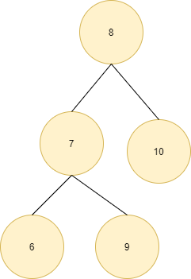
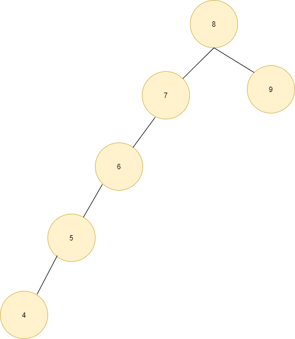

## 1 二叉查找树

红黑树是面试中一个非常重要的考点，在了解红黑树，我们需要知道为啥需要红黑树，红黑树主要为了解决二叉查找树出现瘸腿问题。

二叉查找树，Binary Search Tree(BST)，下图就是标准的二叉查找树，具有以下特征（左小右大）：

1. 若左子树不空，则左子树上所有结点的值均小于它的根结点)的值；

2. 若右子树不空，则右子树上所有结点的值均大于它的根结点的值；

3. 左、右子树也分别为二叉排序树；

4. 没有键值相等的结点。

红黑树主要为了解决二叉查找树出现瘸腿问题，所谓瘸腿问题如下图所示：

明显可以看到 BST 一条腿特别长。

## 2 红黑树

红黑树是每个结点都带有颜色属性的二叉查找树，颜色或红色或黑色。 在二叉查找树强制一般要求以外，对于任何有效的红黑树我们增加了如下的额外要求:

* 结点是红色或黑色；

* 根结点是黑色；

* 所有叶子都是黑色，叶子是 NIL 结点；
* 每个红色结点的两个子结点都是黑色，也就是从每个叶子到根的所有路径上不能有两个连续的红色结点；
*  从任一节结点其每个叶子的所有路径都包含相同数目的黑色结点。