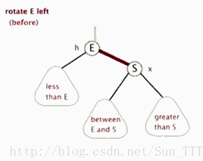
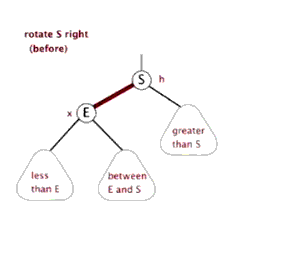
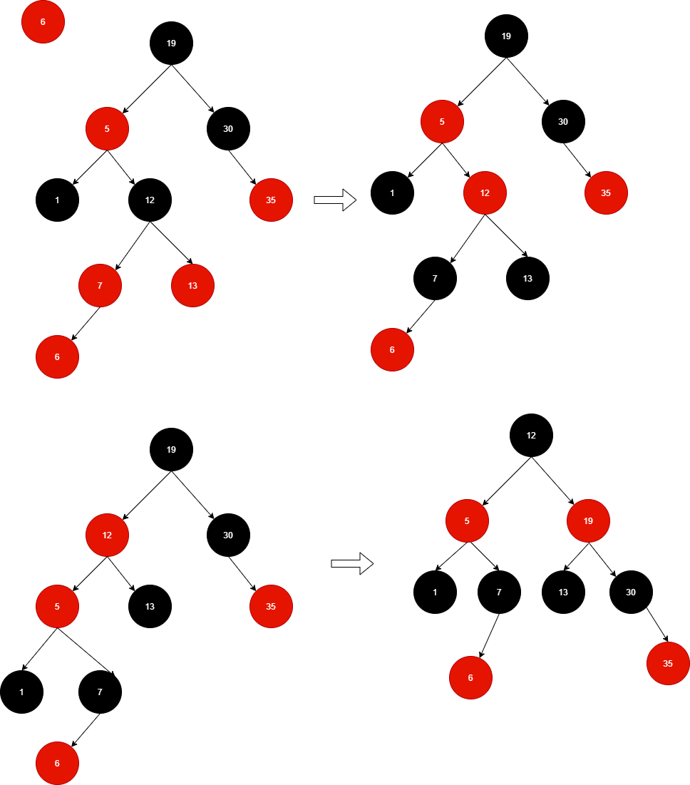

## 1 二叉查找树

红黑树是面试中一个非常重要的考点，在了解红黑树，我们需要知道为啥需要红黑树，红黑树主要为了解决二叉查找树出现瘸腿问题。

二叉查找树，Binary Search Tree(BST)，下图就是标准的二叉查找树，具有以下特征（左小右大）：

1. 若左子树不空，则左子树上所有结点的值均小于它的根结点)的值；

2. 若右子树不空，则右子树上所有结点的值均大于它的根结点的值；

3. 左、右子树也分别为二叉排序树；

4. 没有键值相等的结点。

红黑树主要为了解决二叉查找树出现瘸腿问题，所谓瘸腿问题如下图所示：

明显可以看到 BST 一条腿特别长。

## 2 红黑树

红黑树是每个结点都带有颜色属性的二叉查找树，不是红色就是黑色。 在二叉查找树强制一般要求以外，对于任何有效的红黑树增加了如下的要求:

* 结点是红色或黑色；

* 根结点是黑色；

* 所有叶子都是黑色，叶子是 NIL 结点；
* 每个红色结点的两个子结点都是黑色，也就是从每个叶子到根的所有路径上不能有两个连续的红色结点；
*  从任一节结点其每个叶子的所有路径都包含相同数目的黑色结点。

为了满足红黑树的特征，因此可以通过以下两个操作满足：

* 改变颜色：红变黑、黑变红
* 旋转（左旋、右选）

左旋操作：

右旋操作：

## 3 构建红黑树规则

所有插入的点默认为**红色**。

变颜色情况：当前结点父亲为红色，叔叔为也红色：

* 父亲 -> 黑色
* 叔叔 -> 黑色
* 爷爷 -> 红色
* 把操作节点变为爷爷

左旋：当前父结点为红色，叔叔为黑色，且位于右子树，父结点左旋

右旋：当前父结点为红色，叔叔为黑色，且位于左子树，右旋：

* 父亲 -> 黑色
* 爷爷 -> 红色
* 以爷爷结点旋转

如上图所示，插入 6：

变颜色情况：当前结点父亲为红色，叔叔为也红色：

- 父亲（7） -> 黑色    
- 叔叔（13） -> 黑色    
- 爷爷（12） -> 红色    
- 把操作节点变为爷爷（12）

左旋：当前（12）父结点（5）为红色，叔叔（1）为黑色，且位于右子树，父结点（5）左旋

右旋：当前（5）父结点（12）为红色，叔叔（30）为黑色，且位于左子树，右旋：

- 父亲（12） -> 黑色 
- 爷爷（19） -> 红色 
- 以爷爷（19）结点旋转 