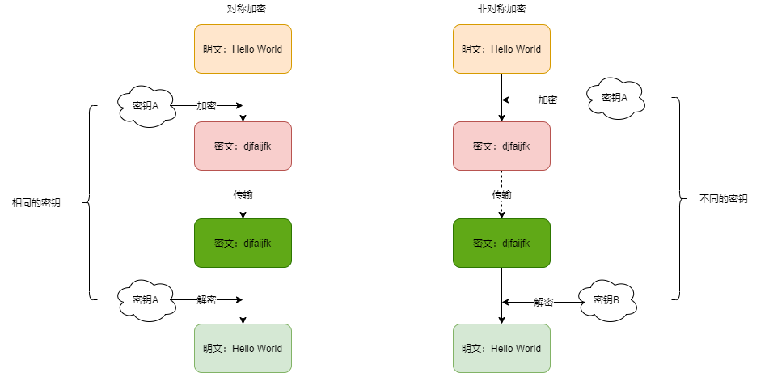

## 1 常见加密方式



## 2 对称加密

采用单钥密码系统的加密方法，同一个密钥可以同时用作信息的加密和解密，这种加密方法称为对称加密，也称为单密钥加密。

常见加密算法：

* **DES** : Data Encryption Standard，**数据加密标准**，是一种使用密钥加密的块算法，1977年被美国联邦政府的国家标准局确定为联邦资料处理标准（FIPS），并授权在非密级政府通信中使用，随后该算法在国际上广泛流传开来。
* **AES** : Advanced Encryption Standard, **高级加密标准** ，在密码学中又称 Rijndael 加密法，是美国联邦政府采用的一种区块加密标准。这个标准用来替代原先的 DES，已经被多方分析且广为全世界所使用。

特点

- 加密速度快， 可以加密大文件
- 密文可逆，一旦密钥文件泄漏,，就会导致数据暴露
- 加密后编码表找不到对应字符，出现乱码
- 一般结合 Base64 使用

### 2.1  DES

```java
public class DESDemo {
    public static void main(String[] args) throws Exception {
            String input = "Hello World";
            String key = "12345678";
            String transformation = "DES";
            String algorithm = "DES";

            String encrypt = null;
            encrypt = encryptDES(input, key, transformation, algorithm);
            System.out.println("加密:" + encrypt);

            String decrypt = decryptDES(encrypt, key, transformation, algorithm);
            System.out.println("解密:" + decrypt);
    }

    /**
     * 使用DES加密数据
     *
     * @param input          : 原文
     * @param key            : 密钥(DES,密钥的长度必须是8个字节)
     * @param transformation : 获取Cipher对象的算法
     * @param algorithm      : 获取密钥的算法
     * @return : 密文
     * @throws Exception
     */
    private static String encryptDES(String input, String key, String transformation, String algorithm) throws Exception {
        // 获取加密对象
        Cipher cipher = Cipher.getInstance(transformation);
        // 创建加密规则
        // 第一个参数key的字节
        // 第二个参数表示加密算法
        SecretKeySpec sks = new SecretKeySpec(key.getBytes(), algorithm);
        // ENCRYPT_MODE：加密模式
        // DECRYPT_MODE: 解密模式
        // 初始化加密模式和算法
        cipher.init(Cipher.ENCRYPT_MODE, sks);
        // 加密
        byte[] bytes = cipher.doFinal(input.getBytes());

        // 输出加密后的数据
        return Base64.encode(bytes);
    }

    /**
     * 使用DES解密
     *
     * @param input          : 密文
     * @param key            : 密钥
     * @param transformation : 获取Cipher对象的算法
     * @param algorithm      : 获取密钥的算法
     * @throws Exception
     * @return: 原文
     */
    private static String decryptDES(String input, String key, String transformation, String algorithm) throws Exception {
        // 1,获取Cipher对象
        Cipher cipher = Cipher.getInstance(transformation);
        // 指定密钥规则
        SecretKeySpec sks = new SecretKeySpec(key.getBytes(), algorithm);
        cipher.init(Cipher.DECRYPT_MODE, sks);
        // 3. 解密，上面使用的base64编码，下面直接用密文
        byte[] bytes = cipher.doFinal(Base64.decode(input));
        //  因为是明文，所以直接返回
        return new String(bytes);
    }
}
```

### 2.2 AES

```java
public class AESDemo {
    public static void main(String[] args) throws Exception {
        String input = "Hello World";
        // AES加密算法，比较高级，所以key的大小必须是16个字节
        String key = "1234567812345678";
        String transformation = "AES";
        // 指定获取密钥的算法
        String algorithm = "AES";
        // 先测试加密，然后在测试解密
        String encryptDES = encryptAES(input, key, transformation, algorithm);
        System.out.println("加密:" + encryptDES);
        String s = decryptAES(encryptDES, key, transformation, algorithm);
        System.out.println("解密:" + s);
    }

    /**
     * 使用AES加密数据
     *
     * @param input          : 原文
     * @param key            : 密钥(DES,密钥的长度必须是8个字节)
     * @param transformation : 获取Cipher对象的算法
     * @param algorithm      : 获取密钥的算法
     * @return : 密文
     * @throws Exception
     */
    private static String encryptAES(String input, String key, String transformation, String algorithm) throws Exception {
        // 获取加密对象
        Cipher cipher = Cipher.getInstance(transformation);
        // 创建加密规则
        // 第一个参数key的字节
        // 第二个参数表示加密算法
        SecretKeySpec sks = new SecretKeySpec(key.getBytes(), algorithm);
        // ENCRYPT_MODE：加密模式
        // DECRYPT_MODE: 解密模式
        // 初始化加密模式和算法
        cipher.init(Cipher.ENCRYPT_MODE, sks);
        // 加密
        byte[] bytes = cipher.doFinal(input.getBytes());

        // 输出加密后的数据
        return Base64.encode(bytes);
    }

    /**
     * 使用AES解密
     *
     * @param input          : 密文
     * @param key            : 密钥
     * @param transformation : 获取Cipher对象的算法
     * @param algorithm      : 获取密钥的算法
     * @throws Exception
     * @return: 原文
     */
    private static String decryptAES(String input, String key, String transformation, String algorithm) throws Exception {
        // 1,获取Cipher对象
        Cipher cipher = Cipher.getInstance(transformation);
        // 指定密钥规则
        SecretKeySpec sks = new SecretKeySpec(key.getBytes(), algorithm);
        cipher.init(Cipher.DECRYPT_MODE, sks);
        // 3. 解密
        byte[] bytes = cipher.doFinal(Base64.decode(input));
        return new String(bytes);
    }
}
```

### 2.4 加密模式

* ECB : Electronic codebook, 电子密码本. 需要加密的消息按照块密码的块大小被分为数个块，并对每个块进行独立加密
* CBC : Cipher-block chaining, 密码块链接. 每个明文块先与前一个密文块进行异或后，再进行加密。在这种方法中，每个密文块都依赖于它前面的所有明文块

### 2.5 填充模式

当需要按块处理的数据, 数据长度不符合块处理需求时, 按照一定的方法填充满块长的规则，

* NoPadding：不填充，在DES加密算法下, 要求原文长度必须是8byte的整数倍，在AES加密算法下, 要求原文长度必须是16byte的整数倍
* PKCS5Padding：数据块的大小为8位, 不够就补足

```java
String transformation = "DES/CBC/NoPadding"; 

private static String encryptDES(String input, String key, String transformation, String algorithm) throws Exception {
        // 获取加密对象
        Cipher cipher = Cipher.getInstance(transformation);
        // 创建加密规则
        // 第一个参数key的字节
        // 第二个参数表示加密算法
        SecretKeySpec sks = new SecretKeySpec(key.getBytes(), algorithm);
        // ENCRYPT_MODE：加密模式
        // DECRYPT_MODE: 解密模式
         // 初始向量，参数表示跟谁进行异或，初始向量的长度必须是8位
        IvParameterSpec iv = new IvParameterSpec(key.getBytes());
         // 初始化加密模式和算法
        cipher.init(Cipher.ENCRYPT_MODE,sks);
        // 加密
        byte[] bytes = cipher.doFinal(input.getBytes());
        // 输出加密后的数据
        String encode = Base64.encode(bytes);
        return encode;
    }
```


### 2.6 Base64 

Base64 是网络上最常见的用于传输8Bit[字节码](https://baike.baidu.com/item/字节码/9953683)的编码方式之一，Base64就是一种基于64个可打印字符来表示[二进制](https://baike.baidu.com/item/二进制/361457)数据的方法。可查看RFC2045～RFC2049，上面有MIME的详细规范。

Base64编码是从二进制到字符的过程，可用于在[HTTP](https://baike.baidu.com/item/HTTP)环境下传递较长的标识信息。采用Base64编码具有不可读性，需要解码后才能阅读。

Base64由于以上优点被广泛应用于计算机的各个领域，然而由于输出内容中包括两个以上“符号类”字符（+, /, =)，不同的应用场景又分别研制了Base64的各种“变种”。为统一和规范化Base64的输出，Base62x被视为无符号化的改进版本。

规则

- 把3个字节变成4个字节。

- 每76个字符加一个换行符。

- 最后的结束符也要处理。