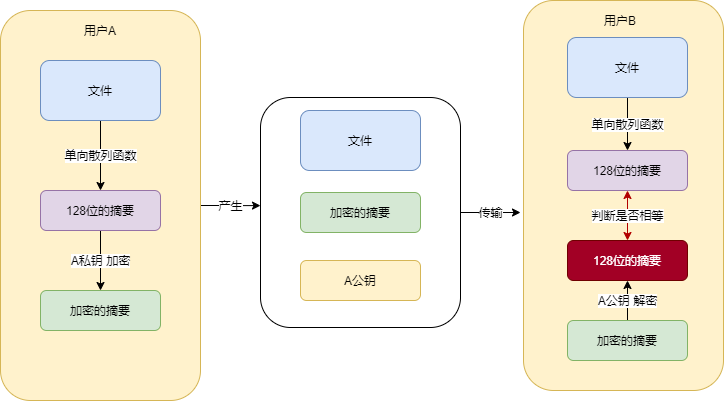
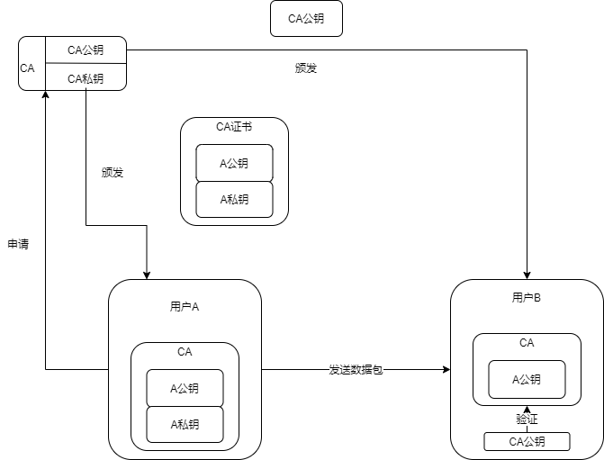

## 1 数字签名

数字签名（又称[公钥](https://baike.baidu.com/item/公钥)数字签名）是只有信息的发送者才能产生的别人无法伪造的一段数字串，这段数字串同时也是对信息的发送者发送信息真实性的一个有效证明。它是一种类似写在纸上的普通的物理签名，但是使用了[公钥加密](https://baike.baidu.com/item/公钥加密/6245950)领域的技术来实现的，用于鉴别数字信息的方法。一套数字签名通常定义两种互补的运算，一个用于签名，另一个用于验证。数字签名是非对称[密钥加密技术](https://baike.baidu.com/item/密钥加密技术)与[数字摘要](https://baike.baidu.com/item/数字摘要/4069118)技术的应用。

数字签名的主要作用就是保证了**数据的有效性**（验证是谁发的）和**完整性**（证明信息没有被篡改）。

* 用户 A -> 文件经过单向散列函数 -> 得到 128 位的摘要 -> A私钥加密 -> 得到加密的摘要
* 把文件 + 加密的摘要 + A 公钥  -> 传输给 用户 B

* 用户 B
  - 文件经过单向散列函数 -> 得到 128 位的摘要（摘要 1）
  - A 公钥对加密的摘要进行解密 -> 得到 128 位的摘要（摘要 2）
  - 判断摘要 1 和 摘要 2 是否相等，不相等，文件被篡改

## 2 CA 证书

* 用户 A 向证书颁发机构提交个人信息，申请证书，机构给用户 A 生成 CA 证书（A 公钥、B公钥、CA 数字签名）

* 用户 B 要信任第三方认证机构的 CA 证书

* 用户 A 发送的数据，A公钥 上有认证机构 CA 的数字签名，用户 B 根据 CA 公钥验证 A 公钥得合法性。
* 合法来，下面的流程就和数字签名一样。