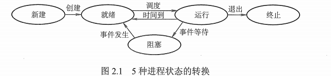

## 1 进程与线程

### 1.1 进程的概念和特征

更好地描述和控制程序并发执行，实现操作系统的**并发性和共享性**。

进程控制块（PCB）：更好的描述进程的基本情况和运行状态，进而控制和管理进程。**是进程存在的唯一标志**。

组成（构成进程映像（进程实体））：

- 进程控制块（PCB）：数据结构，描述进程的基本情况和运行状态，是进程存在的唯一标志。
- 程序段：能被进程调度程序调度到 CPU 运行的程序的代码段。
- 数据段：存储程序运行期间的相关数据。

进程是一个动态的、过程性的概念。

进程的特征：

* 动态性：进程的实质是程序在多道程序系统中的一次执行过程，进程是动态产生，动态消亡的。
* 并发性：任何进程都可以同其他进程一起并发执行。
* 独立性：进程是一个能独立运行的基本单位，同时也是系统分配资源和调度的独立单位。
* 异步性：由于进程间的相互制约，使进程具有执行的间断性，即进程按各自独立的、不可预知的速度向前推进。
* 结构性：程序段、数据段和进程控制块三部分组成。

### 1.2 进程的状态与转换

状态：

* 创建状态：进程正在被创建，还没有就绪。
* 就绪状态：进程已获取了除处理机之外的一切所有资源（只要获取时间片就开始工作了）。
* 运行状态：进程正在处理机上运行。
* 阻塞状态（等待状态）：进程正在等待某一事件而暂停（出现 I/O 或服务请求）。
* 结束状态：进程正从系统中消失，分为正常结束、异常结束。

转换：



- 就绪状态 -> 运行状态：处理机调度，得到处理及资源。
- 运行状态 -> 就绪状态：时间片用完或有更高级的程序进入。
- 运行状态 -> 阻塞状态：进程正在等待某一事件而暂停（某一资源还没有准备好）。
- 阻塞状态 -> 运行状态：进程所需的资源已经准备好了。

### 1.3 进程的控制

把进程控制的程序叫原语（运行期间不可中断，是不可切割的基本单位）。

进程的控制：在进程生存期间，对其全部行为的控制。典型的控制行为有创建进程、阻塞进程、唤醒进程、撤销进程。

* 进程的创建：终端用户登录系统、作业调度、系统提供服务、用户程序的应用请求。（fork 进程）
* 进程的终止：正常结束、发生异常、外界干预。
*  进程的阻塞：进程等待资源。
* 进程的唤醒：进程等待的资源已经准备完成，例如 I/O 设备或服务资源已经可以用。
* 进程的切换：处理机从一个进程运行到另外一个进程运行。时间片用完、放弃处理机。

### 1.4 进程的组织

进程是一个独立的运行单位，操作系统**进行资源分配和调度**基本单位。

组成（构成进程映像（进程实体））：

- 进程控制块（PCB）：数据结构，描述进程的基本情况和运行状态，是进程存在的唯一标志。
- 程序段：能被进程调度程序调度到 CPU 运行的程序的代码段。
- 数据段：存储程序运行期间的相关数据。

### 1.5 进程的通信

- 低级通信（PV 操作：是一种实现进程互斥与同步的有效方法。PV 操作与信号量的处理相关，P：通过，V：释放）
- 高级通信（共享存储、消息传递、管道通信）

#### 1.5.1 共享存储

相互通讯的进程有共享存储区，进程间可以通过直接读写共享存储区的变量来交互数据，同步与互斥在并发程序设计时安排进入程序。操作系统提供这样的共享存储区及同步互斥工具。

#### 1.5.2 消息传递

通过操作系统的相应系统调用进行消息传递通讯，分为两种：

- 直接通信方式：点到点的发送（进程在发送和接收消息时直接指明接收者或发送者进程 ID）
- 间接通信方式：以**信箱**为媒介进行传递，可以广播（系统为每个信箱设一个消息队列，消息发送和接收都指向该消息队列）

#### 1.5.3 管道通信（利用 pipe 文件）

是一种信息流缓冲机构，UNIX 系统中管道基于文件系统，在内核中通过文件描述符表示。管道以先进先出(FIFO)方式组织数据传输。

特点：

1. 管道是一个单向通信信道，如果进程间要进行双向通信，通常需要定义两个管道。
2. 管道通过系统调用 read(), write()函数进行读写操作。

分类：

1. 匿名管道：只适用于父子进程之间通信；管道能够把信息从一个进程的地址空间拷贝到另一个进程的地址空间。
2. 命名管道：命名管道有自己的名字和访问权限的限制，就像一个文件一样。它可以用于不相关进程间的通信，进程通过使用管道的名字获得管道。

### 1.6 线程的概念和多线程模型

目的：减小程序在并发时所付出的失控开销，提高操作系统的并发性能。

理解：轻量级的进程，是一个基本的 CPU 执行单元，是程序执行流的最小单元。

引入线程的变化，有如下方面：

#### 1.6.1 资源分配、调度

1. 传统进程机制中，进程是资源分配、调度的基本单元。
2. 引入线程后**，进程是资源分配的基本单元，线程是调度的基本单元。**

#### 1.6.2 并发性

1. 传统进程机制中，只能进程间并发。
2. 引入线程后，各线程间也能并发，提高了并发度。

#### 1.6.3 系统开销

1. 传统的进程间并发，需要切换进程的运行环境，系统开销大。
2. 线程间并发，如果是同一进程的线程切换，则不需要切换进程环境，系统开销小。
3. 引入线程后，并发所带来的系统开销减少。

#### 1.6.4 线程的属性

- 轻型实体
- 独立调度和分派的基本单位
- 可并发执行
- 共享进程资源

#### 1.6.5 线程的实现方式

- 用户级线程（ULT）：所有工作由应用程序完成。
- 内核级线程（KLT）：内核支持的线程，所有工作由系统内核完成。
  

#### 1.6.6 多线程模型

- 多对一模型：多个用户级线程映射到一个内核级模型
- 一对一模型：一个用户级线程映射到一个内核级模型
- 多对多模型：n 个用户级线程映射到 m 个内核级模型，n >= m。

## 2 处理机调度

### 2.1 调度的概念

处理机调度就是对处理机进行分配，按照一定的算法分配处理机。

处理机调度是多道操作系统的基础，是操作系统设计的核心问题。

### 2.2 调度的层次

- 作业调度（高级调度）：内存与外存的调度，对于每个作业仅调入一次、调出一次。多道批处理系统中大多配有作业调度，而其他系统中通常不需要配置作业调度，作业调度的执行频率较低且时间较长，通常为几分钟一次。
- 中级调度（内存调度）：目的是为了提高内存利用率和系统吞吐量。内存调度将那些暂时不能运行的进程调至外存等待，把此时的进程状态称为挂起状态。当处于挂起状态的进程能够运行且内存有空闲时，将其重新调入内存并修改状态为就绪状态，挂在就绪队列上等待。
- 进程调度（低级调度）：主要任务是按照某种方法和策略从就绪队列中选取一个进程，将处理机分配给它。进程调度是操作系统中最基本的一种调度，执行频率很高且时间较短，一般几十毫秒一次。

### 2.3 三级调度的联系

1. 作业调度为进程活动做准备，进程调度使进程正常活动起来。
2. 内存调度将暂时不能运行的进程挂起，内存调度处于作业调度和进程调度之间。
3. 作业调度次数最少，内存调度次数略多，进程调度频率最高。
4. 进程调度是最基本的，不可或缺。


### 2.4 进程调度的方式

- 剥夺式（抢占式）：有更为重要或紧迫的进程需要使用处理机，立即分配。
- 非剥夺式（非抢占式）：有更为重要或紧迫的进程需要使用处理机，仍让当前进程继续执行。

### 2.5 调度的基本准则

- CPU 利用率
- 系统吞吐量
- 周转时间
- 等待时间
- 响应时间

### 2.6 典型的调度算法

- 先来先服务（FCFS）调度算法：选择最先进入队列
- 短作业（SJF）调度算法：选择完成时间最短
- 优先级调度算法：选择优先级别最高
- 高响应比优先调度算法：选择响应比最高
- 时间片轮转调度算法：总是选择就绪队列中第一个进程，但仅能运行一个时间片
- 多级反馈队列调度算法：时间片轮转调度算法和优先级调度算法综合和发展。

## 3 进程同步

### 3.1 基本概念

#### 3.1.1 临界资源

**临界资源**：一次仅允许一个进程使用的资源（必须互斥进行）。

临界区：访问临界资源的代码。

#### 3.1.2 同步

也称直接制约关系，为了完成任务的多个线程进程，需要协调它们工作次序等待。

#### 3.1.3 互斥

也称间接制约关系，当一个进程使用临界资源，其他进程需要等待。

同步机制遵循以下准则：

1. 空闲等待
2. 忙则等待
3. 有限等待
4. 让权等待

### 3.2 实现临界区互斥的方法

#### 3.2.1 软件实现

##### 3.2.1.1 单标志法（违背空闲等待原则）

该算法设置一个公用整型变量 turn ，用于指示被允许进入临界区的进程编号，即，若turn = 0 ，则允许p0 进程进入临界区。

该算法可确保每次只允许一个进程进入临界区，但两个进程必须交换进入临界区，如果某个进程不再进入临界了，那么另一个进程也将无法进入临界区（违背“空闲让进”）。这样很容易造成资源利用不充分。

##### 3.2.1.2 双标志法先检查（违背忙则等待原则）

 该算法的基本思想是在每一个进程访问临界区资源之前，先查看一下临界区资源是否正被访问，若正被访问，该进程需等待；否则，进程才进入自己的临界区。为此，设置一个数据  flag[ i ] ，如第i个元素值为 FALSE ，表示Pi进程未进入临界区，值为 TRUE ，表示Pi进程进入临界区。

##### 3.2.1.3 双标志法后检查（会导致饥饿现象）

算法二是先检查对方进程状态标志后，再置自己的标志，由于在检查和放置中可插入另一个进程到达时的检测操作，会造成两个进程在分别检查后，同时进入临界区。为此，算法三采用先设置自己标志为  TRUE  后，再检测对方状态标志，若对方标志位 TRUE，则进程等待，否则进入临界区。

##### 3.2.1.4 Peterson's Algorithm（皮特森算法：单标志法和双标志法后检查的结合）

为了防止两个进程为进入临界区而无限期等待，又设置变量 turn，每个进程在设置自己标志后再设置 turn 标志。这时，再同时检测另一个进程状态标志和不允许进入标志，这样可以保证当进程同时要求进入临界区，只允许一个进程进入临界区。

#### 3.2.2 硬件实现

 计算机提供了特殊的硬件指令，允许对一个字中的内容进行检测和修正，或者是对两个字的内容进行交换等。通过硬件支持实现临界区问题的低级方法或称为 **元方法**。

##### 3.2.2.1 中断屏蔽方法

当一个进程正在使用处理机执行它的临界区代码时，要防止其他进程再进入其临界区访问的最简单的方法是：禁止一切中断发生，或称之为屏蔽中断关中断。

##### 3.2.2.2 硬件指令方法：设立原子操作指令

TestAndSet 指令：这条指令是**原子操作**，即执行该代码时不允许被中断。其功能是：读出指定标志后把该标志设置为真。

##### 3.2.2.3 信号量

解决互斥和同步问题，只能被 wait(S) 和 signal(S) 访问。记作，P 操作、V 操作。本身是一个计数器，使用P，V两个操作来实现计数的减与加，当计数不大于 0 时，则进程进入睡眠状态，它用于为多个进程提供共享数据对象的访问。

### 3.3 管程

管程是由局部于自己的若干公共变量及其说明和所有访问这些公共变量的过程所组成的软件模块。

目的：

1. 把分散在各进程中的临界区集中起来进行管理；
2. 防止进程有意或无意的违法同步操作；
3. 便于用高级语言来书写程序，也便于程序正确性验证。

### 3.4 经典同步问题

#### 3.4.1 生产者与消费者问题

问题描述：一组生产者进程和一组消费者进程共享一块初始为空，大小确定的缓冲区，只有当缓冲区为满时，生产者进程才可以把信息放入缓冲区，否则就要等待；只有缓存区不为空时，消费者进程才能从中取出消息，否则就要等待。缓冲区一次只能一个进程访问（临界资源）。

问题分析：生产者与消费者进程对缓冲区的访问是互斥关系，而生产者与消费者本身又存在同步关系，即必须生成之后才能消费。因而对于缓冲区的访问设置一个互斥量，再设置两个信号量一个记录空闲缓冲区单元，一个记录满缓冲区单元来实现生产者与消费者的同步。

```c
semaphore mutex=1;
semaphore full=0;      //满缓冲区单元
semaphore empty=N;    //空闲缓冲区单元

prodecer()
{
    while(1)
    {
          P(empty);          
          P(mutex);
          add_source++;
          V(mutex);
          V(full);      
    }    
}        

consumer()
{
    while(1)
   {
         P(full);
         P(mutex);
         add_source--;
         V(mutex);
         V(empty);     
    }    
}
```

#### 3.4.2 读者与写者问题

问题描述：有读者与写者两个并发进程共享一个数据，两个或以上的读进程可以访问数据，但是一个写者进程访问数据与其他进程都互斥。

问题分析：读者与写者是互斥关系，写者与写者是互斥关系，读者与读者是同步关系。因而需要一个互斥量实现读与写和写与写互斥，一个读者的访问计数和实现对计数的互斥。

```c
//1.读者优先
//读者优先，只要有读者源源不断，写者就得不到资源。容易造成写者饥饿。
//读者优先

int count=0;
semaphore mutex=1;    //读者计数锁
semaphore rw=1;       //资源访问锁

writer()
{
    while(1)
    {
        P(rw);
        writing sth;
        V(rw);
    }
}

reader()
{
    while(1)
    {
        P(mutex);
        if(count==0)
            P(rw);
        count++;
        V(mutex);
        reading sth;
        P(mutex);
        count--;
        if(count==0)
            V(rw);
        V(mutex)；
    }
}

//2.读写公平
//读者与写者公平抢占资源，但是只要之前已经排队的读者，就算写者获取的资源，也要等待所有等待的读者进程结束。
//读写公平
int count=0；
semaphore mutex=1;    //读者计数锁
semaphore rw=1;       //资源访问锁
semaphore w=1;        //读写公平抢占锁
writer()
{
    while(1)
    {
        P(w);
        P(rw);
        writing sth;
        V(rw);
        V(w);
    }
}

reader()
{
    while(1)
    {
        P(w);
        P(mutex);
        if(count==0)
            P(rw);
        count++;
        V(mutex);
        V(w);
        reading sth;
        P(mutex);
        count--;
        if(count==0)
            V(rw);
        V(mutex);
    }
}

//3.写者优先
//写者优先，只要写者源源不断，读者就得不到资源，但是在这之前已经排队的的读者进程依然可以优先获得资源，在这之后则等待所有写者进程的结束。这种也易造成读者饥饿。
//写者优先
int write_count=0;         //写计数
int count=0;               //读计数
semaphore w_mutex=1;     //读计数时锁
semaphore r_mutex=1;    //写计数时锁
semaphore rw=1;            //写优先锁
semaphore source=1;        //资源访问锁

writer()
{
    while(1)
    {
        P(w_mutux);
        if(write_count==0)
            P(rw);        //获得则只要有写进程进来就不释放
        write_count++;
        V(w_mutux)

        P(resouce);        //写时互斥必须加资源独占的锁
        writing sth;
        V(resouce);

        P(w_mutux);
        write_count--;
        if(write_count==0)
            V(rw);
        V(w_mutux);
    }
}

reader()
{
    while(1)
    {
        P(rw);            //使用了立即释放
        P(r_mutex);
        if(count==0)
            P(resouce);
        count++;
        V(r_mutex);
        V(rw);

        reading sth;

        P(r_mutex);
        count--;
        if(count==0)
            V(resouce);
        V(r_mutex);
    }
}
```

#### 3.4.3 哲学家就餐问题

问题描述：一张圆桌上坐着五名哲学家，每两名哲学家之间的桌子摆一根筷子，哲学家只有同时拿起左右两根筷子时才可以用餐，用餐完了筷子放回原处。

问题分析：这里五名哲学家就是五个进程，五根筷子是需要获取的资源。可以定义互斥数组用于表示五根筷子的互斥访问，为了防止哲学家个取一根筷子出现死锁，需要添加一定的限制条件。一种方法是限制仅当哲学家左右筷子均可以用时，才拿起筷子，这里需要一个互斥量来限制获取筷子不会出现竞争。

问题解决：一次仅能一个哲学家拿起筷子，效率比较低。

```c
semaphore chopstick[5]={1,1,1,1,1};
semaphore mutex=1;
pi()
{
    while(1)
    {
        P(mutex);
        P(chopstick[i]);
        P(chopstick[(i+1)%5]);
        V(mutex);

        eating;

        V(chopstick[i]);
        V(chopstick[(i+1)%5]);
    }
}
```

#### 3.4.4 吸烟者问题

问题描述：三个吸烟者，一个供应者。每个吸烟者需要的材料不同，共需要三种材料：烟草，纸，胶水。他们分别只有其中一种，剩下的两种需要供应者提供。供应者可以无限的提供三种材料，每次只随机提供其中的两种（意味着每次只有一个吸烟者的材料能够凑齐）。凑齐材料的吸烟者成功吸烟之后，供应者才能继续提供。

问题分析：供应者和吸烟者属于同步关系，只有供应者供应了自己所需要的材料时，吸烟者才可以正常消费。三个吸烟者不能同时吸烟，属于互斥关系。

```c
int random;
semaphore offer1=0; //第一个吸烟者需要的材料
semaphore offer2=0; //第二个吸烟者需要的材料
semaphore offer3=0; //第三个吸烟者需要的材料
semaphore finish=0; //第四个吸烟者需要的材料
//供应者
process p1(){
    while(1){ 
        random=任意一个整数随机数;
        random=random%3;
        switch(random){
            case 0:
                v(offer1);		//供应的材料不同，释放的资源也不一样
                break;
            case 1:
                v(offer2);
                break;
            case 2:
                v(offer3);
                break;
        }
        supply the material;
        p(finish);
    }
}
process p2(){
    p(offer1);			//只在自己需要的材料释放之后，才可以正常推进，否则阻塞
   	get the material and smoke;
    v(finish);			//在拿到材料之后，供应者才可以继续提供下一组材料
}
process p3(){
    p(offer2);
   	get the material and smoke;
    v(finish);
}
process p4(){
    p(offer3);
   	get the material and smoke;
    v(finish);
}
```

## 4 死锁

### 4.1 死锁的概念

 

多个进程因为**竞争资源**而造成互相等待。

### 4.2 死锁产生的条件

#### 4.2.1 互斥条件

进程获取到资源具有排他性，一旦占用，其他进程只能等待。

#### 4.2.2 不剥夺条件

进程已获得的资源，在未使用完之前，不能被剥夺，只能在使用完时由自己释放。

#### 4.2.3 请求并保持条件

指进程已经保持至少一个资源，但又提出了新的资源请求，而该资源已被其它进程占有，此时请求进程阻塞，但又对自己已获得的其它资源保持不放。（吃着碗里瞧着锅里）

#### 4.2.4 循环等待条件

指在发生死锁时，必然存在一个进程——资源的环形链，即进程集合{P0，P1，P2，···，Pn}中的P0正在等待一个P1占用的资源；P1正在等待P2占用的资源，……，Pn正在等待已被P0占用的资源。

### 4.3 死锁的处理策略

#### 4.3.1 预防死锁

1. 破坏互斥条件：有些资源必须互斥使用，无法破坏互斥条件（例如打印机）。
2. 破坏不剥夺条件：增加系统开销，降低吞吐量。
3. 破坏请求和保持条件：采用预先静态分配方法，一次性申请所有需要资源，严重浪费系统资源，还肯导致饥饿现象。
4. 破坏循环等待条件：采用顺序资源分配方法，浪费系统资源，造成编程的不便。

#### 4.3.2 避免死锁

1. 安全状态：能找到一个分配资源的序列让所有进程都顺序完成。
2. 银行家算法：采用预分配策略检查分配完成时系统是否处在安全状态。

#### 4.3.3 检测死锁

利用死锁定理化简资源分配图以检测死锁的存在。

#### 4.3.4 解除死锁

1. 资源剥夺法：挂起某些死锁的进程，让其他进程继续推进。
2. 撤销进程法：强制撤销部分，甚至全部，并剥夺资源。
3. 进程回退法：让一个或多个进程回退到足以回避死锁的地步。