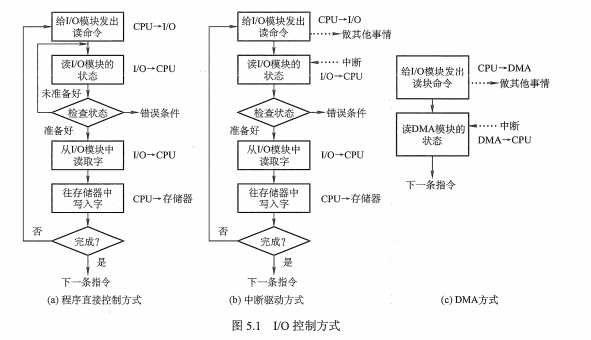
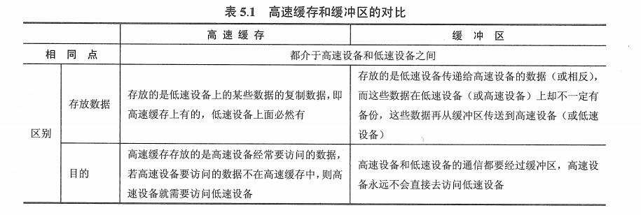

## 1 IO管理概述

### 1.1 I/O 设备

I/O 设备的类型分类。

#### 1.1.1 按使用特性

- 人机交互类外部设备，例如打印机、显示器等。
- 存储设备，例如磁盘、光盘等。
- 网络通信设备，例如网络接口等。

#### 1.1.2 按传输速率

- 低速设备：键盘、鼠标。
- 中速设备：打印机、激光机等。
- 高速设备：磁带机、磁盘机等。

#### 1.1.3 按信息交换的单位分类

- 块设备：信息存取以数据块为单位。
- 字符设备：传输单位以字符为单位，如打印机、交互式终端机。

### 1.2 I/O控制方式

#### 2.2.1 程序直接控制方式

CPU 和 I/O 设备串行工作，由用户进程直接控制主存或 CPU 和外围设备之间的信息传送。

#### 2.2.2 中断驱动方式

允许 I/O 设备主动打断 CPU 的运行并请求服务。为了减少程序直接控制方式下 CPU 的等待时间以及提高系统的并行程度，外围设备仅当操作正常结束或异常结束时才向 CPU 发出中断请求。在 I/O 设备输入每个数据的过程中，由于无需 CPU 的干预，一定程度上实现了 CPU 与 I/O设备的并行工作。仅当输入或输出完一个数据时，才需 CPU 花费极短的时间做中断处理。

#### 2.2.3 DMA 方式（直接存储器存储）

用窃取或挪用总线控制权，在设备和主存之间开辟直接数据交换通道，成批地交换数据，而不必让 CPU 干预。

#### 2.2.4 通道控制方式

通道，独立于 CPU 的专门负责输入输出控制的处理机，它控制设备与内存直接进行数据交换。有自己的通道指令，这些指令由 CPU 启动，并在操作结束时向 CPU 发出中断信号。

通道控制方式，实现了CPU、通道和I/O设备三者的并行操作，从而更加有效地提高整个系统的资源利用率。

### 1.3 I/O子系统的层次结构

* 用户层I/O软件：实现与用户交互的接口
* 设备独立性软件：实现用户程序与设备驱动器的统一结构、设备命令、设备保以及设备分配与释放
* 设备驱动程序：与硬件直接相关，负责具体实现系统对设备发出的操作指令
* 中断处理程序：用于处理中断相关事项
* 硬件设备：包括一个机械部件（设备本身）和一个电子部件（控制器）

## 2 IO 核心子系统

### 2.1 I/O子系统概述

主要提供IO调度、缓冲与高速缓存、设备分配与回收、假脱机、设备保护和差错处理

### 2.2 IO调度概念

通过IO调度改善系统整体性能，使得进程之间公平共享设备访问，减少IO完成所需要的平均等待时间。

### 2.3 高速缓存与缓冲区

高速缓存在内存中分为两种形式：

* 在内存中开辟一个**单独的存储空间**作为磁速缓存，大小固定
* 把未利用的内存空间作为一个缓沖池，供请求分页系统和磁盘I/O时共享。

缓存区：

- 釆用硬件缓冲器，但由于成本太高，除一些关键部位外，一般不釆用硬件缓冲器
- 釆用缓冲区（位于内存区域）。

缓存区分类：

* 单缓存
* 双缓存
* 循环缓存
* 缓冲池

### 2.4 设备分配与回收

充分发挥设备的使用效率，避免进程死锁。

设备分类：

- 独占设备
- 共享设备
- 虚拟设备

### 2.5 IO调度

* 安全分配方式：为进程分配一个设备后就将该进程阻塞，本次I/O完成后才将进程唤醒。

* 不安全分配方式：进程发出I/O请求后，系统为其分配I/O设备，进程可继续执行，之后还可以发出新的I/O请求，只有某个I/O请求得不到满足时才将进程阻塞。不安全分配方式一个进程可以同时使用多个设备。

### 2.6 SPOOLING技术（假脱机技术）

如果设备被占用，先把数据暂存，等到设备空闲了就把这些数据输送到设备中。

