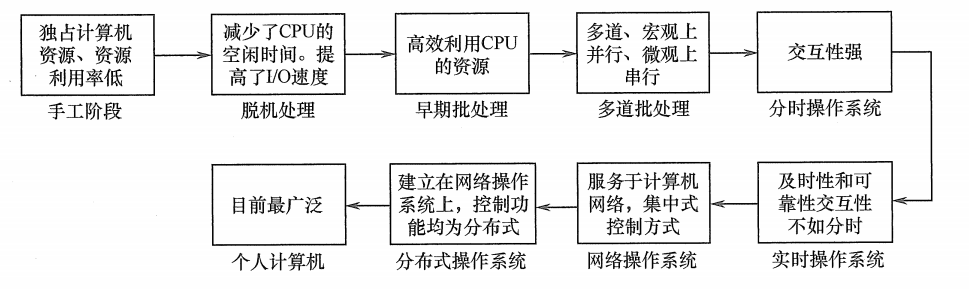

## 1 操作系统发展阶段

### 1.1 手工操作阶段（无操作系统）

计算机上的所有操作都需要人工干预。

缺点：

* 用户独占全机，不会因资源已被其他用户占用而等待，资源利用率低。
* CPU 等待手工操作，CPU 利用不充分。

### 1.2 批处理阶段（操作系统开始出现）

发展历程又分为两种：

* 单道批处理系统：系统对作业处理都是成批进行的，但内存中始终只有一道作业。特征：自动性、顺序性、单道性。

* 多道批处理系统：允许多个程序同时进入内存并允许它们在 CPU 中交替运行。特点：多道、宏观上并行、微观上串行。

### 1.3 分时操作系统

分时技术：处理器的运行时间分成很短的时间片，按时间片轮流把处理器分配给各联机作业使用，如果某个作业不能完成计算，该作业暂时停止运行，把处理器给其他作业，等待下一轮再继续运行。

分时操作系统：多个用户通过终端同时共享一台主机，这些终端连接在主机上，用户可以一时与主机进行交互操作而互不干扰。特征：同时性、交互性、独立性、及时性。

### 1.4 实时操作系统

为了能在摸个时间 限制内完成默写紧急任务而不需要时间片排队，就有了实时操作系统，分为两种：

* 硬实时系统：某个动作必须绝对地在规定的时刻发生，如飞行器的飞行自动控制系统。
* 软实时系统：偶尔违反时间规定且不会引起任何永久性的损害，如飞机订票系统。特征：及时性、可靠性。

### 1.5 网络操作系统和分布式计算机系统

网络操作系统：把计算机网络中各台计算机有机地结合起来，提供统一、经济而有效的使用各台计算机的方法，实现各台计算机之间数据的互相传送。特点：资源共享、通信。

分布式计算机系统：由多台计算机组成并满足：

1. 任两台计算机通过通信方式交换信息
2. 每台计算机具有同等地位、资源共享、任意台计算机可以构成一个子系统，并且能重构。

分布式计算机系统具有特征：分布性、并行性。

网络操作系统和分布式计算机系统区别：分布式操作系统中若干计算机相互协同完成同一任务。

### 1.6 个人计算机操作系统

使用最广泛的操作系统，广泛应用于文字处理、电子表格、游戏等。

## 2 总结

