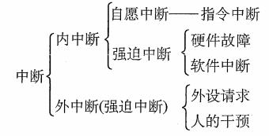
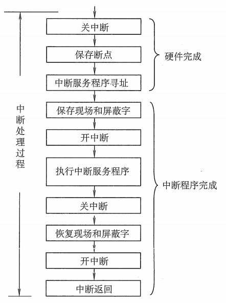

## 1 操作系统的环境

计算机系统中，CPU 执行两种不同性质的程序 ：

* 操作系统内核程序  -> 可以执行特权指令 -> 运行在用户态
* 用户自编程序（系统外层应用程序，简称 -> 应用程序，例如：QQ） -> 处于安全考虑，一般不能执行特权指令。 -> 运行在核心态

前者是后者的管理者。

特权指令：计算机不允许用户直接使用的指令，例如 I/O 指令、置中断指令，存取用于内存保护的寄存器、送程序状态到程序状态的字寄存器等指令，具体实现：

* 用户态（目态） -> 执行非特权指令
* 核心态（又称管态、内核态）-> 执行特权指令

内核是计算机配置的底层软件，是计算机的延伸，大多数分为四类：

* 时钟管理：计时
* 中断机制 ：负责保护和恢复中断现场信息，转移控制权到相关处理程序，例如鼠标、键盘输入、进程管理和调度、系统功能的调用、设备驱动、文件访问等都有利用到。
* 原语：可调用的公用小程序，定义原语的直接方法是关闭中断，系统中的设备驱动、 CPU 切换、进程通信等功能中的部分功能都可以定义为原语。
  - 处于操作系统最底层，最接近硬件的部分
  - 运行有原子性，操作一气呵成
  - 运行时间都较短，调用频繁

* 系统控制的数据结构及处理：系统中用来登记状态信息的数据结构，作业控制块、进程控制块（PCB）、设备控制块、各类链表、缓冲区、空闲区登记表、内存分配。常见操作：
  - 进程管理：进程状态管理、进程调度和分派、创建与撤销进程控制块。
  - 存储器管理：存储器的空间分配和回收、内存信息保护程序、代码对换等。
  - 设备管理：缓冲区管理、设备分配和回收。

## 2 中断和异常的概念

计算机系统需要考虑：核心态和用户态之间的切换。可以通过中断或异常来切换核心态与用户态。

### 2.1 中断和异常的定义

#### 2.1.1 中断

中断也称外中断，指来自 CPU 执行指令以外的事件的发生，如设备发出 I/O 结束中断。

#### 2.1.2 异常

异常也称为内中断、例外或陷入，指 CPU 执行内部的事件，如程序的非法操作码、地址越界、算术溢出等。

#### 2.1.3 区别

#### 2.1.4 中断处理的过程

1. 关中断
2. 保存断点
3. 引出中断服务程序
4. 保存现场和屏蔽字
5. 开中断
6. 执行中断服务程序
7. 关中断
8. 恢复现场和屏蔽字
9. 开中断、中断返回

## 3 系统调用

