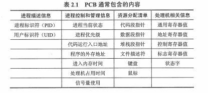
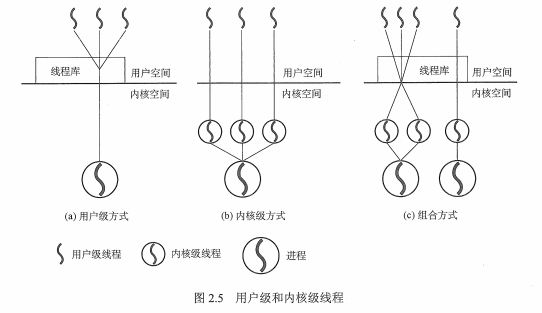

## 1 进程的概念和特征
### 1.1 进程的概念
引入进程目的：更好地描述和控制程序并发进行。

概念：是进程实体运行过程，系统进行**资源分配**和**调度**的一个独立单位。

组成（构成进程映像（进程实体））：
* 进程控制块（PCB）：数据结构，描述进程的基本情况和运行状态，是进程存在的唯一标志。
* 程序段：能被进程调度程序调度到 CPU 运行的程序的代码段。
* 数据段：存储程序运行期间的相关数据。

进程是一个动态的、过程性的概念。

### 1.2 进程的特征
* 动态性：进程的实质是程序在多道程序系统中的一次执行过程，进程是动态产生，动态消亡的。
* 并发性：任何进程都可以同其他进程一起并发执行。
* 独立性：进程是一个能独立运行的基本单位，同时也是系统分配资源和调度的独立单位。
* 异步性：由于进程间的相互制约，使进程具有执行的间断性，即进程按各自独立的、不可预知的速度向前推进。
* 结构性：程序段、数据段和进程控制块三部分组成。

## 2 程序的状态与转换
### 2.1 程序的状态
* 创建状态：进程正在被创建，还没有就绪。
* 就绪状态：进程已获取了除处理机之外的一切所有资源（只要获取时间片就开始工作了）。
* 运行状态：进程正在处理机上运行。
* 阻塞状态（等待状态）：进程正在等待某一事件而暂停（出现 I/O 或服务请求）。
* 结束状态：进程正从系统中消失，分为正常结束、异常结束。

### 2.2 程序的转换
* 就绪状态 -> 运行状态：处理机调度，得到处理及资源。
* 运行状态 -> 就绪状态：时间片用完或有更高级的程序进入。
* 运行状态 -> 阻塞状态：进程正在等待某一事件而暂停（某一资源还没有准备好）。
* 阻塞状态 -> 运行状态：进程所需的资源已经准备好了。

## 3 进程的控制
把进程控制的程序叫原语（运行期间不可中断，是不可切割的基本单位）。

进程的控制：在进程生存期间，对其全部行为的控制。典型的控制行为有创建进程、阻塞进程、唤醒进程、撤销进程。

### 3.1 进程的创建
终端用户登录系统、作业调度、系统提供服务、用户程序的应用请求。（fork 进程）

### 3.2 进程的终止
正常结束、发生异常、外界干预。

### 3.3 进程的阻塞
进程等待资源。

### 3.4 进程的唤醒
进程等待的资源已经准备完成，例如 I/O 设备或服务资源已经可以用。

### 3.5 进程的切换
处理机从一个进程运行到另外一个进程运行。时间片用完、放弃处理机。

## 4 进程组织

### 4.1 进程控制块
进程创建时，操作系统就新建一个 PCB 结构，它之后就常驻内存，任一时刻可以存取, 在进程结束时删除。PCB是进程实体的一部分，是进程存在的唯一标志。

### 4.2 程序段
程序段就是能被进程调度程序调度到 CPU 执行的程序代码段。注意，程序可以被多个进程共享，就是说多个进程可以运行同一个程序。

### 4.3 数据段
一个进程的数据段，可以是进程对应的程序加工处理的原始数据，也可以是程序执行时产生的中间或最终结果。

## 5 进程的通信
* 低级通信（PV 操作：是一种实现进程互斥与同步的有效方法。PV 操作与信号量的处理相关，P：通过，V：释放）
* 高级通信（共享存储、消息传递、管道通信）

### 5.1 共享存储
相互通讯的进程有共享存储区，进程间可以通过直接读写共享存储区的变量来交互数据，同步与互斥在并发程序设计时安排进入程序。操作系统提供这样的共享存储区及同步互斥工具。

### 5.2 消息传递
通过操作系统的相应系统调用进行消息传递通讯，分为两种：
* 直接通信方式：点到点的发送（进程在发送和接收消息时直接指明接收者或发送者进程 ID）
* 间接通信方式：以信箱为媒介进行传递，可以广播（系统为每个信箱设一个消息队列，消息发送和接收都指向该消息队列）

### 5.3 管道通信（利用 pipe 文件）
是一种信息流缓冲机构，UNIX 系统中管道基于文件系统，在内核中通过文件描述符表示。管道以先进先出(FIFO)方式组织数据传输。

特点：
1. 管道是一个单向通信信道，如果进程间要进行双向通信，通常需要定义两个管道。
2. 管道通过系统调用 read(), write()函数进行读写操作。

分类：
1. 匿名管道：只适用于父子进程之间通信；管道能够把信息从一个进程的地址空间拷贝到另一个进程的地址空间。
2. 命名管道：命名管道有自己的名字和访问权限的限制，就像一个文件一样。它可以用于不相关进程间的通信，进程通过使用管道的名字获得管道。

## 6 线程的概念和多线程模型
目的：减小程序在并发时所付出的失控开销，提高操作系统的并发性能。

理解：轻量级的进程，是一个基本的 CPU 执行单元，是程序执行流的最小单元。

引入线程的变化，有如下方面：
### 6.1 资源分配、调度
1. 传统进程机制中，进程是资源分配、调度的基本单元。
2. 引入线程后，进程是资源分配的基本单元，线程是调度的基本单元。

### 6.2 并发性
1. 传统进程机制中，只能进程间并发。
2. 引入线程后，各线程间也能并发，提高了并发度。

### 6.3 系统开销
1. 传统的进程间并发，需要切换进程的运行环境，系统开销大。
2. 线程间并发，如果是同一进程的线程切换，则不需要切换进程环境，系统开销小。
3. 引入线程后，并发所带来的系统开销减少。

## 7 线程的属性
* 轻型实体
* 独立调度和分派的基本单位
* 可并发执行
* 共享进程资源

## 8 线程的实现方式
* 用户级线程（ULT）：所有工作由应用程序完成。
* 内核级线程（KLT）：内核支持的线程，所有工作由系统内核完成。

## 9 多线程模型
* 多对一模型：多个用户级线程映射到一个内核级模型
* 一对一模型：一个用户级线程映射到一个内核级模型
* 多对多模型：n 个用户级线程映射到 m 个内核级模型，n >= m。