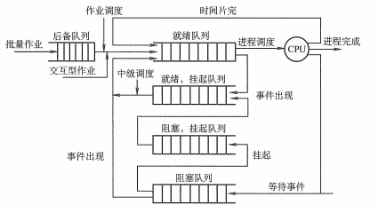

## 1 调度的概念

### 1.1 调度的基本概念
处理机调度就是对处理机进行分配，按照一定的算法分配处理机。

处理机调度是多道操作系统的基础，是操作系统设计的核心问题。

### 1.2 调度的层次
* 作业调度（高级调度）：内存与外存的调度，对于每个作业仅调入一次、调出一次。多道批处理系统中大多配有作业调度，而其他系统中通常不需要配置作业调度，作业调度的执行频率较低且时间较长，通常为几分钟一次。
* 中级调度（内存调度）：目的是为了提高内存利用率和系统吞吐量。内存调度将那些暂时不能运行的进程调至外存等待，把此时的进程状态称为挂起状态。当处于挂起状态的进程能够运行且内存有空闲时，将其重新调入内存并修改状态为就绪状态，挂在就绪队列上等待。
* 进程调度（低级调度）：主要任务是按照某种方法和策略从就绪队列中选取一个进程，将处理机分配给它。进程调度是操作系统中最基本的一种调度，执行频率很高且时间较短，一般几十毫秒一次。

### 1.3 三级调度的联系
1. 作业调度为进程活动做准备，进程调度使进程正常活动起来。
2. 内存调度将暂时不能运行的进程挂起，内存调度处于作业调度和进程调度之间。
3. 作业调度次数最少，内存调度次数略多，进程调度频率最高。
4. 进程调度是最基本的，不可或缺。

## 2 进程调度的方式
* 剥夺式（抢占式）：有更为重要或紧迫的进程需要使用处理机，立即分配。
* 非剥夺式（非抢占式）：有更为重要或紧迫的进程需要使用处理机，仍让当前进程继续执行。

## 3 调度的基本准则

* CPU 利用率
* 系统吞吐量
* 周转时间
* 等待时间
* 响应时间

## 4 典型的调度算法
* 先来先服务（FCFS）调度算法：选择最先进入队列
* 短作业（SJF）调度算法：选择完成时间最短
* 优先级调度算法：选择优先级别最高
* 高响应比优先调度算法：选择响应比最高
* 时间片轮转调度算法：总是选择就绪队列中第一个进程，但仅能运行一个时间片
* 多级反馈队列调度算法：时间片轮转调度算法和优先级调度算法综合和发展。