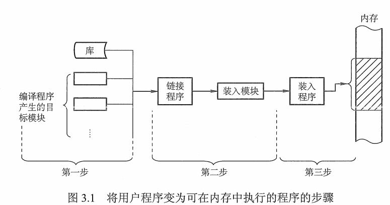

##  1 内存管理概念

### 1.1 内存管理的基本原理和要求

内存管理的功能：

* 内存空间的分配与回收：由操作系统完成主存储器空间的分配和管理。
* 地址转换：逻辑地址 -> 物理地址
* 内存空间的扩充：利用虚拟存技术或自动覆盖技术，从逻辑上扩充内存。
* 存储的保护：保证各道作业在各自的存储空间内运行，互不干扰。

### 1.1 程序装入和链接

源程序变为可执行的文件过程：编译、链接、装入。

