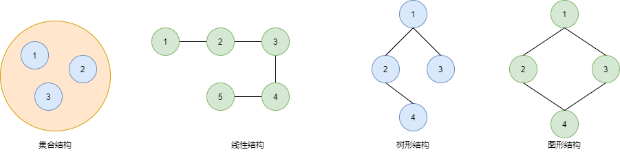
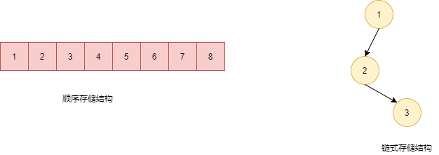

## 1 数据结构

是一门研究非数值计算的程序设计问题中的操作对象，以及他们之间的关系和操作等相关问题的学科。简单来说是把数据元素按照一定的关系组织起来的集合，用来组织和存储数据。

## 2 分类

数据结构分为两类：

* 逻辑结构：从具体问题中抽象出来的模型，是抽象意义上的结构，按照对象中数据元素之间的相互关系分类。
* 物理结构：逻辑结构在计算机中真正的表示方式（又称为映像）称为物理结构，也可以叫做存储结构。常见的物理结构有**顺序存储结构、链式存储结构**。

逻辑结构：

物理结构：

## 3 算法

是指解题方案的准确而完整的描述，是一系列解决问题的清晰指令，算法代表着用系统的方法解决问题的策略机制。也就是说，能够对一定规范的输入，在有限时间内获得所要求的输出。

算法追求的目标：

* **花最少的时间完成需求**；
* **占用最少的内存空间完成需求**；

## 4 算法分析

算法的时间耗费分析，称为时间复杂度分析，算法的空间耗费分析，称为空间复杂度分析。

常见的算法时间复杂度：

| 描述         | 复杂度   | 说明     | 例子           |
| ------------ | -------- | -------- | -------------- |
| 常数级别     | O(1)     | 普通语句 | 将两个数相加   |
| 对数级别     | O(logn)  | 二分策略 | 二分查找       |
| 线性级别     | O(n)     | 循环     | 找出最大元素   |
| 线型对数级别 | O(nlogn) | 分治思想 | 归并排序       |
| 平方级别     | O(n^2)   | 双层循环 | 检查所有元素对 |
| 立方级别     | O(n^3)   | 三层循环 | 检查所有三元组 |
| 指数级别     | O(2^n)   | 穷举     | 检查所有子集   |

