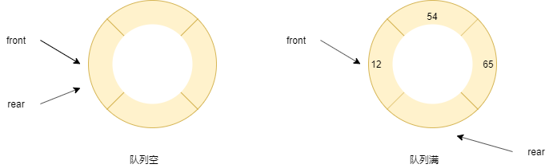

## 1 简介
* 队列是一个有序列表，可以用**数组**或**链表**来实现。
* 遵循**先入先出**的原则。
## 2 模拟队列
1. 队列本身是有序列表，可以使用数组来存储，用 maxSize 控制最大容量。
2. 使用变量 front 及 rear 记录队列前后端下标。

### 3.1 数组队列
```java
public class ArrayQueue {
    //最大数组容量
    private int maxSize;
    //队列头指针 指向队列的第一个元素,  arr[front] 就是队列的第一个元素
    private int front;
    //队列尾指针 指向队列的最后一个元素的后一个位置
    private int rear;
    //存储数据，模拟数组
    private int[] arr;

    public ArrayQueue(int maxSize) {
        this.maxSize = maxSize;
        arr = new int[this.maxSize];
        front = -1; //指向指向队列头的前一个位置
        rear = -1; // 指向队列尾，指向队列尾的数据,即就是队列最后一个数据
    }

    /**
     * 判断队列是否空
     *
     * @return
     */
    public boolean isEmpty() {
        return rear == front;
    }

    /**
     * 判断队列是否满
     *
     * @return
     */
    public boolean isFull() {
        return rear == maxSize - 1;
    }

    /**
     * 添加数据 入队
     *
     * @param n
     */
    public void addQueue(int n) {
        if (isFull()) {
            System.out.println("队列已满！");
        } else {
            rear++;
            arr[rear] = n;
        }
    }

    /**
     * 获取数据 出队
     */
    public int getQueue() {
        if (isEmpty()) {
            throw new RuntimeException("队列已空！");
        } else {
            front++;
            return arr[front];
        }
    }

    /**
     * 遍历
     */
    public void showQueuq() {
        if (isEmpty()) {
            System.out.println("队列已空！");
        } else {
            for (int i = 0; i < arr.length; i++) {
                System.out.printf("arr[%d] = %d\n", i, arr[i]);
            }
        }

    }

    /**
     * 获取队列头
     *
     * @return
     */
    public int headQueue() {
        if (isEmpty()) {
            throw new RuntimeException("队列已空！");
        } else {
            return arr[front + 1];
        }
    }
}

```
存在假溢出问题，也就是 rear 在队尾，但是 front !=0，并且存在空间浪费，使用一次不能使用，优化为循环数组队列。


### 3.2 循环队列
front 指向队列中第一个元素，rear 指向队列队尾的下一个位置。
1. front==rear 队列为空。
2. (rear + 1) % maxSize ==front 队列为满。



```java
public class CircleQueue {
    private int maxSize;
    //队列头指针 指向队列的第一个元素,  arr[front] 就是队列的第一个元素
    private int front;
    //队列尾指针 指向队列的最后一个元素的后一个位置
    private int rear;
    //存储数据，模拟数组
    private int[] arr;

    public CircleQueue(int maxSize) {
        this.maxSize = maxSize;
        arr = new int[this.maxSize];
        front = 0;
        rear = 0;
    }

    /**
     * 判断队列是否空
     *
     * @return
     */
    public boolean isEmpty() {
        return rear == front;
    }

    /**
     * 判断队列是否满
     *
     * @return
     */
    public boolean isFull() {
        return (rear + 1) % maxSize == front;
    }

    /**
     * 添加数据 入队
     *
     * @param n
     */
    public void addQueue(int n) {
        if (isFull()) {
            System.out.println("队列已满！");
        } else {
            arr[rear] = n;
            //将 rear 后移, 这里必须考虑取模
            rear = (rear + 1) % maxSize;
        }
    }

    /**
     * 获取数据 出队
     */
    public int getQueue() {
        if (isEmpty()) {
            throw new RuntimeException("队列已空！");
        } else {
            int value = arr[front];
            front = (front + 1) % maxSize;
            return value;
        }
    }

    /**
     * 遍历
     */
    public void showQueuq() {
        if (isEmpty()) {
            System.out.println("队列已空！");
        } else {
            for (int i = 0; i < arr.length; i++) {
                System.out.printf("arr[%d] = %d\n", i, arr[i]);
            }
        }

    }

    /**
     * 当前队列有效数据的个数
     *
     * @return
     */
    public int size() {
        return (rear + maxSize - front) % maxSize;
    }


    /**
     * 获取队列头
     *
     * @return
     */
    public int headQueue() {
        if (isEmpty()) {
            throw new RuntimeException("队列已空！");
        } else {
            return arr[front];
        }
    }
}
```
