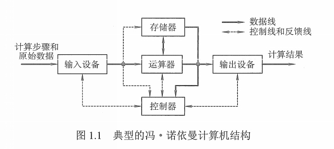
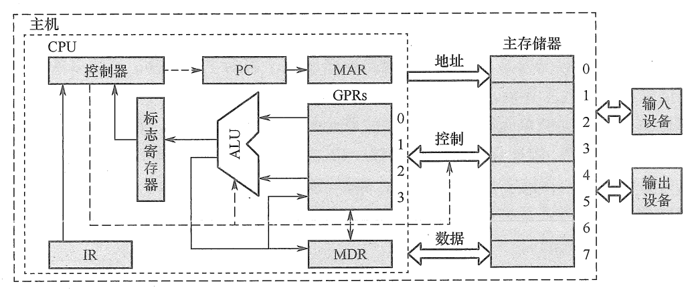
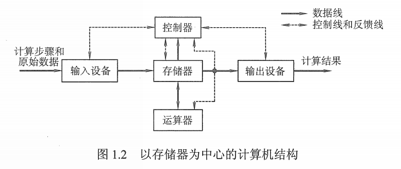
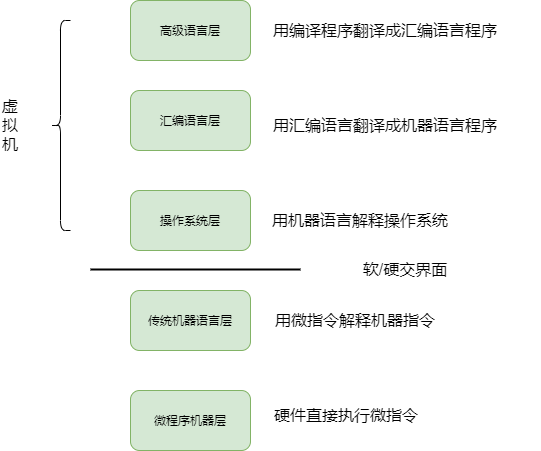

## 1 计算机发展历程

### 1.1 计算机的硬件发展

* 电子管时代
* 晶体管时代
* 中小规模集成电路时代
* 超大规模集成点电路时代

元件更新变化：

* 摩尔定律：18 个月晶体管翻一倍
* 半导体存储器不断发展
* 微处理器不断发展

### 1.2 计算机软件发展

* 面向机器：
  - 机器语言
  - 汇编语言
* 面向问题的高级语言：C++、Java 等

### 1.3 计算机的分类与发展方向

电子计算机：电子模拟计算机、电子数字计算机。

数字计算机：专用计算机、通用计算机。

通用计算机按其规模、速度和功能等又可分为巨型机、大型机、中型机、小型机、微型机及单片机。

计算机按指令和数据流分类：

* SISD（单指令流单数据流）：传统冯·诺依曼体系结构
* SIMD（单指令流多数据流）：阵列处理器向量处理器系统
* MISD（多指令流单数据流）：实际不存在
* MIMD（多指令流多数据流）：多处理器和多计算机系统

计算机发展趋势：
* 微型计算机：更微型、网络化、高性能、多用途
* 巨型计算机：更巨型、超高速、并行处理、智能化方向

## 2 计算机系统结构

### 2.1 计算机系统构成

由硬件系统和软件系统组成。

### 2.2 计算机硬件的基本组成

#### 2.2.1 冯·诺依曼机

冯诺依曼机的组成：存储器+运算器+控制器+输入设备+输出设备。

其主要特征为：

* 数字计算机的数制采用二进制；
* 计算机应该按照程序顺序执行；
* 以**运算器**为中心；

典型冯·诺依曼机如下图所示：

主要由五大部件组成：

1. 存储器：用来存放数据和程序；
2. **运算器**：主要运行算数运算和逻辑运算，并将中间结果暂存到运算器中；
3. 控制器：主要用来控制和指挥程序和数据的输入运行，以及处理运算结果；
4. 输入设备：用来将人们熟悉的信息形式转换为机器能够识别的信息形式，常见的有键盘，鼠标等；
5. 输出设备：可以将机器运算结果转换为人们熟悉的信息形式，如打印机输出，显示器输出等；

冯 · 诺依曼结构的模型机：

一般运算器和控制器集成到同一个芯片上，称为中央处理器（CPU）。

#### 2.2.2 现代计算机的组织结构

现代计算机发展以**存储器**为中心，使 I/O 操作尽可能地绕过 CPU，直接在 I/O 设备和存储器之间完成，提高系统的整体的运行效率。 

### 2.3 计算机软件的分类

软件按功能分类，分为以下两种：

* 系统软件：保证计算机高效运行、正确运行的基础软件，通常作为系统资源提供给用户使用，如操作系统、数据库管理系统等。
* 应用软件：用户为解决某个应用领域的问题，编制的程序。如科学计算类程序。

语言分类：

* 机器语言：二进制代码语言， 是计算机唯一可以直接识别和执行的语言。
* 汇编语言：用英文单词或其缩写代替二进制的指令代码，需要汇编程序的系统软件翻译，转换为机器语言后，才能在计算机硬件系统上运行。

* 高级语言：例如 C、C++、Java。需要经过编译程序编译成汇编语言，然后经汇编操作得到机器语言程序，或直接由高级语言翻译成机器语言程序。

### 2.4 计算机工作过程

具体步骤：

- 程序、数据装入主存
- 从程序其实地址开始运行
- 程序首地址**取出指令**
- 新得到的指令地址读出下一条指令，直到程序结束

信息流程：

* 取指令：PC -> MAR -> M（存储器）-> MDR -> IR
* 分析指令：OP（IR） -> CU
* 执行指令：Ad（IR） -> MAR -> M -> MDR -> ACC

### 2.5 多级层次结构

### 2.6 各硬件部件

* 主存
  - 存储体：存储元、存储单元、存储字、存储字长、地址
  - MAR：地址寄存器
  - MDR：数据寄存器
* 运算器
  - ACC：累加计数器
  - MQ：乘商寄存器
  - X：通用寄存器
  - ALU：算术逻辑单元
* 控制器
  - PC：程序计数器
  - IR：指令寄存器
  - CU：控制单元
* 工作过程：指令、数据存入主存，PC 指向第一条指令

## 3 计算机性能指标

### 3.1 机器字长

计算机进行一次整数运算（即定点整数运算）所能处理的二进制数据的位数，与 CPU 的寄存器位数、加法器有关，机器字长一般等于内部寄存器的大小，字节越长，数的范围越大，计算精度越高。通常为字节（8 位）的整数倍。

### 3.2 数据通路带宽

数据总线一次所能并行传送信息的位数。

### 3.3 主存容量

主存储器所能存储信息的最大容量，以字节来衡量，也就是字数 * 字长来表示存储容量。

### 3.4 运算速度

#### 3.4.1 吞吐量和响应时间

##### 3.4.1.1 吞吐量

系统在单位时间内处理请求的数量，取决于信息能多快地输入内存。

##### 3.4.1.2 响应时间

用户向计算机发送一个请求，到系统对该请求做出相应并获得所需结果的等待时间。

#### 3.4.2 主频和 CPU 时钟周期

##### 3.4.2.1 CPU 时钟周期

通常为节拍脉冲或 T 周期，既主频的倒数，它是处理操作的最基本的单位。

##### 3.4.2.2 主频

也叫时钟频率，单位是 Hz，用来表示 CPU 的运算速度，越大，运算速度越快，常用有 1.8GHz、2.4GHz、2.8GHz。

##### 3.4.2.3 CPI

执行一条指令所需的时钟周期数。

##### 3.4.2.4 CPU 执行时间

即运行一个程序所花费的时间。

CPU 执行时间 = CPU 时钟周期数 / 主频 = （指令条数 * CPI）/ 主频

#### 3.4.3 MIPS、MFLOPS、GFLOPS、TFLOPS

* MIPS：每秒处理多少（百万级的指令条数）。
* MFLOPS：每秒百万个浮点运算数。
* GFLOPS：即每秒 10 亿次的浮点运算数，常作为 GPU 性能参数但不一定代表 GPU 的实际表现，因为还要考虑具体如何拆分多边形和像素、以及纹理填充，理论上该数值越高越好。
* TFLOPS：即每秒万亿次的浮点运算数。