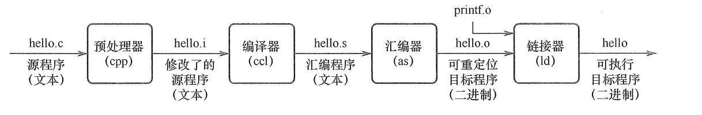

## 1 计算机系统的组成
由硬件系统和软件系统组成。

## 2 计算机硬件的基本组成

### 2.1 冯·诺依曼机
冯诺依曼机的组成：存储器+运算器+控制器+输入设备+输出设备。

其主要特征为：
* 数字计算机的数制采用二进制；
* 计算机应该按照程序顺序执行；
* 以**运算器**为中心；

典型冯·诺依曼机如下图所示：

主要由五大部件组成：
1. 存储器：用来存放数据和程序；
2. 运算器：主要运行算数运算和逻辑运算，并将中间结果暂存到运算器中；
3. 控制器：主要用来控制和指挥程序和数据的输入运行，以及处理运算结果；
4. 输入设备：用来将人们熟悉的信息形式转换为机器能够识别的信息形式，常见的有键盘，鼠标等；
5. 输出设备：可以将机器运算结果转换为人们熟悉的信息形式，如打印机输出，显示器输出等；

冯 · 诺依曼结构的模型机：

一般运算器和控制器集成到同一个芯片上，称为中央处理器（CPU）。

### 2.2 现代计算机的组织结构

现代计算机发展以**存储器**为中心，使 I/O 操作尽可能地绕过 CPU，直接在 I/O 设备和存储器之间完成，提高系统的整体的运行效率。 

## 3 计算机软件的分类

软件按功能分类，分为以下两种：

* 系统软件：保证计算机高效运行、正确运行的基础软件，通常作为系统资源提供给用户使用，如操作系统、数据库管理系统等。
* 应用软件：用户为解决某个应用领域的问题，编制的程序。如科学计算类程序。

### 3.1 三个级别的语言

1. 机器语言：二进制代码语言， 是计算机唯一可以直接识别和执行的语言。
2. 汇编语言：用英文单词或其缩写代替二进制的指令代码，需要汇编程序的系统软件翻译，转换为机器语言后，才能在计算机硬件系统上运行。
3. 高级语言：例如 C、C++、Java。需要经过编译程序编译成汇编语言，然后经汇编操作得到机器语言程序，或直接由高级语言翻译成机器语言程序。

### 3.2 计算机工作过程

三个步骤：

1. 把程序和数据装入主存储器。
2. 将源程序转换为可执行文件。
3. 从可执行文件的首地址开始逐条执行指令。

下面以 UNIX 系统中 GCC 编译程序为例子：

以上程序经过：预处理 -> 编译 -> 汇编 -> 链接 （也是 c ++ 编译程序的步骤）

### 3.2 指令执行过程描述

1. 取指令：PC（程序计数器） -> MAR （地址寄存器）-> M（存储体） ->MDR（数据寄存器） -> IR（指令寄存器）
2. 分析指令：操作码OP(IR：指令寄存器) -> CU（控制单元）
3. 执行指令 ：地址码Ad(IR) -> MAR -> M -> MDR -> ACC（累加器）

## 4 计算机系统的多级层次结构

 